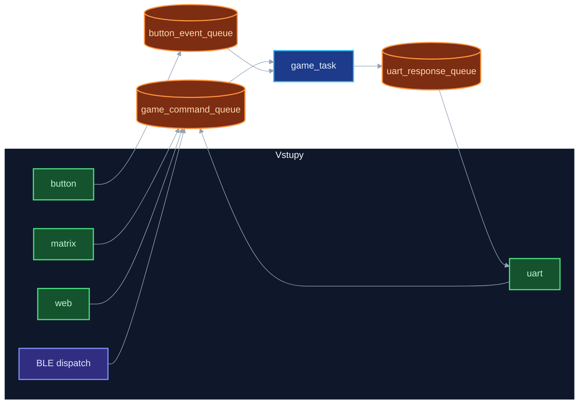

# CZECHMATE firmware **1.8.0**

Ahoj, tady je **CzechMate**, náš šachový systém, firmware na ESP32-C6, web v prohlížeči a aplikace ve Flutteru (`flutter_czechmate/`).
**Verze a hardware:** Aktuální verze projektu ve firmwaru i v dokumentaci je **`1.8.0`** — běží na prototypu **V1** s **reed switch** maticí (objemnější deska, viz záznam na [YouTube](https://youtu.be/_MS6OP3x6Z4)). **V2.0** je připravovaná **komerční** deska se **Hall senzory** (rozlišení typu figurky), skladnější; předobjednávky a dotazníky na webu se vztahují k **V2**. Přehled: [`docs/reference/HARDWARE_VERZE.md`](docs/reference/HARDWARE_VERZE.md).

**Stáhnout aplikaci:** (https://alfredkrutina.github.io/chess_esp32_c6_devkit/downloads.html) — Android APK, macOS DMG a **Windows instalátor** (`*-windows-setup.exe`) jsou na **[GitHub Releases](https://github.com/alfredkrutina/chess_esp32_c6_devkit/releases/latest)** (produkční stránka je na Pages, binárky servuje GitHub). **iOS / iPad** zatím připravujeme. **Windows:** instalátor sestavuje CI ([`.github/workflows/flutter-app-release.yml`](.github/workflows/flutter-app-release.yml)); BLE sken v desktopové aplikaci není — připojení přes Wi‑Fi URL na LAN (viz [`docs/flutter/README.md`](docs/flutter/README.md)). **Představení:** [YouTube](https://youtu.be/_MS6OP3x6Z4) (vložené i na [produktové stránce](https://alfredkrutina.github.io/chess_esp32_c6_devkit/downloads.html)).

*Šachmat z Česka*

**Kde co najdeš v textech:** **[`docs/README.md`](docs/README.md)** — rozcestí po diagramech, Flutteru, OTA a referencích; k C API si lokálně generuju Doxygen (viz níže).

---

## 🎓 O projektu

Tento projekt představuje náš největší a nejkomplexnější projekt, na kterém jsme pracovali. Je to šachový systém postavený na ESP32-C6 mikrokontroléru, který kombinuje hardware, software, embedded systémy, webové technologie a samozřejmě šachovou logiku. Když jsme začínali, netušili jsme, kolik se toho naučíme a kolik výzev nás čeká.

Projekt vznikal postupně - od jednoduché myšlenky "udělat šachy s LED" až po komplexní systém s FreeRTOS multitaskingem, webovým serverem, fyzickou detekcí figurek a kompletní implementací všech šachových pravidel. Každá část projektu nás něco naučila - od základů embedded programování přes real-time systémy až po webové technologie.

**Spolupráce:** Projekt je výsledkem týmové práce — Matěj řešil fyzickou realizaci šachovnice, já aplikaci, firmware zařízení a šachovou logiku.

**CZECHMATE** - to je název našeho projektu. "checkmate" (šachmat) a "Czech" (český), protože je to šachový systém udělaný v Česku. Původní nápad byl "CZECHMADE", ale to se nám zdálo příliš abstraktní. CZECHMATE lépe vystihuje, o co jde - šachmat, ale český.
--- 

## 📋 Co CzechMate umí (stručně)

Na prototypu **V1** řešíme fyzickou hru **reed switch** maticí 8×8 (jen obsazeno / volné pole). **V2** přejde na **Hall senzory** s rozlišením typu figurky. **73× WS2812B** (64 pole + 9 u tlačítek) dává zpětnou vazbu k tahům na obou generacích. Vedle toho se dá hrát a učit přes **aplikaci** (hlavně **Flutter** v `flutter_czechmate/` — Android / iOS / Mac / desktop), přes **web** v prohlížeči nebo si můžeš hrát s konzolí přes **UART** (typicky na ladění; klidně z toho někdo časem udělá vlastní rozšíření).

### 🎯 Hlavní funkce

- **Fyzická šachovnice** — **V1:** 8×8 reed matrix; **V2:** Hall senzory (typ figurky na poli)
- **LED** — 64 na šachovnici + 9 u tlačítek
- **Aplikace** — Flutter (`flutter_czechmate/`) pro Android / iOS / Mac / desktop
- **Šachová logika** — pravidla včetně rošády, en passant, promoce, šach, mat
- **Web** — HTTP server, stav stránky držíme aktuální (volitelně WebSocket `/ws`)
- **UART** — textové příkazy, debug, testy
- **Animace** — tahy, šach, mat, remíza...
- **Home Assistant** — MQTT „světlo“ přes `ha_light_task`
- **Auto nová hra** — když jsou figurky v základním postavení a chvíli to drží (~2 s), spustí se nová partie
- **Stockfish / bot** — obtížnost (ELO), volba barvy
- **Výuka** — nápovědy, hodnocení tahů, odměny za dobré tahy

---

## 🛠️ Hardware

*realizace HW: Matěj Jager*

### Prototyp V1 vs plánovaná V2

| | **V1** (v repu + video) | **V2.0** (komerční směr) |
|---|-------------------------|---------------------------|
| Figurky | Reed 8×8 | Hall — typ figurky na poli |
| Formát | Bulkier dev/prototyp | Skladnější produkt |
| Firmware | **`1.8.0`** v tomto repu | Stejný ekosystém softwaru; HW vrstva podle integrace |

Detailní tabulka a odkazy: [`docs/reference/HARDWARE_VERZE.md`](docs/reference/HARDWARE_VERZE.md).

### Komponenty (prototyp V1)

V HW primárně je mimo jiné:

- **ESP32-C6 DevKit** - Hlavní mikrokontrolér s WiFi a Bluetooth
- **73x WS2812B LED** - 64 LED na šachovnici + 9 LED na tlačítkách
- **8x8 Reed Switch Matrix** - Pro detekci fyzických figurek na šachovnici (64 Reed Switchů)
- **4x Promotion tlačítka** - Pro výběr figury při promoci pěšce (Queen, Rook, Bishop, Knight)
- **1x Reset tlačítko** - Pro reset hry
- **USB Serial JTAG** - Pro konzoli, programování a ladění
- **Externí 5V zdroj** - Pro napájení LED pásu (WS2812B potřebují hodně proudu)

### GPIO mapování

ESP32-C6 má s pinama práci — museli jsme si vybrat bezpečné kombinace a držet je sladěné se softwarem. Aktuální mapování vypadá takhle:

```
LED Data:        GPIO7  (WS2812B - bezpečný pin pro RMT)
Matrix Rows:     GPIO10,11,18,19,20,21,22,23 (8 výstupů)
Matrix Columns: GPIO0,1,2,3,6,4,16,17 (8 vstupů s pull-up)
Status LED:      GPIO5  
Reset Button:    GPIO15 (s pull-up)
```
---

## 🏗️ Architektura

### FreeRTOS Tasky

Systém používá FreeRTOS pro multitasking. To byla pro mě úplně nová oblast - před tím jsem programoval hlavně sekvenční kód. Naučil jsem se, jak správně navrhnout tasky, jak používat fronty pro komunikaci a jak synchronizovat přístup ke sdíleným zdrojům pomocí mutexů.

Tady jen tabulka, jak mám tasky nastavené (priorita / stack):

| Task / runtime | Priorita | Popis | Stack Size |
|----------------|----------|-------|------------|
| `led_task` | 7 | WS2812B LED, batch commit, animace (`unified_animation_manager`) | 8KB |
| `matrix_task` | 6 | Sken 8×8 matice + time-multiplex s tlačítky | 4KB |
| `button_task` | 5 | Tlačítka (promoce, reset, …) | 3KB |
| `game_task` | 4 | Šachová logika a stav hry | 6KB |
| `uart_task` | 3 | USB Serial JTAG konzole (po boot animaci resume) | 5KB |
| `web_server_task` | 3 | HTTP server, REST, volitelně WebSocket `/ws` (`CONFIG_HTTPD_WS_SUPPORT`) | 20KB |
| `ha_light_task` | 3 | MQTT Home Assistant (RGB light) | 8KB |
| `test_task` | 1 | Automatické testy (jen pokud `CONFIG_CHESS_ENABLE_TEST_TASK`) | 4KB |
| **NimBLE host** | (ESP-IDF) | GATT pro mobilní klienty — startuje se `ble_task_init()` → `nimble_port_freertos_init`, **není** samostatný `xTaskCreate("ble_task")` v `main.c` | (jen řídí stack NimBLE) |

**Proč jsou priority takto nastavené?**

To jsem se naučil tvrdě - když jsem měl špatně nastavené priority, systém se choval divně. LED task má nejvyšší prioritu (7), protože WS2812B LED vyžadují přesný timing a nesmí být přerušeny. Matrix task má prioritu 6 pro real-time detekci pohybu figurek. **Game task** má prioritu **4** (stav hry a tahy). **UART, web server i HA light task** mají prioritu **3** (I/O a síť); přenosové BLE běží v **NimBLE host tasku** z ESP-IDF (viz `ble_task_init`), ne jako řádek v tabulce výše. **Test task** má prioritu **1** a zapíná se jen v menuconfig.

**Poznámka k animacím:** Dřívější samostatný FreeRTOS task `animation_task` (priorita 3) je **vypnutý**; animace jsou integrované do pipeline LED tasku

### Komunikace mezi tasky

Mezi tasky to držíme přes fronty a mutexy — přehled kapacit je v `freertos_chess.h` (`GAME_QUEUE_SIZE` atd.):

- **FreeRTOS Queues** — asynchronní předávání zpráv
  - `game_command_queue` - Příkazy pro `game_task` (**24** zpráv typu `chess_move_command_t`)
  - `button_event_queue` - Eventy z tlačítek (5 zpráv)
  - LED se ovládají přímými voláními (fronta byla odstraněna pro lepší výkon)

- **Mutexes** — sdílené zdroje (UART výstup, LED buffer)
  - `uart_mutex` - Ochrana UART výstupu
  - `led_unified_mutex` - Ochrana LED bufferu / batch commit v `led_task`

- **Timers** - Pro periodické úlohy

### Diagramy firmware

Kompletní obrázek naráz (priority, stacky, fronty, SVG, pořadí **`main_system_init` → `ble_task_init` → `create_system_tasks`**, BLE přes `web_server_ble_command_dispatch`) je v **[`docs/diagrams/README.md`](docs/diagrams/README.md)**.

| Náhled | Popis |
|--------|--------|
| [](docs/diagrams/README.md) | Pořadí `xTaskCreate` + runtime fronty |
| [](docs/diagrams/README.md) | `main_system_init` včetně BLE před tasky |
| [](docs/diagrams/README.md) | Matrix / UART / web → `game_command_queue` |
| [](docs/diagrams/README.md) | LED batch / mutex (zjednodušení) |
| [](docs/flutter/README.md) | Flutter: features → Riverpod → služby |

Další SVG ve **[`docs/diagrams/README.md`](docs/diagrams/README.md)**: smyčka každého tasku, přehled aplikací (firmware / Flutter / volitelný nativní klient), rozšířená mapa `flutter_czechmate/lib/`, pipeline šachové logiky (`game_is_valid_move`, generování legálních tahů, `game_execute_move`, `game_process_commands`), plus **toky rošády, promoce, en passantu, braní, bootu z NVS, **matrix guard**, **error recovery**, **rezignace králem**, **undo**.

Zdroje: [`docs/diagrams/sources/*.mmd`](docs/diagrams/sources/) → `./scripts/render_docs.sh` vygeneruje SVG/PNG.




*(BLE příkazy nejdou přímo z jedné řádkové funkce na frontu — používají sdílený dispatch ve web vrstvě; viz `docs/diagrams/README.md`.)*

### Struktura komponent

Ve `components/` mám rozsekáno zhruba takhle (každá složka = vlastní kus systému):

```
components/
├── freertos_chess/              # Základní FreeRTOS infrastruktura
│   ├── freertos_chess.c         # Inicializace, fronty, mutexy
│   ├── led_mapping.c            # Mapování LED pozic
│   ├── shared_buffer_pool.c     # Sdílené buffery
│   └── streaming_output.c      # Streamování výstupu
│
├── game_task/                   # Šachová logika a pravidla
│   ├── game_task.c              # Hlavní šachová logika (11k+ řádků)
│   ├── game_led_direct.c        # Přímé LED funkce
│   └── demo_mode_helpers.c      # Pomocné funkce pro demo mód
│
├── ble_task/                    # Bluetooth LE komunikace
│   └── ble_nimble_impl.c        # NimBLE GATT server pro app
│
├── matrix_task/                 # Skenování 8x8 matice
│   └── matrix_task.c             # Reed switch skenování
│
├── led_task/                    # WS2812B LED ovládání
│   └── led_task.c                # LED hardware interface
│
├── button_task/                 # Zpracování tlačítek
│   └── button_task.c            # Button event handling
│
├── uart_task/                   # UART konzole
│   └── uart_task.c              # Textové příkazy
│
├── web_server_task/             # HTTP web server
│   ├── web_server_task.c        # HTTP server implementace + embed JS
│   └── chess_app.js             # Zdroj embedded JavaScriptu (nekompiluje se)
│
├── animation_task/              # Legacy API / typy (FreeRTOS task nevytváří se)
│   └── animation_task.c
│
├── unified_animation_manager/   # Unified animation system (běžící cesta)
│   └── unified_animation_manager.c
│
├── led_state_manager/           # Správa LED stavů
│   └── led_state_manager.c
│
├── game_led_animations/         # Vysokoúrovňové animace (tahy, endgame, změna hráče)
│   └── game_led_animations.c
│
├── config_manager/              # Správa konfigurace
│   └── config_manager.c
│
├── timer_system/                # Timer utilities
│   └── timer_system.c
│
├── ha_light_task/               # MQTT/HA integrace pro světlo
│   └── ha_light_task.c
│
├── promotion_button_task/       # (Nepoužívá se, sdruženo do button_task)
│   └── promotion_button_task.c
│
├── reset_button_task/           # (Nepoužívá se, sdruženo do button_task)
│   └── reset_button_task.c
│
└── visual_error_system/         # Vizuální error handling
    └── visual_error_system.c
```

---

## 🚀 Jak si firmware přeložím a nahraju

### Co k tomu používám

- **ESP-IDF** v5.1+
- **Python 3.8+**, **CMake 3.16+**
- **ESP32-C6 DevKit** (nebo kompatibilní desku)
- **USB kabel**

### Typický postup

```bash
# aktivace ESP-IDF
. $IDF_PATH/export.sh

# volitelná konfigurace
idf.py menuconfig

# překlad
idf.py build

# flash — PORT = sériové zařízení desky (Linux např. /dev/ttyUSB0, macOS často /dev/cu.usbserial-*)
idf.py -p PORT flash

# sériová konzole
idf.py -p PORT monitor
```

### Menuconfig

V `menuconfig` řeším mimo jiné Wi‑Fi pro web, jas LED, rychlost skenu matice a úroveň logů (ERROR až VERBOSE).

#### Home Assistant / MQTT

Home Assistant vidím jako **MQTT RGB světlo** přes `ha_light_task`:

- MQTT broker výchozí host: `homeassistant.local` (TCP port `1883`), lze změnit v NVS.
- Konfigurace MQTT (host, port, username, password) se ukládá do NVS namespace `mqtt_config` (`broker_host`, `broker_port`, `broker_username`, `broker_password`).
- Po úspěšném připojení k MQTT klient publikuje **Home Assistant auto-discovery**:
  - discovery topic ve tvaru `homeassistant/light/esp32_chess_light_<MAC>/config`
  - entita typu `light` se jménem `CzechMate`
  - JSON schema, podpora `brightness`, `rgb` color mode a efektů (`rainbow`, `pulse`, `static`).
- Používané MQTT topicy:
  - `HA_TOPIC_LIGHT_COMMAND` – příkazy z HA (zapnutí/vypnutí, barva, jas, efekt)
  - `HA_TOPIC_LIGHT_STATE` – publikovaný stav světla (on/off, jas, RGB, efekt)
  - `HA_TOPIC_LIGHT_AVAILABILITY` – dostupnost (`online` / `offline`)

Režimy:

- **GAME MODE** — základ: šachovnice a herní animace na LED.
- **HA MODE (Lampa)** — celá deska jako jedno RGB; z HA přes MQTT nebo z webu i jen přes AP šachovnice.
- Zpět do hry to často skočí samo při pohybu figurek / tahu z webu nebo UARTu, případně ručně přepínačem „Šachovnice“ v Nastavení na webu.

---

## 📖 Jak to v praxi používám

### UART konzole

USB Serial JTAG, 115200 baud — pak jdou textové příkazy jako:

```
help                    - Zobrazit nápovědu se všemi příkazy
move e2e4              - Provede tah (notace: e2e4, e2-e4, nebo e2 e4)
reset                  - Resetovat hru na výchozí pozici
status                 - Zobrazit aktuální stav hry
board                  - Zobrazit šachovnici v ASCII
test                   - Spustit testovací funkce
```

### Webové rozhraní

Po Wi‑Fi mi deska nabídne HTTP server; IP hlásí UART log. V prohlížeči:

```
http://<IP_ADDRESS>/
```

Na webu máme mimo jiné:

- živou šachovnici, tahy klikem, historii, reset
- sandbox a review režimy
- MQTT / Home Assistant vedle toho (`ha_light_task`)
- stejné herní a chybové stavy jako na LED (zvednutá figurka, špatný tah, recovery…)

### Flutter klient (`flutter_czechmate/`)

- **Stack:** Flutter 3.x, Riverpod, `flutter_blue_plus`, HTTP, WebSocket, balíček `chess`, Stockfish / API podle nastavení.
- **Smysl:** jedna codebase pro telefony i desktop; k desce přes BLE (kde je host podporovaný) a/nebo síť k ESP webu.
- **Windows desktop:** složka `flutter_czechmate/windows/` je v repu; `flutter_blue_plus` na Windows nemá backend — v aplikaci je BLE vypnuté a připojení je přes Wi‑Fi URL na LAN. Build: Visual Studio 2022 (*Desktop development with C++*), pak `flutter build windows`. Popis v [`docs/flutter/README.md`](docs/flutter/README.md).
- **Mobilní drobnosti v repu:** třeba Live Activities (iOS), Wear OS modul, notifikace chess clocku na Androidu — detaily v `flutter_czechmate/ios/` a `flutter_czechmate/android/wear/`.
- **Lokální běh:** `cd flutter_czechmate && flutter pub get && flutter run` (např. `-d windows`, `-d macos`).
- **Hotové buildy:** [GitHub Releases](https://github.com/alfredkrutina/chess_esp32_c6_devkit/releases) — APK a DMG (Apple Silicon / arm64).

### ⚙️ Nastavení na webu

V záložce **Nastavení** řeším mimo jiné:

- **Šachovnice / Lampa** — v lampě je celá deska jedno RGB; funguje i jen přes hotspot desky. Barvy a on/off jdou do NVS a při MQTT i do HA.
- **Jas LED** — jeden slider 0–100 % pro šachy i lampu.
- **Bot / ELO** — úrovně 1–8.
- **Zhodnocení tahů** — zapnuto/vypnuto po každém tahu.
- **Výuka** — zbývající nápovědy, průměrná kvalita.
- **Wi‑Fi** — sken sítí, heslo, uložení do NVS.

### 🤖 Bot a výuka

Na webu máme napojený **Stockfish** (přes chess-api.com):

#### Hra proti botovi
- nastavitelné ELO
- tah bota ukážou LED (odkud → kam), figurku musíš fyzicky přesunout
- volba barvy

#### Nápovědy a analýza
- tlačítko nápovědy = návrh tahu
- krátký komentář k návrhu
- po tahu (volitelně) slovní + barevné hodnocení:
    - 🟢 **Best / Good** - Výborný nebo dobrý tah.
    - 🟡 **Inaccuracy** - Menší nepřesnost.
    - 🟠 **Mistake** - Chyba, zhoršení pozice.
    - 🔴 **Blunder** - Hrubá chyba (např. ztráta figury).
- **Výukový systém:** Počet nápověd může být omezen. Za dobré tahy ("Best" nebo "Good") a sebrání figur získává hráč nápovědy navíc jako odměnu.
- **Statistiky:** Sledování průměrné kvality tahů pro oba hráče (hodnocení 1.0 - 5.0).

### Fyzická hra

1. Figurky do základního postavení.
2. Matice je přečte sama (Reed).
3. Zvednutí figurky → LED ukáže odkud.
4. Položení na pole → validace a zápis tahu.
5. Barvy na LED řeknou výsledek:
   - Zelená = platný tah
   - Červená = neplatný tah
   - Modrá = šach
   - Červená blikání = mat
6. **Automatický start nové hry** - pokud po skončení hry ručně vrátíte všechny figurky do počáteční pozice (řady 0,1,6,7 obsazené, 2–5 prázdné) a tato pozice je stabilní ~2 s, systém spustí novou hru sám

---

## 🎓 Co jsem si z toho odnáším

Projekt mi rozšířil obzor hodně rychle — z čistých základů k tomuhle přehledu věcí, které už beru jako samozřejmé:

### Embedded programování
- **FreeRTOS** — RTOS pro embedded; tasky, priority, plánování
- **GPIO** — správné použití pinů, pull-up/pull-down, multiplexing
- **Interrupt handling** — práce s přerušeními od hardwaru
- **Paměť** — stack vs heap, kde šetřit a kde ne
- **Watchdog** — pojistka proti zaseknutí

### Šachová logika
- **Pravidla FIDE** — včetně en passant, rošády, promoce
- **Validace tahů** — co kontrolovat před zápisem
- **Šach / mat** — detekce v bitboard / stavovém modelu
- **Reprezentace desky** — jak to držet v RAM rozumně

### Webové technologie
- **HTTP server** na MCU z ESP-IDF
- **WebSocket** — endpoint `/ws` pokud je v buildu `CONFIG_HTTPD_WS_SUPPORT` (jinak REST polling)
- **Embedded JS** ve statických stránkách v binárce
- **REST API** — jak klient mluví s firmware

### Architektura softwaru
- **Moduly** — rozsekání do komponent podle zodpovědnosti
- **Komunikace tasků** — fronty, mutexy, smyčky
- **Chyby** — kde logovat, kde recovery
- **Organizace** — jak se neztratit ve velkém C projektu

### Hardware 
- **Reed spínače** — jak je číst v matici
- **WS2812B** — timing a napájení
- **Time-multiplexing** — sdílení pinů s diodami
- **Spotřeba** — kdy LED žerou hodně proudu

### Ladění
- **UART log** — hlavní kanál pravdy
- **LED feedback** — vizuální signály stavu
- **Monitoring** — heap, watchdog, poslední řádky před pádem

---

## 🐛 Výzvy, které nás držely vzhůru

### Hardware

**Reed matice:** 64 spínačů do řádků a sloupců — každý musí sedět na správný pin a držet kontakt.

**Napájení LED:** až ~4,5 A při plném jasu u 73 WS2812B — externí 5 V a společná zem s ESP musí být v pořádku.

**Fyzická deska:** od návrhu po zapojení na desce — bez toho by firmware neměl co číst.

### Software

**FW strana:** v ~25 ms cyklu střídám sken matice a tlačítek (detail mám v sekci o multiplexu). Hodně práce s tím, aby se stavy nepřebíjely.

### 1. Šachová logika

**Co mě štvalo:** pravidla jsou „jednoduchá“, dokud neřešíš všechny hrany případů.

**Jak jsem to lámal:** hodiny nad pravidly a postupné pravidlo po pravidlu; nejvíc mě potrápil en passant. Matěj mi pomáhal tahat hraniční situace na reálné desce.

### 2. FreeRTOS

**Co mě štvalo:** na začátku chaos — závody, deadlocky, občas ticho bez logu.

**Jak jsem to lámal:** fronty, mutexy, semafory a několik přestaveb architektury, než to začalo dávat smysl.

### 3. LED animace

**Co mě štvalo:** WS2812B jsou citlivé na timing — moc často trhání, málokdy molasses.

**Co z toho je:** `unified_animation_manager` jako centrální řidič animací.

### 4. Web na MCU

**Co mě štvalo:** RAM není nafukovací; HTTP stack + JS musí být úsporné.

**Co z toho je:** ESP-IDF HTTP server, optimalizovaný embed JS, komprese / cache kde to dávalo smysl. Matěj testoval UI na různých zařízeních.

### 5. Debugging

**Co mě štvalo:** někdy nebylo jasné, jestli je problém ve FW nebo v zapojení.

**Jak jsme to řešili:** Matěj multimetrem na drátě; já UART logging a podrobně rozepsané systematické kroky v logu.

---

## Dokumentace

Co kde držím:

- **[docs/README.md](docs/README.md)** — rozcestník po celém repu
- **[docs/diagrams/README.md](docs/diagrams/README.md)** — boot, fronty, mutexy, smyčky tasků, šachy, Flutter
- **[docs/flutter/README.md](docs/flutter/README.md)** — aplikace, BLE/HTTP, `lib/`
- **[docs/ota_architecture.md](docs/ota_architecture.md)** — OTA (HTTPS / HTTP / BLE), REST, Flutter, rollback po `create_system_tasks`, dual-slot flash, kompatibilita NVS a checklist před release; směr rozšíření: podepsaný / šifrovaný obraz podle Espressif
- **[docs/reference/README.md](docs/reference/README.md)** — delší texty: komunikace tasků, souřadnice, web UI v binárce, checklist integrace

**Doxygen** z C kódu — HTML si generuju:

```bash
./generate_docs.sh
open docs/doxygen/html/index.html
```

RTF / Word z toho samého skriptu (`docs/doxygen/rtf/refman.rtf`), PDF přes `./create_pdf_simple.sh` po `generate_docs.sh`.

**Mermaid / SVG:** [docs/diagrams/README.md](docs/diagrams/README.md), sekvenční HTML [diagrams_mermaid.html](docs/diagrams/diagrams_mermaid.html), přehled tasků [tasks_architecture.md](docs/diagrams/tasks_architecture.md). Grafiky přegeneruju **`./scripts/render_docs.sh`**.

Další poznámky držím lokálně mimo git (`context/`, případně plánovací složky).

### GitHub Pages

Veřejně je nasazený web s dokumentací a stránkou ke stažení appky: **[GitHub Pages](https://alfredkrutina.github.io/chess_esp32_c6_devkit/)**, přímo stažení [downloads.html](https://alfredkrutina.github.io/chess_esp32_c6_devkit/downloads.html). Postup kolem Actions a 404 je v [`gh-pages-ready/README.md`](gh-pages-ready/README.md).

**Google Formuláře** (rozcestník je i na stránce stažení):

- **Předobjednávka** (jméno, kontakt, přání k produktu): [otevřít formulář](https://docs.google.com/forms/d/18ns5uSUSzr5zcHsiZwD1HWfY15xBa-folmE-oH86BsY/viewform)
- **Průzkum zájmu / hodnocení**: [otevřít formulář](https://docs.google.com/forms/d/e/1FAIpQLSck_q6sjN1nnUs9aV2CsY0MyPNo9puLcncW603iEJz6BMLjPw/viewform)

---

## 📁 Jak je repozitář položený

```
chess_esp32_c6_devkit/
├── main/                          # Hlavní aplikace
│   ├── main.c                     # Startup, inicializace, task creation
│   └── CMakeLists.txt
│
├── components/                     # FreeRTOS komponenty
│   ├── freertos_chess/            # Základní infrastruktura
│   ├── game_task/                 # Šachová logika (největší komponenta)
│   ├── matrix_task/               # Matrix skenování
│   ├── led_task/                  # LED ovládání
│   ├── button_task/               # Button handling
│   ├── uart_task/                 # UART konzole
│   ├── web_server_task/           # HTTP web server
│   ├── animation_task/            # Legacy animace (task v main vypnutý)
│   ├── game_led_animations/       # Animace tahů / konců her
│   ├── unified_animation_manager/ # Společný systém animací
│   ├── led_state_manager/         # Správa barev/stavů LED
│   ├── timer_system/              # Časovače a chess clock
│   ├── ha_light_task/             # MQTT/HA integrace
│   ├── promotion_button_task/     # Tlačítka pro promoci
│   ├── reset_button_task/         # Reset tlačítko
│   └── ...                        # Další pomocné komponenty
│
├── docs/                          # Mapa repa + firmware diagramy + Flutter popis
│   ├── README.md                  # Přehled celého projektu (Firmware + Flutter)
│   ├── flutter/README.md          # Flutter appka, diagramy, lib/
│   ├── reference/                 # WEB_UI_DEPLOY, komunikace tasků, souřadnice
│   ├── diagrams/                # Firmware diagramy (Mermaid, SVG, HTML)
│   └── doxygen/                 # Doxygen výstup — generuj lokálně (viz docs/.gitignore)
│
├── build/                         # Build výstup ESP-IDF (generovaný, v .gitignore)
├── managed_components/            # IDF Component Manager (generovaný, v .gitignore)
├── gh-pages-ready/                # Produktová stránka (downloads), assety landing/, .nojekyll
├── flutter_czechmate/             # Flutter klient (BLE / HTTP / WS)
├── CZECHMATE/                     # Xcode projekt — .gitignore (jen lokálně)
├── context/                       # AI podklady — .gitignore (není v remote)
├── CMakeLists.txt                 # Build konfigurace
├── Doxyfile                       # Doxygen konfigurace
├── generate_docs.sh              # Skript pro generování dokumentace
├── create_pdf_simple.sh          # Skript pro vytvoření PDF
└── README.md                      # Kořenový přehled projektu
```

---

## 🔧 Ladění a testy

### Debug mód

Debug zapínám přes `menuconfig` nebo makro v buildu, např.:

```c
#define CHESS_DEBUG_MODE 1
```

V `menuconfig`:
```
Component config → Chess System → Enable debug mode
```

… a pak v logu vidím víc detailů o taskách, paměti atd.

### Test task

Když mám zapnutý test task v konfiguraci, na běžícím monitoru napíšu `test` a nechám to projít svoje kolečko.

```bash
idf.py -p /dev/ttyUSB0 monitor
# v konzoli: test
```

---

## 🐛 Co víme, že občas štve

- RTF z Doxygen umí narůst (~10 MB) — na čtení je příjemnější HTML nebo PDF.
- Starý puzzle systém jsme vyhodili (rozhraní necháváme rozumně rozšířitelné).
- Po pádu Wi‑Fi někdy pomůže restart desky.
- Při hodně dlouhých sezeních hlídám heap / watchdog.
- Reed kontakty se mohou časem chovat hůř — čistě HW věc.

---

## 🔧 Když něco nejde (co zkouším jako první)

### Hardware

**LED nesvítí:** napájení 5 V pro pásek, společná zem s ESP, datový GPIO7 na DIN.

**Matice nic nevidí:** zapojení reedů, pull-upy na sloupcích (~10 kΩ), řádkové výstupy.

**Tlačítka:** diody 1N4148 ke všem řádkům, polarita.

### Software

**Zamrzlo to:** watchdog by měl po chvíli resetnout — v logu hledám poslední řádek před zásekem; případně zvětším stack u podezřelého tasku.

**Šachy „nedávají smysl“:** log tahů, příkaz `board` v UARTu, jestli matice sedí s realitou.

**Web nejede:** v logu jestli doběhla inicializace Wi‑Fi (`WiFi initialized …`) a jestli `Starting HTTP server` / `HTTP server started` — bez toho REST neběží. **Starší firmware** při vypnutém hotspotu desky mohl skončit už na `ESP_ERR_WIFI_MODE` a úloha HTTP se vůbec nespustila; v aktuálním kódu se ve STA-only **nastavuje jen STA** a AP konfigurace se přeskakuje. Dál: IP desky (STA nebo `192.168.4.1` při zapnutém hotspotu), firewall z LAN, jestli `web_server_task` žije.

---

## 📝 Historie verzí

### 1.8.0 — aktuální řádek verzí (firmware + aplikace v repu, 2026)

Semver **`1.8.0`** držíme v `CMakeLists.txt` (`PROJECT_VERSION`), `firmware/version.json`, Doxygen `PROJECT_NUMBER` a v záhlaví aplikace; Flutter `pubspec.yaml` má **`1.8.0+3`** (číslo za `+` je build). Shrnutí funkcí (sloučený stav vývoje):

- ✅ Kompletní šachová logika včetně všech pravidel; webové rozhraní s real-time aktualizací
- ✅ LED animace pro všechny stavy hry; **unified animation manager**; vizuální error systém
- ✅ FreeRTOS multitasking; **time-multiplexing GPIO** pro **V1** reed matici + tlačítka
- ✅ **Matrix skenování** (`matrix_task`) pro **V1**; příprava Hall/I2C pro **V2** (`hall_i2c_matrix.h`, STM32 v `firmware/stm32_hall_c031/`)
- ✅ **Hra proti botovi** (Stockfish), chytrá nápověda, výukový systém s odměnami
- ✅ **Flutter klient** `flutter_czechmate/` (BLE, HTTP, WebSocket)
- ✅ **Vypnutý samostatný `animation_task`** — animace v `led_task` přes `unified_animation_manager` / `game_led_animations`
- ✅ MQTT / Home Assistant (`ha_light_task`)
- ✅ **BLE:** NimBLE přes `ble_task_init()` (host task od ESP-IDF)

**Poznámka:** Starší interní označení typu „v2.4 / v2.5“ v historii vývoje už nesleduju paralelně — všechno pod jednou projektovou verzí **1.8.0**. Každý pokus a slepá ulička v gitu samozřejmě zůstává v commitech.

---

## 🔮 Možné další směry

Část témat už částečně pokrývá Flutter klient, jiná zůstávají jako dlouhodobé nápady:

- **Move history** — trvalejší historie her ve flash
- **Offline AI** — plný engine na MCU je náročný; praktická cesta vede přes telefon nebo API
- **Statistics** — hlubší statistiky her
- **Opening book** — knihovna zahájení
- **Endgame tablebases** — koncovky (ambiciózní)
- **Voice commands** — experimentální směr (např. hlasové zadání tahu)

---

## 👥 Autoři

### Alfred Krutina - Software & Firmware

**Role:** Software development, firmware, šachová logika, webový server, dokumentace

Zodpovídal jsem za celý software stack - od FreeRTOS tasků přes šachovou logiku až po webové rozhraní. Strávil jsem stovky hodin programováním, debugováním a vylepšováním. Každá část projektu mě něco naučila - od základů embedded programování přes real-time systémy až po webové technologie.

**Hlavní příspěvky:**
- FreeRTOS architektura a task management
- Kompletní šachová logika včetně všech pravidel
- Webový server a embedded JavaScript
- LED animace a unified animation manager
- UART konzole a debugging systém
- Kompletní dokumentace
- Výběr komponentů a vymyšlení flow celého zařízení

### Matěj Jager - Hardware

**Role:** Hardwarová fyzická realizace, testování

Matěj realizoval hardware **V1** — Reed Switch matice, LED zapojení a time-multiplexing s diodami; na **V2** (Hall, kompaktnější deska) pracujeme jako na komerčním nástupci. Bez jeho pečlivé práce na hardwaru by software neměl na čem běžet. Matěj testoval všechny funkce na fyzickém hardwaru a pomáhal identifikovat problémy s timingem a napájením.

**Hlavní příspěvky:**
- Reed Switch matice (8x8 = 64 switchů)
- Napájecí systém pro WS2812B LED
- Fyzická realizace šachovnice
- Hardware debugging a testování
- 3D model CZECHMATE V1


---

## 📄 Licence

Kód zveřejňujeme **otevřeně a férově vůči komunitě**: rádi ukážeme přístup k problémům, architekturu a detaily implementace. Zároveň to **není klasická open-source licence** ve smyslu OSI (bez omezení použití, úprav a šíření). Jde o **zdroj dostupný veřejně** s níže uvedenými pravidly — aby bylo jasné, co od nás můžete očekávat a co ne.

**Hardware:** Firmware a navazující části projektu počítají s **konkrétní deskou a zapojením, které patří autorům**. Tyto podklady **v tomto repozitáři nejsou** a **nejsou open source**. Bez výslovné domluvy nepředpokládejte právo hardware kopírovat, vyrábět ani prodávat „kompatibilní“ klon z našeho softwaru.

**Software z tohoto repozitáře:** Bez **předchozího písemného souhlasu autorů** nesmí být kód ani podstatné části použity jako základ **komerčního produktu**, konkurenčního zařízení ani široce šířeného odvozeného díla. **Prohlížení, studium a pokusy „jen pro sebe“** v této filozofii vítáme — ale ne přebírání do vlastní produkce, balíčků ani produktů bez domluvy.

Jsme **vstřícní k výjimkám** (škola, výzkum, nezisk, osobní zájem) — v takových případech se klidně ozvěte. Ve výchozím stavu ale platí: **transparentně sdílíme know-how, ale neudělujeme právo náš kód svévolně používat v cizích výrobcích nebo službách**; **plná a zamýšlená funkčnost je vázaná na autorův hardware**, který zde není součástí licence.

---

## 🔗 Užitečné odkazy

- [ESP-IDF](https://docs.espressif.com/projects/esp-idf/)
- [ESP32-C6 datasheet](https://www.espressif.com/sites/default/files/documentation/esp32-c6_datasheet_en.pdf)
- [FreeRTOS dokumentace](https://www.freertos.org/Documentation/RTOS_book.html)
- [FIDE Laws of Chess](https://www.fide.com/FIDE/handbook/LawsOfChess.pdf) — když řeším pravidla „do písmene“

---

## 🙏 Poděkování

Bez lidí a nástrojů okolo bych tu desku jen tak neuhnal:

### Učitelé

Díky pedagogům za základy programování a elektroniky — bez nich bych ani nevěděl, kde začít.

### ESP-IDF tým

Framework a dokumentace od Espressifu mi hodně šetřily čas; architektura IDF mi sedla.

### Shawn Hymel (YouTube)

Od něj jsem čerpal hlavně ESP-IDF a FreeRTOS v souvislostech — embedďácký mindset.

- [Wi-Fi tutoriál](https://youtu.be/j1ve8mYjUoU?si=iETnCguVFkBee_yP) — tenhle odkaz jsem měl po ruce při Wi‑Fi a web serveru

### Perplexity AI

Používal jsem ho jako rychlý průzkumník nápadů a architektury — inspirace, ne náhrada za vlastní rozmyšlení.

### FreeRTOS

RTOS, který má smysl na malých MCU a je dobře popsáný.

### Komunita ESP32 + open source

Fóra, příklady projektů a knihovny — díky nim člověk nestojí na špičkách úplně sám.

---

## 💭 Závěrečné myšlenky

Na začátku jsem netušil, jak hluboká bude cesta od „umím trochu C“ k celému stacku — embedded, RTOS, web na MCU, šachy v bitboards a vedle toho hardware, který musí držet krok.

Největší radost je vždycky moment, kdy se to spojí: LED reagují na figurku, první celá hra přes web, první správně detekovaný mat. To je odměna za hodiny logů.

Beru to jako reminder, že komplexní věc není jen kód — je to iterace, trpělivost a ochota přiznat, že předchozí návrh byl špatně.

**Co mi zůstalo ze spolupráce s Matějem:**

- ptám se, když něco nechápu na jeho straně drátů (a on naopak ve FW)
- věřím jeho HW intuici a on zase mně ve stacku
- někdy to prostě druhý den funguje lépe než první večer

**AI v tom mám jako turbo na brainstorm:**

Perplexity a podobné nástroje jsem používal na směry a nápady. Pořád platí: pokud tomu nerozumím dost na vysvětlení, nepatří to do produkce. Když návrh dává smysl a ověřím ho v kódu, klidně ho nechám — ale kritické myšlení je pořád na mně.

Když budete mít otázku nebo postřeh k projektu, klidně napište — rád si přečtu, co vám z toho vyšlo.

---

Hlubší technické detaily a diagramy jsou v adresáři [docs/](docs/).

**Verze tohoto README:** 1.8.0  
**Naposledy jsem to upravoval:** 2026-05-06
 
