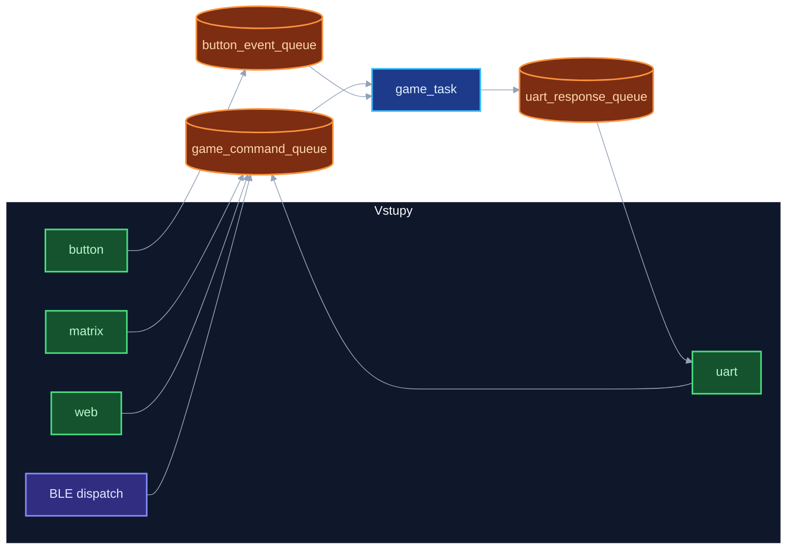

# CZECHMATE firmware **1.8.0**

Ahoj, tady je **CzechMate**, náš šachový systém — firmware na ESP32-C6, web v prohlížeči a aplikace ve Flutteru (`flutter_czechmate/`).

**Verze a hardware:** Firmware i dokumentace **`1.8.0`** — prototyp **V1** s **reed switch** maticí ([YouTube](https://youtu.be/_MS6OP3x6Z4)). **V2.0** = **Hall senzory**, komerční deska — [HARDWARE_VERZE.md](docs/reference/HARDWARE_VERZE.md).

**Stáhnout aplikaci:** [downloads.html](https://alfredkrutina.github.io/chess_esp32_c6_devkit/downloads.html) — APK, DMG, Windows instalátor na [GitHub Releases](https://github.com/alfredkrutina/chess_esp32_c6_devkit/releases/latest). **Windows:** BLE sken není — připojení přes Wi‑Fi URL ([docs/flutter/README.md](docs/flutter/README.md)). **iOS / iPad** připravujeme.

*Šachmat z Česka*

**Dokumentace:** [docs/README.md](docs/README.md) — diagramy, Flutter, OTA, reference. **Rozložení repa:** [docs/reference/REPO_LAYOUT.md](docs/reference/REPO_LAYOUT.md). **Řešení problémů:** [docs/reference/TROUBLESHOOTING.md](docs/reference/TROUBLESHOOTING.md).

---

## O projektu

Šachový systém na ESP32-C6: FreeRTOS, fyzická detekce figurek, LED zpětná vazba, web a Flutter klient. **Spolupráce:** Matěj — hardware, Alfred — firmware, aplikace, logika.

Delší poznámky (učení, autoři, licence): [docs/reference/PROJECT_NOTES.md](docs/reference/PROJECT_NOTES.md).

---

## Co CzechMate umí

**V1:** reed matice 8×8 (obsazeno/volno). **V2:** Hall — typ figurky. **73× WS2812B** (64 + 9 u tlačítek). Hra přes **aplikaci** (`flutter_czechmate/`), **web** nebo **UART** konzoli.

| Oblast | Popis |
|--------|--------|
| Šach | Rošáda, en passant, promoce, šach, mat |
| LED | Tahy, šach, mat, chyby, animace |
| Web | HTTP, REST, volitelně WebSocket `/ws` |
| Klient | Flutter — BLE (mobil), Wi‑Fi (desktop) |
| Bot / výuka | Stockfish, ELO, nápovědy, hodnocení tahů |
| Integrace | MQTT Home Assistant (`ha_light_task`) |
| Auto nová hra | Základní postavení stabilní ~2 s → nová partie |

---

## Hardware (V1 stručně)

*HW: Matěj Jager* — detail [HARDWARE_VERZE.md](docs/reference/HARDWARE_VERZE.md).

- ESP32-C6 DevKit, 73× WS2812B, 8×8 reed matice
- 4× promoce + 1× reset, USB Serial JTAG, externí 5 V pro LED

**GPIO (sladěno se softwarem):**

```
LED Data:        GPIO7
Matrix Rows:     GPIO10,11,18,19,20,21,22,23
Matrix Columns:  GPIO0,1,2,3,6,4,16,17
Status LED:      GPIO5
Reset Button:    GPIO15
```

---

## Architektura

Multitasking FreeRTOS — priority, fronty a mutexy: [KOMUNIKACE_MEZI_TASKY.md](docs/reference/KOMUNIKACE_MEZI_TASKY.md). Diagramy: [docs/diagrams/README.md](docs/diagrams/README.md).

| Task / runtime | Priorita | Stack |
|----------------|----------|-------|
| `led_task` | 7 | 8 KB |
| `matrix_task` | 6 | 4 KB |
| `button_task` | 5 | 3 KB |
| `game_task` | 4 | 6 KB |
| `uart_task`, `web_server_task`, `ha_light_task` | 3 | 5–20 KB |
| `test_task` (menuconfig) | 1 | 4 KB |
| **NimBLE host** | ESP-IDF | BLE přes `ble_task_init()` |

`animation_task` je **vypnutý** — animace v `led_task` / `unified_animation_manager`.



Komponenty ve `components/`: přehled skupin v [REPO_LAYOUT.md](docs/reference/REPO_LAYOUT.md).

---

## Build a flash

```bash
. $IDF_PATH/export.sh
idf.py menuconfig    # volitelně
idf.py build
idf.py -p PORT flash
idf.py -p PORT monitor
```

**Home Assistant:** MQTT RGB světlo — broker výchozí `homeassistant.local:1883`, NVS namespace `mqtt_config`. Discovery topic `homeassistant/light/esp32_chess_light_<MAC>/config`.

---

## Použití

| Kanál | Jak |
|-------|-----|
| **UART** | 115200 baud — `help`, `move e2e4`, `board`, `reset` |
| **Web** | `http://<IP>/` po Wi‑Fi (IP v logu) |
| **Flutter** | `cd flutter_czechmate && flutter pub get && flutter run` |
| **Releases** | [GitHub Releases](https://github.com/alfredkrutina/chess_esp32_c6_devkit/releases) |

**Fyzická hra:** zvednutí figurky → LED zdroj; položení → validace. Zelená = OK, červená = chyba, modrá = šach.

**Bot / výuka na webu:** Stockfish (chess-api.com), ELO 1–8, nápovědy, barevné hodnocení tahů (Best → Blunder).

---

## Dokumentace

| Dokument | Obsah |
|----------|--------|
| [docs/README.md](docs/README.md) | Rozcestník |
| [docs/diagrams/README.md](docs/diagrams/README.md) | Mermaid / SVG |
| [docs/flutter/README.md](docs/flutter/README.md) | Aplikace |
| [docs/ota_architecture.md](docs/ota_architecture.md) | OTA firmware |
| [docs/reference/REPO_LAYOUT.md](docs/reference/REPO_LAYOUT.md) | Inventář repa |
| [docs/reference/TROUBLESHOOTING.md](docs/reference/TROUBLESHOOTING.md) | Ladění, známé problémy |
| [docs/reference/PROJECT_NOTES.md](docs/reference/PROJECT_NOTES.md) | Verze, autoři, licence |

**Doxygen:** `./generate_docs.sh` → `docs/doxygen/html/index.html`  
**Diagramy:** `./scripts/render_docs.sh`

**GitHub Pages:** [alfredkrutina.github.io/chess_esp32_c6_devkit](https://alfredkrutina.github.io/chess_esp32_c6_devkit/) — postup [gh-pages-ready/README.md](gh-pages-ready/README.md).

**Formuláře V2:** [předobjednávka](https://docs.google.com/forms/d/18ns5uSUSzr5zcHsiZwD1HWfY15xBa-folmE-oH86BsY/viewform) · [průzkum](https://docs.google.com/forms/d/e/1FAIpQLSck_q6sjN1nnUs9aV2CsY0MyPNo9puLcncW603iEJz6BMLjPw/viewform)

---

**Verze README:** 1.8.0 · **2026**
