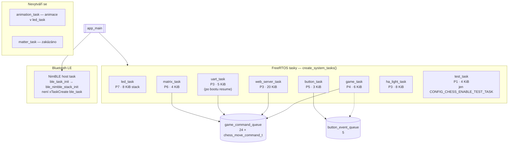

# CZECHMATE v2.5

**Kompletní šachový systém s fyzickou šachovnicí, LED osvětlením, webovým serverem a Flutter klientem (`flutter_czechmate/`).** Nativní Xcode projekt `CZECHMATE/` je jen lokálně (není v gitu).

*Šachmat, udělaný v Česku*

---

## 🎓 O projektu

**CZECHMATE** - to je název našeho projektu. Hra se slovem "checkmate" (šachmat) a "Czech" (český), protože je to šachový systém udělaný v Česku. Původní nápad byl "CZECHMADE", ale to se nám zdálo příliš abstraktní. CZECHMATE lépe vystihuje, o co jde - šachmat, ale český.

Tento projekt představuje náš největší a nejkomplexnější projekt, na kterém jsme pracovali. Je to šachový systém postavený na ESP32-C6 mikrokontroléru, který kombinuje hardware, software, embedded systémy, webové technologie a samozřejmě šachovou logiku. Když jsme začínali, netušili jsme, kolik se toho naučíme a kolik výzev nás čeká.

Projekt vznikal postupně - od jednoduché myšlenky "udělat šachy s LED" až po komplexní systém s FreeRTOS multitaskingem, webovým serverem, fyzickou detekcí figurek a kompletní implementací všech šachových pravidel. Každá část projektu nás něco naučila - od základů embedded programování přes real-time systémy až po webové technologie.

**Spolupráce:** Projekt je výsledkem týmové práce - Matěj se zaměřil na hardware design, zapojení a fyzickou realizaci šachovnice, zatímco já jsem pracoval na software, firmware a šachové logice.

---

## 📋 Přehled projektu

CZECHMATE je pokročilý šachový systém, který umožňuje hrát šachy na fyzické šachovnici s automatickou detekcí figurek pomocí Reed Switch matice. Systém obsahuje 73 WS2812B LED diod (64 na šachovnici + 9 na tlačítkách), které poskytují vizuální feedback pro každý tah. Kromě fyzické hry je možné hrát i přes webové rozhraní nebo UART konzoli.

### 🎯 Hlavní funkce

- **Fyzická šachovnice** - 8x8 Reed Switch matice pro automatickou detekci figurek
- **LED osvětlení** - 64 LED na šachovnici + 9 LED na tlačítkách pro vizuální feedback
- **Flutter aplikace (`flutter_czechmate/`)** - Multiplatformní klient (Dart/Flutter): BLE (`flutter_blue_plus`), HTTP a WebSocket pro spojení s deskou a webem.
- **Mobilní aplikace** — primárně **Flutter** (`flutter_czechmate/`) pro Android / iOS / desktop. Případná nativní iOS appka ve složce `CZECHMATE/` drž lokálně (mimo tento repozitář).
- **Kompletní šachová logika** - Všechna pravidla včetně rošády, en passant, promoce, šach, mat
- **Webové rozhraní** - HTTP server pro vzdálenou hru přes prohlížeč s real-time aktualizací
- **UART konzole** - Textové příkazy pro ovládání, ladění a testování
- **LED animace** - Vizuální feedback pro tahy, šach, mat, remízu a konec hry (sjednocená vítězná animace)
- **FreeRTOS multitasking** - Paralelní tasky (LED, matice, hra, web, BLE, MQTT, časovače); samostatný **`animation_task` je vypnutý** — LED animace běží v **`led_task`** přes **`unified_animation_manager`** / **`game_led_animations`** (komponenta `animation_task/` zůstává v repu kvůli API, FreeRTOS task se ve `main.c` nevytváří).
- **Integrace s Home Assistant** - MQTT světlo přes `ha_light_task` (dynamické LED scény řízené z HA)
- **Automatický start nové hry** - Pokud jsou všechny figurky fyzicky v počáteční pozici po ~2 sekundách, spustí se nová hra
- **Hra proti Botovi (Stockfish)** - Možnost hrát proti AI enginu s nastavitelnou obtížností (ELO) a volbou strany
- **Výukový režim a Nápověda** - Integrovaná nápověda tahů s vysvětlením, hodnocení kvality tahů a systém odměn za dobré tahy

---

## 🛠️ Hardware

*Hardware design a realizace: Matěj Jager*

### Komponenty

Projekt používá následující hardware komponenty, které Matěj pečlivě navrhl a zapojil:

- **ESP32-C6 DevKit** - Hlavní mikrokontrolér s WiFi a Bluetooth
- **73x WS2812B LED** - 64 LED na šachovnici + 9 LED na tlačítkách
- **8x8 Reed Switch Matrix** - Pro detekci fyzických figurek na šachovnici (64 Reed Switchů)
- **4x Promotion tlačítka** - Pro výběr figury při promoci pěšce (Queen, Rook, Bishop, Knight)
- **1x Reset tlačítko** - Pro reset hry
- **USB Serial JTAG** - Pro konzoli, programování a ladění
- **Externí 5V/5A zdroj** - Pro napájení LED pásu (WS2812B potřebují hodně proudu)

### GPIO mapování

Jedna z prvních výzev bylo správně namapovat všechny GPIO piny. ESP32-C6 má omezený počet bezpečných pinů, takže Matěj musel pečlivě naplánovat, co kam připojit, a já jsem musel zajistit, aby software toto mapování respektoval:

```
LED Data:        GPIO7  (WS2812B - bezpečný pin pro RMT)
Matrix Rows:     GPIO10,11,18,19,20,21,22,23 (8 výstupů)
Matrix Columns: GPIO0,1,2,3,6,4,16,17 (8 vstupů s pull-up)
Status LED:      GPIO5  (samostatný pin pro status - GPIO8 je boot strapping pin)
Reset Button:    GPIO15 (samostatný pin s pull-up)
```

### Time-Multiplexing

Protože ESP32-C6 má omezený počet GPIO pinů, museli jsme použít time-multiplexing pro sdílení pinů mezi maticí a tlačítky. Matěj navrhl hardware zapojení s diodami, které umožňují sdílení pinů, a já jsem implementoval software časování. To byla jedna z technicky nejnáročnějších částí projektu:

**25ms cyklus:**
- **0-20ms**: Matrix skenování (8x8 reed switchů) - detekce figurek
- **20-25ms**: Tlačítkové skenování (9 tlačítek) - ovládání
- LED aktualizace probíhá nezávisle mimo multiplexing cyklus

Toto řešení mi umožnilo použít stejné piny pro matici i tlačítka, což bylo kritické pro úsporu GPIO pinů.

---

## 🏗️ Architektura

### FreeRTOS Tasky

Systém používá FreeRTOS pro multitasking. To byla pro mě úplně nová oblast - před tím jsem programoval hlavně sekvenční kód. Naučil jsem se, jak správně navrhnout tasky, jak používat fronty pro komunikaci a jak synchronizovat přístup ke sdíleným zdrojům pomocí mutexů.

Systém má několik hlavních FreeRTOS tasků s různými prioritami:

| Task / runtime | Priorita | Popis | Stack Size |
|----------------|----------|-------|------------|
| `led_task` | 7 | WS2812B LED, batch commit, animace (`unified_animation_manager`) | 8KB |
| `matrix_task` | 6 | Sken 8×8 matice + time-multiplex s tlačítky | 4KB |
| `button_task` | 5 | Tlačítka (promoce, reset, …) | 3KB |
| `game_task` | 4 | Šachová logika a stav hry | 6KB |
| `uart_task` | 3 | USB Serial JTAG konzole (po boot animaci resume) | 5KB |
| `web_server_task` | 3 | HTTP server, REST, volitelně WebSocket `/ws` (`CONFIG_HTTPD_WS_SUPPORT`) | 20KB |
| `ha_light_task` | 3 | MQTT Home Assistant (RGB light) | 8KB |
| `test_task` | 1 | Automatické testy (jen pokud `CONFIG_CHESS_ENABLE_TEST_TASK`) | 4KB |
| **NimBLE host** | (ESP-IDF) | GATT pro mobilní klienty — startuje se `ble_task_init()` → `nimble_port_freertos_init`, **není** samostatný `xTaskCreate("ble_task")` v `main.c` | (řídí stack NimBLE) |

**Proč jsou priority takto nastavené?**

To jsem se naučil tvrdě - když jsem měl špatně nastavené priority, systém se choval divně. LED task má nejvyšší prioritu (7), protože WS2812B LED vyžadují přesný timing a nesmí být přerušeny. Matrix task má prioritu 6 pro real-time detekci pohybu figurek. **Game task** má prioritu **4** (stav hry a tahy). **UART, web server i HA light task** mají prioritu **3** (I/O a síť); přenosové BLE běží v **NimBLE host tasku** z ESP-IDF (viz `ble_task_init`), ne jako řádek v tabulce výše. **Test task** má prioritu **1** a zapíná se jen v menuconfig.

**Poznámka k animacím:** Dřívější samostatný FreeRTOS task `animation_task` (priorita 3) je **vypnutý**; animace jsou integrované do pipeline LED tasku a sdílených modulů výše — menší režie tasků a konzistentnější timing s RMT.

### Komunikace mezi tasky

Jedna z nejdůležitějších věcí, kterou jsem se naučil, je správná komunikace mezi tasky:

- **FreeRTOS Queues** - Pro asynchronní komunikaci mezi tasky (velikosti viz `GAME_QUEUE_SIZE` atd. v `freertos_chess.h`)
  - `game_command_queue` - Příkazy pro `game_task` (**24** zpráv typu `chess_move_command_t`)
  - `button_event_queue` - Eventy z tlačítek (5 zpráv)
  - LED se ovládají přímými voláními (fronta byla odstraněna pro lepší výkon)

- **Mutexes** - Pro thread-safe přístup ke sdíleným zdrojům
  - `uart_mutex` - Ochrana UART výstupu
  - `led_unified_mutex` - Ochrana LED bufferu / batch commit v `led_task`

- **Timers** - Pro periodické úlohy

### Diagram architektury tasků (Mermaid)

Na GitHubu se diagram vykreslí přímo v náhledu README. Zdroj pro příkazovou řadu / CI: [`docs/diagrams/sources/tasks_architecture.mmd`](docs/diagrams/sources/tasks_architecture.mmd) (`./scripts/render_docs.sh` → SVG/PNG).



### Struktura komponent

Projekt je rozdělen do logických komponent, každá má svou vlastní složku:

```
components/
├── freertos_chess/              # Základní FreeRTOS infrastruktura
│   ├── freertos_chess.c         # Inicializace, fronty, mutexy
│   ├── led_mapping.c            # Mapování LED pozic
│   ├── shared_buffer_pool.c     # Sdílené buffery
│   └── streaming_output.c      # Streamování výstupu
│
├── game_task/                   # Šachová logika a pravidla
│   ├── game_task.c              # Hlavní šachová logika (11k+ řádků)
│   ├── game_led_direct.c        # Přímé LED funkce
│   └── demo_mode_helpers.c      # Pomocné funkce pro demo mód
│
├── ble_task/                    # Bluetooth LE komunikace
│   └── ble_nimble_impl.c        # NimBLE GATT server pro iOS app
│
├── matrix_task/                 # Skenování 8x8 matice
│   └── matrix_task.c             # Reed switch skenování
│
├── led_task/                    # WS2812B LED ovládání
│   └── led_task.c                # LED hardware interface
│
├── button_task/                 # Zpracování tlačítek
│   └── button_task.c            # Button event handling
│
├── uart_task/                   # UART konzole
│   └── uart_task.c              # Textové příkazy
│
├── web_server_task/             # HTTP web server
│   ├── web_server_task.c        # HTTP server implementace + embed JS
│   └── chess_app.js             # Zdroj embedded JavaScriptu (nekompiluje se)
│
├── animation_task/              # Legacy API / typy (FreeRTOS task nevytváří se)
│   └── animation_task.c
│
├── unified_animation_manager/   # Unified animation system (běžící cesta)
│   └── unified_animation_manager.c
│
├── led_state_manager/           # Správa LED stavů
│   └── led_state_manager.c
│
├── game_led_animations/         # Vysokoúrovňové animace (tahy, endgame, změna hráče)
│   └── game_led_animations.c
│
├── config_manager/              # Správa konfigurace
│   └── config_manager.c
│
├── timer_system/                # Timer utilities
│   └── timer_system.c
│
├── ha_light_task/               # MQTT/HA integrace pro světlo
│   └── ha_light_task.c
│
├── promotion_button_task/       # (Nepoužívá se, sdruženo do button_task)
│   └── promotion_button_task.c
│
├── reset_button_task/           # (Nepoužívá se, sdruženo do button_task)
│   └── reset_button_task.c
│
└── visual_error_system/         # Vizuální error handling
    └── visual_error_system.c
```

---

## 🚀 Instalace a Build

### Požadavky

- **ESP-IDF** v5.1 nebo novější
- **Python 3.8+**
- **CMake 3.16+**
- **ESP32-C6 DevKit** nebo kompatibilní hardware
- **USB kabel** pro programování

### Build proces

```bash
# 1. Nastavit ESP-IDF prostředí
. $IDF_PATH/export.sh

# 2. Konfigurovat projekt
idf.py menuconfig

# 3. Sestavit projekt
idf.py build

# 4. Nahrát do ESP32-C6
idf.py -p /dev/ttyUSB0 flash

# 5. Monitorovat výstup
idf.py -p /dev/ttyUSB0 monitor
```

### Konfigurace

Hlavní konfigurační možnosti v `menuconfig`:

- **WiFi SSID/Password** - Pro web server
- **LED brightness** - Jas LED diod (0-255)
- **Matrix scan rate** - Rychlost skenování matice (ms)
- **Debug level** - Úroveň logování (ERROR, WARN, INFO, DEBUG, VERBOSE)

#### Home Assistant / MQTT integrace

Integrace s Home Assistant je řešená přes komponentu `ha_light_task` jako **MQTT RGB light**:

- MQTT broker výchozí host: `homeassistant.local` (TCP port `1883`), lze změnit v NVS.
- Konfigurace MQTT (host, port, username, password) se ukládá do NVS namespace `mqtt_config` (`broker_host`, `broker_port`, `broker_username`, `broker_password`).
- Po úspěšném připojení k MQTT klient publikuje **Home Assistant auto-discovery**:
  - discovery topic ve tvaru `homeassistant/light/esp32_chess_light_<MAC>/config`
  - entita typu `light` se jménem `CzechMate`
  - JSON schema, podpora `brightness`, `rgb` color mode a efektů (`rainbow`, `pulse`, `static`).
- Používané MQTT topicy:
  - `HA_TOPIC_LIGHT_COMMAND` – příkazy z HA (zapnutí/vypnutí, barva, jas, efekt)
  - `HA_TOPIC_LIGHT_STATE` – publikovaný stav světla (on/off, jas, RGB, efekt)
  - `HA_TOPIC_LIGHT_AVAILABILITY` – dostupnost (`online` / `offline`)

Režimy provozu:

- **GAME MODE** – výchozí režim, LED zobrazují stav šachovnice a herní animace.
- **HA MODE (Lampa)** – všechny LED se chovají jako jedno RGB světlo. Může být řízeno z Home Assistant (MQTT) nebo přímo z webu bez připojení k WiFi (viz níže).
- Přepínání zpět do GAME MODE proběhne automaticky při detekci aktivity (pohyb figurky, tah přes web/UART), nebo ručně tlačítkem „Šachovnice“ v Nastavení.

---

## 📖 Použití

### UART Konzole

Připojte se přes USB Serial JTAG (115200 baud) a použijte textové příkazy:

```
help                    - Zobrazit nápovědu se všemi příkazy
move e2e4              - Provede tah (notace: e2e4, e2-e4, nebo e2 e4)
reset                  - Resetovat hru na výchozí pozici
status                 - Zobrazit aktuální stav hry
board                  - Zobrazit šachovnici v ASCII
test                   - Spustit testovací funkce
```

### Webové rozhraní

Po připojení k WiFi se systém automaticky spustí jako HTTP server. Najděte IP adresu v UART konzoli a otevřete v prohlížeči:

```
http://<IP_ADDRESS>/
```

Webové rozhraní umožňuje:
- **Zobrazení šachovnice** - Real-time aktualizace
- **Provedení tahů** - Kliknutím na figurky
- **Zobrazení historie** - Všechny provedené tahy
- **Reset hry** - Tlačítko pro restart
- **Sandbox mód** - Zkoušení tahů bez ovlivnění hry
- **Review mód** - Procházení historie tahů

- **Integrace s Home Assistant a stav systému** - Web vrstvu doplňuje MQTT integrace (`ha_light_task`) pro ovládání RGB světla z Home Assistant.
- **Stav hry, error stavy a konec hry** - Jsou zobrazovány konzistentně na webu i na fyzických LED (zvednutá figurka, nevalidní tah, error recovery).

### Flutter klient (`flutter_czechmate/`)

- **Stack:** Flutter 3.x, Riverpod, `flutter_blue_plus` (BLE), HTTP, WebSocket, balíček `chess`, integrace Stockfish/API dle nastavení.
- **Účel:** Jedna codebase pro Android / iOS / desktop; spojení s deskou (BLE a/nebo HTTP/WebSocket k webové vrstvě ESP32).
- **Mobilní rozšíření (stav repa):** mimo jiné podpora **Live Activities** (iOS), **Wear OS** modul a chess clock notifikace na Androidu — viz zdroje v `flutter_czechmate/ios/` a `flutter_czechmate/android/wear/`.
- **Build:** z kořene `cd flutter_czechmate && flutter pub get && flutter run` (vyžaduje Flutter SDK).

### ⚙️ Nastavení a Přizpůsobení (Web UI)

Webové rozhraní obsahuje záložku **Nastavení**, kde můžete konfigurovat:

- **Režim zobrazení (Zařízení):** Přepínač **Šachovnice** / **Lampa**. V režimu Lampa se celá deska chová jako jedno RGB světlo – ovládání je dostupné i bez připojení k domácí WiFi (stačí AP šachovnice). Barva (R, G, B) a zapnutí/vypnutí se nastavují v sekci Zařízení; poslední stav se ukládá do NVS a obnoví po restartu. Stav je synchronizován s Home Assistant (pokud je MQTT připojen).
- **Jas LED:** Jeden globální slider (0–100 %) platí pro šachovnici i pro režim Lampa.
- **Obtížnost Bota:** Nastavení ELO síly pro hru proti počítači (Level 1-8).
- **Zhodnocení tahů:** Zapnutí/vypnutí automatické analýzy tahů po každém tahu.
- **Výukový přehled:** Zobrazení panelu s počtem zbývajících nápověd a průměrnou kvalitou hry.
- **WiFi Manager:** Připojení k domácí WiFi síti (skenování, zadání hesla).

### 🤖 Hra proti Botovi a Výuka (Novinka v2.5)

Webové rozhraní nově integruje **Stockfish engine** (přes chess-api.com) pro pokročilé funkce:

#### Hra proti Botovi
- **Nastavitelná síla (ELO):** Od začátečníka po velmistra.
- **Fyzická interakce:** Botův tah je zobrazen na šachovnici pomocí LED navigace (odkud-kam). Hráč musí fyzicky provést tah za bota.
- **Volba strany:** Můžete hrát za bílé i černé.

#### Nápověda a Analýza (Hint System)
- **Tlačítko Nápověda:** Zobrazí nejlepší tah doporučený Stockfishem.
- **Vysvětlení tahu:** Stručné vysvětlení, proč je tah dobrý (např. "Získáš výhodu", "Mat za 3 tahy").
- **Hodnocení tahů:** Po každém tahu systém (volitelně) zhodnotí vaši hru slovně i barevně:
    - 🟢 **Best / Good** - Výborný nebo dobrý tah.
    - 🟡 **Inaccuracy** - Menší nepřesnost.
    - 🟠 **Mistake** - Chyba, zhoršení pozice.
    - 🔴 **Blunder** - Hrubá chyba (např. ztráta figury).
- **Výukový systém:** Počet nápověd může být omezen. Za dobré tahy ("Best" nebo "Good") a sebrání figur získává hráč nápovědy navíc jako odměnu.
- **Statistiky:** Sledování průměrné kvality tahů pro oba hráče (hodnocení 1.0 - 5.0).

### Fyzická hra

1. **Umístěte figurky** na šachovnici do výchozí pozice
2. **Systém automaticky detekuje** pozice pomocí Reed Switch matice
3. **Zvedněte figurku** - LED se rozsvítí na aktuální pozici
4. **Položte na novou pozici** - Systém validuje a provede tah
5. **LED animace** zobrazí validitu tahu:
   - Zelená = platný tah
   - Červená = neplatný tah
   - Modrá = šach
   - Červená blikání = mat
6. **Automatický start nové hry** - pokud po skončení hry ručně vrátíte všechny figurky do počáteční pozice (řady 0,1,6,7 obsazené, 2–5 prázdné) a tato pozice je stabilní ~2 s, systém spustí novou hru sám

---

## 🎓 Co jsme se naučili

Tento projekt nás naučil neuvěřitelně moc věcí. Když jsme začínali, znali jsme jen základy. Teď rozumíme:

### Embedded programování
- **FreeRTOS** - Real-time operační systém pro embedded zařízení
- **GPIO management** - Správné použití pinů, pull-up/pull-down, multiplexing
- **Interrupt handling** - Práce s hardware přerušeními
- **Memory management** - Stack vs heap, optimalizace paměti
- **Watchdog timers** - Ochrana před zaseknutím systému

### Šachová logika
- **Chess rules** - Všechna pravidla včetně těch složitých (en passant, rošáda, promoce)
- **Move validation** - Jak správně validovat tahy
- **Check detection** - Detekce šachu a matu
- **Board representation** - Efektivní reprezentace šachovnice v paměti

### Webové technologie
- **HTTP server** - Implementace HTTP serveru na embedded zařízení
- **WebSocket** - Endpoint `/ws` pokud je v buildu zapnuté `CONFIG_HTTPD_WS_SUPPORT` (jinak polling přes REST)
- **JavaScript** - Embedded JavaScript pro webové rozhraní
- **REST API** - API pro komunikaci s webovým rozhraním

### Software architektura
- **Modular design** - Rozdělení kódu do logických modulů
- **Task communication** - Komunikace mezi paralelními tasky
- **Error handling** - Správné ošetření chyb
- **Code organization** - Jak organizovat velký projekt

### Hardware
- **Reed switches** - Jak fungují a jak je použít
- **WS2812B LED** - Adresovatelné LED diody, protokol, timing
- **Time-multiplexing** - Sdílení pinů mezi komponentami
- **Power management** - Optimalizace spotřeby

### Debugging
- **UART logging** - Logování pro debugging
- **LED debugging** - Vizuální indikace chyb
- **System monitoring** - Sledování stavu systému

---

## 🐛 Výzvy, které jsme řešili

### Hardware výzvy (Matěj)

Matěj řešil především hardware problémy:

**Reed Switch zapojení:** Jedna z největších výzev bylo správně zapojit 64 Reed Switchů do matice. Každý switch musel být připojený mezi správný row a column pin, a všechny musely být spolehlivě připojené.

**Time-multiplexing s diodami:** Navrhl zapojení s diodami 1N4148, které umožňují sdílení pinů mezi maticí a tlačítky. To vyžadovalo pečlivé plánování a testování, aby se zajistilo, že diody správně izolují signály.

**Napájení LED:** 73 WS2812B LED potřebují hodně proudu (až 4.5A při plném jasu). Matěj musel zajistit externí 5V zdroj a správné zapojení GND, aby nedocházelo k problémům s napájením.

**Fyzická realizace:** Nejenže navrhl zapojení, ale také fyzicky realizoval šachovnici - umístil Reed Switchy, zapojil LED, vytvořil PCB nebo použil breadboard, a zajistil, aby vše fungovalo spolehlivě.

### Software výzvy (Alfred)

### 1. Time-Multiplexing GPIO pinů

**Problém:** ESP32-C6 má omezený počet GPIO pinů, ale potřebujeme 8 výstupů pro matici řádků, 8 vstupů pro sloupce, a ještě 4 tlačítka pro promoci.

**Hardware řešení (Matěj):** Matěj navrhl zapojení s diodami 1N4148, které umožňují sdílení pinů. Každé tlačítko je připojené přes diody ke všem řádkům matice, což umožňuje detekci tlačítka během button scan fáze.

**Software řešení (Alfred):** Implementoval jsem time-multiplexing - během 25ms cyklu se střídá skenování matice a tlačítek (viz sekce Time-Multiplexing výše). To bylo technicky náročné, protože jsem musel zajistit, aby se stavy neovlivňovaly a aby diody správně izolovaly signály.

### 2. Šachová logika

**Problém:** Implementovat všechna šachová pravidla správně. En passant, rošáda, promoce - to všechno má spoustu edge cases.

**Řešení:** Strávil jsem hodiny studiem šachových pravidel a implementací každého pravidla zvlášť. Musel jsem opravit spoustu bugů - například en passant validace byla velmi složitá. Matěj mi pomáhal testovat edge cases na fyzické šachovnici.

### 3. FreeRTOS multitasking

**Problém:** Když jsem začínal, nevěděl jsem, jak správně navrhnout tasky a jejich komunikaci. Měl jsem race conditions, deadlocky, a systém se občas zasekl.

**Řešení:** Naučil jsem se správně používat fronty, mutexy a semafory. Musel jsem přepracovat architekturu několikrát, než jsem to dostal správně. Matěj mi pomáhal testovat na hardwaru a identifikovat problémy s timingem.

### 4. LED animace

**Problém:** WS2812B LED vyžadují přesný timing. Když jsem aktualizoval LED příliš často, animace trhaly. Když příliš zřídka, byly pomalé. Navíc Matěj měl problémy s napájením - 73 LED potřebují hodně proudu.

**Hardware řešení (Matěj):** Matěj zajistil externí 5V/5A zdroj a správné zapojení GND, aby nedocházelo k problémům s napájením.

**Software řešení (Alfred):** Implementoval jsem unified animation manager, který spravuje všechny animace centralizovaně a zajišťuje plynulý chod.

### 5. Webový server

**Problém:** Implementovat HTTP server na embedded zařízení s omezenou pamětí bylo výzvou. Musel jsem optimalizovat každý byte.

**Řešení:** Použil jsem embedded HTTP server z ESP-IDF a optimalizoval jsem JavaScript kód. Také jsem implementoval kompresi a caching. Matěj testoval webové rozhraní na různých zařízeních a pomáhal identifikovat problémy s responsivitou.

### 6. Debugging

**Problém:** Když něco nefungovalo, bylo těžké zjistit proč. UART logy pomáhaly, ale někdy to nestačilo. Navíc když hardware nefungoval správně, bylo těžké zjistit, jestli je problém v softwaru nebo hardwaru.

**Hardware debugging (Matěj):** Matěj používal multimetr a osciloskop pro testování signálů a identifikaci problémů s hardware.

**Software debugging (Alfred):** Implementoval jsem vizuální error systém - když dojde k chybě, LED se rozsvítí červeně na konkrétní pozici, což nám pomohlo rychle identifikovat problém. Také jsme implementovali detailní UART logy pro každou komponentu.

---

## 📚 Dokumentace

Vytvořili jsme kompletní dokumentaci pomocí Doxygen. Dokumentace je dostupná v několika formátech:

### HTML dokumentace (doporučeno)

Interaktivní dokumentace s vyhledáváním a navigací:

**Lokální zobrazení:**
```bash
./generate_docs.sh
open docs/doxygen/html/index.html  # Otevře dokumentaci v prohlížeči
```


### RTF dokumentace (jeden soubor)

Kompletní dokumentace v jednom souboru pro Microsoft Word:

```bash
./generate_docs.sh
open docs/doxygen/rtf/refman.rtf
```

### PDF dokumentace

Pro tisk a sdílení:

```bash
./generate_docs.sh
./create_pdf_simple.sh
```

### Mermaid Sequence Diagramy

Kompletní diagramy všech flow v programu: komunikace mezi tasky, zpracování příkazů, speciální tahy, error handling a další.

[Mermaid — sekvenční diagramy](docs/diagrams/diagrams_mermaid.html) — kompletní diagramy programových toků  
[Architektura tasků (Mermaid v Markdownu)](docs/diagrams/tasks_architecture.md) — vektor **[tasks_architecture.svg](docs/diagrams/tasks_architecture.svg)** / PNG generuje **`./scripts/render_docs.sh`** nebo CI ([`.github/workflows/docs-diagrams.yml`](.github/workflows/docs-diagrams.yml))

**Další dokumentace v repu:** [docs/reference/](docs/reference/) (deploy web UI, komunikace tasků, souřadnice), [docs/diagrams/](docs/diagrams/) (Mermaid HTML/SVG, sekvence). Složky `context/`, `docs/planning/` a `docs/archive/` jsou v [.gitignore](.gitignore) — lokální podklady pro AI / plány, nejsou určené k sdílení v remote.

### GitHub Pages (veřejná dokumentace)

Po pushi na `main` workflow [.github/workflows/gh-pages.yml](.github/workflows/gh-pages.yml) nasadí složku [`gh-pages-ready/`](gh-pages-ready/) na větev **`gh-pages`**.

1. V repozitáři na GitHubu: **Settings → Pages → Build and deployment → Source:** **Deploy from a branch** → Branch **gh-pages**, folder **/ (root)** → Save.  
2. Po minutě běží web na `https://<uživatel>.github.io/<název-repa>/` (úvodní stránka z Doxygen v `gh-pages-ready/index.html`, Mermaid: [`diagrams_mermaid.html`](gh-pages-ready/diagrams_mermaid.html)).

---

## 📁 Struktura projektu

```
chess_esp32_c6_devkit/
├── main/                          # Hlavní aplikace
│   ├── main.c                     # Startup, inicializace, task creation
│   └── CMakeLists.txt
│
├── components/                     # FreeRTOS komponenty
│   ├── freertos_chess/            # Základní infrastruktura
│   ├── game_task/                 # Šachová logika (největší komponenta)
│   ├── matrix_task/               # Matrix skenování
│   ├── led_task/                  # LED ovládání
│   ├── button_task/               # Button handling
│   ├── uart_task/                 # UART konzole
│   ├── web_server_task/           # HTTP web server
│   ├── animation_task/            # Legacy animace (task v main vypnutý)
│   ├── game_led_animations/       # Animace tahů / konců her
│   ├── unified_animation_manager/ # Společný systém animací
│   ├── led_state_manager/         # Správa barev/stavů LED
│   ├── timer_system/              # Časovače a chess clock
│   ├── ha_light_task/             # MQTT/HA integrace
│   ├── promotion_button_task/     # Tlačítka pro promoci
│   ├── reset_button_task/         # Reset tlačítko
│   └── ...                        # Další pomocné komponenty
│
├── docs/                          # Ve remote: reference/ + diagrams/ (+ .gitignore pro doxygen)
│   ├── reference/                 # WEB_UI_DEPLOY, komunikace tasků, souřadnice
│   ├── diagrams/                # Mermaid HTML/SVG/PNG, zdroje .mmd
│   └── doxygen/                 # Doxygen výstup — generuj lokálně (viz docs/.gitignore)
│
├── build/                         # Build výstup ESP-IDF (generovaný, v .gitignore)
├── flutter_czechmate/             # Flutter klient (BLE / HTTP / WS)
├── CZECHMATE/                     # Xcode projekt — .gitignore (jen lokálně)
├── context/                       # AI podklady — .gitignore (není v remote)
├── CMakeLists.txt                 # Build konfigurace
├── Doxyfile                       # Doxygen konfigurace
├── generate_docs.sh              # Skript pro generování dokumentace
├── create_pdf_simple.sh          # Skript pro vytvoření PDF
└── README.md                      # Tento soubor
```

---

## 🔧 Vývoj

### Debug mód

Pro zapnutí debug módu upravte `CMakeLists.txt` nebo použijte `menuconfig`:

```c
#define CHESS_DEBUG_MODE 1
```

V `menuconfig`:
```
Component config → Chess System → Enable debug mode
```

Debug mód zobrazuje:
- Detailní logy všech operací
- Stav všech tasků
- Memory usage
- Performance metriky

### Testování

Systém obsahuje testovací funkce:

```bash
# Spustit test task
idf.py -p /dev/ttyUSB0 monitor
# V konzoli: test
```

---

## 🐛 Známé problémy a omezení

- **RTF dokumentace** může být velká (~10MB) - doporučujeme použít HTML nebo PDF
- **Legacy puzzle systém** byl odstraněn (zachována kompatibilita pro budoucí použití)
- **WiFi reconnect** - při ztrátě WiFi připojení je potřeba restart
- **Memory usage** - při dlouhých hrách může dojít k fragmentaci heap paměti (řešeno pomocí watchdog)
- **Reed Switch spolehlivost** - některé Reed Switchy mohou být méně spolehlivé po čase (hardware problém)

---

## 🔧 Troubleshooting

### Hardware problémy

**LED nesvítí:**
- Zkontrolujte napájení - WS2812B potřebují externí 5V zdroj
- Zkontrolujte GND - musí být společná pro ESP32 i LED
- Zkontrolujte GPIO7 - musí být správně připojený k DIN LED pásu

**Matrix nedetekuje figurky:**
- Zkontrolujte Reed Switchy - každý musí být správně zapojený
- Zkontrolujte pull-up rezistory na column pinech (10kΩ)
- Zkontrolujte, že row piny jsou správně připojené

**Tlačítka nefungují:**
- Zkontrolujte diody - každé tlačítko musí mít diody ke všem row pinům
- Zkontrolujte, že diody jsou správně orientované (anode k rows)

### Software problémy

**Systém se zasekne:**
- Zkontrolujte watchdog - měl by resetovat systém po 5 sekundách
- Zkontrolujte UART logy - mohou ukázat, kde se systém zasekl
- Zkontrolujte stack size tasků - možná je některý task přetížený

**Šachová logika nefunguje správně:**
- Zkontrolujte UART logy - zobrazují se všechny tahy
- Použijte `board` příkaz v UART konzoli pro zobrazení aktuálního stavu
- Zkontrolujte, že figurky jsou správně detekované maticí

**Webové rozhraní nefunguje:**
- Zkontrolujte WiFi připojení - IP adresa by měla být v UART logu
- Zkontrolujte, že web server task běží (priorita 3)
- Zkontrolujte firewall - možná blokuje připojení

---

## ❓ FAQ (Často kladené otázky)

**Q: Jak dlouho trval vývoj?**  
A: Projekt vznikal postupně několik měsíců - od prvních nápadů až po finální verzi.

**Q: Co bylo nejtěžší?**  
A: Pro Matěje to bylo hardware zapojení s time-multiplexingem. Pro mě to byla šachová logika - implementovat všechna pravidla správně bylo velmi náročné.

**Q: Jaké jsou plány do budoucna?**  
A: Máme spoustu nápadů - viz sekce "Budoucí vylepšení". Hlavně bychom chtěli přidat Chess AI a vylepšit webové rozhraní.

---

## 📝 Historie verzí

### v2.5.1 / firmware (aktuální stav repa, 2026-04)
- ✅ **Flutter klient** `flutter_czechmate/` (BLE, HTTP, WebSocket; iOS Live Activities / Wear OS v portu)
- ✅ **Vypnutý FreeRTOS `animation_task`** — animace přes `led_task` + `unified_animation_manager` / `game_led_animations`
- ✅ **Menší stacky** u LED/matrix/game/uart oproti starším README tabulkám — hodnoty z `freertos_chess.h`
- ✅ MQTT / Home Assistant (`ha_light_task`, priorita 3, stack 8KB)
- ✅ **BLE:** NimBLE přes `ble_task_init()` (host task od ESP-IDF, ne vlastní jméno tasku v tabulce výše)

### v2.5.0
- ✅ **Hra proti Botovi** (Stockfish integrace)
- ✅ **Chytrá nápověda** a analýza tahů
- ✅ **Výukový systém** s odměnami
- ✅ Vylepšené webové rozhraní (nové nastavení, statistiky)

### v2.4.0
- ✅ Kompletní šachová logika včetně všech pravidel
- ✅ Webové rozhraní s real-time aktualizací
- ✅ LED animace pro všechny stavy hry
- ✅ FreeRTOS multitasking (počet tasků se měnil; `animation_task` později vypnut)
- ✅ Time-multiplexing GPIO pinů
- ✅ Kompletní Doxygen dokumentace
- ✅ Unified animation manager
- ✅ Vizuální error systém

### v2.3.0
- Základní šachová logika
- LED osvětlení
- Matrix skenování

### v2.0.0
- První funkční verze
- Základní tahy
- LED feedback

**Poznámka:** V této historii verzí není uvedeno mnoho backupů a špatných slepých uliček, které vznikly během vývoje. Reálně existuje přes 15 verzí programu a nespočet commitů.

---

## 🤝 Jak jsme spolupracovali

Tento projekt byl výsledkem spolupráce mezi hardware a software částí. Matěj navrhl hardware a já jsem napsal software. Pracovali jsme na svých částech a pravidelně jsme se setkávali pro testování a koordinaci.

---

## 🔮 Budoucí vylepšení

Máme spoustu nápadů, co bychom chtěli přidat:

- **Move history** - Ukládání historie her do flash paměti (trvalé úložiště)
- **Offline AI** - Vlastní engine na MCU je náročný; reálnější je spoléhat na API z telefonu
- **Statistics** - Pokročilejší statistiky her
- **Opening book** - Databáze zahájení
- **Endgame database** - Databáze koncovek
- **WebSocket** - Rozšířit použití `/ws` ve všech klientech (firmware už umí za podmínky `CONFIG_HTTPD_WS_SUPPORT`)
- **Voice commands** - Hlasové ovládání (možná trochu sci-fi, ale proč ne?)

---

## 👥 Autoři

### Alfred Krutina - Software & Firmware

**Role:** Software development, firmware, šachová logika, webový server, dokumentace

Zodpovídal jsem za celý software stack - od FreeRTOS tasků přes šachovou logiku až po webové rozhraní. Strávil jsem stovky hodin programováním, debugováním a vylepšováním. Každá část projektu mě něco naučila - od základů embedded programování přes real-time systémy až po webové technologie.

**Hlavní příspěvky:**
- FreeRTOS architektura a task management
- Kompletní šachová logika včetně všech pravidel
- Webový server a embedded JavaScript
- LED animace a unified animation manager
- UART konzole a debugging systém
- Kompletní Doxygen dokumentace

### Matěj Jager - Hardware

**Role:** Hardware design, zapojení, fyzická realizace, testování

Matěj navrhl a realizoval celý hardware - od Reed Switch matice přes LED zapojení až po time-multiplexing s diodami. Bez jeho pečlivé práce na hardwaru by software neměl na čem běžet. Matěj také testoval všechny funkce na fyzickém hardwaru a pomáhal identifikovat problémy s timingem a napájením.

**Hlavní příspěvky:**
- Hardware design a zapojení
- Reed Switch matice (8x8 = 64 switchů)
- Time-multiplexing s diodami pro tlačítka
- Napájecí systém pro WS2812B LED
- Fyzická realizace šachovnice
- Hardware debugging a testování

### Spolupráce

Tento projekt je výsledkem spolupráce - Matěj navrhl hardware a já jsem napsal software. Pracovali jsme na svých částech a pravidelně jsme se setkávali pro testování a koordinaci.

---

## 📄 Licence

Tento projekt je soukromý projekt pro osobní použití a vzdělávací účely.

---

## 🔗 Užitečné odkazy

- [ESP-IDF Dokumentace](https://docs.espressif.com/projects/esp-idf/) - Oficiální dokumentace ESP-IDF
- [ESP32-C6 Datasheet](https://www.espressif.com/sites/default/files/documentation/esp32-c6_datasheet_en.pdf) - Technický datasheet
- [FreeRTOS Dokumentace](https://www.freertos.org/Documentation/RTOS_book.html) - FreeRTOS příručka
- [Chess Rules](https://www.fide.com/FIDE/handbook/LawsOfChess.pdf) - Oficiální šachová pravidla FIDE

---

## 🙏 Poděkování

Tento projekt by nevznikl bez pomoci a podpory mnoha lidí:

### Učitelé

Děkujeme našim učitelům za to, že nás naučili základy programování a elektroniky a ukázali nám, jak tyto znalosti použít v praxi. Bez jejich pomoci bychom tento projekt nedokázali vytvořit.

### ESP-IDF tým

Děkuji týmu ESP-IDF za výborný framework a dokumentaci. ESP-IDF je neuvěřitelně dobře navržený a dokumentovaný, což mi velmi usnadnilo práci.

### Shawn Hymel (YouTube)

Děkuji Shawn Hymel za jeho YouTube kanál, ze kterého jsem se naučil ESP-IDF, FreeRTOS a mnoho dalších embedded programovacích technik. Jeho tutoriály byly neocenitelné při učení se embedded systémům.

- [Wi-Fi tutoriál](https://youtu.be/j1ve8mYjUoU?si=iETnCguVFkBee_yP) - Tutoriál o Wi-Fi pro ESP32, který jsem použil při implementaci webového serveru

### Perplexity AI

Děkuji Perplexity AI za pomoc při hledání nápadů a návrhů pro firmware a software architekturu. Používal jsem ho jako nástroj pro inspiraci a prozkoumávání různých přístupů k řešení problémů během vývoje.

### FreeRTOS

Děkuji za FreeRTOS - robustní a dobře zdokumentovaný real-time operační systém, který je zdarma a open-source.

### Komunita ESP32

Děkuji celé komunitě ESP32 za pomoc na fórech, za sdílení zkušeností a za všechny ty skvělé projekty, které mě inspirovaly.

### Open Source komunita

Děkuji všem, kteří vytvářejí open source nástroje a knihovny, které jsem mohl použít v tomto projektu.

---

## 💭 Závěrečné myšlenky

Když jsme začínali tento projekt, netušili jsme, kolik se toho naučíme. Od základů programování v C přes embedded systémy, real-time programování, webové technologie, hardware design až po šachovou logiku - každá část projektu byla výzvou a každá nás něco naučila.

Nejvíc nás bavilo, když jsme viděli, jak se všechny části skládají dohromady - když jsme poprvé viděli, jak LED reagují na pohyb figurek, když jsme poprvé zahráli kompletní hru přes webové rozhraní, nebo když jsme poprvé viděli, jak systém správně detekuje šach a mat.

Tento projekt nám ukázal, že vytváření něčeho komplexního není jen o programování nebo hardwaru - je to o řešení problémů, o učení se novým věcem, o trpělivosti a vytrvalosti. A hlavně - je to zábava, když pracujete na něčem, co vás baví, a když máte skvělého spolupracovníka.

**Co jsme se naučili o spolupráci:**

- Komunikace je klíčová - když jsme něco nechápali, vždy jsme se zeptali
- Respektování odbornosti - Matěj rozuměl hardwaru, já softwaru, a vzájemně jsme si důvěřovali
- Trpělivost - někdy to nefungovalo a museli jsme to zkusit znovu
- Týmová práce - projekt by nevznikl bez obou z nás

**AI jako nástroj pro učení:**

Během vývoje tohoto projektu jsem aktivně používal AI nástroje (jako Perplexity AI) pro hledání nápadů a inspirace. Vnímám to jako přirozenou evoluci programování - podobně jako byl přechod z assembleru na C, nebo z C na Python v některých oblastech, tak nyní přichází AI jako další úroveň abstrakce. 

Pro mě jako začátečníka v embedded programování a ESP32 bylo AI neocenitelným nástrojem, který mi zrychlil učící proces a ukázal mi možnosti a přístupy, o kterých jsem předtím nevěděl. Pokud si tento nástroj neosvojím a nebudu ho aktivně prozkoumávat, budu pozadu oproti budoucí konkurenci. 

Nepovažuji za problém používat AI i v ročníkové práci, pokud všemu rozumím a dokážu to vysvětlit. AI mi pomohlo najít správný směr a v některých případech jsem použil funkce, které AI navrhlo - pokud fungovaly a rozuměl jsem jim, nechal jsem je v projektu. Je to nástroj, který zrychluje učení a otevírá nové možnosti, ale stále je to jen nástroj - bez vlastního porozumění a schopnosti kriticky myslet by byl k ničemu.

Pokud máte jakékoli otázky nebo připomínky k projektu, neváhejte se ozvat. Rádi se podělíme o zkušenosti a možná se i něco naučíme od vás.

---

**Poznámka:** Tento projekt je aktivně vyvíjen. Pro nejnovější informace, bug reporty a technické detaily se podívejte do [docs/](docs/) složky.

**Verze dokumentace:** 2.5.1 (README)
**Poslední aktualizace:** 2026-04-30

---

**Poznámka:** Tento projekt je aktivně vyvíjen. Pro nejnovější informace se podívejte do [docs/](docs/) složky.
