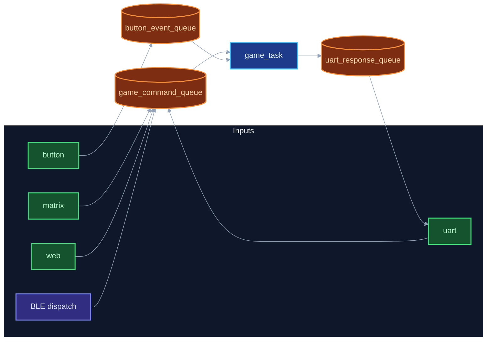

# CzechMate firmware **1.8.0**

**CzechMate** is a smart physical chess system — ESP32-C6 firmware, a browser UI, and a Flutter app (`flutter_czechmate/`).

**Version & hardware:** Firmware and docs at **`1.8.0`** — prototype **V1** with a **reed-switch** matrix ([YouTube](https://youtu.be/_MS6OP3x6Z4)). **V2.0** targets **Hall sensors** and a commercial board — [HARDWARE_VERSIONS.md](docs/reference/HARDWARE_VERSIONS.md).

**Download the app:** [downloads.html](https://alfredkrutina.github.io/chess_esp32_c6_devkit/downloads.html) — APK, DMG, and Windows installer on [GitHub Releases](https://github.com/alfredkrutina/chess_esp32_c6_devkit/releases/latest). **Windows:** no BLE scan — connect via Wi‑Fi URL ([docs/flutter/README.md](docs/flutter/README.md)). **iOS / iPad** support is in progress.

*Checkmate from Czechia*

**Docs:** [docs/README.md](docs/README.md) — diagrams, Flutter, OTA, reference. **Repo layout:** [docs/reference/REPO_LAYOUT.md](docs/reference/REPO_LAYOUT.md). **Troubleshooting:** [docs/reference/TROUBLESHOOTING.md](docs/reference/TROUBLESHOOTING.md).

---

## About

ESP32-C6 chess system: FreeRTOS, physical piece detection, LED feedback, web UI, and Flutter client — firmware, hardware, app, and game logic in one project.

Longer notes (learning log, license): [docs/reference/PROJECT_NOTES.md](docs/reference/PROJECT_NOTES.md).

---

## Features

**V1:** 8×8 reed matrix (occupied / empty). **V2:** Hall sensors — piece type. **73× WS2812B** (64 squares + 9 near the buttons). Play via the **app** (`flutter_czechmate/`), **web**, or **UART** console.

| Area | Description |
|------|-------------|
| Chess | Castling, en passant, promotion, check, mate |
| LED | Moves, check, mate, errors, animations |
| Web | HTTP, REST, optional WebSocket `/ws` |
| Client | Flutter — BLE (mobile), Wi‑Fi (desktop) |
| Bot / training | Stockfish, ELO, hints, move evaluation |
| Integration | MQTT Home Assistant (`ha_light_task`) |
| Auto new game | Starting position stable ~2 s → new game |

---

## Hardware (V1 overview)

Hardware details: [HARDWARE_VERSIONS.md](docs/reference/HARDWARE_VERSIONS.md).

- ESP32-C6 DevKit, 73× WS2812B, 8×8 reed matrix
- 4× promotion + 1× reset, USB Serial JTAG, external 5 V for LEDs

**GPIO (matches the firmware):**

```
LED Data:        GPIO7
Matrix Rows:     GPIO10,11,18,19,20,21,22,23
Matrix Columns:  GPIO0,1,2,3,6,4,16,17
Status LED:      GPIO5
Reset Button:    GPIO15
```

---

## Architecture

FreeRTOS multitasking — priorities, queues, and mutexes: [TASK_COMMUNICATION.md](docs/reference/TASK_COMMUNICATION.md). Diagrams: [docs/diagrams/README.md](docs/diagrams/README.md).

| Task / runtime | Priority | Stack |
|----------------|----------|-------|
| `led_task` | 7 | 8 KB |
| `matrix_task` | 6 | 4 KB |
| `button_task` | 5 | 3 KB |
| `game_task` | 4 | 6 KB |
| `uart_task`, `web_server_task`, `ha_light_task` | 3 | 5–20 KB |
| `test_task` (menuconfig) | 1 | 4 KB |
| **NimBLE host** | ESP-IDF | BLE via `ble_task_init()` |

`animation_task` is **disabled** — animations run in `led_task` / `unified_animation_manager`.


```mermaid
%%{init: {'theme':'dark','themeVariables':{'clusterBkg':'#0f172a','lineColor':'#94a3b8','primaryTextColor':'#f1f5f9','titleColor':'#f8fafc'}}}%%
flowchart LR
  subgraph IN["Inputs"]
    MT[matrix]:::t
    BTN[button]:::t
    SER[uart]:::t
    WEB[web]:::t
    BLE[BLE dispatch]:::b
  end
  GQ[(game_command_queue)]:::q
  BQ[(button_event_queue)]:::q
  GT[game_task]:::g
  MT --> GQ
  SER --> GQ
  WEB --> GQ
  BLE --> GQ
  BTN --> BQ
  GQ --> GT
  BQ --> GT
  GT --> URQ[(uart_response_queue)]:::q --> SER

  classDef t fill:#14532d,stroke:#4ade80,stroke-width:2px,color:#bbf7d0
  classDef b fill:#312e81,stroke:#818cf8,stroke-width:2px,color:#e0e7ff
  classDef q fill:#7c2d12,stroke:#fb923c,stroke-width:2px,color:#fed7aa
  classDef g fill:#1e3a8a,stroke:#38bdf8,stroke-width:2px,color:#e0f2fe
```

Components under `components/`: group overview in [REPO_LAYOUT.md](docs/reference/REPO_LAYOUT.md).

---

## Build & flash

```bash
. $IDF_PATH/export.sh
idf.py menuconfig    # optional
idf.py build
idf.py -p PORT flash
idf.py -p PORT monitor
```

**Home Assistant:** MQTT RGB light — default broker `homeassistant.local:1883`, NVS namespace `mqtt_config`. Discovery topic `homeassistant/light/esp32_chess_light_<MAC>/config`.

---

## Usage

| Channel | How |
|---------|-----|
| **UART** | 115200 baud — `help`, `move e2e4`, `board`, `reset` |
| **Web** | `http://<IP>/` after Wi‑Fi (IP in the log) |
| **Flutter** | `cd flutter_czechmate && flutter pub get && flutter run` |
| **Releases** | [GitHub Releases](https://github.com/alfredkrutina/chess_esp32_c6_devkit/releases) |

**Physical play:** lift a piece → LED on the source square; place → validation. Green = OK, red = error, blue = check.

**Bot / training on the web:** Stockfish (chess-api.com), ELO 1–8, hints, color-coded move quality (Best → Blunder).

---

## Documentation

| Document | Contents |
|----------|----------|
| [docs/README.md](docs/README.md) | Index |
| [docs/diagrams/README.md](docs/diagrams/README.md) | Mermaid / SVG |
| [docs/flutter/README.md](docs/flutter/README.md) | App |
| [docs/ota_architecture.md](docs/ota_architecture.md) | Firmware OTA |
| [docs/reference/REPO_LAYOUT.md](docs/reference/REPO_LAYOUT.md) | Repo inventory |
| [docs/reference/TROUBLESHOOTING.md](docs/reference/TROUBLESHOOTING.md) | Debugging, known issues |
| [docs/reference/PROJECT_NOTES.md](docs/reference/PROJECT_NOTES.md) | Version history, license |

**Doxygen:** `./generate_docs.sh` → `docs/doxygen/html/index.html`  
**Diagrams:** `./scripts/render_docs.sh`

**GitHub Pages:** [alfredkrutina.github.io/chess_esp32_c6_devkit](https://alfredkrutina.github.io/chess_esp32_c6_devkit/) — how-to in [gh-pages-ready/README.md](gh-pages-ready/README.md).

**V2 forms:** [preorder](https://docs.google.com/forms/d/18ns5uSUSzr5zcHsiZwD1HWfY15xBa-folmE-oH86BsY/viewform) · [survey](https://docs.google.com/forms/d/e/1FAIpQLSck_q6sjN1nnUs9aV2CsY0MyPNo9puLcncW603iEJz6BMLjPw/viewform)

---

**README version:** 1.8.0 · **2026**
