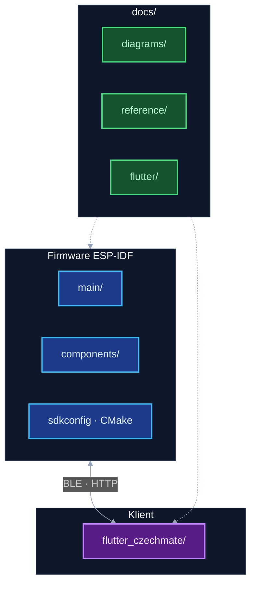

# Dokumentace — rozcestník

Kořen **[README.md](../README.md)**: HW, GPIO, přehled projektu. Složka **`docs/`**: architektura, tasky, Flutter, OTA, reference, diagramy.

---

## Doporučené čtení

1. [README.md](../README.md) — systém, hardware, tabulka tasků
2. [diagrams/README.md](diagrams/README.md) — boot, fronty, smyčky tasků, šachová logika
3. [reference/KOMUNIKACE_MEZI_TASKY.md](reference/KOMUNIKACE_MEZI_TASKY.md) — fronty a HW podrobněji
4. [flutter/README.md](flutter/README.md) — struktura klienta, BLE/HTTP
5. [ota_architecture.md](ota_architecture.md) — OTA firmwaru ESP32 (HTTPS, HTTP z telefonu, BLE)
6. [reference/](reference/) — souřadnice, web UI, integrační checklist (tabulka níže)
7. Doxygen: `./generate_docs.sh` → `docs/doxygen/html/index.html`

Po úpravě diagramů: `./scripts/render_docs.sh` (SVG, `diagrams_mermaid.html`).

---

## Inventář

| Dokument | Obsah |
|----------|--------|
| [README.md](../README.md) | Projekt, HW, troubleshooting |
| [docs/README.md](README.md) | Tento rozcestník |
| [diagrams/README.md](diagrams/README.md) | Mermaid/SVG diagramy |
| [diagrams/diagrams_mermaid.html](diagrams/diagrams_mermaid.html) | Sekvence (generuje `render_docs.sh`) |
| [diagrams/mermaid_diagrams.txt](diagrams/mermaid_diagrams.txt) | Zdroj pro HTML |
| [diagrams/sources/chess_flow_*.mmd](diagrams/sources/) | Šablony tahů, recovery, … |
| [flutter/README.md](flutter/README.md) | Flutter klient |
| [reference/KOMUNIKACE_MEZI_TASKY.md](reference/KOMUNIKACE_MEZI_TASKY.md) | Komunikace tasků |
| [reference/coordinates_system.md](reference/coordinates_system.md) | Notace ↔ row/col, LED |
| [reference/WEB_UI_DEPLOY.md](reference/WEB_UI_DEPLOY.md) | Embed web UI, build |
| [reference/CZECHMATE_INTEGRATION_CHECKLIST.md](reference/CZECHMATE_INTEGRATION_CHECKLIST.md) | REST, WS, BLE pro klienty |
| [ota_architecture.md](ota_architecture.md) | OTA: kanály, API, Flutter (roadmap: OTAvo místo vlastní OTA ve FW) |
| [reference/BLENDER_VIDEO_BRIEF.md](reference/BLENDER_VIDEO_BRIEF.md) | Brief pro videa |
| [flutter_czechmate/README.md](../flutter_czechmate/README.md) | Spuštění aplikace |
| [diagrams/DIAGRAM_BACKLOG.local.example.md](diagrams/DIAGRAM_BACKLOG.local.example.md) | Šablona backlogu diagramů |

Lokální drafty diagramů: `docs/diagrams/LOCAL_DIAGRAM_BACKLOG.md` (gitignore). OTA logy a poznámky z testů: `context/ota/`.

---

## Struktura repa (dokumentace)

| Cesta | Obsah |
|-------|--------|
| `main/` | Boot, fronty, start tasků |
| `components/` | `game_task`, `led_task`, `matrix_task`, `uart_task`, `web_server_task`, `ble_task`, … |
| `flutter_czechmate/lib/` | UI, Riverpod, BLE/API |
| `docs/diagrams/` | `sources/*.mmd`, SVG, sekvenční HTML |
| `docs/reference/` | Delší texty |
| `docs/ota_architecture.md` | OTA ESP32 ↔ Flutter |
| `docs/flutter/` | Přehled aplikace |
| `context/ota/` | OTA logy, E2E poznámky (volitelné) |
| `scripts/` | `render_docs.sh`, … |
| `generate_docs.sh`, `Doxyfile` | C API HTML |

---

## Limity docs vs. zdroják

- `game_task.c` je velký — hlavní toky jsou v diagramech a Doxygenu; úplný inventář funkcí z HTML Doxygen.
- Časové chování partie: diagramy + KOMUNIKACE + logy na desce + testy.

---

## Build

| | Příkaz |
|---|--------|
| Firmware | `idf.py build` (ESP-IDF env) |
| Flutter | `cd flutter_czechmate && flutter pub get && flutter run` |
| Diagramy | `./scripts/render_docs.sh` |
| Doxygen | `./generate_docs.sh` |
