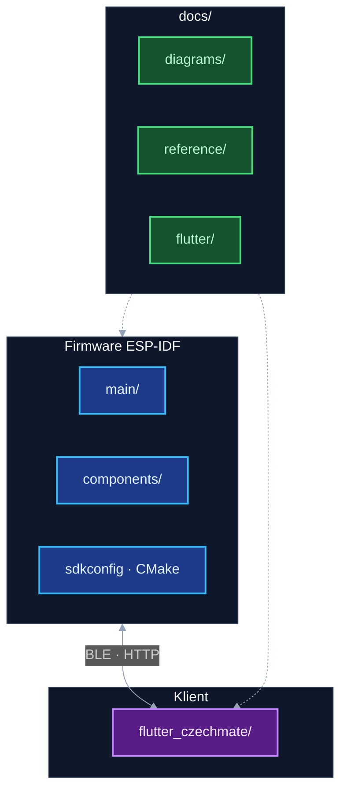

# Dokumentace — orientace v repozitáři

Úplný vstup do projektu je v **[README.md](../README.md)** (hardware, GPIO, tabulka tasků, praktické věci). Ve **`docs/`** je hlubší rozpitváno: diagramy, Flutter, OTA, reference kolem integrace.

**Google Formuláře:** [předobjednávka](https://docs.google.com/forms/d/18ns5uSUSzr5zcHsiZwD1HWfY15xBa-folmE-oH86BsY/viewform) · [průzkum zájmu](https://docs.google.com/forms/d/e/1FAIpQLSck_q6sjN1nnUs9aV2CsY0MyPNo9puLcncW603iEJz6BMLjPw/viewform)

---

## Typické pořadí čtení

1. [README.md](../README.md) — velký obrázek.
2. [diagrams/README.md](diagrams/README.md) — boot, fronty, smyčky tasků, šachové toky.
3. [reference/KOMUNIKACE_MEZI_TASKY.md](reference/KOMUNIKACE_MEZI_TASKY.md) — fronty, mutexy, HW podrobněji.
4. [flutter/README.md](flutter/README.md) — klient, BLE/HTTP.
5. [ota_architecture.md](ota_architecture.md) — jak taháme firmware na desku (HTTPS, HTTP z telefonu, BLE).
6. [reference/](reference/) — souřadnice, web UI v binárce, checklist pro klienty (viz tabulku níže).
7. Doxygen: `./generate_docs.sh` → `docs/doxygen/html/index.html`.

Když měním `.mmd` nebo chci přepsat SVG/HTML diagramů: `./scripts/render_docs.sh`.

---

## Co kde leží (inventář)

| Dokument | Účel |
|----------|----------------|
| [README.md](../README.md) | Projekt, HW, řešení problémů |
| [docs/README.md](README.md) | Tenhle rozcestník |
| [diagrams/README.md](diagrams/README.md) | Mermaid / SVG přehled |
| [diagrams/diagrams_mermaid.html](diagrams/diagrams_mermaid.html) | Sekvence (generuje `render_docs.sh`) |
| [diagrams/mermaid_diagrams.txt](diagrams/mermaid_diagrams.txt) | Zdroj pro sekvenční HTML |
| [diagrams/sources/chess_flow_*.mmd](diagrams/sources/) | Šablony tahů, recovery, … |
| [flutter/README.md](flutter/README.md) | Flutter klient |
| [reference/KOMUNIKACE_MEZI_TASKY.md](reference/KOMUNIKACE_MEZI_TASKY.md) | Komunikace tasků |
| [reference/coordinates_system.md](reference/coordinates_system.md) | Notace ↔ řádek/sloupec, LED |
| [reference/WEB_UI_DEPLOY.md](reference/WEB_UI_DEPLOY.md) | Embed web UI, build |
| [reference/CZECHMATE_INTEGRATION_CHECKLIST.md](reference/CZECHMATE_INTEGRATION_CHECKLIST.md) | REST, WS, BLE pro klienty |
| [ota_architecture.md](ota_architecture.md) | OTA: kanály, API, Flutter (dlouhodobě uvažuju OTAvo místo vlastní vrstvy ve FW) |
| [reference/BLENDER_VIDEO_BRIEF.md](reference/BLENDER_VIDEO_BRIEF.md) | Co potřebuju k videím z Blenderu |
| [flutter_czechmate/README.md](../flutter_czechmate/README.md) | Spuštění aplikace |
| [diagrams/DIAGRAM_BACKLOG.local.example.md](diagrams/DIAGRAM_BACKLOG.local.example.md) | Šablona backlogu diagramů |

Lokální poznámky k diagramům si píšu do `docs/diagrams/LOCAL_DIAGRAM_BACKLOG.md` (gitignore). OTA logy a poznámky z testů často do `context/ota/`.

---

## Jak to sedí v repu (diagram)

| Cesta | Obsah |
|-------|--------|
| `main/` | Boot, fronty, start tasků |
| `components/` | `game_task`, `led_task`, `matrix_task`, `uart_task`, `web_server_task`, `ble_task`, … |
| `flutter_czechmate/lib/` | UI, Riverpod, BLE/API |
| `docs/diagrams/` | `sources/*.mmd`, SVG, sekvenční HTML |
| `docs/reference/` | Delší texty |
| `docs/ota_architecture.md` | OTA ESP32 ↔ Flutter |
| `docs/flutter/` | Přehled aplikace |
| `context/ota/` | OTA logy, E2E poznámky (volitelné) |
| `scripts/` | `render_docs.sh`, … |
| `generate_docs.sh`, `Doxyfile` | C API HTML |

---

## Co dokumentace schválně nedělá

- `game_task.c` je obří — celý proud řeším radši přes diagramy a Doxygen; úplný výpis funkcí je v HTML po `generate_docs.sh`.
- Časové chování partie nejlíp sedí z kombinace diagramů, textu v KOMUNIKACE, logů z desky a testů.

---

## Typické příkazy

| Co | Příkaz |
|----|--------|
| Firmware | `idf.py build` (v aktivovaném ESP-IDF prostředí) |
| Flutter | `cd flutter_czechmate && flutter pub get && flutter run` |
| Diagramy | `./scripts/render_docs.sh` |
| Doxygen | `./generate_docs.sh` |
