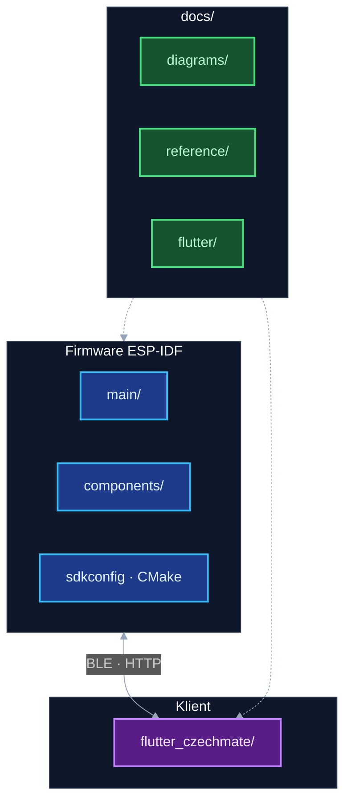

# Dokumentace — hlavní rozcestník

Tento soubor je **startovní bod**, pokud chceš projekt pochopit jen z repozitáře (bez lokálních poznámek). Kořenové **[`README.md`](../README.md)** má příběh projektu, hardware, GPIO a dlouhé pasáže; **`docs/`** doplňuje **architekturu**, **komunikaci tasků**, **klienta Flutter** a **nástroje**.

---

## Doporučené pořadí čtení

1. **[`README.md`](../README.md)** — účel systému, hardware, tabulka FreeRTOS tasků, odkaz na diagramy.
2. **`docs/README.md` (tento soubor)** — inventář a kam jít dál.
3. **[`docs/diagrams/README.md`](diagrams/README.md)** — obrázky: boot, fronty, mutexy, **smyčka každého tasku**, **šachová logika** (`game_is_valid_move`, generování tahů, …).
4. **[`docs/reference/KOMUNIKACE_MEZI_TASKY.md`](reference/KOMUNIKACE_MEZI_TASKY.md)** — stejné téma jako diagramy, ale **textově do hloubky** (fronty, mutexy, hardware).
5. **[`docs/flutter/README.md`](flutter/README.md)** — struktura `flutter_czechmate/lib/`, BLE vs HTTP, stavy session.
6. **[`docs/reference/`](reference/)** — souřadnice, web UI deploy, integrační checklist (viz tabulka níže).
7. **Doxygen** (`./generate_docs.sh` → `docs/doxygen/html/index.html`) — API z **C** (`grep` v `game_task.c` má limity; Doxygen je hlavní přehled funkcí).

Po změně diagramů ve zdrojích spusť z kořene: `./scripts/render_docs.sh` (SVG + `diagrams_mermaid.html`).

---

## Inventář dokumentace v repu

| Dokument | Obsah |
|----------|--------|
| [`README.md`](../README.md) | Produktový přehled, HW, GPIO, architektura, troubleshooting, odkazy dolů |
| [`docs/README.md`](README.md) | Tento rozcestník |
| [`docs/diagrams/README.md`](diagrams/README.md) | Všechny Mermaid/SVG diagramy firmware + Flutter vrstvy + šachové pipeline |
| [`docs/diagrams/diagrams_mermaid.html`](diagrams/diagrams_mermaid.html) | Sekvenční diagramy (vygeneruje `render_docs.sh`) |
| [`docs/diagrams/mermaid_diagrams.txt`](diagrams/mermaid_diagrams.txt) | Zdroj pro HTML výše |
| Diagramy speciálních tahů, recovery, guard, undo | [`docs/diagrams/sources/chess_flow_*.mmd`](diagrams/sources/) → SVG po `./scripts/render_docs.sh` |
| [`docs/flutter/README.md`](flutter/README.md) | Flutter klient |
| [`docs/reference/KOMUNIKACE_MEZI_TASKY.md`](reference/KOMUNIKACE_MEZI_TASKY.md) | Komunikace tasků a HW (dlouhý text) |
| [`docs/reference/coordinates_system.md`](reference/coordinates_system.md) | Notace a1–h8 ↔ `row`/`col`, LED indexy |
| [`docs/reference/WEB_UI_DEPLOY.md`](reference/WEB_UI_DEPLOY.md) | Embed JS do firmware, build, Stockfish nápověda na webu |
| [`docs/reference/CZECHMATE_INTEGRATION_CHECKLIST.md`](reference/CZECHMATE_INTEGRATION_CHECKLIST.md) | REST, WS, BLE, snapshot — checklist pro klienty |
| [`docs/reference/BLENDER_VIDEO_BRIEF.md`](reference/BLENDER_VIDEO_BRIEF.md) | Brief pro marketingová videa z Blenderu (hero, detail desky, UI mock, volitelný teaser) |
| [`flutter_czechmate/README.md`](../flutter_czechmate/README.md) | Rychlý start Dart aplikace + odkaz sem |
| [`docs/diagrams/DIAGRAM_BACKLOG.local.example.md`](diagrams/DIAGRAM_BACKLOG.local.example.md) | Šablona pro lokální backlog diagramů |

Lokální poznámky mimo git často v `context/` nebo `docs/diagrams/LOCAL_DIAGRAM_BACKLOG.md` — nejsou nutné k pochopení základu.

---

## Struktura (zjednodušeně)

| Cesta | Obsah |
|-------|--------|
| `main/` | `main.c` — boot, fronty, start tasků |
| `components/` | FreeRTOS tasky: `game_task`, `led_task`, `matrix_task`, `uart_task`, `web_server_task`, `ble_task`, … |
| `flutter_czechmate/lib/` | Dart UI, Riverpod, služby BLE/API |
| `docs/diagrams/` | Grafy (`sources/*.mmd`), SVG, sekvenční HTML |
| `docs/reference/` | Delší texty (komunikace, web UI, souřadnice, checklist) |
| `docs/flutter/` | Shrnutí Flutter appky + odkazy na diagramy |
| `scripts/` | `render_docs.sh` apod. |
| `Doxyfile` + `generate_docs.sh` | API dokumentace z C zdrojáků |

---

## Co z dokumentace „nejde“ nahradit čtením řádek po řádku

- **`components/game_task/game_task.c`** je velký modul — diagramy v [`docs/diagrams/README.md`](diagrams/README.md) popisují **hlavní toky**; úplný výčet funkcí a komentářů je v **Doxygen**.
- **Chování v čase** (série tahů, edge cases) je kombinace **diagramů**, **KOMUNIKACE_MEZI_TASKY**, **logů** a **testů** na zařízení.

---

## Build (pro orientaci)

| Co | Příkaz |
|----|--------|
| Firmware | z kořene: `idf.py build` (ESP-IDF prostředí) |
| Flutter | `cd flutter_czechmate && flutter pub get && flutter run` |
| Diagramy SVG | z kořene: `./scripts/render_docs.sh` (volitelně Node/npx pro Mermaid CLI) |
| Doxygen HTML | `./generate_docs.sh` |
