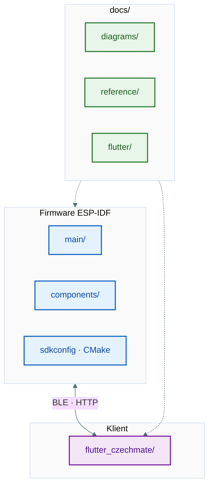

# Co je v tomhle repu

Jeden projekt = **firmware na ESP32-C6** (šachovnice s LED a senzory) + **Flutter aplikace** (`flutter_czechmate/`), která k desce mluví přes **BLE** nebo **HTTP/WebSocket**. Nativní Xcode appka **CZECHMATE/** je v `.gitignore` — v gitu je jako klient jen Flutter.

Verze firmware: `CMakeLists.txt` → `PROJECT_VERSION`. Kořenové **`README.md`** je hlavní popis hardware a buildu; tady máš **mapu složek** a odkazy, aby šlo rychle najít soubor i pro nástroje / lidi.

---

## Struktura (zjednodušeně)

| Cesta | Obsah |
|-------|--------|
| `main/` | `main.c` — boot, fronty, start tasků |
| `components/` | FreeRTOS tasky: `game_task`, `led_task`, `matrix_task`, `uart_task`, `web_server_task`, `ble_task`, … |
| `flutter_czechmate/lib/` | Dart UI, Riverpod, služby BLE/API |
| `docs/diagrams/` | Grafy firmware (`sources/*.mmd`, SVG, sekvenční HTML) |
| `docs/reference/` | Delší texty (komunikace tasků, web UI, souřadnice, checklist) |
| `docs/flutter/` | Popis Flutter appky + diagramy |
| `scripts/` | `render_docs.sh` apod. |
| `Doxyfile` + `generate_docs.sh` | API dokumentace z C zdrojáků |

---

## Kde číst co

- **Firmware — obrázky a tabulky:** [`docs/diagrams/README.md`](diagrams/README.md)  
- **Firmware — dlouhý text o frontách:** [`docs/reference/KOMUNIKACE_MEZI_TASKY.md`](reference/KOMUNIKACE_MEZI_TASKY.md)  
- **Flutter — vrstvy, BLE, složky:** [`docs/flutter/README.md`](flutter/README.md)  
- **Sekvenční diagramy v HTML:** po `./scripts/render_docs.sh` soubor [`docs/diagrams/diagrams_mermaid.html`](diagrams/diagrams_mermaid.html) (zdroj řádků v `docs/diagrams/mermaid_diagrams.txt`)
- **Nápady na nové diagramy (jen lokálně, ne v gitu):** `docs/diagrams/LOCAL_DIAGRAM_BACKLOG.md` — začni zkopírováním [`docs/diagrams/DIAGRAM_BACKLOG.local.example.md`](diagrams/DIAGRAM_BACKLOG.local.example.md)

---

## Build (pro orientaci)

| Co | Příkaz |
|----|--------|
| Firmware | z kořene: `idf.py build` (ESP-IDF prostředí) |
| Flutter | `cd flutter_czechmate && flutter pub get && flutter run` |
| Diagramy SVG | z kořene: `./scripts/render_docs.sh` (volitelně Node/npx pro Mermaid CLI) |
| Doxygen HTML | `./generate_docs.sh` |
