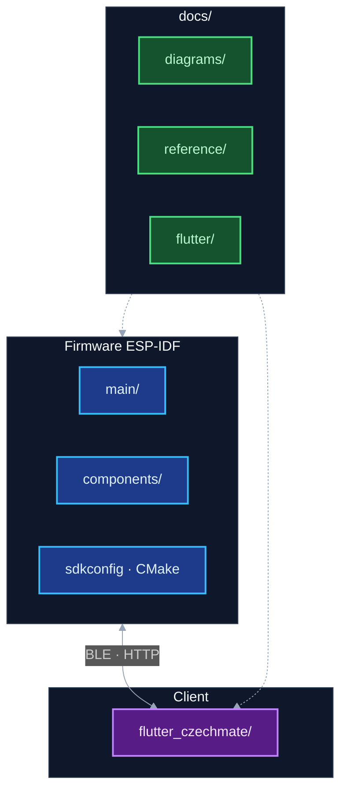

# Documentation — repository orientation

The full project entry point is **[README.md](../README.md)** (hardware, GPIO, task table, practical notes). **`docs/`** goes deeper: diagrams, Flutter, OTA, integration reference material.

**Google Forms** (interest in **CzechMate V2**): [pre-order](https://docs.google.com/forms/d/18ns5uSUSzr5zcHsiZwD1HWfY15xBa-folmE-oH86BsY/viewform) · [interest survey](https://docs.google.com/forms/d/e/1FAIpQLSck_q6sjN1nnUs9aV2CsY0MyPNo9puLcncW603iEJz6BMLjPw/viewform)

**Firmware in the repo:** **1.8.0** (prototype **V1**, reed). **V2** = Hall — see [reference/HARDWARE_VERSIONS.md](reference/HARDWARE_VERSIONS.md).

---

## Typical reading order

1. [README.md](../README.md) — introduction, build, quick overview.
2. [reference/REPO_LAYOUT.md](reference/REPO_LAYOUT.md) — path inventory and component groups.
3. [reference/HARDWARE_VERSIONS.md](reference/HARDWARE_VERSIONS.md) — V1 (reed) vs V2 (Hall).
4. [reference/WIRING_ESP_STM4.md](reference/WIRING_ESP_STM4.md) — ESP ↔ STM32 wiring (V2, auto-flash).
5. [diagrams/README.md](diagrams/README.md) — boot, queues, task loops, chess flows.
6. [reference/TASK_COMMUNICATION.md](reference/TASK_COMMUNICATION.md) — queues, mutexes, hardware in more detail.
7. [flutter/README.md](flutter/README.md) — client, BLE/HTTP.
8. [ota_architecture.md](ota_architecture.md) — board OTA firmware.
9. [reference/TROUBLESHOOTING.md](reference/TROUBLESHOOTING.md) — debugging and known issues.
10. Doxygen: `./generate_docs.sh` → `docs/doxygen/html/index.html`.

When changing `.mmd` files or regenerating diagram SVG/HTML: `./scripts/render_docs.sh`.

---

## What lives where (inventory)

| Document | Purpose |
|----------|---------|
| [README.md](../README.md) | Introduction, build, links |
| [reference/REPO_LAYOUT.md](reference/REPO_LAYOUT.md) | Repository inventory |
| [reference/TROUBLESHOOTING.md](reference/TROUBLESHOOTING.md) | Debugging, UART, known limits |
| [reference/PROJECT_NOTES.md](reference/PROJECT_NOTES.md) | Version, authors, license, notes |
| [reference/HARDWARE_VERSIONS.md](reference/HARDWARE_VERSIONS.md) | V1 vs V2 (reed vs Hall, fw 1.8.0, pre-order) |
| [reference/WIRING_ESP_STM4.md](reference/WIRING_ESP_STM4.md) | ESP ↔ STM32C031 wiring, `hall_v2` profile |
| [docs/README.md](README.md) | This index |
| [diagrams/README.md](diagrams/README.md) | Mermaid / SVG overview |
| [diagrams/diagrams_mermaid.html](diagrams/diagrams_mermaid.html) | Sequence diagrams (generated by `render_docs.sh`) |
| [diagrams/mermaid_diagrams.txt](diagrams/mermaid_diagrams.txt) | Source for sequential HTML |
| [diagrams/sources/chess_flow_*.mmd](diagrams/sources/) | Move templates, recovery, … |
| [flutter/README.md](flutter/README.md) | Flutter client |
| [reference/TASK_COMMUNICATION.md](reference/TASK_COMMUNICATION.md) | Task communication |
| [reference/coordinates_system.md](reference/coordinates_system.md) | Notation ↔ row/column, LED |
| [reference/WEB_UI_DEPLOY.md](reference/WEB_UI_DEPLOY.md) | Embedded web UI, build |
| [reference/CZECHMATE_INTEGRATION_CHECKLIST.md](reference/CZECHMATE_INTEGRATION_CHECKLIST.md) | REST, WS, BLE for clients |
| [reference/OPENING_TRAINING_PLAN.md](reference/OPENING_TRAINING_PLAN.md) | Opening Trainer — architecture, phases, release gate |
| [reference/MENUCONFIG_FEATURES_PLAN.md](reference/MENUCONFIG_FEATURES_PLAN.md) | Plan: optional guard/error/hints via menuconfig |
| [testing/MANUAL_TEST_CHECKLIST.md](testing/MANUAL_TEST_CHECKLIST.md) | HW checklist opening trainer v1.0 |
| [ota_architecture.md](ota_architecture.md) | OTA: channels, REST/BLE, Flutter, rollback, flash/compatibility, pre-release checklist |
| [reference/BLENDER_VIDEO_BRIEF.md](reference/BLENDER_VIDEO_BRIEF.md) | Requirements for Blender videos |
| [reference/WEB_MEDIA_BRIEF.md](reference/WEB_MEDIA_BRIEF.md) | Web media — link to local spec in `context/` or `gh-pages-ready/` |
| [flutter_czechmate/README.md](../flutter_czechmate/README.md) | Running the app |
| [diagrams/DIAGRAM_BACKLOG.local.example.md](diagrams/DIAGRAM_BACKLOG.local.example.md) | Diagram backlog template |

Local diagram notes belong in `docs/diagrams/LOCAL_DIAGRAM_BACKLOG.md` (gitignore). OTA logs and custom E2E checklists may live in the local `context/` folder (in `.gitignore`); the shared OTA reference is [`docs/ota_architecture.md`](ota_architecture.md).

---

## How it fits in the repo (diagram)

```mermaid
%%{init: {'theme':'dark','themeVariables':{'lineColor':'#94a3b8','clusterBkg':'#0f172a','clusterBorder':'#334155','primaryTextColor':'#f1f5f9','titleColor':'#f8fafc'}}}%%
flowchart TB
  subgraph FW["Firmware ESP-IDF"]
    M[main/]:::fw
    C[components/]:::fw
    CM[sdkconfig · CMake]:::fw
  end
  subgraph APP["Client"]
    FL[flutter_czechmate/]:::app
  end
  subgraph DOC["docs/"]
    DG[diagrams/]:::doc
    RF[reference/]:::doc
    DF[flutter/]:::doc
  end
  FW <-->|BLE · HTTP| FL
  DOC -.-> FW
  DOC -.-> FL

  classDef fw fill:#1e3a8a,stroke:#38bdf8,stroke-width:2px,color:#e0f2fe
  classDef app fill:#581c87,stroke:#c084fc,stroke-width:2px,color:#f3e8ff
  classDef doc fill:#14532d,stroke:#4ade80,stroke-width:2px,color:#bbf7d0
```

| Path | Contents |
|-------|--------|
| `main/` | Boot, queues, task startup |
| `components/` | `game_task`, `led_task`, `matrix_task`, `uart_task`, `web_server_task`, `ble_task`, … |
| `flutter_czechmate/lib/` | UI, Riverpod, BLE/API |
| `docs/diagrams/` | `sources/*.mmd`, SVG, sequential HTML |
| `docs/reference/` | Longer texts — see [reference/README.md](reference/README.md) |
| `docs/ota_architecture.md` | OTA ESP32 ↔ Flutter |
| `docs/flutter/` | App overview |
| `context/` (gitignore) | Local context for AI |
| `scripts/` | `render_docs.sh`, `docs/` — see [scripts/README.md](../scripts/README.md) |
| `generate_docs.sh`, `Doxyfile` | C API HTML (wrapper → `scripts/docs/`) |

---

## What the documentation deliberately omits

- `game_task.c` is huge — the flow is covered via diagrams and Doxygen; a full function listing is in HTML after `generate_docs.sh`.
- Game timing behavior is best understood from diagrams, text in KOMUNIKACE, board logs, and tests combined.

---

## Typical commands

| Task | Command |
|----|--------|
| Firmware | `idf.py build` (in an activated ESP-IDF environment) |
| Flutter | `cd flutter_czechmate && flutter pub get && flutter run` |
| Diagrams | `./scripts/render_docs.sh` |
| Doxygen | `./generate_docs.sh` |
