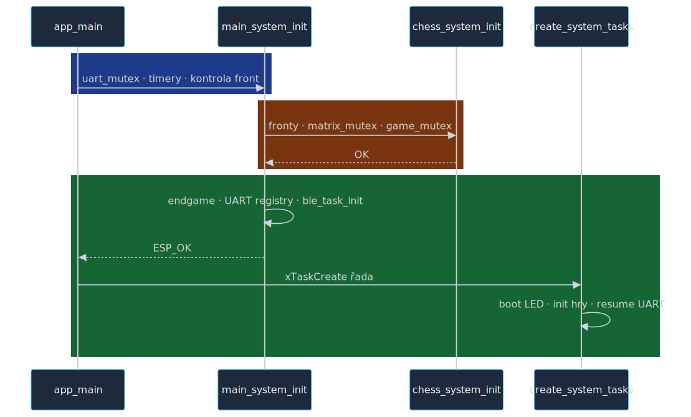
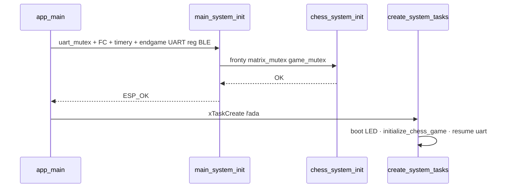
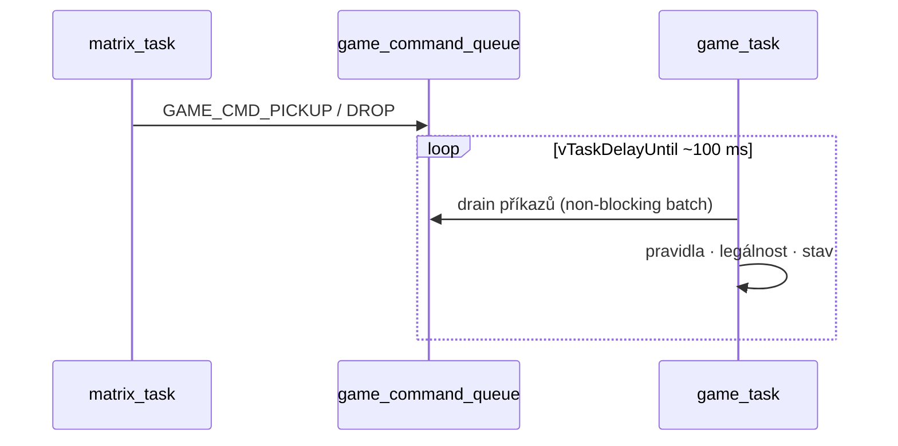

# Diagramy — firmware CZECHMATE

Tato stránka je **rozcestník a rozšířený popis**: čísla tasků, front a mutexů sedí s [`freertos_chess.h`](../../components/freertos_chess/include/freertos_chess.h) a pořadím v [`main/main.c`](../../main/main.c). Detailní textové rozpití komunikace je v [**reference/KOMUNIKACE_MEZI_TASKY.md**](../reference/KOMUNIKACE_MEZI_TASKY.md).

| Artefakt | K čemu |
|----------|--------|
| **`sources/*.mmd`** | Zdroj pravdy pro obrázky · editovat a spustit `./scripts/render_docs.sh` |
| **`*.svg` / `*.png`** (vedle tohoto README) | Stejné jméno jako `.mmd` — náhled v GitHubu i offline |
| **`mermaid_diagrams.txt`** | 26+ **sekvenčních** diagramů → [`diagrams_mermaid.html`](diagrams_mermaid.html) |
| **`main_flow_diagram.txt`** | Jedna dlouhá sekvence „celá smyčka“ pro ladění |

---

## Obsah

Úvodní tabulky → inicializace → pořadí tasků a fronty → boot → hlavní / vedlejší fronty → mutexy → topologie → matice → komponenty → HTML knihovna.

---

## 1. Konvence a čtení diagramů

- **Plná šipka** mezi taskem a frontou obvykle znamená `xQueueSend` / producent vs. **spotřebitel** (`xQueueReceive`).  
- **Čárkovaná šipka** = volitelná větev (`menuconfig`) nebo nepřímé volání API (např. BLE → sdílený dispatch ve web vrstvě).  
- **`main_system_init()`** proběhne **dřív** než jakýkoli `xTaskCreate` z `create_system_tasks()` — včetně **`ble_task_init()`** (NimBLE host task).  
- **`animation_task`** a **`matter_task`** jsou v `main.c` **zakomentované**; fronty pro animace mohou existovat, ale samostatný animační task se **nevytváří**.

---

## 2. Konstanty — tasky (priorita · stack)

| Task | Priorita | Stack | Poznámka |
|------|----------|-------|----------|
| `led_task` | 7 | 8 KiB | WS2812B, batch, animace |
| `matrix_task` | 6 | 4 KiB | Reed matice + příkazy z fronty |
| `button_task` | 5 | 3 KiB | Multiplex tlačítek |
| `game_task` | 4 | 6 KiB | Šachy, NVS, smyčka typicky **100 ms** |
| `uart_task` | 3 | 5 KiB | Po boot animaci **resume** |
| `web_server_task` | 3 | 20 KiB | WiFi + HTTP |
| `ha_light_task` | 3 | 8 KiB | MQTT po WiFi STA |
| `test_task` | 1 | 4 KiB | Jen **`CONFIG_CHESS_ENABLE_TEST_TASK`** |

---

## 3. Konstanty — fronty

| Konstanta | Hodnota | Typ zprávy (zjednodušeně) |
|-----------|---------|---------------------------|
| `GAME_QUEUE_SIZE` | 24 | Herní příkazy (`chess_move_command_t` …) |
| `BUTTON_QUEUE_SIZE` | 5 | `button_event_t` |
| `UART_QUEUE_SIZE` | 10 | UART vstupní řádky / `game_response_t` na výstupní frontě |
| `MATRIX_QUEUE_SIZE` | 8 | Příkazy pro matrix |
| `ANIMATION_QUEUE_SIZE` | 5 | API bez běžícího `animation_task` |
| `WEB_SERVER_QUEUE_SIZE` | 10 | Web interní fronty |
| `SCREEN_SAVER_QUEUE_SIZE` | 3 | Rezerva |
| `TEST_COMMAND_QUEUE_SIZE` | 16 | Jen s test taskem |

---

## 4. Inicializace a BLE

`ble_task_init()` se volá **uvnitř** `main_system_init()` — **ne** až po spuštění FreeRTOS tasků z `create_system_tasks()`.

  
*Zdroj: [`sources/boot_sequence.mmd`](sources/boot_sequence.mmd)*

---

## 5. Pořadí `xTaskCreate` a runtime fronty

Řádek **led → matrix → button → uart (suspend) → game → web → ha_light** je pořadí z `main.c`. Volitelný **test_task** je mezi game a web v kódu pouze pokud je zapnutý `CONFIG_CHESS_ENABLE_TEST_TASK` — na grafu je jako čárkovaná větev.

Šipky na **`game_command_queue`** / **`button_event_queue`** ukazují **běhové** předávání zpráv (ne pořadí startu).

  
*Zdroj: [`sources/tasks_architecture.mmd`](sources/tasks_architecture.mmd)*

---

## 6. Boot sekvence

Stejný obsah jako obrázek výše — sekvenční pohled:

---

## 7. Hlavní herní fronty

  
*Zdroj: [`sources/queues_flow.mmd`](sources/queues_flow.mmd)*

---

## 8. Vedlejší příkazové fronty

UART (diagnostika) a volitelný **test_task** posílají příkazy na **`matrix_command_queue`**; test může část událostí tlačítek pumpovat přes **`button_command_queue`**.

  
*Zdroj: [`sources/auxiliary_queues.mmd`](sources/auxiliary_queues.mmd)*

---

## 9. Mutexy

  
*Zdroj: [`sources/mutex_map.mmd`](sources/mutex_map.mmd)*

---

## 10. Topologie vstupů a výstupů

BLE příkazy procházejí **`web_server_ble_command_dispatch()`** (viz `ble_nimble_impl.c`), ne přímým `xQueueSend` z jednoho malého souboru — proto šipka míří na „sdílený“ dispatch směrem k herní frontě.

  
*Zdroj: [`sources/system_topology.mmd`](sources/system_topology.mmd)*

---

## 11. Tah ze senzorové matice

---

## 12. Komponenty vs. aktivní task

| Složka v `components/` | Stav |
|--------------------------|------|
| `freertos_chess`, `game_task`, `led_task`, `matrix_task`, `button_task`, `uart_task`, `web_server_task`, `ble_task`, `ha_light_task` | Aktivní integrace v běhu |
| `animation_task` | Kód v CMake · **task z `main.c` nevytváří se** |
| `matter_task` | Zakomentováno v `main.c` |
| `promotion_button_task`, `reset_button_task`, `screen_saver_task` | Knihovny — **bez `xTaskCreate` v aktuálním `main.c`** (promoce často přes `button_task` / `game_task`) |

---

## 13. Sekvenční knihovna (HTML)

1. Uprav [`mermaid_diagrams.txt`](mermaid_diagrams.txt) (sekce `# ČÁST A:` …).  
2. Spusť z kořene repa: `./scripts/render_docs.sh`.  
3. Otevři [`diagrams_mermaid.html`](diagrams_mermaid.html) — levé menu = sekce A–J, každý poddiagram má vlastní kotvu.

---

*Verze firmware: [`CMakeLists.txt`](../../CMakeLists.txt) · `PROJECT_VERSION`.*
