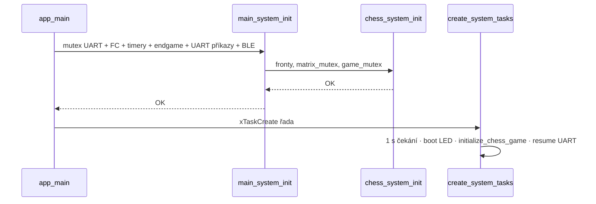
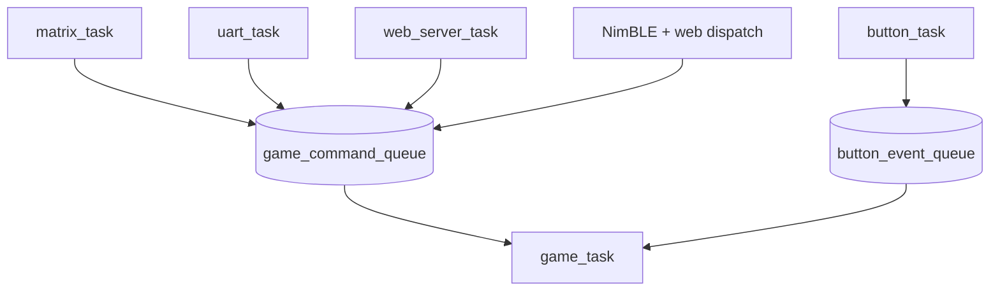
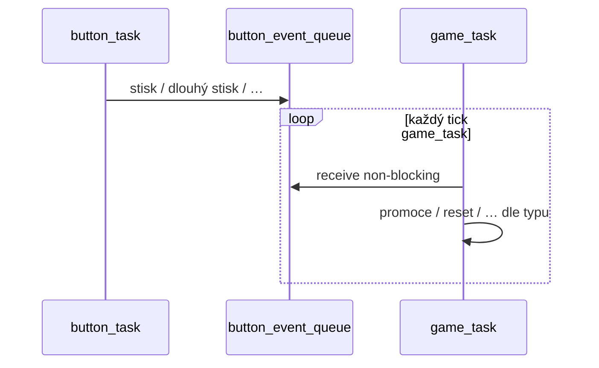
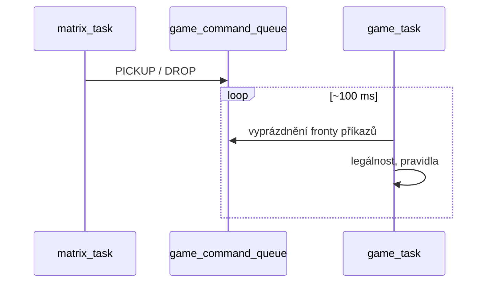
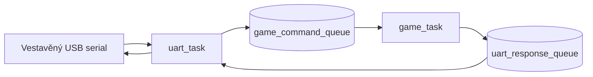
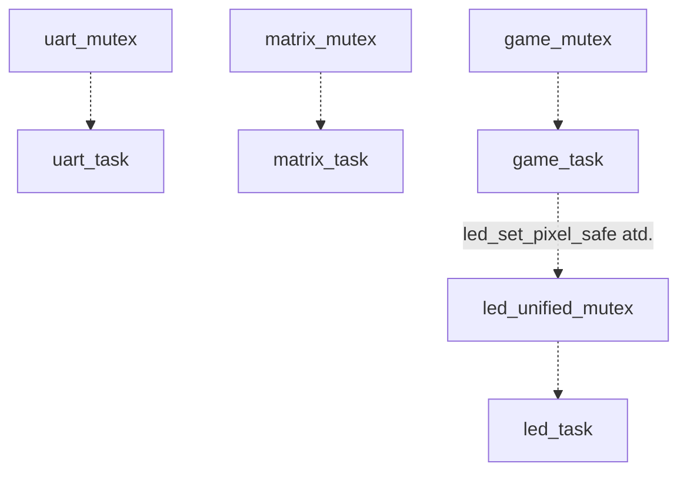

# Diagramy (firmware)

Čísla priorit, velikostí front a stacků najdeš v [`freertos_chess.h`](../../components/freertos_chess/include/freertos_chess.h). Pořadí startu tasků v [`main/main.c`](../../main/main.c). Když potřebuješ popsat komunikaci řádek po řádku, je tam [`reference/KOMUNIKACE_MEZI_TASKY.md`](../reference/KOMUNIKACE_MEZI_TASKY.md).

Obrázky SVG ti vyrobí `./scripts/render_docs.sh` ze složky [`sources/`](sources/) (stejné jméno jako `.mmd`).

---

## Jak číst šipky

- Plná šipka na frontu = typicky někdo posílá (`xQueueSend`), druhý bere (`xQueueReceive`).
- Čárkovaná = volitelné (menuconfig) nebo nepřímé volání (např. BLE přes funkce web vrstvy).
- `main_system_init()` doběhne dřív než `create_system_tasks()` — včetně `ble_task_init()`.
- `animation_task` a `matter_task` se v `main.c` nevytváří (zakomentované).

---

## Tasky — priorita a stack

| Task | P | Stack | Poznámka |
|------|---|-------|----------|
| led_task | 7 | 8 KiB | WS2812B |
| matrix_task | 6 | 4 KiB | reed matice |
| button_task | 5 | 3 KiB | multiplex tlačítek |
| game_task | 4 | 6 KiB | šachy, NVS, smyčka ~100 ms |
| uart_task | 3 | 5 KiB | po boot animaci resume |
| web_server_task | 3 | 20 KiB | WiFi + HTTP |
| ha_light_task | 3 | 8 KiB | MQTT |
| test_task | 1 | 4 KiB | jen `CONFIG_CHESS_ENABLE_TEST_TASK` |

---

## Fronty (kapacity z hlavičky)

| Konstanta | Počet |
|-----------|-------|
| GAME_QUEUE_SIZE | 24 |
| BUTTON_QUEUE_SIZE | 5 |
| UART_QUEUE_SIZE | 10 |
| MATRIX_QUEUE_SIZE | 8 |
| ANIMATION_QUEUE_SIZE | 5 |
| WEB_SERVER_QUEUE_SIZE | 10 |
| SCREEN_SAVER_QUEUE_SIZE | 3 |
| TEST_COMMAND_QUEUE_SIZE | 16 |

---

## Časová řada: init → BLE → tasky

---

## Pořadí xTaskCreate + kde tečou herní zprávy

Řádek **led → matrix → button → uart (nejprve suspend) → game → [test] → web → ha** je z `main.c`. Šipky dolů na fronty ukazují **provoz**, ne pořadí startu.

---

## Kdo feeduje game_command_queue a kdo ho čte

---

## Tlačítko → fronta → hra

---

## Matrix → tah

---

## UART: vstup a odpověď zpět

---

## Vedlejší fronty (UART test, matrix příkazy)

UART umí poslat příkaz i na `matrix_command_queue`; test task stejně (když je zapnutý).

---

## Mutexy (kdo s čím počítá)

---

## Celkový obrázek vstupů

---

## CMake komponenty bez vlastního tasku v main.c

| Složka | Realita |
|--------|---------|
| animation_task | knihovna v buildu, samostatný task z main.c ne |
| matter_task | vypnuto |
| promotion_button_task, reset_button_task, screen_saver_task | žádný `xTaskCreate` v současném main.c |

---

## Sekvenční HTML (hodně diagramů najednou)

Soubor `mermaid_diagrams.txt` se přegeneruje do `diagrams_mermaid.html` přes `python3 generate_mermaid_html.py` nebo `./scripts/render_docs.sh`. Dlouhá jednovětevnač je `main_flow_diagram.txt` (hodí se zkopírovat do mermaid.live).

---

*Firmware verze: `CMakeLists.txt` → `PROJECT_VERSION`.*
