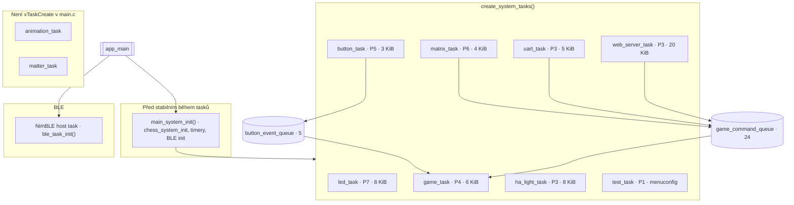
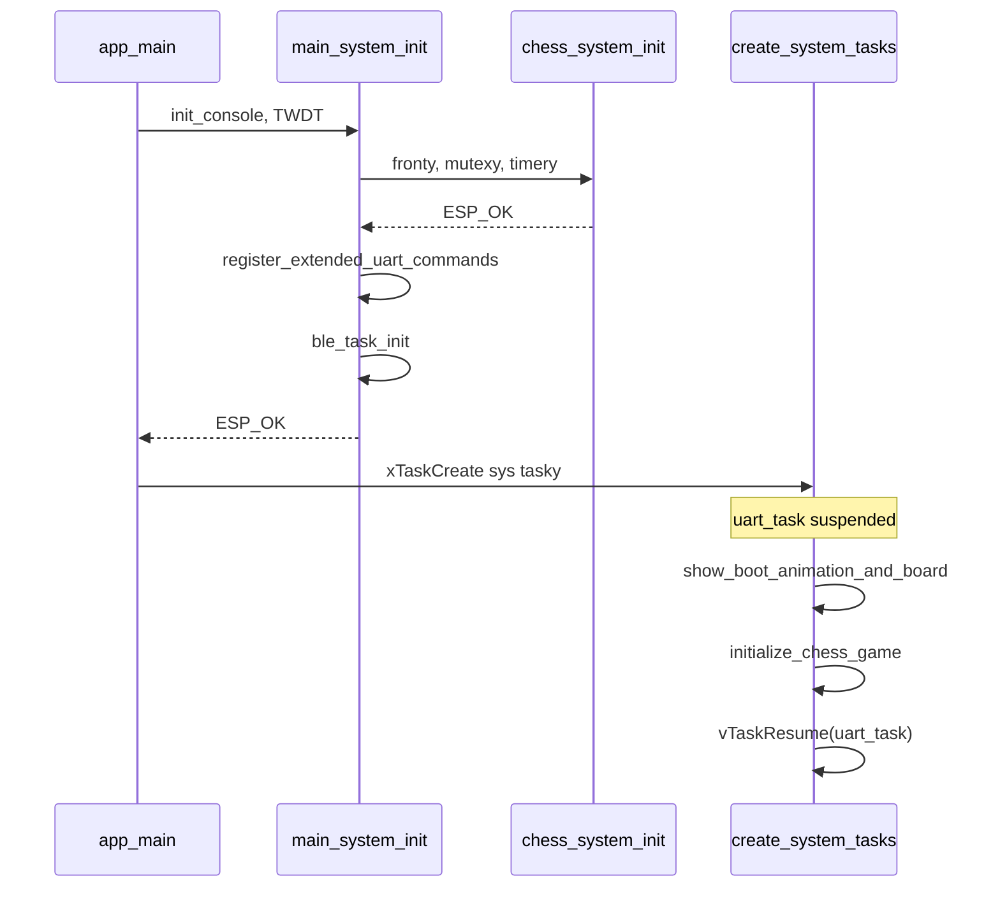
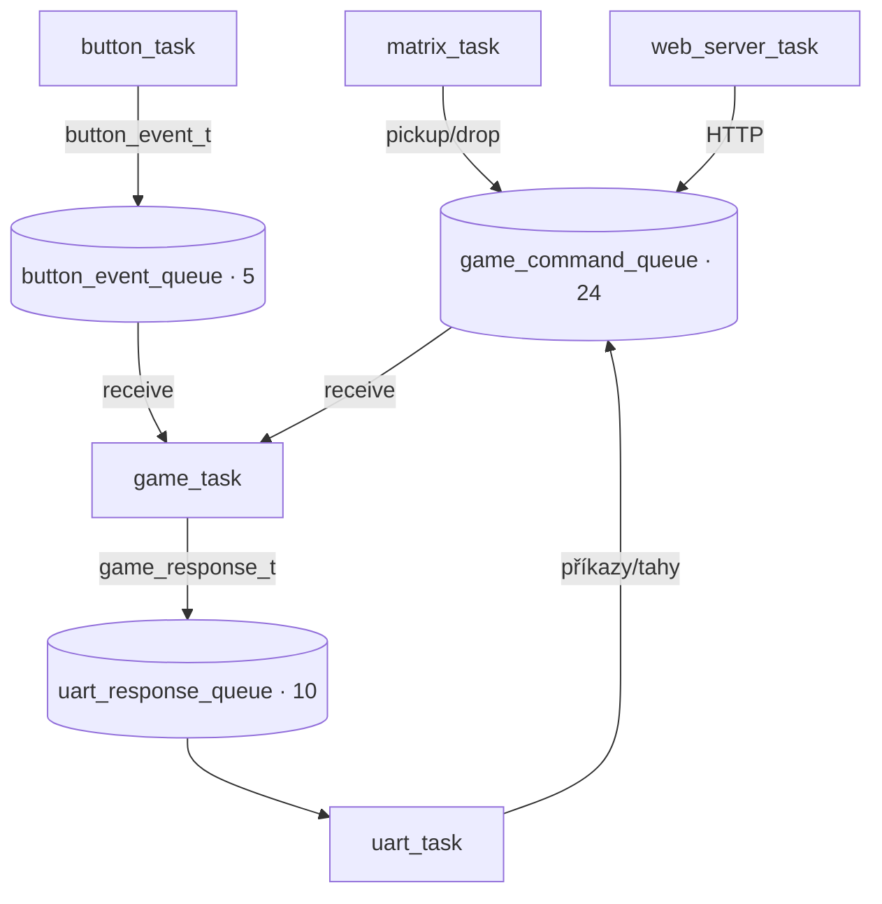
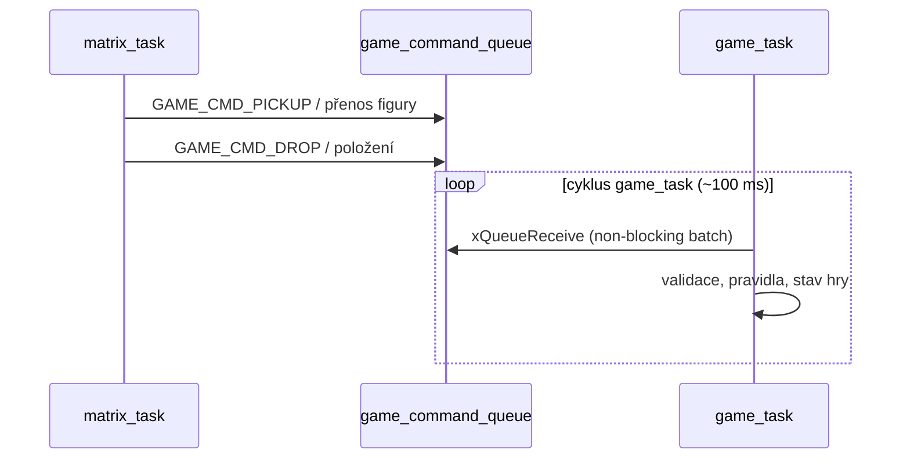
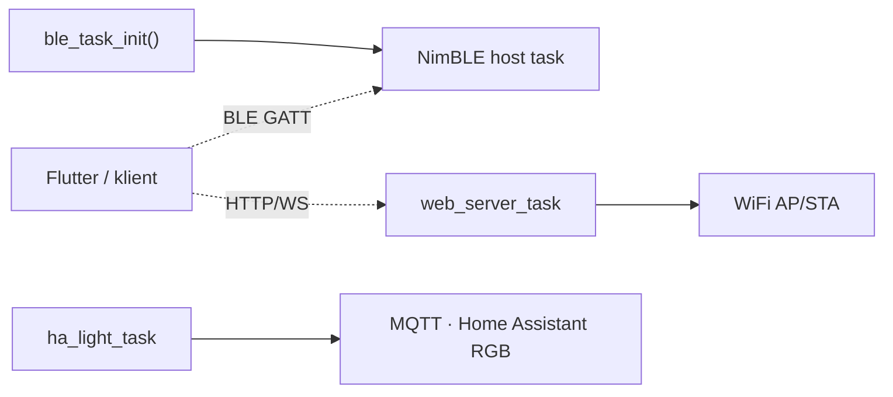

# Diagramy — firmware CZECHMATE

**Verze:** viz [`CMakeLists.txt`](../../CMakeLists.txt) (`PROJECT_VERSION`). **Zdroj pravdy pro tasky:** [`main/main.c`](../../main/main.c) (`create_system_tasks`, `main_system_init`), konstanty front v [`freertos_chess.h`](../../components/freertos_chess/include/freertos_chess.h).

Úplná knihovna **sekvenčních** diagramů (generuje se do HTML): [`mermaid_diagrams.txt`](mermaid_diagrams.txt) → po `./scripts/render_docs.sh` otevři [`diagrams_mermaid.html`](diagrams_mermaid.html). **SVG/PNG** z `.mmd`: `./scripts/render_docs.sh` (složka [`sources/`](sources/)).

---

## FreeRTOS tasky a vztah k frontám

---

## Boot: `app_main` → init → tasky → UART resume

---

## Fronty: tahy a odpovědi konzoli

---

## Tah ze senzorové matice (zjednodušeně)

---

## BLE a síťové rozhraní

---

## Komponenty ve složce `components/` vs. task z `main.c`

Složky jako `animation_task`, `matter_task`, `promotion_button_task`, `reset_button_task`, `screen_saver_task` jsou v **CMake** přilinkované jako knihovny; **samostatný FreeRTOS task z `main.c`** z nich aktuálně nevzniká tam, kde je kód v `main.c` zakomentovaný nebo init se nevolá. Aktivní rozhraní pro vstup jsou především **matrix_task**, **button_task**, **uart_task**, **web_server_task** a **BLE stack**.

---

## Další soubory

| Soubor | Obsah |
|--------|--------|
| [`mermaid_diagrams.txt`](mermaid_diagrams.txt) | Sekvence A–J+ (kompletní toky, err handling, web, test…) |
| [`main_flow_diagram.txt`](main_flow_diagram.txt) | Jedna dlouhá sekvence „hlavní smyčka“ pro ladění |
| [`sources/*.mmd`](sources/) | Zdroje pro CLI / CI → SVG/PNG vedle stejného jména |
| [`tasks_architecture.md`](tasks_architecture.md) | Duplicitní embed stejného grafu + tabulka front |
