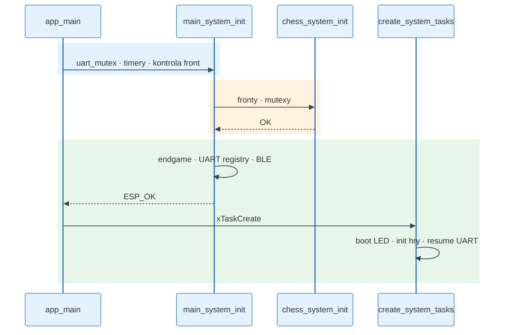
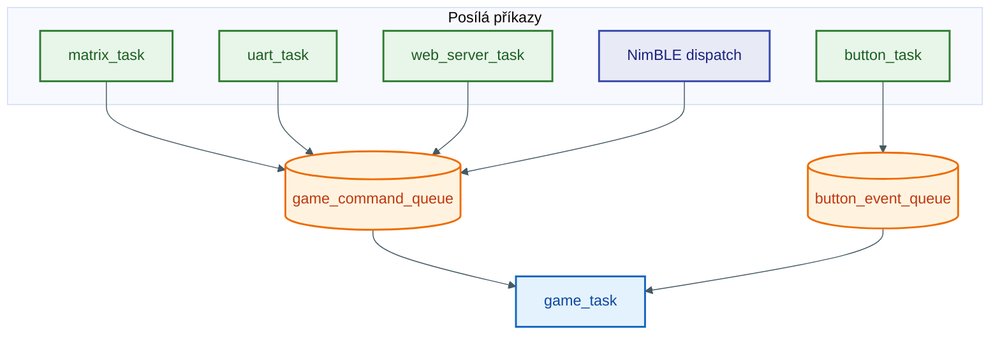
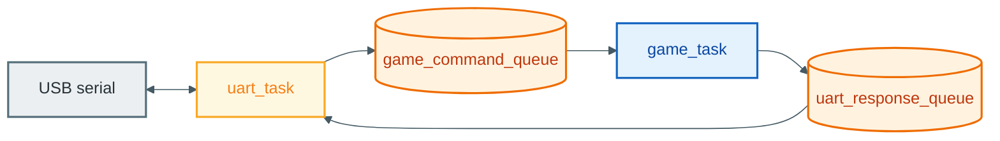
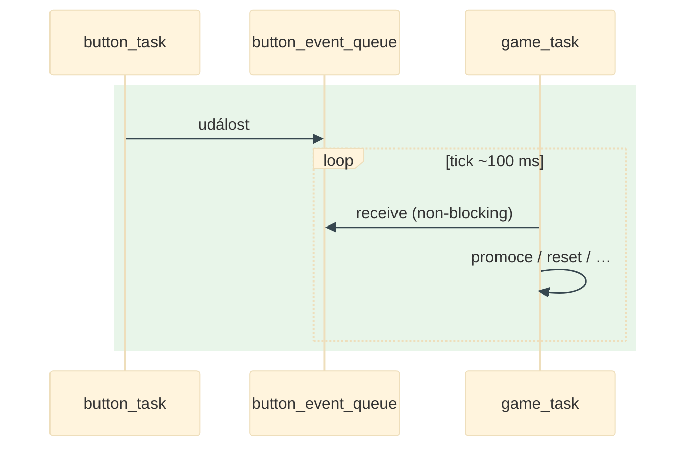
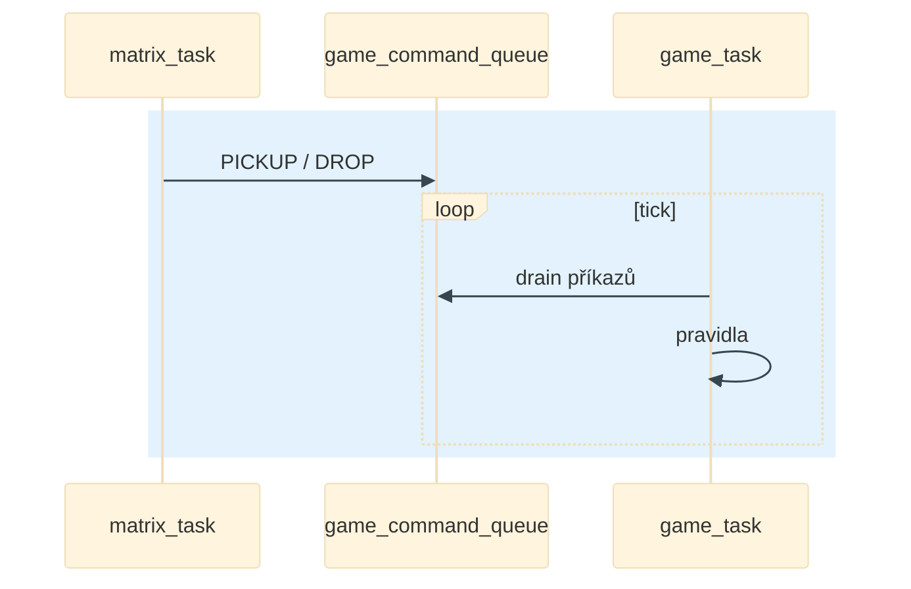
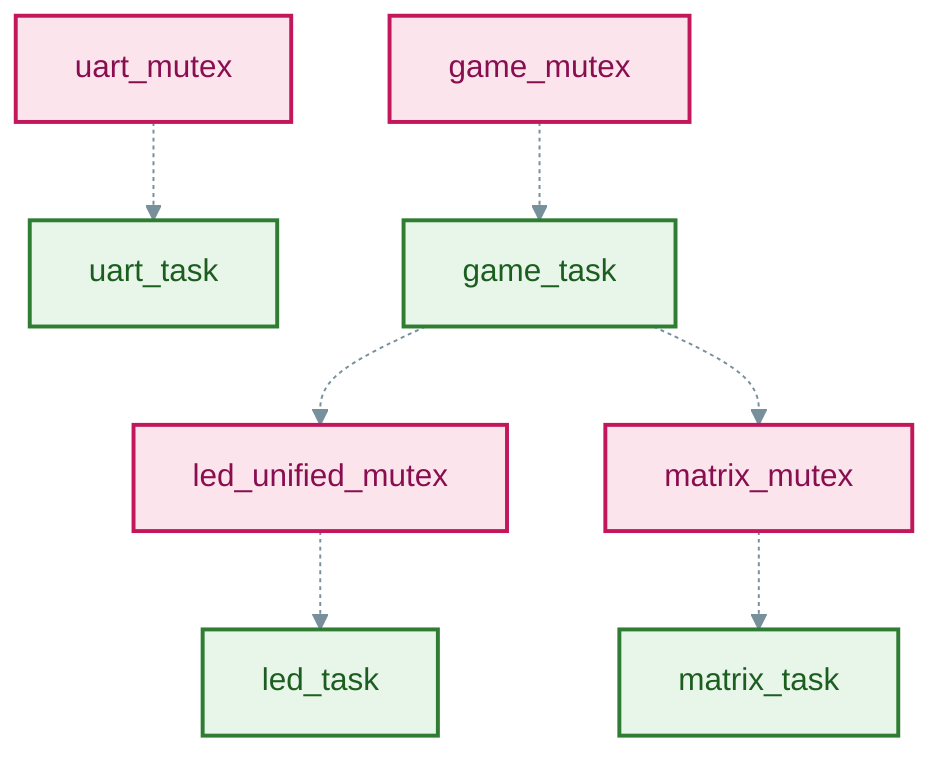

# Diagramy (firmware)

Čísla ber z [`freertos_chess.h`](../../components/freertos_chess/include/freertos_chess.h) a [`main/main.c`](../../main/main.c). Delší popis komunikace: [`reference/KOMUNIKACE_MEZI_TASKY.md`](../reference/KOMUNIKACE_MEZI_TASKY.md).

**Nápady na další grafy** si piš lokálně do souboru **`LOCAL_DIAGRAM_BACKLOG.md`** — je v `.gitignore`, do remote neleze. Start šablony: [`DIAGRAM_BACKLOG.local.example.md`](DIAGRAM_BACKLOG.local.example.md).

SVG z této složky: `./scripts/render_docs.sh` nad [`sources/*.mmd`](sources/).

---

## Legenda šipek

- Plná šipka na frontu ≈ `xQueueSend` / `xQueueReceive`.
- Čárkovaná = optional (`menuconfig`) nebo nepřímé volání (BLE přes web dispatch).
- `main_system_init()` včetně `ble_task_init()` doběhne **před** `create_system_tasks()`.
- `animation_task` / `matter_task` se z `main.c` nespouštějí.

---

## Tasky — priorita · stack

| Task | P | Stack | Poznámka |
|------|---|-------|----------|
| led_task | 7 | 8 KiB | WS2812B |
| matrix_task | 6 | 4 KiB | reed |
| button_task | 5 | 3 KiB | multiplex |
| game_task | 4 | 6 KiB | ~100 ms smyčka |
| uart_task | 3 | 5 KiB | resume po boot LED |
| web_server_task | 3 | 20 KiB | WiFi HTTP |
| ha_light_task | 3 | 8 KiB | MQTT |
| test_task | 1 | 4 KiB | jen menuconfig |

---

## Fronty (kapacity)

| Konstanta | Počet |
|-----------|-------|
| GAME_QUEUE_SIZE | 24 |
| BUTTON_QUEUE_SIZE | 5 |
| UART_QUEUE_SIZE | 10 |
| MATRIX_QUEUE_SIZE | 8 |
| ANIMATION_QUEUE_SIZE | 5 |
| WEB_SERVER_QUEUE_SIZE | 10 |
| SCREEN_SAVER_QUEUE_SIZE | 3 |
| TEST_COMMAND_QUEUE_SIZE | 16 |

---

## Init → BLE → tasky

---

## Pořadí tasků + runtime fronty

---

## Produkce → `game_command_queue` → `game_task`

---

## UART tam a zpět

---

## Tlačítko → fronta → `game_task`

---

## Matrix → tah

---

## LED batch (zjednodušení)

  
Zdroj: [`sources/led_pipeline.mmd`](sources/led_pipeline.mmd)

---

## Vedlejší fronty

---

## Mutexy

---

## Topologie vstupů

---

## Flutter vrstvy (stejný export co `render_docs`)

Obrázek je vygenerovaný z [`sources/client_app_layers.mmd`](sources/client_app_layers.mmd) — používá ho i [`docs/flutter/README.md`](../flutter/README.md).

---

## CMake komponenty bez tasku z `main.c`

| Složka | Poznámka |
|--------|----------|
| animation_task | build ano, `xTaskCreate` ne |
| matter_task | vypnuto |
| promotion_button_task, reset_button_task, screen_saver_task | žádný task v současném `main.c` |

---

## Sekvenční HTML

`mermaid_diagrams.txt` → `diagrams_mermaid.html` přes `generate_mermaid_html.py` nebo `./scripts/render_docs.sh`. Dlouhý jeden diagram: `main_flow_diagram.txt`.

---

*Firmware verze: `CMakeLists.txt` → `PROJECT_VERSION`.*
