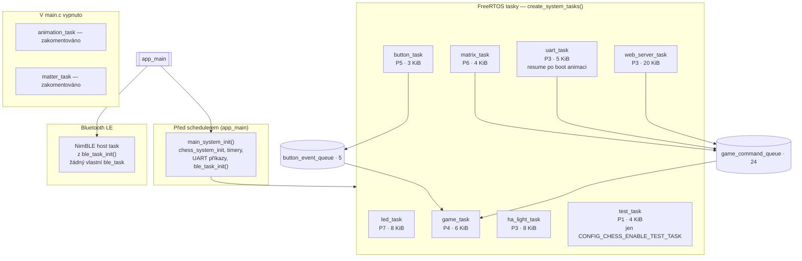

# Architektura FreeRTOS tasků (zdroj pravdy: kód)

Popis odpovídá **`main/main.c`** (`create_system_tasks`, `main_system_init`) a konstantám ve **`components/freertos_chess/include/freertos_chess.h`**.

**Export obrázků:** [`sources/tasks_architecture.mmd`](sources/tasks_architecture.mmd) → `./scripts/render_docs.sh` vyrobí **`tasks_architecture.svg`** a **`.png`**.

**Přehled všech diagramů:** [README.md v této složce](README.md).

## Mermaid

## Klíčové fronty (`freertos_chess.c`)

| Fronta | Konstanta | Poznámka |
|--------|-----------|----------|
| Herní příkazy | `GAME_QUEUE_SIZE` | **24** |
| Tlačítka | `BUTTON_QUEUE_SIZE` | 5 |
| UART odpovědi | `UART_QUEUE_SIZE` | **10** (`game_response_t`) |
| Animation API | `ANIMATION_QUEUE_SIZE` | 5 — **`animation_task` se ve `main.c` nevytváří** |

## LED synchronizace

Mutex **`led_unified_mutex`** (`led_task.c`) — batch commit a `led_strip_refresh()`.
