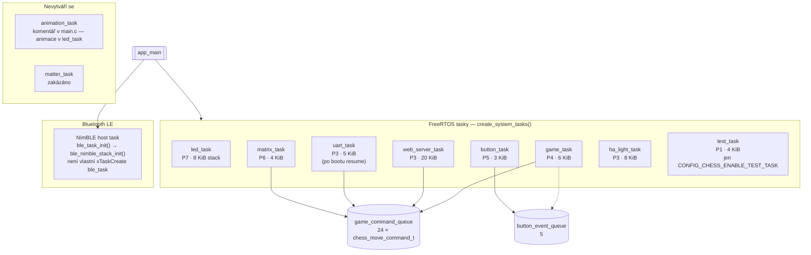

# Architektura FreeRTOS tasků (zdroj pravdy pro diagram)

Tento soubor popisuje **tasky skutečně vytvářené v** [`main/main.c`](../../main/main.c) a konstanty v [`components/freertos_chess/include/freertos_chess.h`](../../components/freertos_chess/include/freertos_chess.h).

**Generované obrázky:** stejný graf jako `sources/tasks_architecture.mmd` → po `./scripts/render_docs.sh` vznikne **`tasks_architecture.svg`** a **`tasks_architecture.png`** (starší ruční PNG může být nahrazeno). Při rozporu platí **kód** a `.mmd`.

## Mermaid (zkopíruj do [mermaid.live](https://mermaid.live))

## Klíčové fronty (viz `freertos_chess.c`)

| Fronta | Konstanta | Položky |
|--------|-----------|---------|
| Herní příkazy | `GAME_QUEUE_SIZE` | **24** |
| Tlačítka | `BUTTON_QUEUE_SIZE` | 5 |
| UART odpovědi | `UART_QUEUE_SIZE` | **10** (`game_response_t`) |
| Animation API | `ANIMATION_QUEUE_SIZE` | 5 (fronty existují; **animation_task** se ve `main.c` **nevytváří**) |

## LED synchronizace

- Mutex: **`led_unified_mutex`** (`led_task.c`) — batch commit + `led_strip_refresh()`.
