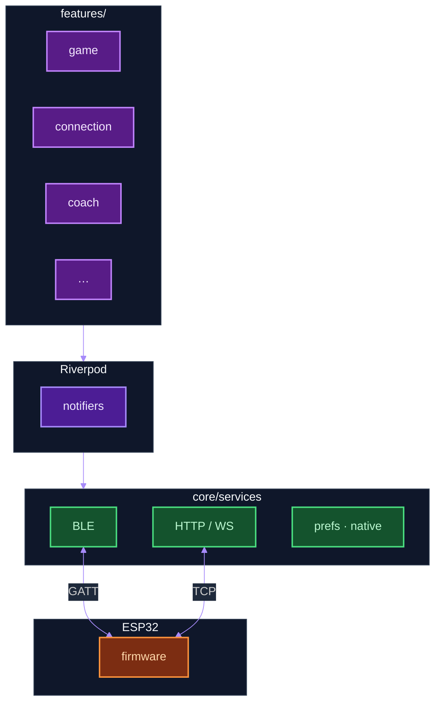
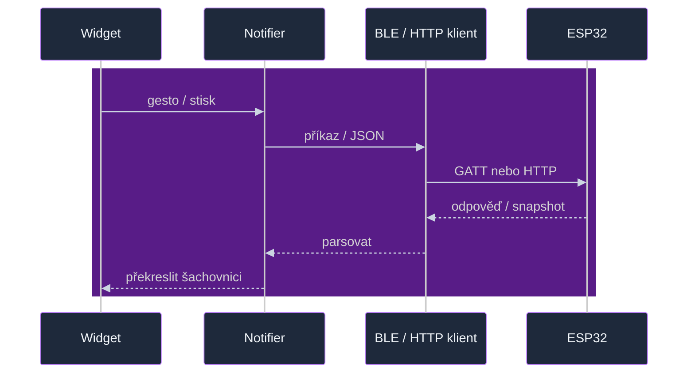
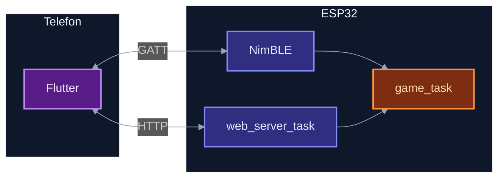
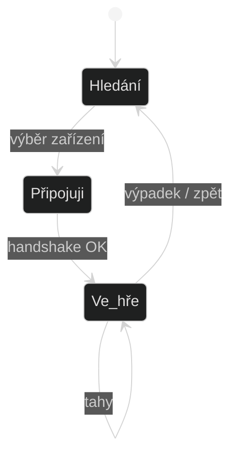
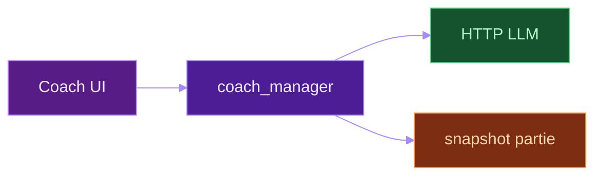

# Flutter aplikace (`flutter_czechmate/`)

**Mapa celé dokumentace (firmware + reference + diagramy):** [`docs/README.md`](../README.md).

Dart klient k desce CZECHMATE: **BLE** nebo **HTTP / WebSocket**. Stav drží hlavně **Riverpod**. **Šachová pravidla a stav partie na desce** běží ve firmware [`game_task`](../../components/game_task/); Flutter používá API snapshotů / streamů a lokálně např. balíček `chess` tam, kde je v kódu potřeba — není náhrada za `game_task.c`.

Spuštění: `cd flutter_czechmate && flutter pub get && flutter run`.

**APK + DMG z CI:** workflow [Flutter app release](../../.github/workflows/flutter-app-release.yml) při pushi na `main`/`master` (změny ve `flutter_czechmate/**`) automaticky buildí a publikuje na [Releases](https://github.com/alfredkrutina/chess_esp32_c6_devkit/releases); ručně lze spustit *Run workflow* nebo tag `app-*`.

Dlouhý lokální seznam nápadů na nové diagramy: **`docs/diagrams/LOCAL_DIAGRAM_BACKLOG.md`** (gitignored) — šablona začátku [`DIAGRAM_BACKLOG.local.example.md`](../diagrams/DIAGRAM_BACKLOG.local.example.md).

---

## Vrstvy (features → Riverpod → služby → deska)

  
Zdroj Mermaid: [`../diagrams/sources/client_app_layers.mmd`](../diagrams/sources/client_app_layers.mmd)

Širší mapa složek `lib/` (features + core + navigace): [`../diagrams/flutter_app_structure.svg`](../diagrams/flutter_app_structure.svg) · [`sources/flutter_app_structure.mmd`](../diagrams/sources/flutter_app_structure.mmd).

---

## Tabulka `lib/`

| Složka | Co tam je |
|--------|-----------|
| `features/game/` | Partie, šachovnice, hodiny, report |
| `features/connection/` | Scan, session, diagnostika |
| `features/coach/` | AI chat, LLM klienti |
| `features/analysis/` | Evaluace, grafy |
| `features/settings/` | Zařízení, MQTT/HA obrazovky |
| `core/services/` | `ble_czechmate_client`, `board_api_client`, `web_socket_manager`, Stockfish, Live Activity, hodinky |
| `core/models/` | Snapshot, časové kontroly, enumy |
| `app_providers.dart` | Globální providery |
| `app_navigation.dart` | Routy |

---

## Tah z UI na hardware

---

## BLE vs WiFi na desce

Příkazy z BLE často jdou přes **`web_server_ble_command_dispatch`** na firmware — nemusí existovat úplně oddělený „BLE protokol“ od web API.

---

## Session stavy

Implementace: `board_session_notifier.dart`, `features/connection/`.

---

## Coach

---

## Nativní části

| Platforma | Extra |
|-----------|--------|
| iOS | Live Activities, případně Watch bridge |
| Android | Wear modul, notifikace hodin |

---

## Firmware diagramy

[`docs/diagrams/README.md`](../diagrams/README.md) — FreeRTOS, fronty, LED pipeline.

---

Krátký úvod u samotné appky: [`flutter_czechmate/README.md`](../../flutter_czechmate/README.md).
