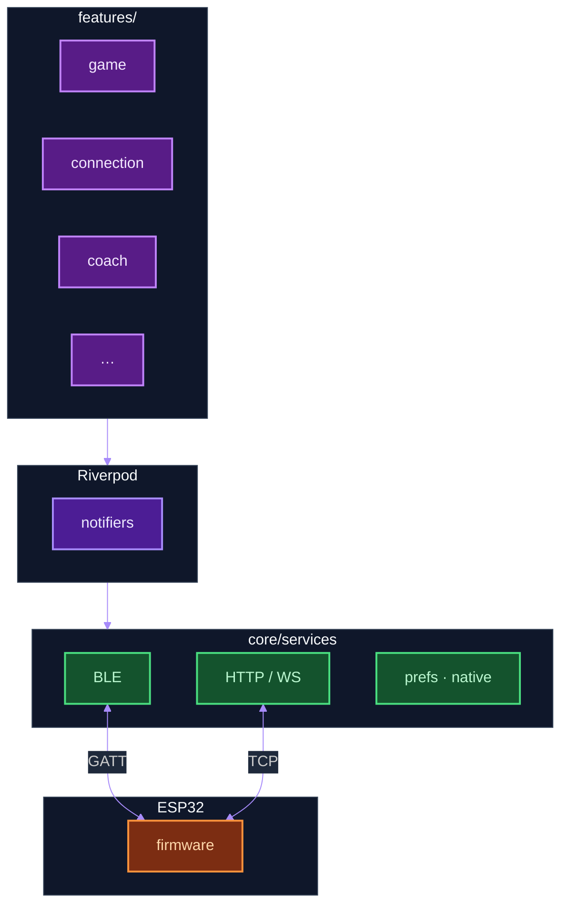
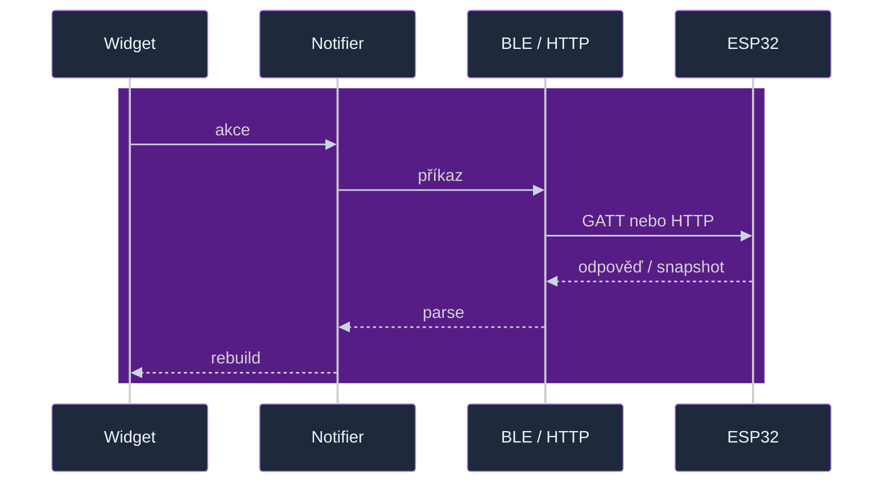
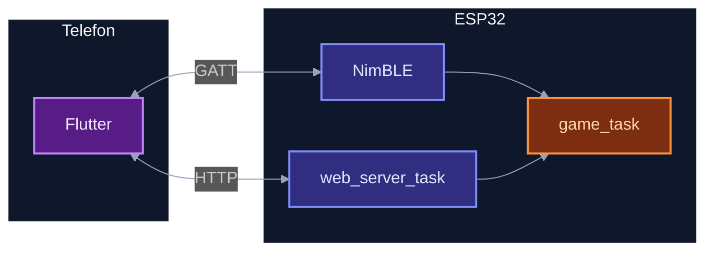
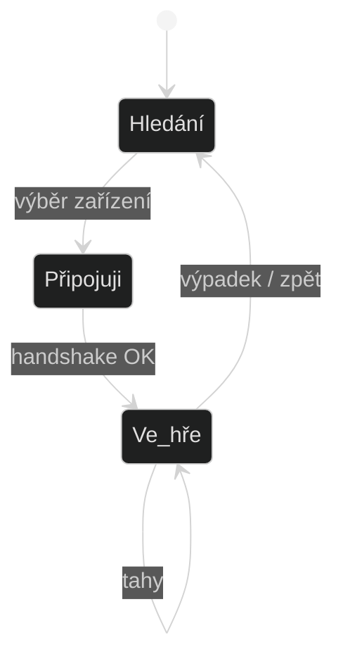
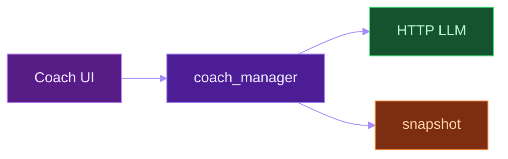

# Flutter klient (`flutter_czechmate/`)

[Rozcestník celého repa](../README.md).

Aplikace umí **BLE** nebo **HTTP / WebSocket**, stav držím přes **Riverpod**. Na **Windows** je v této codebase jen síťová větev (BLE stack chybí ve `flutter_blue_plus`). Partie sama o sobě žije ve firmware [`game_task`](../../components/game_task/) — klient v Dartu synchronizuje snapshoty a API; balíček `chess` používám tam, kde pomůže UI, ne jako náhradu celého `game_task`.

```bash
cd flutter_czechmate && flutter pub get && flutter run
```

### Windows desktop

- **Předpoklady:** Windows 10/11, [Flutter](https://docs.flutter.dev/get-started/install/windows) na stable kanálu, **Visual Studio 2022** s úlohou *Desktop development with C++* (CMake, MSVC, Windows SDK).
- **Spuštění:** `flutter pub get && flutter run -d windows`.
- **Release:** `flutter build windows` — spustitelná aplikace typicky v `build/windows/x64/runner/Release/` (zkopíruj celou složku včetně dat DLL).
- **Bluetooth:** knihovna `flutter_blue_plus` v tomto projektu **nemá** backend pro Windows. Klient BLE API nevolá; připojení k desce je přes **HTTP / WebSocket** (stejná síť jako počítač, URL z webového rozhraní desky nebo z telefonu po zprovoznění Wi‑Fi). BLE sken a OTA přes GATT vyžadují Android / iOS / macOS / Linux.
- **CI instalátor:** při pushi na `main`/`master`, který mění `flutter_czechmate/**`, běží [`.github/workflows/flutter-app-release.yml`](../../.github/workflows/flutter-app-release.yml) na GitHub Actions — job `windows` udělá `flutter build windows --release` a zabalí výstup Inno Setup skriptem `flutter_czechmate/installer/windows/CzechMateSetup.iss` do `czechmate-<ver>-windows-setup.exe` na Releases.

Hotové buildy: [GitHub Releases](https://github.com/alfredkrutina/chess_esp32_c6_devkit/releases).

Nápady na nové diagramy si píšu lokálně do `docs/diagrams/LOCAL_DIAGRAM_BACKLOG.md`, vzor je [DIAGRAM_BACKLOG.local.example.md](../diagrams/DIAGRAM_BACKLOG.local.example.md).

---

## Vrstvy

  
Mermaid: [client_app_layers.mmd](../diagrams/sources/client_app_layers.mmd)

Širší mapa `lib/`: [flutter_app_structure.svg](../diagrams/flutter_app_structure.svg) · [flutter_app_structure.mmd](../diagrams/sources/flutter_app_structure.mmd)



---

## `lib/`

| Složka | Role |
|--------|------|
| `features/game/` | Partie, šachovnice, hodiny, report |
| `features/connection/` | Scan, session |
| `features/coach/` | AI chat, LLM |
| `features/analysis/` | Evaluace |
| `features/settings/` | Zařízení, MQTT/HA, OTA (`firmware_update_section`, `firmware_ota_runner`, manifest) |
| `core/services/` | `ble_czechmate_client`, `board_api_client`, `firmware_phone_host_ota`, WS, Stockfish, … |
| `core/models/` | Snapshot, enumy |
| `app_providers.dart` | Providery |
| `app_navigation.dart` | Routy |

---

## Tok příkazu na desku



---

## BLE vs HTTP na desce



JSON z BLE často končí ve `web_server_ble_command_dispatch` — stejná logika jako část web API.

---

## OTA firmwaru ESP32

[docs/ota_architecture.md](../ota_architecture.md) — HTTPS se STA, HTTP z telefonu, BLE chunky `OB`, REST, Bearer.

Dart: `BoardSessionNotifier.requestFirmwareOta` / `uploadFirmwareOtaBle`, `FirmwareOtaRunner`, `FirmwarePhoneHostOta`, `BleCzechmateClient.uploadFirmwareBle`.

E2E poznámky k OTA si lze vést lokálně (např. vlastní checklist); veřejný popis kanálů a API je v [`docs/ota_architecture.md`](../ota_architecture.md).

---

## Session



Kód: `board_session_notifier.dart`, `features/connection/`.

---

## Coach



---

## Nativní vrstvy

| Platforma | |
|-----------|--|
| iOS | Live Activities, Watch |
| Android | Wear, notifikace |

---

## Firmware diagramy

[diagrams/README.md](../diagrams/README.md) — tasky, boot, LED pipeline.

[flutter_czechmate/README.md](../../flutter_czechmate/README.md) — krátký start z kořene aplikace.
