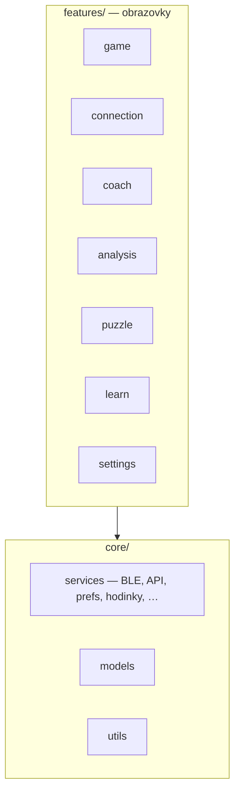
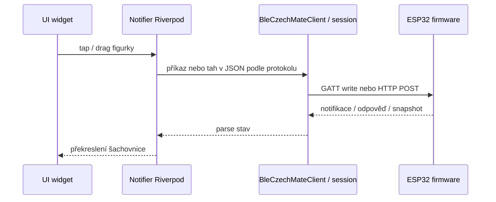
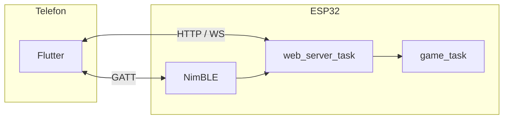
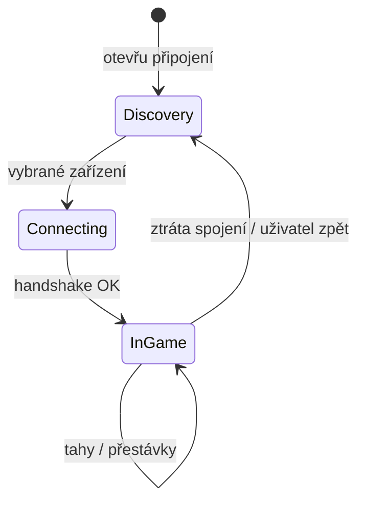
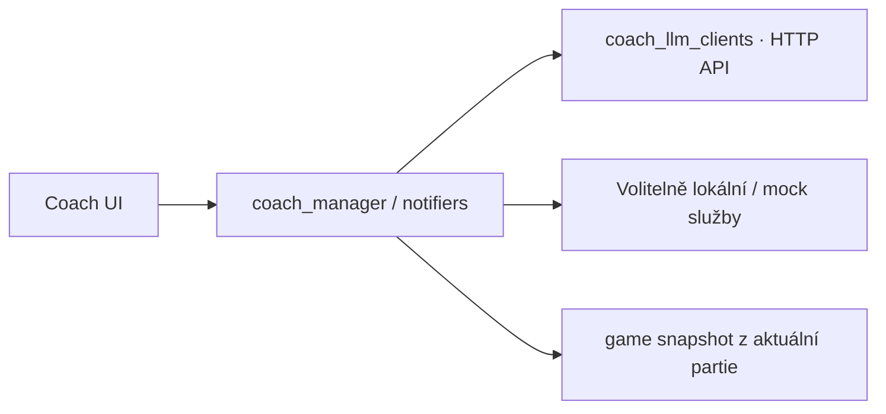

# Flutter aplikace (`flutter_czechmate/`)

Dart klient k šachovnici CZECHMATE. Komunikuje s ESP32 přes **BLE** (GATT) nebo přes **HTTP / WebSocket**, podle toho jak máš desku nahozenou a co aplikace zrovna používá. Stav aplikace drží hlavně **Riverpod**.

Spuštění: `cd flutter_czechmate && flutter pub get && flutter run`.

---

## Co kde je v `lib/`

| Složka | Účel |
|--------|------|
| `features/game/` | Šachovnice, partie, hodiny, report |
| `features/connection/` | Hledání desky, session, diagnostika |
| `features/coach/` | Chat s AI / LLM backendy |
| `features/analysis/` | Evaluace tahů, grafy |
| `features/settings/` | Zařízení, vývojářské volby, MQTT/HA obrazovky |
| `core/services/` | `ble_czechmate_client`, `board_api_client`, `web_socket_manager`, Stockfish klient, Live Activity, hodinky |
| `core/models/` | Snapshot hry, time control, coach backend enumy |
| `app_providers.dart` | Globální Riverpod setup |
| `app_navigation.dart` | Routy |

---

## Jak proudí tah od uživatele k desce

---

## BLE vs síť (zjednodušeně)

Na firmware straně BLE příkazy často končí ve stejné logice jako web (`web_server_ble_command_dispatch` v `ble_nimble_impl.c`). Proto v aplikaci nemusí být úplně jiný „jazyk“ pro každý kanál — záleží na konkrétním endpointu/GATT charakteristikách implementovaných v repu.

---

## Životní cyklus „session“ k desce

Implementace: `board_session_notifier.dart`, `board_session_state.dart`, obrazovky v `features/connection/`.

---

## Coach (AI)

Soubory: `features/coach/*`, `core/services/coach_ai_completion_service.dart`, `coach_llm_clients.dart`.

---

## Nativní části mimo Dart

| Platforma | Co je navíc |
|-----------|-------------|
| **iOS** | Live Activities (`ios/ChessLiveActivityExtension/`, `LiveActivityNativeController.swift`), Watch bridge dle aktuálního stavu projektu |
| **Android** | Wear modul (`android/wear/`), notifikace šachových hodin v `MainActivity` / Kotlin pomocné třídy |

---

## Čtení na firmware stranu

Diagramy FreeRTOS a front: [`docs/diagrams/README.md`](../diagrams/README.md). Checklist integrace: [`docs/reference/CZECHMATE_INTEGRATION_CHECKLIST.md`](../reference/CZECHMATE_INTEGRATION_CHECKLIST.md).

---

Krátký úvod přímo ve složce appky: [`flutter_czechmate/README.md`](../../flutter_czechmate/README.md).
