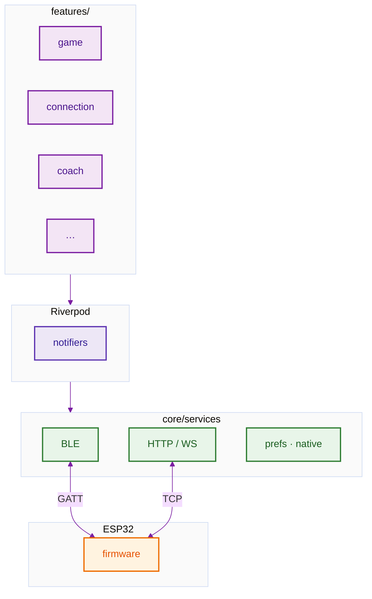
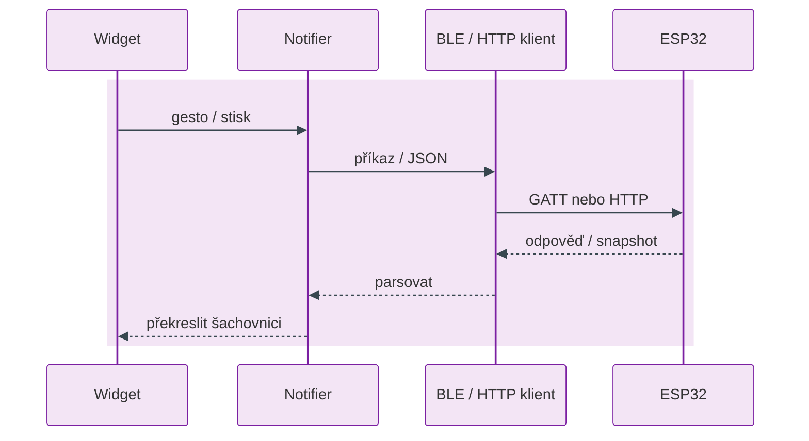
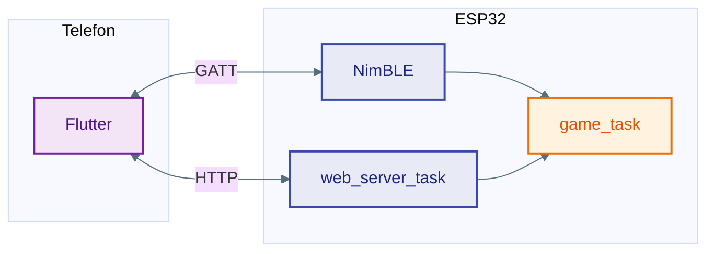
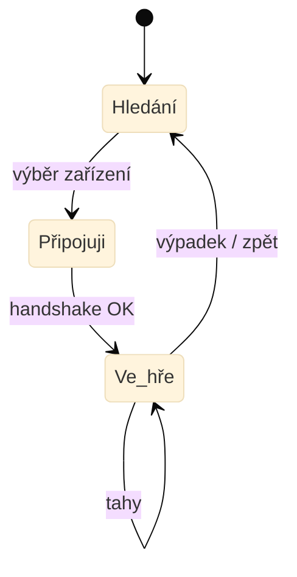
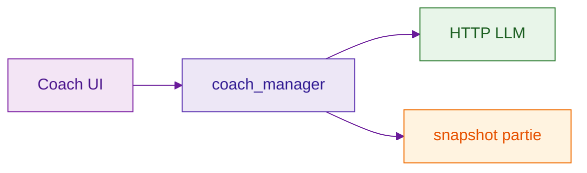

# Flutter aplikace (`flutter_czechmate/`)

Dart klient k desce CZECHMATE: **BLE** nebo **HTTP / WebSocket**. Stav drží hlavně **Riverpod**.

Spuštění: `cd flutter_czechmate && flutter pub get && flutter run`.

Dlouhý lokální seznam nápadů na nové diagramy: **`docs/diagrams/LOCAL_DIAGRAM_BACKLOG.md`** (gitignored) — šablona začátku [`DIAGRAM_BACKLOG.local.example.md`](../diagrams/DIAGRAM_BACKLOG.local.example.md).

---

## Vrstvy (features → Riverpod → služby → deska)

  
Zdroj Mermaid: [`../diagrams/sources/client_app_layers.mmd`](../diagrams/sources/client_app_layers.mmd)

---

## Tabulka `lib/`

| Složka | Co tam je |
|--------|-----------|
| `features/game/` | Partie, šachovnice, hodiny, report |
| `features/connection/` | Scan, session, diagnostika |
| `features/coach/` | AI chat, LLM klienti |
| `features/analysis/` | Evaluace, grafy |
| `features/settings/` | Zařízení, MQTT/HA obrazovky |
| `core/services/` | `ble_czechmate_client`, `board_api_client`, `web_socket_manager`, Stockfish, Live Activity, hodinky |
| `core/models/` | Snapshot, časové kontroly, enumy |
| `app_providers.dart` | Globální providery |
| `app_navigation.dart` | Routy |

---

## Tah z UI na hardware

---

## BLE vs WiFi na desce

Příkazy z BLE často jdou přes **`web_server_ble_command_dispatch`** na firmware — nemusí existovat úplně oddělený „BLE protokol“ od web API.

---

## Session stavy

Implementace: `board_session_notifier.dart`, `features/connection/`.

---

## Coach

---

## Nativní části

| Platforma | Extra |
|-----------|--------|
| iOS | Live Activities, případně Watch bridge |
| Android | Wear modul, notifikace hodin |

---

## Firmware diagramy

[`docs/diagrams/README.md`](../diagrams/README.md) — FreeRTOS, fronty, LED pipeline.

---

Krátký úvod u samotné appky: [`flutter_czechmate/README.md`](../../flutter_czechmate/README.md).
