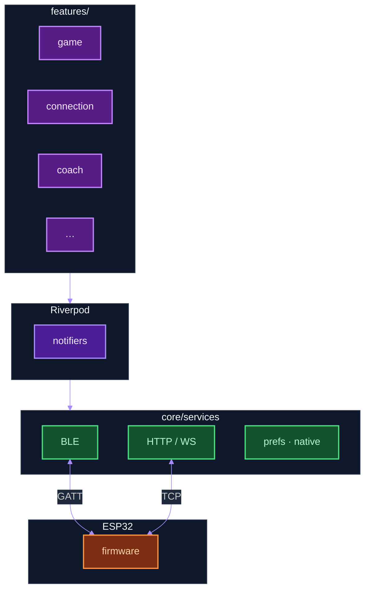
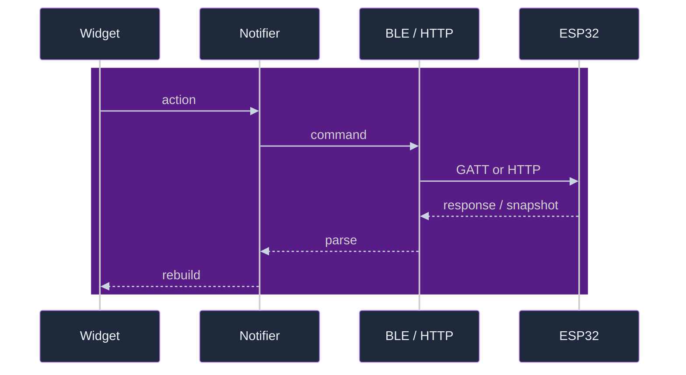
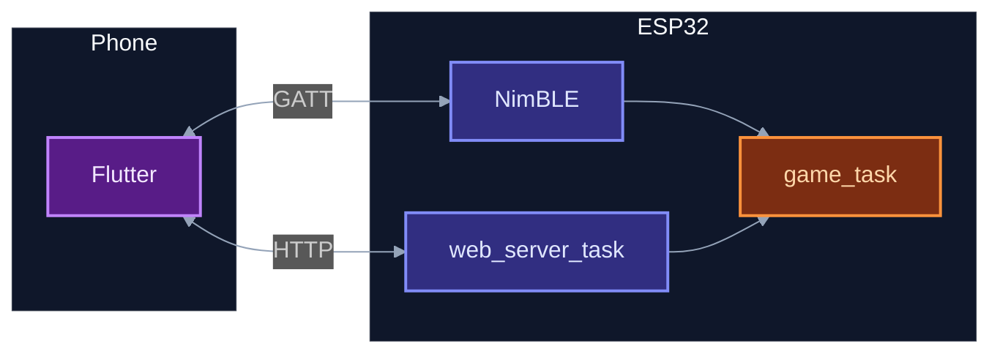
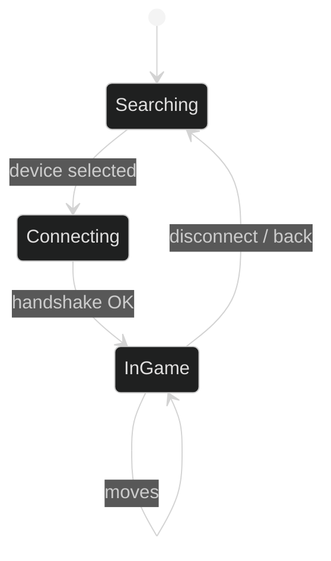
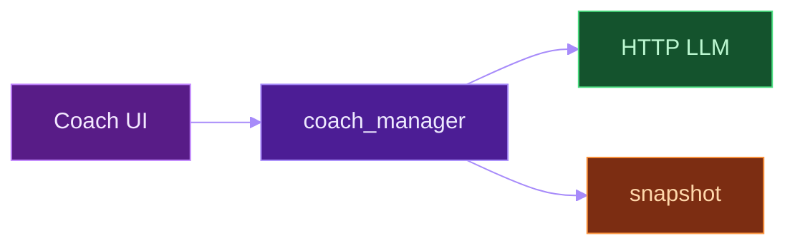

# Flutter client (`flutter_czechmate/`)

[Full repo index](../README.md).

The app supports **BLE** or **HTTP / WebSocket**; state is held via **Riverpod**. On **Windows**, this codebase only implements the network path (no BLE stack in `flutter_blue_plus`). The game itself runs in firmware [`game_task`](../../components/game_task/) — the Dart client synchronizes snapshots and API calls; the `chess` package is used where it helps the UI, not as a replacement for the entire `game_task`.

```bash
cd flutter_czechmate && flutter pub get && flutter run
```

### Windows desktop

- **Prerequisites:** Windows 10/11, [Flutter](https://docs.flutter.dev/get-started/install/windows) on the stable channel, **Visual Studio 2022** with the *Desktop development with C++* workload (CMake, MSVC, Windows SDK).
- **Run:** `flutter pub get && flutter run -d windows`.
- **Release:** `flutter build windows` — the executable is typically in `build/windows/x64/runner/Release/` (copy the entire folder including DLL data).
- **Bluetooth:** the `flutter_blue_plus` library has **no** Windows backend in this project. The client does not call the BLE API; board connection is via **HTTP / WebSocket** (same network as the PC, URL from the board web UI or from the phone after Wi‑Fi setup). BLE scan and OTA over GATT require Android / iOS / macOS / Linux.
- **CI installer:** on push to `main`/`master` that changes `flutter_czechmate/**`, [`.github/workflows/flutter-app-release.yml`](../../.github/workflows/flutter-app-release.yml) runs on GitHub Actions — the `windows` job runs `flutter build windows --release` and packages the output with the Inno Setup script `flutter_czechmate/installer/windows/CzechMateSetup.iss` into `czechmate-<ver>-windows-setup.exe` on Releases.

Release builds: [GitHub Releases](https://github.com/alfredkrutina/chess_esp32_c6_devkit/releases).

New diagram ideas can be tracked locally in `docs/diagrams/LOCAL_DIAGRAM_BACKLOG.md`; the template is [DIAGRAM_BACKLOG.local.example.md](../diagrams/DIAGRAM_BACKLOG.local.example.md).

---

## Layers

  
Mermaid: [client_app_layers.mmd](../diagrams/sources/client_app_layers.mmd)

Broader `lib/` map: [flutter_app_structure.svg](../diagrams/flutter_app_structure.svg) · [flutter_app_structure.mmd](../diagrams/sources/flutter_app_structure.mmd)


```mermaid
%%{init: {'theme':'dark','themeVariables':{'lineColor':'#a78bfa','clusterBkg':'#0f172a','clusterBorder':'#334155','primaryTextColor':'#f1f5f9','edgeLabelBackground':'#1e293b','titleColor':'#f8fafc'}}}%%
flowchart TB
  subgraph UI["features/"]
    direction LR
    GA[game]:::u
    CN[connection]:::u
    CH[coach]:::u
    XX[…]:::u
  end
  subgraph RP["Riverpod"]
    NT[notifiers]:::r
  end
  subgraph SV["core/services"]
    BLE[BLE]:::s
    HTTP[HTTP / WS]:::s
    PF[prefs · native]:::s
  end
  subgraph BD["ESP32"]
    FW[firmware]:::e
  end
  UI --> RP --> SV
  BLE <-->|GATT| FW
  HTTP <-->|TCP| FW

  classDef u fill:#581c87,stroke:#c084fc,stroke-width:2px,color:#f3e8ff
  classDef r fill:#4c1d95,stroke:#a78bfa,stroke-width:2px,color:#ede9fe
  classDef s fill:#14532d,stroke:#4ade80,stroke-width:2px,color:#bbf7d0
  classDef e fill:#7c2d12,stroke:#fb923c,stroke-width:2px,color:#fed7aa
```

---

## `lib/`

| Folder | Role |
|--------|------|
| `features/game/` | Game, board, clock, report |
| `features/connection/` | Scan, session |
| `features/coach/` | AI chat, LLM |
| `features/analysis/` | Evaluation |
| `features/settings/` | Device, MQTT/HA, OTA (`firmware_update_section`, `firmware_ota_runner`, manifest) |
| `core/services/` | `ble_czechmate_client`, `board_api_client`, `firmware_phone_host_ota`, WS, Stockfish, … |
| `core/models/` | Snapshot, enums |
| `app_providers.dart` | Providers |
| `app_navigation.dart` | Routes |

---

## Command flow to the board


```mermaid
%%{init: {'theme':'dark','themeVariables':{'actorBkg':'#1e293b','actorBorder':'#c084fc','actorTextColor':'#f1f5f9','signalColor':'#cbd5e1'}}}%%
sequenceDiagram
  rect rgb(88, 28, 135)
    participant W as Widget
    participant N as Notifier
    participant X as BLE / HTTP
    participant D as ESP32
    W->>N: action
    N->>X: command
    X->>D: GATT or HTTP
    D-->>X: response / snapshot
    X-->>N: parse
    N-->>W: rebuild
  end
```

---

## BLE vs HTTP on the board


```mermaid
%%{init: {'theme':'dark','themeVariables':{'clusterBkg':'#0f172a','lineColor':'#94a3b8','primaryTextColor':'#f1f5f9','titleColor':'#f8fafc'}}}%%
flowchart LR
  subgraph Phone["Phone"]
    APP[Flutter]:::p
  end
  subgraph Board["ESP32"]
    NIM[NimBLE]:::b
    WEB[web_server_task]:::b
    GT[game_task]:::g
  end
  APP <-->|GATT| NIM
  APP <-->|HTTP| WEB
  NIM --> GT
  WEB --> GT
  classDef p fill:#581c87,stroke:#c084fc,stroke-width:2px,color:#f3e8ff
  classDef b fill:#312e81,stroke:#818cf8,stroke-width:2px,color:#e0e7ff
  classDef g fill:#7c2d12,stroke:#fb923c,stroke-width:2px,color:#fed7aa
```

JSON from BLE often ends up in `web_server_ble_command_dispatch` — same logic as part of the web API.

---

## ESP32 firmware OTA

[docs/ota_architecture.md](../ota_architecture.md) — HTTPS with STA, HTTP from phone, BLE `OB` chunks, REST, Bearer.

Dart: `BoardSessionNotifier.requestFirmwareOta` / `uploadFirmwareOtaBle`, `FirmwareOtaRunner`, `FirmwarePhoneHostOta`, `BleCzechmateClient.uploadFirmwareBle`.

E2E OTA notes can be kept locally (e.g. a custom checklist); the public channel and API description is in [`docs/ota_architecture.md`](../ota_architecture.md).

---

## Session


```mermaid
%%{init: {'theme':'dark'}}%%
stateDiagram-v2
  [*] --> Searching
  Searching --> Connecting: device selected
  Connecting --> InGame: handshake OK
  InGame --> InGame: moves
  InGame --> Searching: disconnect / back
```

Code: `board_session_notifier.dart`, `features/connection/`.

---

## Coach


```mermaid
%%{init: {'theme':'dark','themeVariables':{'lineColor':'#a78bfa','primaryTextColor':'#f1f5f9'}}}%%
flowchart LR
  UI[Coach UI]:::u --> CM[coach_manager]:::r
  CM --> LLM[HTTP LLM]:::s
  CM --> SN[snapshot]:::x
  classDef u fill:#581c87,stroke:#c084fc,color:#f3e8ff
  classDef r fill:#4c1d95,stroke:#a78bfa,color:#ede9fe
  classDef s fill:#14532d,stroke:#4ade80,color:#bbf7d0
  classDef x fill:#7c2d12,stroke:#fb923c,color:#fed7aa
```

---

## Native layers

| Platform | |
|-----------|--|
| iOS | Live Activities, Watch |
| Android | Wear, notifications |

---

## Firmware diagrams

[diagrams/README.md](../diagrams/README.md) — tasks, boot, LED pipeline.

[flutter_czechmate/README.md](../../flutter_czechmate/README.md) — short start guide from the app root.
