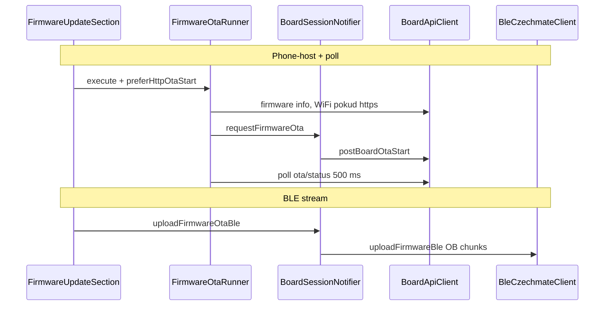

# OTA firmwaru na ESP32-C6 — přehled chování

Deska si umí stáhnout nový aplikační obraz po **HTTPS** (internet, je potřeba STA), po **HTTP** z LAN (typicky když telefon hostuje `.bin` na hotspotu desky), nebo ten samý obraz přijmout po **BLE** jako stream chunků začínajících hlavičkou `OB`. Flutter pak jen řídí start; stav OTA se na desce typicky polluje přes HTTP (kde to dává smysl), nebo telefon posílá chunky přes GATT.

STM32 na Hall segmentech tímhle protokolem neřeším — tam je jiný příběh. Když je flash jen `factory` bez `ota_0`/`ota_1`, `ota_supported` je false a HTTP OTA vrací 503; pak zbývá UART / esptool.

**Směr do budoucna:** časem přejít z vlastní logiky v `ota_update.c` na **`esp_encrypted_img` / OTAvo styl** podle Espressif — až na to dojde, současné handlery se obalí nebo nahradí.

---

## 1. Partition a synchronizace

- `ota_partition_layout_ok()` v `components/web_server_task/ota_update.c` kontroluje, že existují **oba** oddíly `APP_OTA_0` a `APP_OTA_1`. Jinak `GET /api/system/firmware` vrátí `ota_supported: false` a `POST /api/system/ota` je **503**.
- Po úspěchu volám `esp_ota_set_boot_partition()` a `esp_restart()` — platí pro všechny tři kanály.
- `s_ota_sem`: současně může běžet jen jedna OTA. Druhý start → HTTP **409**, přes BLE často `ESP_ERR_INVALID_STATE` („busy“).

---

## 2. Kanály

| | URL | Kdo tahá / zapisuje | STA |
|---|-----|---------------------|-----|
| HTTPS | `https://…` | `esp_https_ota` + CA bundle | potřeba |
| HTTP | `http://…` | `esp_http_client` + `esp_ota_write` | ne (LAN / AP) |
| BLE | — | telefon posílá `OB` write na CMD char | ne |

**Debug:** při `CHESS_DEBUG_MODE` loguju v `ota_update.c` řádky `[STAGING]`; u GATT v `ble_nimble_impl.c`. Když někdo pošle chunk bez šifrování linku, uvidím něco jako `OTA BLE chunk rejected: link not encrypted`.

---

## 3. Síť

- AP desky typicky `192.168.4.1`; telefon na hotspotu `192.168.4.x`. Ve Flutteru `FirmwarePhoneHostOta.ipv4OnBoardApSubnet()` vybírá IP do URL.
- Na domácí LAN používám `ipv4OnSameSubnet24As(boardStaIp)`, pokud telefon není na 4.x.
- `FirmwarePhoneHostOta.startServingBin`: malý `HttpServer` na `0.0.0.0`, volný port, jen `GET /czechmate_ota.bin`, `Content-Length`, stream souboru.

---

## 4. REST (`ota_update_register_http_handlers`)

### `GET /api/system/firmware`

Bez Bearer. Vracím `version`, `project_name`, `idf`, `ota_supported`.

### `GET /api/system/ota/status`

Bez Bearer. `state`: `idle` | `downloading` | `done` | `error`; `percent`; `message` (poslední chyba z `s_last_err`). Platí i během BLE streamu — je to stejný globální stav.

### `POST /api/system/ota`

Admin: Bearer + web lock podle `board_api_auth.h`. Tělo:

```json
{"url":"https://example/firmware.bin"}
```

`http_post_ota` čte tělo do ~1536 B — držím JSON krátký.

| Kód | Význam |
|-----|--------|
| 202 | `schedule_ota` OK |
| 409 | busy |
| 428 | HTTPS bez STA |
| 400 | prázdné / rozbitý JSON / špatná URL |
| 503 | chybí OTA oddíly |
| 403 | token / web lock |
| 500 | fronta / interní |

Worker: `ota_https_worker_task` nebo `ota_http_worker_task`.

---

## 5. Workery na desce

**HTTPS:** `esp_https_ota_*`, timeout klienta 120 s, progress z velikosti obrazu.

**HTTP:** `esp_http_client_open`, status 200, `esp_ota_begin` → read loop → `esp_ota_write`, timeout 300 s, progress z `Content-Length` nebo z velikosti partition.

Při chybě volám `led_ota_restore_board_after_update_abort()` a `xSemaphoreGive(s_ota_sem)`.

---

## 6. BLE — JSON (`web_server_ble_command_dispatch`)

Šifrovaný link je povinný (`ble_task_conn_is_encrypted`). Jinak posílám `needs_encryption` přes `ble_dispatch_ack_needs_encryption`.

| Příkaz | Akce |
|--------|------|
| `ota_start` + `url` | `schedule_ota(url)` — stejné jako POST |
| `ota_ble_begin` + `size` | Stream; `size` ≥ 32 KiB, ≤ partition |
| `ota_ble_abort` | abort + uvolnění semaforu |
| `ota_ble_status` | JSON z `ota_update_ble_build_status_ack_json` + notify |

`ble_task_notify_command_result` mapuje `esp_err` na `code` / `message`, v JSON je i `"esp": <číslo>`. `ESP_ERR_NOT_ALLOWED` (HTTPS bez STA) spadne do default větve — UART log je konkrétnější.

---

## 7. BLE — chunky `OB`

Stejná GATT CMD charakteristika jako JSON.

| Bajt | Význam |
|------|--------|
| 0–1 | `'O'` `'B'` |
| 2–3 | `chunk_idx` LE u16 |
| 4–5 | `chunk_total` LE u16 |
| 6+ | payload |

Validace v `ota_update_ble_feed_chunk`: pořadí indexů, shoda `chunk_total`, součet payloadů = `size` z `ota_begin`, poslední chunk = `chunk_total - 1` při plném součtu.

**NimBLE:** prvních max 768 B z mbuf do stacku — jeden write od klienta musí vejít do ATT MTU (Flutter drží `payloadMax` konzervativně kvůli iOS).

Nešifrovaný link → `INSUFFICIENT_AUTHOR`. Špatný chunk → notify `{"cmd":"ota_ble_chunk","ok":false}`; úspěšné chunky notify nemám (kvůli frontě na iOS).

**Stavy:** `IDLE` → `RX` po begin. Disconnect v `RX` → `SUSPENDED` + timer **24 h**; po timeoutu abort. První platný chunk po suspend → zase `RX`.

Klient po výpadku: reconnect, `ota_ble_status`, pokračovat od `bytes` / `next_chunk` — viz `BleCzechmateClient.uploadFirmwareBle`.

---

## 8. Flutter



- **Bearer:** `BoardApiClient.resolveBoardApiBearerToken` ← `PrefsRepository.boardApiToken` (`app_providers.dart`). `postBoardOtaStart` mapuje 409, 428, 503, 403 na `BoardApiException`.
- **`FirmwareOtaRunner.execute`:** vyřeší `baseUrl` (`board_http_base_url.dart`), zkontroluje `ota_supported`, u `https://` ověří STA přes `fetchWiFiStatus`, zavolá `requestFirmwareOta`, pak `_pollOta` (500 ms, max 1200 cyklů). Po `downloading` a výpadku HTTP mám v kódu heuristiku úspěchu po rebootu.
- **`requestFirmwareOta`:** `preferHttpOtaStart` → HTTP POST na base URL i když jedu přes BLE session (HTTP na AP běží vedle BLE). Čistý BLE bez toho → `_ble.postOtaStart` (`ota_start`). URL z telefonu hostovaného binárku dávám spíš přes `preferHttpOtaStart`.
- **`uploadFirmwareBle`:** MTU 517, `payloadMax` pod platformu, retry na chunk, iOS gap; resume přes `OtaBleStatus` po disconnect.
- **UI:** `firmware_update_section.dart` — cache bin přes prefs, phone-host + `FirmwareOtaRunner`, nebo `_sendFirmwareViaBle` jen s lokálním `onProgress` (bez runner poll).

---

## 9. Shrnutí chování

| Režim | Start | Progress v app |
|-------|--------|----------------|
| HTTPS | POST nebo BLE `ota_start` | `GET .../ota/status` v runneru |
| HTTP z telefonu | POST + `preferHttpOtaStart` | stejně |
| BLE stream | `ota_ble_begin` + OB | callback bajtů; HTTP status lze číst paralelně pokud znám base URL |

---

## 10. Ladění

| Projev | Kde hledám |
|--------|------------|
| 428 | `schedule_ota`, Flutter WiFi status před startem |
| 409 | paralelní OTA |
| 403 | token / lock |
| needs_encryption | bonding / SMP |
| iOS GATT 8 | menší payload, delay — `ble_czechmate_client.dart` |
| po disconnect nový begin „busy“ | 24 h suspend nebo chybějící abort — `ota_update.h` |

---

## 11. Soubory

| FW | Dart |
|----|------|
| `components/web_server_task/ota_update.c` | `features/settings/firmware_ota_runner.dart` |
| `components/web_server_task/include/ota_update.h` | `core/services/board_api_client.dart` |
| `components/web_server_task/web_server_task.c` | `features/connection/board_session_notifier.dart` |
| `components/ble_task/ble_nimble_impl.c` | `core/services/ble_czechmate_client.dart` |
| `components/web_server_task/include/board_api_auth.h` | `core/services/firmware_phone_host_ota.dart` |
| | `features/settings/widgets/firmware_update_section.dart` |
