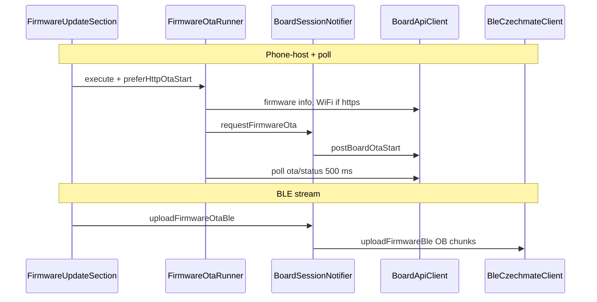
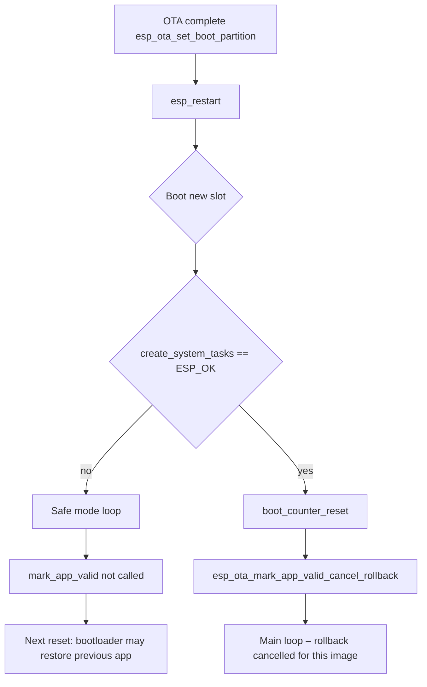

# ESP32-C6 firmware OTA — behavior overview

The board can download a new application image over **HTTPS** (internet, STA required), over **HTTP** from LAN (typically when the phone hosts the `.bin` on the board hotspot), or receive the same image over **BLE** as a stream of chunks starting with the `OB` header. Flutter only controls the start; OTA state on the board is typically polled over HTTP (where it makes sense), or the phone sends chunks over GATT.

STM32 on Hall segments is not handled by this protocol — that is a separate story. When flash contains only `factory` without `ota_0`/`ota_1`, `ota_supported` is false and HTTP OTA returns 503; then UART / esptool remains.

**Future direction:** eventually migrate from custom logic in `ota_update.c` to **`esp_encrypted_img` / OTAvo style** per Espressif — when that happens, current handlers will be wrapped or replaced.

---

## 1. Partition and synchronization

- `ota_partition_layout_ok()` in `components/web_server_task/ota_update.c` checks that **both** partitions `APP_OTA_0` and `APP_OTA_1` exist. Otherwise `GET /api/system/firmware` returns `ota_supported: false` and `POST /api/system/ota` is **503**.
- After success, `esp_ota_set_boot_partition()` and `esp_restart()` are called — applies to all three channels.
- `s_ota_sem`: only one OTA can run at a time. A second start → HTTP **409**, over BLE often `ESP_ERR_INVALID_STATE` (“busy”).

---

## 2. Channels

| | URL | Who pulls / writes | STA |
|---|-----|---------------------|-----|
| HTTPS | `https://…` | `esp_https_ota` + CA bundle | required |
| HTTP | `http://…` | `esp_http_client` + `esp_ota_write` | no (LAN / AP) |
| BLE | — | phone sends `OB` write on CMD char | no |

**Debug:** with `CHESS_DEBUG_MODE`, `[STAGING]` lines are logged in `ota_update.c`; for GATT in `ble_nimble_impl.c`. When a chunk is sent without link encryption, output like `OTA BLE chunk rejected: link not encrypted` appears.

---

## 3. Network

- The board hotspot (AP) is **off** by default — enabled from the app over BLE; when on, the board AP is typically `192.168.4.1` and the phone on the hotspot is `192.168.4.x`. In Flutter, `FirmwarePhoneHostOta.ipv4OnBoardApSubnet()` selects the IP for the URL. HTTP over **STA** (the board’s “home” IP) does not require the hotspot.
- On home LAN, `ipv4OnSameSubnet24As(boardStaIp)` is used if the phone is not on 4.x.
- `FirmwarePhoneHostOta.startServingBin`: small `HttpServer` on `0.0.0.0`, free port, only `GET /czechmate_ota.bin`, `Content-Length`, file stream.

---

## 4. REST (`ota_update_register_http_handlers`)

### `GET /api/system/firmware`

No Bearer. Returns `version`, `project_name`, `idf`, `ota_supported`.

**Rollback (ESP-IDF):** if the bootloader rolled back to the previous slot after OTA because the new image never reached `esp_ota_mark_app_valid_cancel_rollback()`, the other slot is in *invalid* state. JSON is extended with:

| Field | Type | Meaning |
|------|-----|--------|
| `ota_last_boot_failed` | bool | `true` if a last invalid OTA slot exists (`esp_ota_get_last_invalid_partition`) and it is not the currently running partition — typically “rolled back to previous firmware”. |
| `ota_failed_slot` | string | E.g. `ota_0` / `ota_1` — where the failed image lives. |
| `ota_failed_firmware_version` | string (optional) | `version` from the failed image header (`esp_ota_get_partition_description`), if readable. |

The Flutter banner in firmware settings reads these fields after `fetchBoardFirmwareInfo`. Older firmware does not send them — the client ignores them.

### `GET /api/system/ota/status`

No Bearer. `state`: `idle` | `downloading` | `done` | `error`; `percent`; `message` (last error from `s_last_err`). Also valid during BLE stream — same global state.

### `POST /api/system/ota`

Admin: Bearer + web lock per `board_api_auth.h`. Body:

```json
{"url":"https://example/firmware.bin"}
```

`http_post_ota` reads the body up to ~1536 B — keep JSON short.

| Code | Meaning |
|-----|--------|
| 202 | `schedule_ota` OK |
| 409 | busy |
| 428 | HTTPS without STA |
| 400 | empty / broken JSON / bad URL |
| 503 | missing OTA partitions |
| 403 | token / web lock |
| 500 | queue / internal |

Worker: `ota_https_worker_task` or `ota_http_worker_task`.

---

## 5. Board workers

**HTTPS:** `esp_https_ota_*`, client timeout 120 s, progress from image size.

**HTTP:** `esp_http_client_open`, status 200, `esp_ota_begin` → read loop → `esp_ota_write`, timeout 300 s, progress from `Content-Length` or partition size.

On error, `led_ota_restore_board_after_update_abort()` and `xSemaphoreGive(s_ota_sem)` are called.

---

## 6. BLE — JSON (`web_server_ble_command_dispatch`)

Encrypted link is required (`ble_task_conn_is_encrypted`). Otherwise `needs_encryption` is sent via `ble_dispatch_ack_needs_encryption`.

| Command | Action |
|--------|------|
| `ota_start` + `url` | `schedule_ota(url)` — same as POST |
| `ota_ble_begin` + `size` | Stream; `size` ≥ 32 KiB, ≤ partition |
| `ota_ble_abort` | abort + semaphore release |
| `ota_ble_status` | JSON from `ota_update_ble_build_status_ack_json` + notify |

`ble_task_notify_command_result` maps `esp_err` to `code` / `message`; JSON also includes `"esp": <number>`. `ESP_ERR_NOT_ALLOWED` (HTTPS without STA) falls into the default branch — UART log is more specific.

---

## 7. BLE — `OB` chunks

Same GATT CMD characteristic as JSON.

| Byte | Meaning |
|------|--------|
| 0–1 | `'O'` `'B'` |
| 2–3 | `chunk_idx` LE u16 |
| 4–5 | `chunk_total` LE u16 |
| 6+ | payload |

Validation in `ota_update_ble_feed_chunk`: index order, matching `chunk_total`, sum of payloads = `size` from `ota_begin`, last chunk = `chunk_total - 1` at full sum.

**NimBLE:** first max 768 B from mbuf to stack — one client write must fit ATT MTU (Flutter keeps `payloadMax` conservative for iOS).

Unencrypted link → `INSUFFICIENT_AUTHOR`. Bad chunk → notify `{"cmd":"ota_ble_chunk","ok":false}`; successful chunks have no notify (due to iOS queue limits).

**States:** `IDLE` → `RX` after begin. Disconnect in `RX` → `SUSPENDED` + **24 h** timer; abort after timeout. First valid chunk after suspend → back to `RX`.

Client after outage: reconnect, `ota_ble_status`, continue from `bytes` / `next_chunk` — see `BleCzechmateClient.uploadFirmwareBle`.

---

## 8. Flutter


```mermaid
sequenceDiagram
  participant UI as FirmwareUpdateSection
  participant Runner as FirmwareOtaRunner
  participant Sess as BoardSessionNotifier
  participant API as BoardApiClient
  participant BLE as BleCzechmateClient

  Note over UI,BLE: Phone-host + poll
  UI->>Runner: execute + preferHttpOtaStart
  Runner->>API: firmware info, WiFi if https
  Runner->>Sess: requestFirmwareOta
  Sess->>API: postBoardOtaStart
  Runner->>API: poll ota/status 500 ms

  Note over UI,BLE: BLE stream
  UI->>Sess: uploadFirmwareOtaBle
  Sess->>BLE: uploadFirmwareBle OB chunks
```

- **Bearer:** `BoardApiClient.resolveBoardApiBearerToken` ← `PrefsRepository.boardApiToken` (`app_providers.dart`). `postBoardOtaStart` maps 409, 428, 503, 403 to `BoardApiException`.
- **`FirmwareOtaRunner.execute`:** resolves `baseUrl` (`board_http_base_url.dart`), checks `ota_supported`, for `https://` verifies STA via `fetchWiFiStatus`, calls `requestFirmwareOta`, then `_pollOta` (500 ms, max 1200 cycles). After `downloading` and HTTP drop, reboot success heuristics exist in code.
- **`requestFirmwareOta`:** `preferHttpOtaStart` → HTTP POST to base URL even over a BLE session (HTTP on AP runs alongside BLE). Pure BLE without that → `_ble.postOtaStart` (`ota_start`). Phone-hosted binary URL is preferably sent via `preferHttpOtaStart`.
- **`uploadFirmwareBle`:** MTU 517, `payloadMax` per platform, chunk retry, iOS gap; resume via `OtaBleStatus` after disconnect.
- **UI:** `firmware_update_section.dart` — cache bin via prefs, phone-host + `FirmwareOtaRunner`, or `_sendFirmwareViaBle` with local `onProgress` only (no runner poll).

---

## 9. Behavior summary

| Mode | Start | Progress in app |
|-------|--------|----------------|
| HTTPS | POST or BLE `ota_start` | `GET .../ota/status` in runner |
| HTTP from phone | POST + `preferHttpOtaStart` | same |
| BLE stream | `ota_ble_begin` + OB | byte callback; HTTP status can be read in parallel if base URL is known |

---

## 10. Debugging

| Symptom | Where to look |
|--------|------------|
| 428 | `schedule_ota`, Flutter WiFi status before start |
| 409 | parallel OTA |
| 403 | token / lock |
| needs_encryption | bonding / SMP |
| iOS GATT 8 | smaller payload, delay — `ble_czechmate_client.dart` |
| new begin “busy” after disconnect | 24 h suspend or missing abort — `ota_update.h` |

---

## 11. Long-term reliability: flash, rollback, and compatibility

This section summarizes behavior during **repeated OTA** and risks called **“code aging”** — gradual mismatches between stored configuration, image size, and runtime environment (TLS, time), not just memory wear.

### 11.1 Dual-slot model and flash wear

- The production partition table uses **`ota_0` and `ota_1`** (see root `partitions.csv`). Espressif API **`esp_ota_get_next_update_partition`** selects the **inactive** slot; a successful OTA typically **overwrites the other slot**, not one fixed block repeatedly.
- One completed OTA means **erase + program** of the entire target application partition (on the order of megabytes). For normal user updates this is **standard and acceptable for NOR flash lifetime**; extreme stress (thousands of cycles on one HW unit) requires measurement per the specific flash module datasheet.
- The **`otadata`** partition is small; it changes when switching boot partition. Write count is **on the order of one change per successful slot transition**, not on every normal boot of the full image.

### 11.2 Rollback and when new firmware is “accepted”

**OTA rollback** is enabled in `sdkconfig` / `sdkconfig.defaults` (`CONFIG_BOOTLOADER_APP_ROLLBACK_ENABLE`, `CONFIG_APP_ROLLBACK_ENABLE`). After writing a new image, the partition is in **pending verify** state until the app calls **`esp_ota_mark_app_valid_cancel_rollback()`**.

In this project, confirmation happens in **`main/main.c`** only **after successful `create_system_tasks()`**, a short delay, **`boot_counter_reset()`**, and just before entering the main loop (`main_mark_ota_app_valid_if_needed()`).

Consequences:

- If new firmware **crashes earlier** (e.g. task init fails and firmware ends in safe mode loop), **`mark_app_valid` is not called** → on next reset the bootloader may **restore the previous slot**. To the user this can look like “OTA rolled back” or “update failed” even though flash write completed.
- If the system **reaches `mark_app_valid`**, rollback for this boot is **cancelled** — firmware is considered verified even when functionally broken **beyond that boundary** (e.g. broken game logic but tasks run). This is a general Espressif model tradeoff, not an OTA counter bug.

**Anti-rollback** at eFuse level (**`CONFIG_APP_ANTI_ROLLBACK`**) is **not** enabled in this project — downgrade to older semver over OTA remains possible (development flexibility vs. hard protection against intentionally building an older image).


```mermaid
flowchart TD
  O[OTA complete esp_ota_set_boot_partition] --> R[esp_restart]
  R --> B{Boot new slot}
  B --> T{create_system_tasks == ESP_OK}
  T -->|no| S[Safe mode loop]
  S --> X[mark_app_valid not called]
  X --> Y[Next reset: bootloader may restore previous app]
  T -->|yes| M[boot_counter_reset]
  M --> V[esp_ota_mark_app_valid_cancel_rollback]
  V --> L[Main loop – rollback cancelled for this image]
```

### 11.3 Cross-version compatibility (“software aging”)

- **`.bin` size vs. partition:** Slots have **fixed capacity** (currently 3072 KiB per slot in the main table). Growing firmware can hit the ceiling → failure at `esp_ota_begin` / end of write / boot. Fix: **track release build size** and if needed **new partition table + planned transition via UART / one-time flash**, not just “another OTA” from the old layout.
- **Partition table or chip type change:** Incompatible change requires a **controlled migration plan** (documented procedure, one transition version, or forced esptool). Automatic OTA from the previous generation may not suffice.
- **NVS:** Configuration survives OTA (Wi‑Fi preferences, web API tokens, timer, boot counter, …). **Changing blob meaning or structure without migration** leads to silent bugs after upgrade. Recommended pattern: **schema version in NVS**, **one-time migration** at startup or safe defaults for new keys.
- **`stm32_fw` and Hall:** ESP32 firmware OTA is separate from the STM32 story — when the ESP↔STM32 protocol changes, **both sides must be deployed** per hardware version (see project V1/V2 documentation).

### 11.4 HTTPS channel operational aging

Long term, **HTTPS OTA** is especially sensitive to:

- **Server certificate** validity and trust in the **CA bundle** in ESP-IDF.
- **Correct time** (SNTP) — without it TLS can fail with “certificate not yet valid / expired”.
- **DNS and URL availability** of the hosted `.bin`.

HTTP from LAN or BLE stream are less sensitive to public TLS but have their own risks (hotspot isolation, MTU, connection drops — see above).

### 11.5 Image security

The current chain assumes **trust in URL and network** (access to binary, admin token for REST). OTA count does not weaken this; the gap is **image integrity and authenticity** against an attacker with channel access. Extension direction remains **`esp_encrypted_img` / signing** per Espressif (see document intro).

### 11.6 Pre-release OTA build checklist

| Step | Verification |
|------|---------|
| Size | Release `.bin` has headroom vs. `ota_0` / `ota_1` size in active `partitions.csv`. |
| Version | `firmware/version.json` (and CI artifact on Pages if used) matches build semver. |
| Smoke after OTA | After slot switch: boot, STA if needed, one admin action over HTTP, basic BLE command. |
| Rollback and UX | Crash before `mark_app_valid` may restore previous slot — incident should be described to the user as possible “version revert”. |
| NVS | When stored structures change, code has migration or new namespace / version key. |
| HTTPS | Download from production URL on device with real time and DNS. |
| Client | After simulated rollback `GET /api/system/firmware` contains `ota_last_boot_failed` and optionally `ota_failed_firmware_version` — Flutter banner in firmware settings. |

---

## 12. Files

| FW | Dart |
|----|------|
| `components/web_server_task/ota_update.c` | `features/settings/firmware_ota_runner.dart` |
| `components/web_server_task/include/ota_update.h` | `core/services/board_api_client.dart` |
| `components/web_server_task/web_server_task.c` | `features/connection/board_session_notifier.dart` |
| `components/ble_task/ble_nimble_impl.c` | `core/services/ble_czechmate_client.dart` |
| `components/web_server_task/include/board_api_auth.h` | `core/services/firmware_phone_host_ota.dart` |
| `main/main.c` | rollback: `esp_ota_mark_app_valid_cancel_rollback` after `create_system_tasks` |
| `partitions.csv`, `sdkconfig.defaults` | partition table, `CONFIG_*ROLLBACK*` |
| | `features/settings/widgets/firmware_update_section.dart` |
