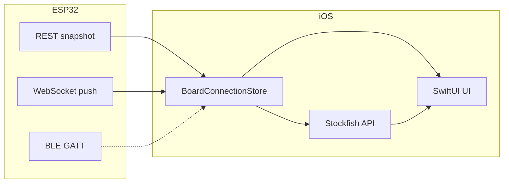

# CZECHMATE — Komplexní plán dodělání (iOS + ESP32)

> **Účel:** Seřídit zbývající práci po současném stavu kódu; doplňuje [CZECHMATE_MASTERPLAN.md](./CZECHMATE_MASTERPLAN.md) konkrétními „hotovo / zbývá“ a prioritami.  
> **Datum:** 2026-04-06

---

## 1. Princip: co je zdroj pravdy

| Vrstva | Role |
|--------|------|
| **ESP32** (`game_task`, matrix, LED) | Pravidla hry, fyzická deska, LED, časovače v logice firmware |
| **Web server** (`web_server_task`) | REST + WS broadcast stavu, `hint_highlight` / `hint_clear` |
| **iOS** | UI, Stockfish přes **chess-api.com**, zrcadlení stavu, ovládání nápovědy na desku |
| **Budoucí BLE** | Stejný kontrakt příkazů jako web/REST, jiný transport |

---

## 2. Stav implementace (k datu plánu)

### 2.1 iOS aplikace — hotovo nebo částečně

| Oblast | Stav | Poznámka |
|--------|------|------------|
| REST `GET /api/game/snapshot`, ETag / 304 | ✅ | `ChessboardAPIClient` |
| WebSocket `ws://…/ws` | ✅ | Primární push; REST watchdog ~25 s |
| `BoardConnectionStore` | ✅ | `BoardTransport` (Wi‑Fi / BLE / mock), `BoardDiscoveryView`, Bonjour výběr bez ruční IP, hint přes aktivní transport |
| Nativní šachovnice, časovače, onboarding, oprávnění | ✅ | Základní UX + rank/file popisky |
| Stockfish + `hint_highlight` / `hint_clear` | ✅ | Parita s webem; kontrola `NWPathMonitor` u nápovědy |
| Po-tahová analýza (Stockfish) | ✅ | Omezení hloubkou |
| App Icon | ⚠️ | Upscal 320→1024; ideálně dodat nativní 1024 |
| Tab bar, Puzzle, Statistiky | ✅ | `MainTabView`: Hra, Analýza, Puzzle (Lichess daily API), Statistiky, Nastavení |
| Jas LED přes API | ✅ | `POST /api/settings/brightness` |
| BLE jako transport | ⚠️ | iOS: GATT klient + chunk JSON; ESP: NimBLE v `ble_nimble_impl.c` při `CONFIG_BT_ENABLED` (nutný `idf.py fullclean` po změně defaults) |
| Bonjour / mDNS | ✅ | iOS: `_http._tcp` browse + resolve; ESP: `mdns_service_add` + hostname `czechmate-XXXXXX` |
| Core Data / historie her | ❌ | UserDefaults + `StatsRecorder` (jednoduché počty) |
| iPad layout / Mac Catalyst | ⚠️ | Nutný cílený test |
| watchOS | ⚠️ | Pokud target existuje — ověřit parity s WC |
| CI iOS build | ✅ | `.github/workflows/ios.yml` |

### 2.2 Firmware / ESP — hotovo nebo částečně

| Oblast | Stav | Poznámka |
|--------|------|------------|
| REST snapshot + timer/status JSON | ✅ | Sladěno s iOS modely |
| WS broadcast při změně hry | ✅ | + watchdog; staging log počtu WS klientů při broadcastu |
| `game_state_notify` → push | ✅ | Méně „slepých“ intervalů |
| `ble_task` + `ble_nimble_impl.c` | ⚠️ | GATT služba + notify snapshot (chunk CM); zapnutí přes `CONFIG_BT_ENABLED` v sdkconfig |
| mDNS na ESP | ✅ | `czechmate_mdns_ensure_started` po startu HTTP serveru |
| Binární BOARD_STATUS přes BLE (MTU) | ❌ | Masterplan počítá s kompaktním formátem |
| Úplná ochrana: max klientů WS, heap pod zátěží | ⚠️ | Průběžné testy |
| OTA / web flasher z appky | ❌ | Není v MVP |

---

## 3. Fáze dodělání (doporučené pořadí)

### Fáze A — Stabilizace „jedna WiFi, jedna app“ (krátkodobě, vysoká priorita)

**iOS**

1. **Diagnostika připojení** — jeden řádek stavu: `WS: živý / mrtvý`, `REST: poslední OK`, `URL`, případně RTT (staging).
2. **Vynucení chyb** — když snapshot nepřijde > N s, jednoznačná hláška (ne jen spinner); respektovat Local Network permission.
3. **Nastavení URL** — validace, trim, test tlačítko „Ping“ na `/api/game/snapshot` bez spuštění celého WS.
4. **Ikona** — nahradit `AppIcon-1024.png` finálním 1024×1024 bez upscale artefaktů.

**ESP**

1. Potvrdit konfiguraci: **jedna pravda** pro JSON snapshotu (žádné rozštěpené klíče mezi webem a API).
2. Logy (staging): počet WS klientů, poslední broadcast, chyby enqueue.

**Výstup:** uživatel vždy ví, jestli je problém síť, oprávnění, nebo firmware.

---

### Fáze B — Herní UX na úrovni „denní použití“

**iOS**

1. **Tab navigace** podle [CZECHMATE_IOS_APP_DESIGN.md](./CZECHMATE_IOS_APP_DESIGN.md): Hra | Analýza (souhrn partie) | Puzzle (placeholder → API) | Statistiky | Nastavení.
2. **Hra:** dokončit animace tahů (volitelně `matchedGeometryEffect`), rank labels + file, lepší dark mode.
3. **Nastavení:** jas (`/api/...` pokud existuje), přepínač WS, hloubka Stockfish, přepínač eval.
4. **Offline režim:** když není internet → jasná hláška u nápovědy a analýzy; deska z LAN může fungovat dál.

**ESP**

1. Žádná nutná změna pro základ; případně lehké endpointy pro prefs, pokud je web už má.

---

### Fáze C — BLE end-to-end (střední priorita, vysoká složitost)

**ESP**

1. Dokončit **GATT mapu**: služba CZECHMATE, charakteristiky pro stav (binární nebo zkrácený JSON), write pro příkazy (`NEW`, `RESET`, případně hint pipeline).
2. **Fronta do `game_task`** — stejná jako z webu/UART; žádná duplicitní šachová logika v BLE handleru.
3. Testy: dlouhá partie, současně WiFi + BLE, měření heap.

**iOS**

1. Scan → connect → subscribe → merge dat do `BoardConnectionStore` (**jeden zdroj** s REST/WS: priorita nebo přepínač transportu).
2. Info.plist: Bluetooth + případně background central.
3. Fallback: pokud BLE spadne → automaticky WiFi stejné URL (pokud dostupné).

---

### Fáze D — Produkt a ekosystém

**iOS**

1. Puzzle (Lichess API), lokální statistiky (Core Data nebo SQLite).
2. TestFlight, App Store metadata, lokalizace (cs/en minimálně).
3. Mac / iPad: adaptivní layout; ověření `navigationBarTitleDisplayMode` apod.

**Projekt / CI**

1. Udržovat [CZECHMATE_INTEGRATION_CHECKLIST.md](../reference/CZECHMATE_INTEGRATION_CHECKLIST.md) při změnách API.
2. Firmware CI (`scripts/idf_build.sh`) + iOS build v pipeline.

---

## 4. Matice závislostí (zjednodušeně)

- **Fáze A** neblokuje nic — základ důvěry.  
- **Fáze B** může běžet paralelně s dokončením BLE specifikace.  
- **Fáze C** vyžaduje stabilní kontrakt na ESP i paritu v iOS store.  
- **Fáze D** až po stabilním „Hra + síť“.

---

## 5. Rizika a pozorování

| Riziko | Akce |
|--------|------|
| Dvě cesty (internet + LAN) selžou nezávisle | UX kopírovat z webu; jedna obrazovka „Diagnostika“ |
| chess-api limity / ToS | Sledovat chyby 429; případně vlastní proxy později |
| BLE + WiFi současně na ESP | Masterplan §6 — heap, priority tasků |
| Přehnaný JSON na MCU | Udržet WS payload minimální; 304 na REST |

---

## 6. Minimální Definition of Done (MVP „hotová app“)

- [ ] Připojení k desce bez webového prohlížeče; jasný stav připojení.
- [ ] Šachovnice + časy + historie v souladu se snapshotem.
- [ ] Nápověda a zrušení hintu konzistentní s webem.
- [ ] Firmware WS + REST stabilní při běžné hře (checklist).
- [ ] TestFlight build s finální ikonou 1024px.
- [ ] Dokumentace aktualizovaná (tento soubor + masterplan verze).

---

## 7. Související soubory v repu

| Soubor | Obsah |
|--------|--------|
| [CZECHMATE_MASTERPLAN.md](./CZECHMATE_MASTERPLAN.md) | Architektura, fáze 0–4, Stockfish tok |
| [CZECHMATE_IOS_APP_DESIGN.md](./CZECHMATE_IOS_APP_DESIGN.md) | UI obrazovky, BLE návrh |
| [CZECHMATE_PROJECT_ANALYSIS.md](./CZECHMATE_PROJECT_ANALYSIS.md) | Firmware tasky, API |
| [CZECHMATE_INTEGRATION_CHECKLIST.md](../reference/CZECHMATE_INTEGRATION_CHECKLIST.md) | Rychlá ověření integrace |

---

*Tento dokument pravidelně aktualizuj při dokončení fází (tabulky §2 a checklist §6).*
