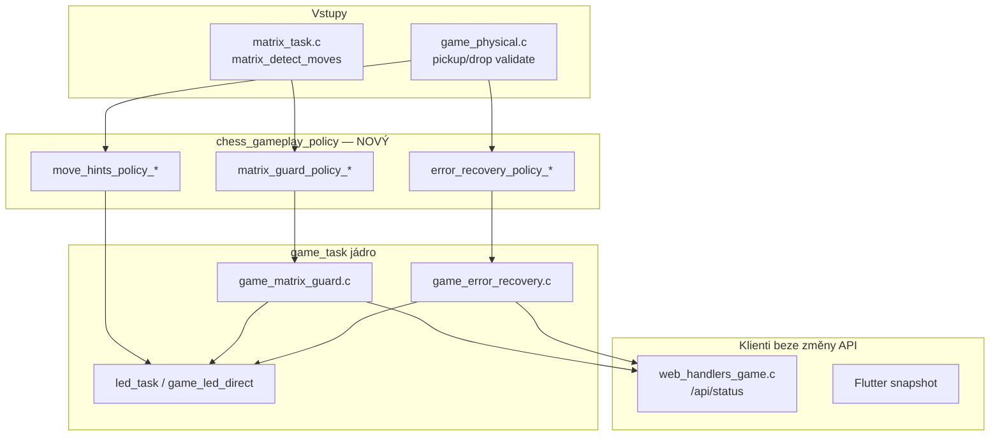
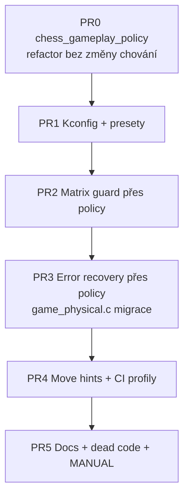

# Plán v2: Volitelné herní funkce přes menuconfig

**Verze:** 2.0 (2026-07-10)  
**Cíl:** Zapínat/vypínat **jednotlivě** error handling, lock hry a barevné LED (modrá/žlutá/červená) přes `idf.py menuconfig`, bez rozbití JSON API pro Flutter/web.  
**Vzor:** `CONFIG_CHESS_ENABLE_WEB_SERVER`, `CONFIG_CHESS_ENABLE_TEST_TASK`  
**Související:** [MATRIX_GUARD.md](MATRIX_GUARD.md) · [CZECHMATE_INTEGRATION_CHECKLIST.md](CZECHMATE_INTEGRATION_CHECKLIST.md)

---

## 0. Executive summary

Dnes jsou „lock hry“ a LED feedback **rozptýlené** v `game_physical.c`, `game_matrix_guard.c`, `game_error_recovery.c` a `matrix_task.c`. Přímé obalení `#if CONFIG_*` na 30+ místech je křehké.

**Doporučený přístup:**

1. **PR0** — tenká vrstva `chess_gameplay_policy` (runtime no-op funkce, vždy zapnuté).
2. **PR1** — Kconfig + presety + policy přepíná chování na jednom místě.
3. **PR2–4** — postupně přesunout volání do policy; matrix guard → error recovery → move hints.

Výsledek: menuconfig mění **politiku**, ne 40 `#if` v `game_physical.c`.

---

## 1. Taxonomie — co uživatel vlastně vypíná

Každá funkce má **3 nezávislé osy** (dají se kombinovat):

| Osa | Význam | Příklad |
|-----|--------|---------|
| **D — Detection** | FW detekuje problém | Matrix ≠ logika; nelegální tah |
| **L — Lock** | Hra pozastaví tahový flow | `freeze_move_flow`; `waiting_for_move_correction` |
| **V — Visual (LED)** | Barevná nápověda na desce | Modrá = černá figurka / legální tah |

```
Příklad kombinací:
  D+L+V  = plný produkt (default)
  D+L    = lock bez LED (tichý režim pro klub s jasným displejem v app)
  D+V    = varování bez locku (nebezpečné u guard — ghost tahy)
  D only   = jen log + JSON flag, bez LED a bez locku (factory / dev)
```

### 1.1 Přehled subsystémů

| ID | Název | D | L | V (barvy) | Primární soubory |
|----|-------|---|---|-----------|------------------|
| **MG** | Matrix guard | `matrix_task.c` | `game_matrix_guard.c` | žlutá / **modrá** / oranžová / bílá | `game_matrix_guard_render_leds()` |
| **ER** | Error recovery (nelegální tah) | `game_physical.c`, `game_error_recovery.c` | `error_recovery_state` | červená lock + **modrá** validní tahy | `game_handle_invalid_move()` + **5× přímé nastavení v `game_physical.c`** |
| **MH** | Move hints (normální hra) | — | — | **modrá** legální tahy, rosada, promotion | `game_highlight_movable_pieces()` (~15 call sites) |
| **UE** | UART error text | — | — | — (jen UART) | `print_error_detail()` v `game_task.c` |
| **VES** | Visual Error System | volitelné | volitelné | vlastní | `components/visual_error_system/` — **téměř odpojené** |

**Důležité:** „Modré LED“ ≠ jedna věc — uživatel může myslet MG modrou, ER modrou nebo MH modrou. Kconfig je **musí** oddělit.

---

## 2. Architektura (cílový stav)



### 2.1 Nový modul `chess_gameplay_policy`

| Soubor | Účel |
|--------|------|
| `components/game_task/include/chess_gameplay_policy.h` | Veřejné API + Kconfig makra |
| `components/game_task/chess_gameplay_policy.c` | Implementace presetů, boot log |

**Ukázkové API (návrh):**

```c
bool chess_policy_matrix_guard_enabled(void);
bool chess_policy_matrix_guard_should_freeze(void);
bool chess_policy_matrix_guard_led_enabled(void);
void chess_policy_matrix_guard_apply_colors(uint8_t row, uint8_t col, piece_t piece, uint8_t phys_occ);

bool chess_policy_error_recovery_enabled(void);
bool chess_policy_error_recovery_should_lock(void);
bool chess_policy_error_recovery_should_mutate_board(void);
void chess_policy_error_recovery_on_invalid_move(move_error_t err, const chess_move_t *mv);

bool chess_policy_move_hints_legal_blue(void);
void chess_policy_highlight_movable_if_enabled(void);
```

**Pravidlo:** `game_physical.c` **nesmí** přímo nastavovat `waiting_for_move_correction` — jen přes `chess_policy_error_recovery_enter(...)`.

---

## 3. Inventář hook pointů (audit repa)

### 3.1 Matrix guard (MG)

| Priorita | Soubor : funkce | Co dělá | Kconfig osa |
|----------|-----------------|---------|-------------|
| P0 | `matrix_task.c` : `matrix_send_guard_command()` | Jediný vstup guard do `game_task` | D — když OFF, return hned |
| P0 | `game_matrix_guard.c` : `game_matrix_guard_handle_command()` | Aktivuje pause + freeze | D+L |
| P0 | `game_matrix_guard.c` : `game_matrix_guard_render_leds()` | Barevné LED | V |
| P1 | `game_matrix_guard.c` : `game_matrix_guard_try_clear_from_matrix()` | Auto-clear po srovnání | L (podmíněně) |
| P1 | `game_matrix_guard.c` : `game_matrix_guard_check_resync_after_restore()` | NVS boot resync | D |
| P1 | `game_dispatch.c` : po tahu | `try_clear` + `highlight_movable` | L + MH |
| P2 | `game_physical.c` : pickup/drop | early return když guard active | — |
| P2 | `uart_handlers_game.c` : `GUARD_CLEAR` | force clear | vždy povoleno (záchrana) |
| P2 | `web_handlers_game.c` : `guard_clear` | HTTP clear | vždy povoleno |

**JSON export:** `matrix_guard_active` je v `web_handlers_game.c` (ne `game_json_export.c`).

### 3.2 Error recovery (ER) — složitější než v1 plánu

| Priorita | Soubor : funkce | Poznámka |
|----------|-----------------|----------|
| P0 | `game_error_recovery.c` : `game_handle_invalid_move()` | Hlavní cesta z validace |
| P0 | `game_physical.c` | **≥5 míst** přímo nastavuje `waiting_for_move_correction` (pickup/drop recovery, opponent return, guided capture) |
| P1 | `game_physical.c` : řádky ~311–393 | Modrá + žlutá při pickup z červeného pole |
| P1 | `game_task.c` : `game_show_invalid_move_error_with_blink()` | Alternativní červené blikání |
| P1 | `game_json_export.c` | Export `error_state.active` (ne `error_recovery`) |

**Kritický závěr:** Stačí **neobalit** jen `game_handle_invalid_move()` — většina lock logiky je v `game_physical.c`. Proto PR0 policy vrstva.

### 3.3 Move hints (MH)

| Call site (výběr) | Kontext |
|-------------------|---------|
| `game_dispatch.c` | Po guard clear |
| `game_physical.c` | Po validním tahu (~10×) |
| `game_castling.c` | Po rosadě |
| `game_promotion.c` | Modrá promotion UI |
| `led_task.c` | Volá `game_highlight_movable_pieces()` |
| `game_error_recovery.c` | Po recovery |

**Doporučení:** Jediný veřejný vstup `chess_policy_highlight_movable_if_enabled()` — interně volá `game_highlight_movable_pieces()`.

### 3.4 Mrtvý / duplicitní kód (úklid ve fázi 4)

| Symbol | Stav |
|--------|------|
| `game_handle_invalid_move_smart()` | **Odstraněno** v PR #22 — nahrazeno `chess_gameplay_policy` + `game_handle_invalid_move()` |
| `visual_error_system` | Linkováno, minimální integrace s ER → compile-out volitelně |

---

## 4. Menuconfig — vylepšená struktura

### 4.1 Presety (choice) — hlavní UX vylepšení

Uživatel nejdřív vybere **profil**, pak může ručně přepsat podvolby:

```
choice CHESS_GAMEPLAY_PROFILE
    prompt "Gameplay safety profile"
    default CHESS_GAMEPLAY_PROFILE_FULL

config CHESS_GAMEPLAY_PROFILE_FULL
    bool "Full (production — guard + error lock + hints)"
config CHESS_GAMEPLAY_PROFILE_DEV
    bool "Developer (no matrix guard, keep error hints)"
config CHESS_GAMEPLAY_PROFILE_LITE
    bool "Lite (no guard, no error lock, minimal LED)"
config CHESS_GAMEPLAY_PROFILE_FACTORY
    bool "Factory test (detection log only, no lock, no LED)"
```

**Mapování preset → volby:**

| Preset | MG D+L+V | ER D+L+V | MH blue | UART verbose |
|--------|----------|----------|---------|--------------|
| FULL | ✅✅✅ | ✅✅✅ | ✅ | ✅ |
| DEV | ❌ | ✅✅✅ | ✅ | ✅ |
| LITE | ❌ | ✅❌❌ | ❌ | ❌ |
| FACTORY | ❌ | ✅❌❌ | ❌ | ❌ |

Preset se aplikuje v `chess_gameplay_policy.c` při bootu (`ESP_LOGI` jednou).

### 4.2 Granulární přepínače (pod menu, `depends on !PRESET locked`)

```
menu "CzechMate firmware"
├── CHESS_ENABLE_TEST_TASK          (existuje)
├── CHESS_ENABLE_WEB_SERVER         (existuje)
└── menu "Gameplay safety & LED"
    ├── CHESS_GAMEPLAY_PROFILE      (choice §4.1)
    │
    ├── menu "Matrix guard"
    │   ├── CHESS_MG_ENABLE              default y
    │   ├── CHESS_MG_FREEZE_MOVES        default y  depends on ENABLE
    │   ├── CHESS_MG_AUTO_CLEAR          default y  depends on ENABLE
    │   ├── CHESS_MG_NVS_RESYNC          default y  depends on ENABLE
    │   └── menu "Matrix guard LED colors"
    │       ├── CHESS_MG_LED_ENABLE      default y  depends on ENABLE
    │       ├── CHESS_MG_LED_WHITE_YELLOW default y
    │       ├── CHESS_MG_LED_BLACK_BLUE  default y  ← „modrá“ u guardu
    │       ├── CHESS_MG_LED_GHOST_ORANGE default y
    │       └── CHESS_MG_LED_MISSING_WHITE default y
    │
    ├── menu "Invalid move recovery"
    │   ├── CHESS_ER_ENABLE              default y
    │   ├── CHESS_ER_LOCK_GAME           default y  depends on ENABLE
    │   ├── CHESS_ER_MUTATE_BOARD        default y  depends on ENABLE
    │   ├── CHESS_ER_LED_RED_PERSIST     default y  depends on ENABLE
    │   ├── CHESS_ER_LED_RED_BLINK       default y  depends on ENABLE
    │   └── CHESS_ER_LED_VALID_BLUE      default y  depends on ENABLE  ← modrá nápověda po chybě
    │
    ├── menu "Move hints (normal play)"
    │   ├── CHESS_MH_ENABLE              default y
    │   ├── CHESS_MH_LEGAL_MOVES_BLUE    default y
    │   ├── CHESS_MH_CASTLING_BLUE       default y
    │   └── CHESS_MH_PROMOTION_BLUE      default y
    │
    └── menu "Diagnostics"
        ├── CHESS_DIAG_UART_ERROR_DETAIL default y
        └── CHESS_ENABLE_VISUAL_ERROR_SYSTEM default n  (compile-out komponenty)
```

**Zkrácený prefix:** `CHESS_MG_` / `CHESS_ER_` / `CHESS_MH_` místo dlouhých `CHESS_MATRIX_GUARD_`.

---

## 5. JSON / BLE kontrakt (neměnit názvy polí)

| Pole | Zdroj | Když feature OFF |
|------|-------|------------------|
| `matrix_guard_active` | `web_handlers_game.c` | vždy `false` |
| `matrix_guard_conflicts` | stejné | `0` |
| `matrix_guard_*_mask_*` | stejné | `0` |
| `error_state.active` | `game_json_export.c` | vždy `false` |
| `error_state.invalid_pos` | stejné | `""` |
| `restore_state.resync_required` | stejné | `false` pokud MG_NVS_RESYNC off |
| `matrix_occupied[]` | opening/puzzle | beze změny |

Flutter `MatrixGuardBanner` a web `matrix_guard.js` **nepotřebují úpravu**, pokud držíme kontrakt.

**Volitelné v2:** přidat `gameplay_profile` string do status JSON (read-only info z Kconfig) — ne blocker.

---

## 6. Interakce s ostatními režimy

| Režim | Dnes | Po změně |
|-------|------|----------|
| Opening trainer (virtual) | `game_task_matrix_guard_mode_conflict_active()` guard ignoruje | Beze změny — conflict active i když MG_ENABLE=off |
| Opening (physical) | Guard může aktivovat při ghost | DEV preset = guard off → **pozor**, jen pro vývoj |
| Puzzle / setup | conflict active | Beze změny |
| Board setup tutorial | conflict active | Beze změny |
| Castling animace | conflict active | Beze změny |

**Pravidlo:** `mode_conflict_active()` **nezávisí** na Kconfig — speciální režimy nikdy nespouští MG, i když je MG zapnutý.

---

## 7. Build profily a CI

| Profil soubor | Kombinace | Účel |
|---------------|-----------|------|
| `sdkconfig.defaults` | FULL | Produkce |
| `sdkconfig.defaults.ble_only` | existuje | BLE transport |
| `sdkconfig.defaults.gameplay_lite` | LITE preset | Menší „šum“ LED, factory |
| `sdkconfig.defaults.gameplay_dev` | DEV preset | Opening HW dev bez guard |

```bash
# Produkce (beze změny)
idf.py build

# Lite gameplay
idf.py -D SDKCONFIG_DEFAULTS="sdkconfig.defaults;sdkconfig.defaults.gameplay_lite" build

# BLE + lite
idf.py -D SDKCONFIG_DEFAULTS="sdkconfig.defaults;sdkconfig.defaults.ble_only;sdkconfig.defaults.gameplay_lite" build
```

**CI jobs (navrhované):**

| Job | Profil | Ověří |
|-----|--------|-------|
| `firmware-build` (existuje) | default FULL | regrese produkce |
| `firmware-build-ble-only` (existuje) | ble_only | linker |
| `firmware-build-gameplay-lite` (nový) | gameplay_lite | Kconfig combinatorics |

---

## 8. Fáze implementace (revidované PR)



### PR0 — Policy vrstva (chování identické) ⭐ nejdůležitější

- Přidat `chess_gameplay_policy.c/h` — všechny funkce zatím `return true` / delegují 1:1.
- Nahradit **5 přímých** `waiting_for_move_correction =` v `game_physical.c` jedním voláním policy.
- Žádný Kconfig — čistý refactor, snadný review.

**Gate:** `idf.py build` + existující flutter testy + HW smoke beze změny.

### PR1 — Kconfig skeleton

- `main/Kconfig.projbuild` — profily + granulární volby §4.2.
- Policy čte `CONFIG_*`; default FULL = dnešní chování.
- Boot log: `Gameplay profile: FULL (MG=y ER=y MH=y)`.

### PR2 — Matrix guard

- `matrix_send_guard_command` → policy gate.
- `render_leds` → barvy přes `chess_policy_matrix_guard_apply_colors`.
- `game_is_matrix_guard_active()` → false když MG_ENABLE=n.

### PR3 — Error recovery (nejnáročnější)

- `game_handle_invalid_move` → policy.
- Všechny větve v `game_physical.c` → policy enter/exit.
- `error_state` JSON jen když ER_ENABLE.

### PR4 — Move hints + úklid

- `chess_policy_highlight_movable_if_enabled()` na všech call sites (mechanický replace).
- Smazat `game_handle_invalid_move_smart`.
- `sdkconfig.defaults.gameplay_*` + CI job.

### PR5 — Dokumentace

- [MATRIX_GUARD.md](MATRIX_GUARD.md) — sekce menuconfig + preset tabulka.
- [MANUAL_TEST_CHECKLIST.md](../testing/MANUAL_TEST_CHECKLIST.md) — scénáře pro FULL vs LITE.
- UART `CONFIG` read-only dump (volitelně).

---

## 9. Nebezpečné kombinace (dokumentovat v Kconfig help)

| Kombinace | Riziko |
|-----------|--------|
| MG_ENABLE=n + produkční provoz | Ghost figurky bez pause — hráč zmaten |
| ER_LOCK=n + ER_MUTATE=y | Figurka na špatném poli v logice, ale hra pokračuje |
| ER_ENABLE=n | Nelegální tah jen UART text — fyzická deska může být jinde než app |
| MH off + ER_LED_VALID_BLUE on | Nekonzistentní — valid blue jen v ER větvích |
| VES on + ER on | Dva paralelní error systémy — nedoporučeno |

**Doporučení:** Kconfig `select` / `depends on` zabránit rozbitým kombinacím (např. `ER_LED_VALID_BLUE depends on ER_ENABLE`).

---

## 10. Testovací matice

| ID | Scénář | Profil | Očekávání |
|----|--------|--------|-----------|
| T-MG1 | Zvednout 2 figurky | FULL | guard active, žlutá/modrá LED |
| T-MG2 | Stejné | DEV | žádný guard, tahy pokračují (log warning) |
| T-ER1 | Nelegální tah e2e4→e2e5 (bílý) | FULL | červené pole, lock, modré po pickup |
| T-ER2 | Stejné | LITE | JSON chyba, bez LED, bez locku |
| T-MH1 | Po validním tahu | FULL | modré legální tahy |
| T-MH2 | Po validním tahu | LITE | žádné modré hinty |
| T-API1 | `/api/status` | všechny | pole přítomná, typy stejné |
| T-OP1 | Opening virtual checkpoint | FULL | guard se neaktivuje (conflict) |
| T-CI1 | 3 build profily | CI | všechny green |

---

## 11. Definition of done (v2)

| # | Kritérium |
|---|-----------|
| G1 | Preset FULL = bit-identické chování s `main` před změnou |
| G2 | `game_physical.c` nemá přímé `waiting_for_move_correction =` mimo policy |
| G3 | Jedno místo pro MG LED barvy (`apply_colors`) |
| G4 | 3 sdkconfig profily + 3 CI build joby |
| G5 | Dokumentace + MANUAL checklist |
| G6 | Flutter/web bez změn (JSON kontrakt) |

---

## 12. Mimo scope v2.0 (backlog)

| Položka | Důvod odložení |
|---------|----------------|
| Runtime přepínání přes NVS / web | Jiný projekt — „Feature flags runtime“ |
| Per-user preference ve Flutter | Vyžaduje runtime na FW nebo app-only hints |
| Sjednocení VES + ER | Větší refactor |
| Web lock (`web_is_locked`) | Jiná doména (API security) |

---

## 13. Rychlý start pro vývojáře

```bash
idf.py menuconfig
# CzechMate firmware → Herní bezpečnost a LED nápovědy
#   Preset → DEV (bez matrix guardu)
#   nebo ručně: ① Matrix guard → [ ] Detekovat nesoulad

idf.py fullclean reconfigure build flash monitor
```

UART po bootu (cíl):

```
I (1234) GAMEPLAY_POLICY: profile=DEV mg=off er=on lock=on mh=on
```

---

*Plán v2.0 — implementováno v PR #20–#21. PR5 docs v PR #22. Navazuje na PR #19 (superseded).*
