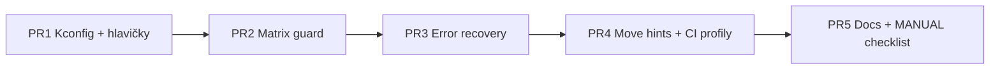

# Plán: Volitelné herní funkce přes menuconfig

**Verze:** 1.0 (2026-07-10)  
**Cíl:** Umožnit v `idf.py menuconfig` **zapínat/vypínat jednotlivé chování** — zejména error handling a „lock hry“ s barevnými LED (žlutá/modrá/oranžová při matrix guard, modrá při nápovědě tahů, červená při chybě).  
**Vzor v repu:** `CONFIG_CHESS_ENABLE_WEB_SERVER`, `CONFIG_CHESS_ENABLE_TEST_TASK` v `main/Kconfig.projbuild`.

---

## 1. Proč to dělat

| Potřeba | Příklad |
|---------|---------|
| **Vývoj / debug** | Vypnout matrix guard při ladění opening traineru (virtuální soupeř) |
| **Tovární test** | Minimální FW — jen logika, bez LED feedbacku |
| **Klub / začátečníci** | Plný error handling + guard zapnutý (default) |
| **Flash/RAM** | Vypnout `visual_error_system` nebo verbose UART texty |
| **Parita s build profily** | BLE-only + „lite gameplay“ profil |

**Rozhodnutí:** compile-time Kconfig (ne runtime NVS) — konzistentní s existující architekturou, žádný overhead v hot path, jasné CI profily.

---

## 2. Inventář — co dnes existuje (a co uživatel myslí)

### 2.1 Matrix guard — „lock hry“ s modrými/žlutými LED

| Vlastnost | Kde | Chování |
|-----------|-----|---------|
| Detekce nesouladu matice vs `board[]` | `matrix_task.c` → `GAME_CMD_MATRIX_GUARD` | Pošle guard do `game_task` |
| Pozastavení hry | `game_matrix_guard.c` | `matrix_guard_pause_state.active`, `game_task_matrix_guard_freeze_move_flow()` |
| Barevné LED | `game_matrix_guard_render_leds()` | **Žlutá** = bílá figurka nesedí, **Modrá** = černá figurka nesedí, **Oranžová** = ghost, **Bílá** = chybí figurka |
| Auto-clear po srovnání | `game_matrix_guard_try_clear_from_matrix()` | ~2 s klid → pokračuje |
| Vynucené clear | UART `GUARD_CLEAR`, HTTP `POST /api/game/guard_clear` | `game_force_clear_matrix_guard()` |
| Výjimky | `game_task_matrix_guard_mode_conflict_active()` | Opening, puzzle, rosada, promotion… guard se **neaktivuje** |

**Dokumentace:** [MATRIX_GUARD.md](MATRIX_GUARD.md)

### 2.2 Error handling nelegálního tahu — červený lock + modré nápovědy

| Vlastnost | Kde | Chování |
|-----------|-----|---------|
| Hlavní entry | `game_handle_invalid_move()` v `game_error_recovery.c` | Voláno z `game_physical.c` při špatném tahu |
| Simulace HW | stejný soubor | Přesune figurku na neplatné pole v `board[]` |
| Červené LED | stejný soubor | Blikání + trvalé červené pole na cíli |
| **Lock hry** | `error_recovery_state.waiting_for_move_correction` | Hra čeká na zvednutí z červeného pole |
| Modré LED (validní tahy) | `game_highlight_valid_moves_for_piece()` | Při zvednutí z červeného pole — **modrá** = legální cíle |
| Alternativa (nepoužívaná) | `game_handle_invalid_move_smart()` | Zelený zdroj + červený cíl + modré tahy — **nikde se nevolá** |
| Červené blikání (starší) | `game_show_invalid_move_error_with_blink()` v `game_task.c` | Samostatná cesta, red blink 10× |

### 2.3 Běžná hra — modré LED (není lock, ale souvisí)

| Vlastnost | Kde |
|-----------|-----|
| Zvýraznění legálních tahů | `game_highlight_movable_pieces()`, `game_matrix_workflow.c`, `game_physical.c` |
| Rosada modře | `game_castling.c`, `game_physical.c` |
| Promotion modře | `game_promotion.c` |

→ Uživatel může chtít vypnout **jen guard modré**, **jen error modré**, nebo **všechny modré hinty**. Plán proto dělí přepínače jemně.

### 2.4 Ostatní (mimo primární scope, ale do menu)

| Modul | Soubor | Poznámka |
|-------|--------|----------|
| UART verbose chyby | `print_error_detail()` v `game_task.c` | Text Reason/Solution do konzole |
| Visual Error System | `components/visual_error_system/` | Samostatná komponenta, téměř nepropojená s `game_handle_invalid_move` |
| Web lock | `web_server_task.c` | NVS lock API — **není LED**, jiná doména |

---

## 3. Navrhovaná struktura menuconfig

```
menu "CzechMate firmware"
    ├── (existující) CHESS_ENABLE_TEST_TASK
    ├── (existující) CHESS_ENABLE_WEB_SERVER
    │
    └── menu "Gameplay feedback & safety"
            │
            ├── menu "Matrix guard (fyzická vs logická deska)"
            │     ├── CHESS_MATRIX_GUARD_ENABLE          [default y]
            │     ├── CHESS_MATRIX_GUARD_LED_ENABLE      [default y, depends on ENABLE]
            │     ├── CHESS_MATRIX_GUARD_LED_BLACK_BLUE  [default y]  # modrá pro černé
            │     ├── CHESS_MATRIX_GUARD_LED_WHITE_YELLOW[default y]  # žlutá pro bílé
            │     ├── CHESS_MATRIX_GUARD_LED_GHOST_ORANGE[default y]
            │     ├── CHESS_MATRIX_GUARD_LED_MISSING_WHITE[default y]
            │     ├── CHESS_MATRIX_GUARD_FREEZE_MOVES    [default y]  # lock tahů
            │     ├── CHESS_MATRIX_GUARD_AUTO_CLEAR      [default y]  # try_clear po srovnání
            │     └── CHESS_MATRIX_GUARD_NVS_RESYNC      [default y]  # check po restore
            │
            ├── menu "Invalid move error recovery"
            │     ├── CHESS_ERROR_RECOVERY_ENABLE        [default y]
            │     ├── CHESS_ERROR_RECOVERY_LOCK_GAME     [default y]  # waiting_for_move_correction
            │     ├── CHESS_ERROR_RECOVERY_BOARD_MUTATE  [default y]  # simulace figurky na špatném poli
            │     ├── CHESS_ERROR_RECOVERY_LED_RED       [default y]  # červené pole + blink
            │     ├── CHESS_ERROR_RECOVERY_LED_VALID_BLUE[default y]  # modré legální tahy po pickup
            │     └── CHESS_ERROR_RECOVERY_UART_VERBOSE  [default y]  # print_error_detail
            │
            └── menu "Move hints (normální hra, bez chyby)"
                  ├── CHESS_MOVE_HINTS_ENABLE            [default y]
                  ├── CHESS_MOVE_HINTS_LEGAL_BLUE        [default y]  # highlight movable
                  └── CHESS_MOVE_HINTS_CASTLING_BLUE     [default y]  # rosada
```

### 3.1 Master přepínače (doporučené minimum pro v1)

Pokud chceš menší první PR, stačí **5 booleanů**:

| Kconfig | Efekt při `n` |
|---------|----------------|
| `CHESS_MATRIX_GUARD_ENABLE` | Guard se nikdy neaktivuje; matrix_task neposílá `GAME_CMD_MATRIX_GUARD` |
| `CHESS_MATRIX_GUARD_LED_ENABLE` | Guard logika běží, ale bez barevných LED (jen log + API flag) |
| `CHESS_ERROR_RECOVERY_ENABLE` | Nelegální tah = jen log + JSON chyba, bez LED a bez locku |
| `CHESS_ERROR_RECOVERY_LOCK_GAME` | LED ano, ale hra nepozastavena (`waiting_for_move_correction = false`) |
| `CHESS_MOVE_HINTS_LEGAL_BLUE` | Žádné modré zvýraznění legálních tahů v běžné hře |

Detailní barevné přepínače = **fáze 2**.

---

## 4. Implementační vzor (stejný jako web server)

### 4.1 Kconfig

- Soubor: `main/Kconfig.projbuild` — rozšířit existující menu `CzechMate firmware`.
- Po změně: `idf.py fullclean reconfigure build` (dokumentovat v help textu).

### 4.2 C kód — tenké guard vrstvy

Vytvořit **`components/game_task/include/chess_kconfig_features.h`**:

```c
#pragma once
#include "sdkconfig.h"

#define CHESS_FEATURE_MATRIX_GUARD()     (CONFIG_CHESS_MATRIX_GUARD_ENABLE)
#define CHESS_FEATURE_MATRIX_GUARD_LED() (CONFIG_CHESS_MATRIX_GUARD_ENABLE && CONFIG_CHESS_MATRIX_GUARD_LED_ENABLE)
#define CHESS_FEATURE_ERROR_RECOVERY()   (CONFIG_CHESS_ERROR_RECOVERY_ENABLE)
// ...
```

**Pravidla obalení:**

| Místo | Co udělat když feature OFF |
|-------|---------------------------|
| `matrix_task.c` — detekce anomálie | Neposílat `GAME_CMD_MATRIX_GUARD`; jen log (staging) |
| `game_matrix_guard_handle_command()` | Early return; žádný freeze |
| `game_matrix_guard_render_leds()` | No-op |
| `game_handle_invalid_move()` | Jen `ESP_LOGW` + UART/JSON message; **neměnit** `board[]` |
| `game_highlight_valid_moves_for_piece()` | No-op |
| `game_task_matrix_guard_mode_conflict_active()` | Beze změny (opening/puzzle výjimky zůstanou) |

### 4.3 API / JSON kontrakt

I při vypnutém guardu **neměnit názvy polí** v `/api/status`:

- `matrix_guard_active` → vždy `false` když guard disabled
- `error_recovery` / obdobná pole → prázdná nebo `active: false`

Flutter a web **nemusí vědět** o Kconfig — jen dostanou konzistentní JSON.

### 4.4 sdkconfig profily

| Soubor | Účel |
|--------|------|
| `sdkconfig.defaults` | Vše zapnuto (produkční default) |
| `sdkconfig.defaults.lite_gameplay` | Guard off, error recovery off, hints off |
| `sdkconfig.defaults.ble_only` | existující + volitelně lite gameplay |

CI job: `idf.py -D SDKCONFIG_DEFAULTS="sdkconfig.defaults;sdkconfig.defaults.lite_gameplay" build`

---

## 5. Fáze implementace (doporučené PR)



### PR 1 — Kconfig skeleton (~2 soubory + generated sdkconfig)

- Rozšířit `main/Kconfig.projbuild` (master přepínače §3.1).
- Přidat `chess_kconfig_features.h`.
- `sdkconfig.defaults` — explicitní `=y` u nových voleb.
- **Bez změny chování** — vše default `y`.

### PR 2 — Matrix guard

| Soubor | Změna |
|--------|-------|
| `matrix_task.c` | `#if CHESS_FEATURE_MATRIX_GUARD()` kolem odeslání guard cmd |
| `game_matrix_guard.c` | LED pod `CHESS_MATRIX_GUARD_LED_*`, freeze pod `FREEZE_MOVES` |
| `game_dispatch.c` | `try_clear` pod `AUTO_CLEAR` |
| `game_init.c` / restore | `NVS_RESYNC` |
| `game_json_export.c` | Beze změny struktury |

**Test:** HW nebo UART simulace — zvednout 2 figurky → guard on/off.

### PR 3 — Error recovery

| Soubor | Změna |
|--------|-------|
| `game_error_recovery.c` | Větvení v `game_handle_invalid_move()` |
| `game_physical.c` | Beze změny volání (logika uvnitř handleru) |
| `game_task.c` | `print_error_detail` pod `UART_VERBOSE`; blink pod recovery |
| `game_json_export.c` | Export `error_recovery` jen když ENABLE |

**Test:** Nelegální tah → s recovery červené pole; bez recovery okamžitě pokračuje.

### PR 4 — Move hints + CI

- `game_highlight_movable_pieces()` a castling blue pod Kconfig.
- `sdkconfig.defaults.lite_gameplay` + CI build job.
- Odstranit nebo označit `@deprecated` `game_handle_invalid_move_smart()` (mrtvý kód).

### PR 5 — Dokumentace

- Aktualizovat [MATRIX_GUARD.md](MATRIX_GUARD.md) — sekce „Vypnutí v menuconfig“.
- [OPENING_TRAINING_PLAN.md](OPENING_TRAINING_PLAN.md) §20 — guard lze vypnout pro HW test (ne pro produkci).
- `main/Kconfig.projbuild` help texty česky/anglicky.
- Volitelně: UART příkaz `CONFIG` jen read-only výpis aktivních flagů (bez runtime změny).

---

## 6. Rizika a mitigace

| Riziko | Mitigace |
|--------|----------|
| Guard vypnutý → ghost figurky nikdo neřeší | Default `y`; lite profil jen pro vývoj; varování v logu při startu |
| Error recovery vypnutý → nelegální tah „projde“ fyzicky ale ne logicky | FW stále **neprovede** tah v `board[]`; jen bez LED/locku |
| Opening trainer + guard off = matoucí | Opening režim má vlastní validaci; dokumentovat |
| Exploze počtu Kconfig voleb | Fáze 1 = 5 master switchů; barvy až fáze 2 |
| Flutter očekává guard banner | JSON `matrix_guard_active: false` — banner se neukáže (OK) |
| Dva error systémy (`visual_error_system` vs `game_error_recovery`) | Fáze 1 neřešit VES; fáze 3: `CONFIG_CHESS_ENABLE_VISUAL_ERROR_SYSTEM` compile-out celé komponenty |

---

## 7. Co **nedělat** v první iteraci

- Runtime přepínání přes NVS / web UI (jiný projekt — „Feature flags v2“).
- Slučovat matrix guard a error recovery do jednoho přepínače (různé use-cases).
- Měnit Flutter — není potřeba, dokud JSON kontrakt drží.
- Mazat `game_handle_invalid_move_smart` bez analýzy — nejdřív grep + deprecate.

---

## 8. Ověření (definition of done)

| # | Kritérium |
|---|-----------|
| T1 | `idf.py menuconfig` → sekce „Gameplay feedback & safety“ viditelná |
| T2 | Všechny volby default `y` → chování **identické** s dnešním `main` |
| T3 | Profil `lite_gameplay`: build OK, guard off → žádné barevné LED při ghost |
| T4 | Profil full: matrix guard HW scénář z [MANUAL_TEST_CHECKLIST.md](../testing/MANUAL_TEST_CHECKLIST.md) §B3 |
| T5 | CI: existující firmware build + nový lite job zelený |
| T6 | Dokumentace aktualizována |

---

## 9. Odhad rozsahu (technický, ne kalendářní)

| Fáze | Dotčené soubory | Invaze |
|------|-----------------|--------|
| PR1 | 2–3 | Minimální |
| PR2 | 4–5 | Střední (matrix_task + game_matrix_guard) |
| PR3 | 3–4 | Střední (error recovery hot path) |
| PR4 | 5–8 | Nízká–střední (rozptýlené highlighty) |
| PR5 | 3 docs | Minimální |

**Doporučený start:** PR1 + PR2 (matrix guard) — nejčastější požadavek u opening traineru a HW testů.

---

## 10. Rychlý příkaz pro vývojáře (cílový stav)

```bash
idf.py menuconfig
# CzechMate firmware
#   → Gameplay feedback & safety
#       → Matrix guard: [ ] Enable matrix guard
#       → Invalid move error recovery: [ ] Lock game until correction
#       → Move hints: [ ] Blue LEDs for legal moves

idf.py -D SDKCONFIG_DEFAULTS="sdkconfig.defaults;sdkconfig.defaults.lite_gameplay" build
```

---

*Plán v1.0 — připraven k implementaci. Navazuje na existující Kconfig vzor (`CHESS_ENABLE_WEB_SERVER`).*
