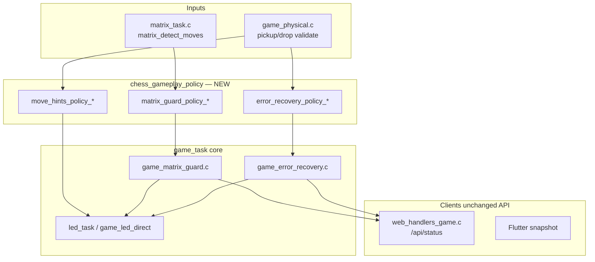
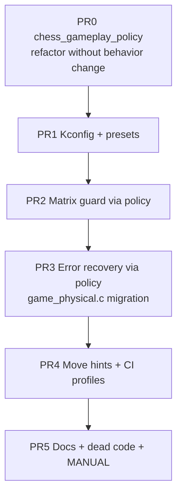

# Plan v2: Optional gameplay features via menuconfig

**Version:** 2.0 (2026-07-10)  
**Goal:** Toggle **individually** error handling, game lock, and colored LEDs (blue/yellow/red) via `idf.py menuconfig`, without breaking JSON API for Flutter/web.  
**Pattern:** `CONFIG_CHESS_ENABLE_WEB_SERVER`, `CONFIG_CHESS_ENABLE_TEST_TASK`  
**Related:** [MATRIX_GUARD.md](MATRIX_GUARD.md) · [CZECHMATE_INTEGRATION_CHECKLIST.md](CZECHMATE_INTEGRATION_CHECKLIST.md)

---

## 0. Executive summary

Today “game lock” and LED feedback are **scattered** across `game_physical.c`, `game_matrix_guard.c`, `game_error_recovery.c`, and `matrix_task.c`. Wrapping 30+ sites in `#if CONFIG_*` is fragile.

**Recommended approach:**

1. **PR0** — thin `chess_gameplay_policy` layer (runtime no-op functions, always on).
2. **PR1** — Kconfig + presets + policy switches behavior in one place.
3. **PR2–4** — gradually move calls into policy; matrix guard → error recovery → move hints.

Result: menuconfig changes **policy**, not 40 `#if` in `game_physical.c`.

---

## 1. Taxonomy — what the user actually disables

Each feature has **3 independent axes** (combinable):

| Axis | Meaning | Example |
|-----|--------|---------|
| **D — Detection** | FW detects problem | Matrix ≠ logic; illegal move |
| **L — Lock** | Game pauses move flow | `freeze_move_flow`; `waiting_for_move_correction` |
| **V — Visual (LED)** | Colored hint on board | Blue = black piece / legal move |

```
Example combinations:
  D+L+V  = full product (default)
  D+L    = lock without LED (quiet mode for club with clear app display)
  D+V    = warning without lock (risky with guard — ghost moves)
  D only = log + JSON flag only, no LED or lock (factory / dev)
```

### 1.1 Subsystem overview

| ID | Name | D | L | V (colors) | Primary files |
|----|-------|---|---|-----------|------------------|
| **MG** | Matrix guard | `matrix_task.c` | `game_matrix_guard.c` | yellow / **blue** / orange / white | `game_matrix_guard_render_leds()` |
| **ER** | Error recovery (illegal move) | `game_physical.c`, `game_error_recovery.c` | `error_recovery_state` | red lock + **blue** legal moves | `game_handle_invalid_move()` + **5× direct sets in `game_physical.c`** |
| **MH** | Move hints (normal play) | — | — | **blue** legal moves, castling, promotion | `game_highlight_movable_pieces()` (~15 call sites) |
| **UE** | UART error text | — | — | — (UART only) | `print_error_detail()` in `game_task.c` |
| **VES** | Visual Error System | optional | optional | own | `components/visual_error_system/` — **mostly disconnected** |

**Important:** “Blue LEDs” ≠ one thing — user may mean MG blue, ER blue, or MH blue. Kconfig **must** separate them.

---

## 2. Architecture (target state)


```mermaid
flowchart TB
  subgraph inputs [Inputs]
    MT[matrix_task.c\nmatrix_detect_moves]
    GP[game_physical.c\npickup/drop validate]
  end

  subgraph policy [chess_gameplay_policy — NEW]
    MG_P[matrix_guard_policy_*]
    ER_P[error_recovery_policy_*]
    MH_P[move_hints_policy_*]
  end

  subgraph core [game_task core]
    MGC[game_matrix_guard.c]
    ERC[game_error_recovery.c]
    LED[led_task / game_led_direct]
  end

  subgraph clients [Clients unchanged API]
    JSON[web_handlers_game.c\n/api/status]
    FL[Flutter snapshot]
  end

  MT --> MG_P
  GP --> ER_P
  GP --> MH_P
  MG_P --> MGC
  ER_P --> ERC
  MH_P --> LED
  MGC --> LED
  ERC --> LED
  MGC --> JSON
  ERC --> JSON
```

### 2.1 New module `chess_gameplay_policy`

| File | Purpose |
|--------|------|
| `components/game_task/include/chess_gameplay_policy.h` | Public API + Kconfig macros |
| `components/game_task/chess_gameplay_policy.c` | Preset implementation, boot log |

**Sample API (proposal):**

```c
bool chess_policy_matrix_guard_enabled(void);
bool chess_policy_matrix_guard_should_freeze(void);
bool chess_policy_matrix_guard_led_enabled(void);
void chess_policy_matrix_guard_apply_colors(uint8_t row, uint8_t col, piece_t piece, uint8_t phys_occ);

bool chess_policy_error_recovery_enabled(void);
bool chess_policy_error_recovery_should_lock(void);
bool chess_policy_error_recovery_should_mutate_board(void);
void chess_policy_error_recovery_on_invalid_move(move_error_t err, const chess_move_t *mv);

bool chess_policy_move_hints_legal_blue(void);
void chess_policy_highlight_movable_if_enabled(void);
```

**Rule:** `game_physical.c` **must not** set `waiting_for_move_correction` directly — only via `chess_policy_error_recovery_enter(...)`.

---

## 3. Hook point inventory (repo audit)

### 3.1 Matrix guard (MG)

| Priority | File : function | What it does | Kconfig axis |
|----------|-----------------|---------|-------------|
| P0 | `matrix_task.c` : `matrix_send_guard_command()` | Sole guard entry to `game_task` | D — when OFF, return immediately |
| P0 | `game_matrix_guard.c` : `game_matrix_guard_handle_command()` | Activates pause + freeze | D+L |
| P0 | `game_matrix_guard.c` : `game_matrix_guard_render_leds()` | Colored LEDs | V |
| P1 | `game_matrix_guard.c` : `game_matrix_guard_try_clear_from_matrix()` | Auto-clear after align | L (conditional) |
| P1 | `game_matrix_guard.c` : `game_matrix_guard_check_resync_after_restore()` | NVS boot resync | D |
| P1 | `game_dispatch.c` : after move | `try_clear` + `highlight_movable` | L + MH |
| P2 | `game_physical.c` : pickup/drop | early return when guard active | — |
| P2 | `uart_handlers_game.c` : `GUARD_CLEAR` | force clear | always allowed (rescue) |
| P2 | `web_handlers_game.c` : `guard_clear` | HTTP clear | always allowed |

**JSON export:** `matrix_guard_active` is in `web_handlers_game.c` (not `game_json_export.c`).

### 3.2 Error recovery (ER) — more complex than v1 plan

| Priority | File : function | Note |
|----------|-----------------|----------|
| P0 | `game_error_recovery.c` : `game_handle_invalid_move()` | Main path from validation |
| P0 | `game_physical.c` | **≥5 places** directly set `waiting_for_move_correction` (pickup/drop recovery, opponent return, guided capture) |
| P1 | `game_physical.c` : lines ~311–393 | Blue + yellow on pickup from red square |
| P1 | `game_task.c` : `game_show_invalid_move_error_with_blink()` | Alternate red blink |
| P1 | `game_json_export.c` | Export `error_state.active` (not `error_recovery`) |

**Critical conclusion:** Wrapping only `game_handle_invalid_move()` is **not enough** — most lock logic is in `game_physical.c`. Hence PR0 policy layer.

### 3.3 Move hints (MH)

| Call site (sample) | Context |
|-------------------|---------|
| `game_dispatch.c` | After guard clear |
| `game_physical.c` | After valid move (~10×) |
| `game_castling.c` | After castling |
| `game_promotion.c` | Blue promotion UI |
| `led_task.c` | Calls `game_highlight_movable_pieces()` |
| `game_error_recovery.c` | After recovery |

**Recommendation:** Single public entry `chess_policy_highlight_movable_if_enabled()` — internally calls `game_highlight_movable_pieces()`.

### 3.4 Dead / duplicate code (cleanup in phase 4)

| Symbol | Status |
|--------|------|
| `game_handle_invalid_move_smart()` | **Removed** in PR #22 — replaced by `chess_gameplay_policy` + `game_handle_invalid_move()` |
| `visual_error_system` | Linked, minimal ER integration → optional compile-out |

---

## 4. Menuconfig — improved structure

### 4.1 Presets (choice) — main UX improvement

User picks a **profile** first, then may override sub-options:

```
choice CHESS_GAMEPLAY_PROFILE
    prompt "Gameplay safety profile"
    default CHESS_GAMEPLAY_PROFILE_FULL

config CHESS_GAMEPLAY_PROFILE_FULL
    bool "Full (production — guard + error lock + hints)"
config CHESS_GAMEPLAY_PROFILE_DEV
    bool "Developer (no matrix guard, keep error hints)"
config CHESS_GAMEPLAY_PROFILE_LITE
    bool "Lite (no guard, no error lock, minimal LED)"
config CHESS_GAMEPLAY_PROFILE_FACTORY
    bool "Factory test (detection log only, no lock, no LED)"
```

**Preset → option mapping:**

| Preset | MG D+L+V | ER D+L+V | MH blue | UART verbose |
|--------|----------|----------|---------|--------------|
| FULL | ✅✅✅ | ✅✅✅ | ✅ | ✅ |
| DEV | ❌ | ✅✅✅ | ✅ | ✅ |
| LITE | ❌ | ✅❌❌ | ❌ | ❌ |
| FACTORY | ❌ | ✅❌❌ | ❌ | ❌ |

Preset applied in `chess_gameplay_policy.c` at boot (`ESP_LOGI` once).

### 4.2 Granular toggles (submenu, `depends on !PRESET locked`)

```
menu "CzechMate firmware"
├── CHESS_ENABLE_TEST_TASK          (exists)
├── CHESS_ENABLE_WEB_SERVER         (exists)
└── menu "Gameplay safety & LED"
    ├── CHESS_GAMEPLAY_PROFILE      (choice §4.1)
    │
    ├── menu "Matrix guard"
    │   ├── CHESS_MG_ENABLE              default y
    │   ├── CHESS_MG_FREEZE_MOVES        default y  depends on ENABLE
    │   ├── CHESS_MG_AUTO_CLEAR          default y  depends on ENABLE
    │   ├── CHESS_MG_NVS_RESYNC          default y  depends on ENABLE
    │   └── menu "Matrix guard LED colors"
    │       ├── CHESS_MG_LED_ENABLE      default y  depends on ENABLE
    │       ├── CHESS_MG_LED_WHITE_YELLOW default y
    │       ├── CHESS_MG_LED_BLACK_BLUE  default y  ← “blue” for guard
    │       ├── CHESS_MG_LED_GHOST_ORANGE default y
    │       └── CHESS_MG_LED_MISSING_WHITE default y
    │
    ├── menu "Invalid move recovery"
    │   ├── CHESS_ER_ENABLE              default y
    │   ├── CHESS_ER_LOCK_GAME           default y  depends on ENABLE
    │   ├── CHESS_ER_MUTATE_BOARD        default y  depends on ENABLE
    │   ├── CHESS_ER_LED_RED_PERSIST     default y  depends on ENABLE
    │   ├── CHESS_ER_LED_RED_BLINK       default y  depends on ENABLE
    │   └── CHESS_ER_LED_VALID_BLUE      default y  depends on ENABLE  ← blue hint after error
    │
    ├── menu "Move hints (normal play)"
    │   ├── CHESS_MH_ENABLE              default y
    │   ├── CHESS_MH_LEGAL_MOVES_BLUE    default y
    │   ├── CHESS_MH_CASTLING_BLUE       default y
    │   └── CHESS_MH_PROMOTION_BLUE      default y
    │
    └── menu "Diagnostics"
        ├── CHESS_DIAG_UART_ERROR_DETAIL default y
        └── CHESS_ENABLE_VISUAL_ERROR_SYSTEM default n  (compile-out component)
```

**Short prefix:** `CHESS_MG_` / `CHESS_ER_` / `CHESS_MH_` instead of long `CHESS_MATRIX_GUARD_`.

---

## 5. JSON / BLE contract (do not rename fields)

| Field | Source | When feature OFF |
|------|-------|------------------|
| `matrix_guard_active` | `web_handlers_game.c` | always `false` |
| `matrix_guard_conflicts` | same | `0` |
| `matrix_guard_*_mask_*` | same | `0` |
| `error_state.active` | `game_json_export.c` | always `false` |
| `error_state.invalid_pos` | same | `""` |
| `restore_state.resync_required` | same | `false` if MG_NVS_RESYNC off |
| `matrix_occupied[]` | opening/puzzle | unchanged |

Flutter `MatrixGuardBanner` and web `matrix_guard.js` **need no change** if contract is kept.

**Optional v2:** add `gameplay_profile` string to status JSON (read-only Kconfig info) — not a blocker.

---

## 6. Interaction with other modes

| Mode | Today | After change |
|-------|------|----------|
| Opening trainer (virtual) | `game_task_matrix_guard_mode_conflict_active()` ignores guard | Unchanged — conflict active even when MG_ENABLE=off |
| Opening (physical) | Guard may activate on ghost | DEV preset = guard off → **caution**, dev only |
| Puzzle / setup | conflict active | Unchanged |
| Board setup tutorial | conflict active | Unchanged |
| Castling animation | conflict active | Unchanged |

**Rule:** `mode_conflict_active()` **does not depend** on Kconfig — special modes never trigger MG even when MG is on.

---

## 7. Build profiles and CI

| Profile file | Combination | Purpose |
|---------------|-----------|------|
| `sdkconfig.defaults` | FULL | Production |
| `sdkconfig.defaults.ble_only` | exists | BLE transport |
| `sdkconfig.defaults.gameplay_lite` | LITE preset | Less LED “noise”, factory |
| `sdkconfig.defaults.gameplay_dev` | DEV preset | Opening HW dev without guard |

```bash
# Production (unchanged)
idf.py build

# Lite gameplay
idf.py -D SDKCONFIG_DEFAULTS="sdkconfig.defaults;sdkconfig.defaults.gameplay_lite" build

# BLE + lite
idf.py -D SDKCONFIG_DEFAULTS="sdkconfig.defaults;sdkconfig.defaults.ble_only;sdkconfig.defaults.gameplay_lite" build
```

**CI jobs (proposed):**

| Job | Profile | Verifies |
|-----|--------|-------|
| `firmware-build` (exists) | default FULL | production regression |
| `firmware-build-ble-only` (exists) | ble_only | linker |
| `firmware-build-gameplay-lite` (new) | gameplay_lite | Kconfig combinatorics |

---

## 8. Implementation phases (revised PRs)


```mermaid
flowchart TD
  P0[PR0 chess_gameplay_policy\nrefactor without behavior change]
  P1[PR1 Kconfig + presets]
  P2[PR2 Matrix guard via policy]
  P3[PR3 Error recovery via policy\ngame_physical.c migration]
  P4[PR4 Move hints + CI profiles]
  P5[PR5 Docs + dead code + MANUAL]
  P0 --> P1 --> P2 --> P3 --> P4 --> P5
```

### PR0 — Policy layer (identical behavior) ⭐ most important

- Add `chess_gameplay_policy.c/h` — all functions return `true` / delegate 1:1 for now.
- Replace **5 direct** `waiting_for_move_correction =` in `game_physical.c` with one policy call.
- No Kconfig — pure refactor, easy review.

**Gate:** `idf.py build` + existing flutter tests + HW smoke unchanged.

### PR1 — Kconfig skeleton

- `main/Kconfig.projbuild` — profiles + granular options §4.2.
- Policy reads `CONFIG_*`; default FULL = today’s behavior.
- Boot log: `Gameplay profile: FULL (MG=y ER=y MH=y)`.

### PR2 — Matrix guard

- `matrix_send_guard_command` → policy gate.
- `render_leds` → colors via `chess_policy_matrix_guard_apply_colors`.
- `game_is_matrix_guard_active()` → false when MG_ENABLE=n.

### PR3 — Error recovery (most demanding)

- `game_handle_invalid_move` → policy.
- All branches in `game_physical.c` → policy enter/exit.
- `error_state` JSON only when ER_ENABLE.

### PR4 — Move hints + cleanup

- `chess_policy_highlight_movable_if_enabled()` at all call sites (mechanical replace).
- Remove `game_handle_invalid_move_smart`.
- `sdkconfig.defaults.gameplay_*` + CI job.

### PR5 — Documentation

- [MATRIX_GUARD.md](MATRIX_GUARD.md) — menuconfig section + preset table.
- [MANUAL_TEST_CHECKLIST.md](../testing/MANUAL_TEST_CHECKLIST.md) — scenarios for FULL vs LITE.
- UART `CONFIG` read-only dump (optional).

---

## 9. Dangerous combinations (document in Kconfig help)

| Combination | Risk |
|-----------|--------|
| MG_ENABLE=n + production use | Ghost pieces without pause — player confused |
| ER_LOCK=n + ER_MUTATE=y | Piece on wrong square in logic but game continues |
| ER_ENABLE=n | Illegal move UART text only — physical board may differ from app |
| MH off + ER_LED_VALID_BLUE on | Inconsistent — valid blue only in ER branches |
| VES on + ER on | Two parallel error systems — not recommended |

**Recommendation:** Kconfig `select` / `depends on` block broken combos (e.g. `ER_LED_VALID_BLUE depends on ER_ENABLE`).

---

## 10. Test matrix

| ID | Scenario | Profile | Expected |
|----|--------|--------|-----------|
| T-MG1 | Lift 2 pieces | FULL | guard active, yellow/blue LED |
| T-MG2 | Same | DEV | no guard, moves continue (log warning) |
| T-ER1 | Illegal move e2e4→e2e5 (white) | FULL | red square, lock, blue after pickup |
| T-ER2 | Same | LITE | JSON error, no LED, no lock |
| T-MH1 | After valid move | FULL | blue legal moves |
| T-MH2 | After valid move | LITE | no blue hints |
| T-API1 | `/api/status` | all | fields present, same types |
| T-OP1 | Opening virtual checkpoint | FULL | guard does not activate (conflict) |
| T-CI1 | 3 build profiles | CI | all green |

---

## 11. Definition of done (v2)

| # | Criterion |
|---|-----------|
| G1 | Preset FULL = bit-identical behavior with `main` before change |
| G2 | `game_physical.c` has no direct `waiting_for_move_correction =` outside policy |
| G3 | Single place for MG LED colors (`apply_colors`) |
| G4 | 3 sdkconfig profiles + 3 CI build jobs |
| G5 | Documentation + MANUAL checklist |
| G6 | Flutter/web unchanged (JSON contract) |

---

## 12. Out of scope v2.0 (backlog)

| Item | Reason deferred |
|---------|----------------|
| Runtime toggle via NVS / web | Separate project — “Feature flags runtime” |
| Per-user preference in Flutter | Needs FW runtime or app-only hints |
| Unify VES + ER | Larger refactor |
| Web lock (`web_is_locked`) | Different domain (API security) |

---

## 13. Quick start for developers

```bash
idf.py menuconfig
# CzechMate firmware → Gameplay safety & LED hints
#   Preset → DEV (no matrix guard)
#   or manually: ① Matrix guard → [ ] Detect mismatch

idf.py fullclean reconfigure build flash monitor
```

UART after boot (target):

```
I (1234) GAMEPLAY_POLICY: profile=DEV mg=off er=on lock=on mh=on
```

---

*Plan v2.0 — implemented in PR #20–#21. PR5 docs in PR #22. Follows PR #19 (superseded).*
