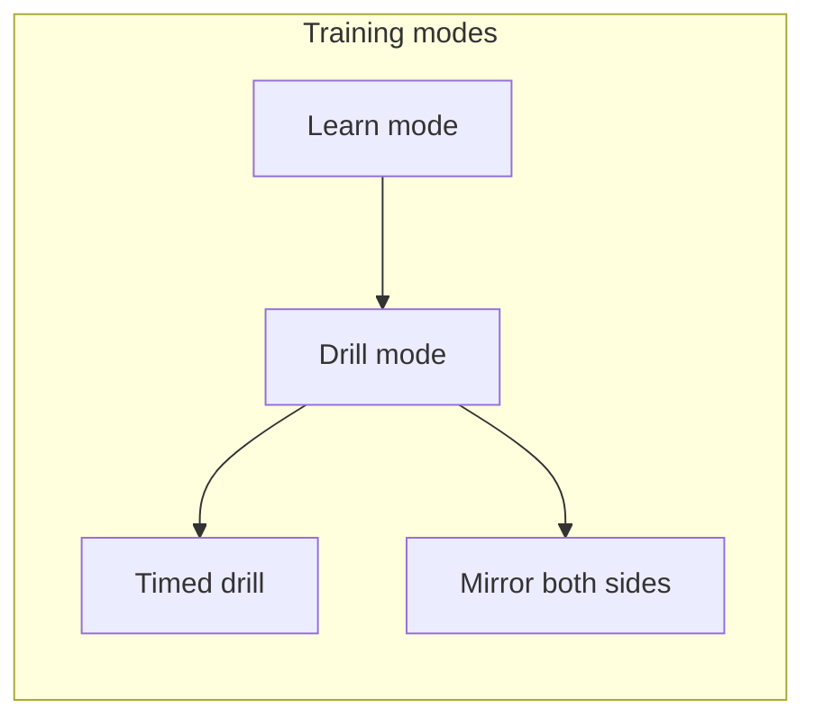
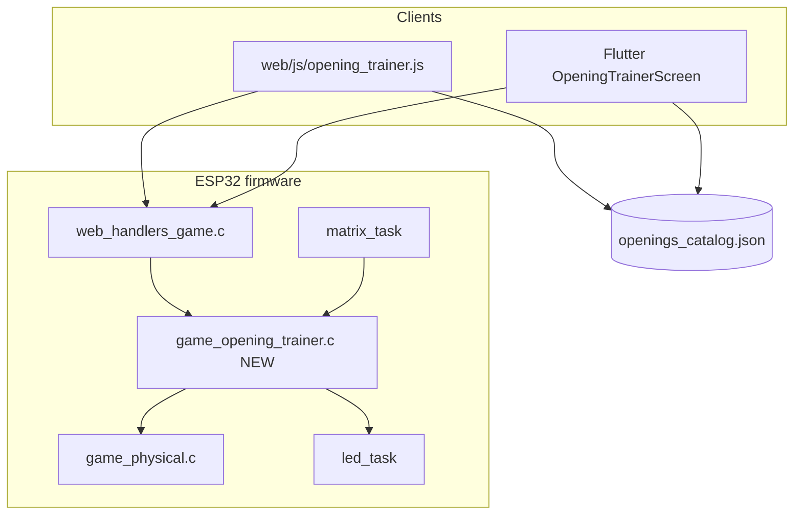
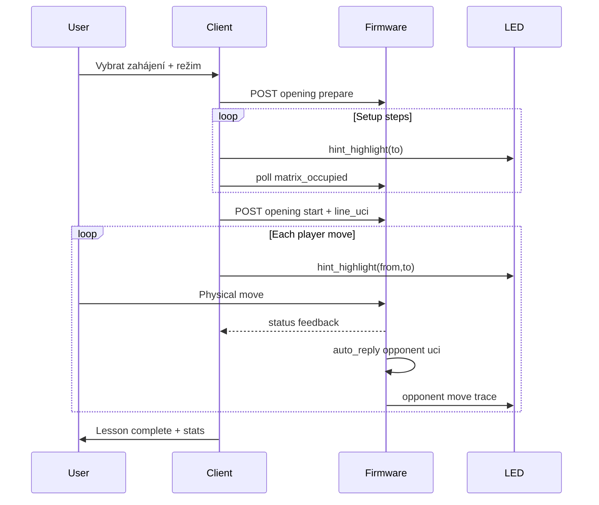

# Plán: Interaktivní trénink zahájení (Opening Trainer)

**Stav:** návrh (2026-07-10)  
**Cíl:** Krok-za-krokem výuka slavných zahájení pro **bílé i černé**, s fyzickou deskou, LED nápovědou a jednotným UX na webu + Flutter.  
**Vstupní dokumentace:** [docs/README.md](../README.md) · [MATRIX_GUARD.md](MATRIX_GUARD.md) · [WEB_UI_DEPLOY.md](WEB_UI_DEPLOY.md)

---

## 1. Shrnutí

CZECHMATE už umí **skládat pozici po krocích** (setup tutorial, puzzle prepare) a **ukázat tah na LED** (`hint_highlight`). Chybí režim, který by:

1. Načetl konkrétní **otevírací variantu** (např. Italská hra, Sicilská ODB, Londýnský systém).
2. Vedl hráče **plynulou linií tahů** (více než jeden tah).
3. Podporoval **obě strany** (hráč hraje bílé linie / černé protičiny).
4. Dával **okamžitou zpětnou vazbu** na fyzické tahy + LED korekci.

Doporučený přístup: nový režim **`opening_trainer`** postavený jako **rozšíření puzzle/setup vrstvy**, ne jako nový monolit. Obsah zahájení držet v **datovém katalogu** (JSON na klientu + volitelně SPIFFS/NVS na ESP), firmware validuje tahy proti UCI/algebraické linii.

---

## 2. Cíle a ne-cíle

### Cíle

| # | Cíl |
|---|-----|
| G1 | Min. **20–30 slavných zahájení** (oba barvy) v katalogu v1 |
| G2 | **Krok za krokem**: setup pozice → tah 1 → odpověď soupeře (auto) → tah 2 → … |
| G3 | **Fyzická deska** jako primární vstup; web/Flutter jako řídicí panel + text |
| G4 | **LED**: zvýraznění cílového pole, volitelně zdroj+ cíl, chyba = červený blink |
| G5 | Parita **Web + Flutter** (dnes puzzle na FW jen web; toto opravit současně) |
| G6 | Postupné učení: **Learn → Drill → Timed drill → obě strany** |

### Ne-cíle (v1)

- Plný opening book engine / neomezená hloubka Stockfish analýzy během drillu
- Rozpoznávání **typu figurky** na matrix (jen obsazenost 0/1)
- Online synchronizace repertoáru mezi uživateli (cloud účty)
- Automatické generování variant z Lichess API za běhu (offline-first firmware)

---

## 3. Uživatelské režimy (training modes)



| Režim | Chování | LED |
|-------|---------|-----|
| **Learn** | Po každém kroku krátký text („Rozviň jezdce na f3“), auto-play soupeře po 1–2 s | Cílové pole pulzuje zlatě; po správném tahu zelený flash |
| **Drill** | Bez textu, jen „Tah 3/8“; špatný tah = oprava | Jen cíl; chyba = červený blink + znovu hint |
| **Timed** | Jako drill + čas na celou linii / na tah | Stejné + timer v UI |
| **Mirror** | Stejná linie, hráč hraje **protivníkovy** tahy (černé linie) | Barva LED podle strany hráče |
| **Setup-only** | Jen postavení výchozí FEN před linií (reuse puzzle prepare) | Stejný pattern jako setup tutorial |

**Doporučení UX:** Každé zahájení má **krátkou kartu** (název, ECO, 1 věta idea, obtížnost, délka linie, strana).

---

## 4. Co v projektu už existuje (znovupoužití)

| Stavební blok | Kde | Co přenést |
|---------------|-----|------------|
| FEN setup po krocích | `SETUP_TUTORIAL_STEPS`, `buildPuzzleSetupStepsFromFen` | Pořadí kroků pro nestandardní FEN |
| Puzzle prepare/start | `game_puzzle.c`, `POST /api/game/puzzle` | `prepare` → prázdná logika + `matrix_occupied` |
| Jednotahová validace | `game_physical.c` (puzzle) | Rozšířit na **řetězec tahů** |
| LED hint | `POST /api/game/hint_highlight` | from+to pro celý tah |
| Matrix guard bypass | `game_task_matrix_guard_mode_conflict_active` | Přidat `opening_trainer_active` |
| Flutter wizard | `BoardSetupWizardScreen`, `board_setup_fen_steps.dart` | Stejný poll + LED refresh |
| Status JSON | `game_json_export.c` | Nová sekce `opening_training` |
| Learn UI shell | `learn_screen.dart` | Napojit na reálné lekce |

**Kritická mezera:** Flutter dnes **nevolá** firmware puzzle API — opening trainer musí mít **explicitní API kontrakt** a testy na obou klientech od fáze 1.

---

## 5. Omezení hardware a důsledky pro design

### Matrix (8×8 Reed switch)

- Senzor zná jen **obsazeno / prázdné**, ne typ figury.
- **Setup fáze:** validace = „figurka na správném poli“ (jako dnes).
- **Tahová fáze:** validace = **from → to** podle fyzického lift/drop (jako normální hra + puzzle).
- **Typ figury** při setupu: důvěřujeme hráči + volitelně **snapshot `/api/board`** na klientu (Flutter už má `_pieceMatches` na Wi‑Fi).

### LED (64 + tlačítka)

| Signál | Barva / animace | Kdy |
|--------|-----------------|-----|
| Cíl tahu | Zlatá / zelená pulse | Learn + Drill |
| Zdroj tahu | Cyan (volitelné) | Learn, první 3 tahy |
| Správný tah | Krátký zelený flash | Po validaci |
| Špatný tah | Červený blink (error recovery) | Reuse `game_show_invalid_move_error_with_blink` |
| Soupeřův auto-tah | Modrá trace from→to 1 s | Po správném hráčově tahu |
| Dokončení linie | Victory wave (reuse endgame anim) | Konec lekce |

### NVS / flash

- Katalog 30 linií × ~15 tahů ≈ **50–150 KB JSON** — vejde se do **SPIFFS partition** nebo klient-only (doporučeno v1: **klient drží obsah**, FW jen stav stroje).

---

## 6. Architektura (doporučená)



**Princip rozdělení:**

| Vrstva | Odpovědnost |
|--------|-------------|
| **Katalog (klient)** | Názvy, FEN, UCI linie, texty lekcí, obtížnost, ECO |
| **Firmware** | Stav stroje: aktivní lekce, index tahu, očekávaný UCI, feedback, auto-play soupeře na logické desce |
| **Klient UI** | Výběr lekce, texty, progress, volání API, LED refresh timer |

Firmware **nepotřebuje** znát „Sicilská ODB“ — dostane `line_id`, `step_index`, `expected_uci[]` v příkazu `start` / `advance`.

---

## 7. Datový model obsahu

### 7.1 Soubor `openings_catalog.json` (klient + repo)

Umístění návrh:

```
components/web_server_task/web/data/openings_catalog.json
flutter_czechmate/assets/data/openings_catalog.json   # stejný obsah, generovaný z jednoho zdroje
```

### 7.2 Schéma (v1)

```json
{
  "version": 1,
  "openings": [
    {
      "id": "italian_giuoco_piano_white",
      "eco": "C50",
      "name": { "cs": "Italská hra — Giuoco Piano", "en": "Italian Game — Giuoco Piano" },
      "side": "white",
      "difficulty": 2,
      "tags": ["classical", "e4"],
      "idea": { "cs": "Rychlý rozvoj a tlak na f7.", "en": "Rapid development and pressure on f7." },
      "start_fen": "rnbqkbnr/pppppppp/8/8/8/8/PPPPPPPP/RNBQKBNR w KQkq - 0 1",
      "line_uci": ["e2e4", "e7e5", "g1f3", "b8c6", "f1c4", "f8c5", "c2c3", "g8f6"],
      "steps": [
        { "uci": "e2e4", "comment": { "cs": "Ovládni centrum e4.", "en": "Control the center with e4." } },
        { "uci": "g1f3", "comment": { "cs": "Rozviň jezdce na f3.", "en": "Develop the knight to f3." } }
      ],
      "opponent_replies": [
        { "after_ply": 1, "uci": "e7e5", "comment": { "cs": "Černý odpovídá symetricky.", "en": "Black mirrors in the center." } }
      ]
    }
  ]
}
```

**Pravidla:**

- `line_uci` = **pouze tahy hráče** (strana z `side`) **nebo** plná linie včetně soupeře — zvolit jeden formát; doporučení: **plná UCI linie** + metadata `player_move_indices: [0,2,4,…]`.
- `steps[]` = podmnožina s komentáři pro Learn mode (nemusí být u každého ply).
- Pro **černé linie** (`side: "black"`): hráč začíná po bílém úvodním tahu (auto-play `e2e4` na desce).

### 7.3 Katalog v1 — doporučených 24 zahájení

| # | Bílé | Černé (proti 1.e4 / 1.d4) |
|---|------|-----------------------------|
| 1 | Italská (Giuoco Piano) | Sicilská (ODB) |
| 2 | Španělská (Ruy Lopez, 6 tahů) | Caro-Kann klasická |
| 3 | Královský gambit (přijetí) | Francouzská (přední varianta) |
| 4 | Anglická 1.c4 | Aljechinova |
| 5 | Dámský gambit přijatý | Skandinávská |
| 6 | Vienna | Petrova (symetrie) |
| 7 | Scotch | Pirc |
| 8 | Four Knights | Scandinavian … |
| 9 | London System | King's Indian setup (černé) |
| 10 | Stonewall / Dutch (bílé) | Nimzo-Indian (černé) |
| 11 | Italian: Evans (zkráceno) | French: Advance |
| 12 | Ruy: Berlin (6 tahů) | Slav defense |

Každá položka: **6–12 plných tahů** (3–6 hráčových), aby lekce trvala 2–5 minut.

### 7.4 Pipeline obsahu

1. **Zdroj pravdy:** PGN z Lichess study / Chess.com → skript `tools/openings/pgn_to_catalog.py`.
2. **Validace:** Každá linie projde lokálním chess.js / python-chess validátorem.
3. **CI:** `openings_catalog.json` — JSON schema test + „všechny UCI tahy legální“.
4. **Lokalizace:** `comment.cs` + `comment.en` (ARB pro Flutter později).

---

## 8. Firmware — `game_opening_trainer.c`

### 8.1 Stav stroje

```c
typedef struct {
  bool active;
  bool setup_phase;       // puzzle-like placement
  bool learn_mode;        // verbose hints allowed
  uint8_t line_id_hash;   // nebo uint16 id z klienta
  uint8_t ply_index;      // index v line_uci[]
  uint8_t ply_total;
  char expected_from[3];  // "e2"
  char expected_to[3];    // "e4"
  opening_feedback_t feedback;
  player_t player_side;   // kterou stranu trénuje hráč
} opening_trainer_state_t;
```

### 8.2 Příkazy (`GAME_CMD_OPENING_TRAINER` + HTTP)

| Akce | Popis |
|------|-------|
| `prepare` | Prázdná logika, `setup_phase=true`, matrix JSON aktivní |
| `load_line` | Body: `{ line_uci[], player_side, start_fen, ply_start }` — nastaví očekávání |
| `start` | Po fyzickém setupu: načte FEN, `active=true`, první hint |
| `cancel` | Reset jako puzzle cancel |
| `auto_reply` | Interně po správném tahu hráče: provede soupeřův UCI na logické desce + LED trace |
| `hint` | Zopakuje LED pro aktuální očekávaný tah |

### 8.3 Validace tahu

1. Hráč provede fyzický tah → `game_physical.c` / matrix flow.
2. Porovnat `(from,to)` s `expected_from/to`.
3. **Správně:** `ply_index++`, pokud další ply je soupeř → `game_execute_move_uci()` + LED animace + **nečekáme na fyzický tah soupeře** (soupeř je „virtuální“).
4. **Špatně:** `OPENING_FEEDBACK_WRONG` + error blink, bez posunu indexu.
5. **Konec linie:** `OPENING_FEEDBACK_COMPLETE` + victory LED.

### 8.4 Integrace s existujícími režimy

Přidat do `game_task_matrix_guard_mode_conflict_active()`:

```c
|| opening_trainer_state.active
|| opening_trainer_state.setup_phase
```

Blokovat: normální hra, puzzle současně, auto-new-game.

### 8.5 Status JSON (rozšíření)

```json
"opening_training": {
  "active": true,
  "setup_phase": false,
  "line_id": "italian_giuoco_piano_white",
  "ply": 3,
  "ply_total": 8,
  "player_side": "white",
  "feedback": "none",
  "message_key": "opening.await_move"
}
```

---

## 9. HTTP / BLE API

### `POST /api/game/opening`

```json
{
  "action": "prepare" | "start" | "cancel" | "hint",
  "line_id": "italian_giuoco_piano_white",
  "start_fen": "...",
  "line_uci": ["e2e4", "e7e5", "..."],
  "player_side": "white",
  "mode": "learn" | "drill" | "timed",
  "player_move_indices": [0, 2, 4, 6]
}
```

| Endpoint | Poznámka |
|----------|----------|
| `POST /api/game/opening` | Nový — mirror v BLE jako u setup_tutorial |
| `POST /api/game/hint_highlight` | Reuse — klient posílá from/to z aktuálního kroku |
| `GET /api/status` | `opening_training` blok |
| `GET /api/board` | Volitelná kontrola typů figur po setupu |

**Staging:** logovat `[STAGING] opening action=%s ply=%u` v `game_opening_trainer.c`.

---

## 10. Klienti — UX flow

### 10.1 Společný flow (Web + Flutter)



### 10.2 Web (`web/js/opening_trainer.js` — Phase 4B)

- Katalog načíst ze `data/openings_catalog.json` (statický fetch nebo embed).
- UI: nová záložka **Učení** nebo rozšíření Learn panelu v `app_main.js`.
- Reuse: `SETUP_TUTORIAL_FAST_POLL_MS`, `hint_highlight` refresh interval.
- **Progress:** `localStorage` `opening_progress_{id}` = poslední dokončený ply / hvězdičky.

### 10.3 Flutter

| Soubor | Úkol |
|--------|------|
| `opening_trainer_screen.dart` | Hlavní UI lekce |
| `opening_catalog_repository.dart` | Načtení assets JSON |
| `board_session_notifier.dart` | `postOpeningAction()` — parita s webem |
| `learn_screen.dart` | Karty lekcí → `OpeningTrainerScreen(lineId: …)` |
| `board_setup_wizard_screen.dart` | Reuse pro FEN setup před linií |

### 10.4 Learn screen mapování

| Lekce (dnes placeholder) | Opening ID (návrh) |
|----------------------------|-------------------|
| L10 Control the center | `italian_giuoco_piano_white` |
| L11 Opening principles | meta-lekce (text only) |
| L12 Ruy Lopez intro | `spanish_berlin_white` |

---

## 11. LED strategie — „nejlepší“ interaktivní pocit

### Learn mode (doporučené výchozí)

1. **Před tahem:** pulzující **zlatá** na `to` (kam položit).
2. **Po zvednutí figury:** přidat **cyan** na `from` (už máte v hint_highlight).
3. **Po správném tahu:** 300 ms zelená na `to`, pak **auto-play soupeře** — modrá stopa from→to.
4. **Špatný tah:** červený blink na `to` + krátký text v UI; figurka zůstane opravitelná (error recovery).

### Drill mode

- Jen krok 1 bez textu; po 3 chybách nabídnout „Ukázat řešení“ (Learn hint).

### Obě strany

- **Bílé linie:** standardní start → hráč od 1. tahu.
- **Černé linie:** firmware po `start` provede `e2e4` (nebo první bílý tah varianty) na logické desce + LED trace; hráč hraje **černý** index 1.

### Konflikt s bot/puzzle

- Při `opening_training.active` zakázat: Stockfish hint, bot move, puzzle overlay (stejný guard jako setup tutorial).

---

## 12. Implementační fáze (step-by-step)

### Fáze 0 — Specifikace a obsah (1 PR)

- [ ] Schválení tohoto dokumentu
- [ ] JSON schema + 3 ukázkové linie (Italská bílá, Sicilská černá, Londýn bílý)
- [ ] `pgn_to_catalog.py` prototyp

**Acceptance:** validátor projde 3 linie; schema v CI.

### Fáze 1 — Firmware jádro (PR #opening-1)

- [ ] `game_opening_trainer.c` — stav, prepare/start/cancel
- [ ] Rozšíření `game_physical.c` — validace opening tahu (paralelně s puzzle)
- [ ] `GAME_CMD_OPENING_TRAINER` + `web_handlers_game.c`
- [ ] Status JSON `opening_training`
- [ ] Matrix guard + hint gating

**Acceptance:** UART/HTTP test script: prepare → start → 3 UCI tahy s fyzickým/mock tahem; LED hint funguje.

### Fáze 2 — Web MVP (PR #opening-2)

- [ ] `web/js/opening_trainer.js` + `data/openings_catalog.json` (10 linií)
- [ ] Integrace do UI (tlačítko z Learn / nový panel)
- [ ] Parita s firmware API

**Acceptance:** jedna kompletní lekce na fyzické desce z prohlížeče.

### Fáze 3 — Flutter parita (PR #opening-3)

- [ ] `OpeningTrainerScreen` + API client
- [ ] Learn screen → launch lekce
- [ ] Sdílený `openings_catalog.json` v assets

**Acceptance:** stejná lekce jako web dokončena z Flutteru.

### Fáze 4 — Obsah + režimy (PR #opening-4)

- [ ] Katalog 24 linií (obě strany)
- [ ] Drill + Timed mode
- [ ] Progress / hvězdičky v localStorage + SharedPreferences
- [ ] Mirror mode (černé linie)

**Acceptance:** všechny v1 linie projdou automatickým UCI validátorem.

### Fáze 5 — Kvalita a pedagogika (PR #opening-5)

- [ ] Lokalizace CS/EN komentářů
- [ ] „Common mistakes“ větve (volitelné wrong-move hints)
- [ ] Stockfish **jen** v Learn jako „proč tento tah“ (read-only, ne auto-play)
- [ ] Diagram v UI (miniboard) synchronní s `/api/board`

**Acceptance:** uživatelské testování 5 hráčů — dokončení lekce bez dokumentace.

### Fáze 6 — Volitelné rozšíření (backlog)

- NVS uložení progress na desce
- SPIFFS katalog na ESP (servírovat JSON z `/data/openings.json`)
- Spaced repetition (Anki-style)
- Custom repertoár editor v app
- Opening trainer vs `enhanced_castling_system` LED tutorial merge

---

## 13. Testování

| Vrstva | Test |
|--------|------|
| JSON | Schema + legální UCI pro každou linii |
| Firmware | Unity-style testy validace UCI → from/to; integrační HW test checklist |
| Web | Playwright: mock API + jeden E2E s snapshot status |
| Flutter | `flutter test` — catalog parse, step index logic |
| HW manual | [docs/reference/MANUAL_TEST_CHECKLIST.md](MANUAL_TEST_CHECKLIST.md) rozšířit o Opening Trainer |

---

## 14. Rizika a mitigace

| Riziko | Dopad | Mitigace |
|--------|-------|----------|
| Matrix nezná typ figury | Špatná figura na poli při setupu | Snapshot board check na klientu; krátké texty „dáma na d1“ |
| LED přepsány jiným režimem | Ztráta hintu | Refresh interval 600 ms (reuse setup tutorial) |
| Příliš dlouhé linie | Únava hráče | Max 8 plných tahů v1; checkpoint uprostřed |
| Flutter/web drift | Jiné chování | Jeden OpenAPI-like JSON kontrakt v `docs/reference/` |
| Flash overflow | Build fail | Katalog jen na klientu v1 |
| Soupeř auto-play vs fyzické figurky | Chaos na desce | **Learn:** soupeř jen logicky + LED; hráč **fyzicky přesune jen své tahy**; po auto-reply krátká pauza + text „soupeř hrál …“ |

---

## 15. Rozhodnutí k potvrzení (před Fází 1)

1. **Katalog na klientu vs SPIFFS na ESP?** — Doporučení: **klient v1**, FW drží stav.
2. **Plná UCI linie vs jen hráčovy tahy?** — Doporučení: **plná linie** + `player_move_indices`.
3. **Soupeř fyzicky nebo virtuálně?** — Doporučení: **virtuálně na logické desce** + LED trace (hráč nekladete černé figurky ručně).
4. **Samostatný režim vs rozšíření puzzle?** — Doporučení: **samostatný** `opening_trainer` (čistší stavový stroj).

---

## 16. Odkazy na kód (výchozí body implementace)

| Oblast | Soubor |
|--------|--------|
| Puzzle vzor | `components/game_task/game_puzzle.c` |
| Setup tutorial FW | `components/game_task/game_init.c` → `game_enter_board_setup_tutorial` |
| Tah + validace | `components/game_task/game_physical.c` |
| HTTP handlery | `components/web_server_task/web_handlers_game.c` |
| Web setup UX | `components/web_server_task/web/js/app_main.js` (~SETUP_TUTORIAL_*, puzzle*) |
| Flutter wizard | `flutter_czechmate/lib/features/setup/board_setup_wizard_screen.dart` |
| ECO labels | `flutter_czechmate/lib/core/utils/opening_eco.dart` |

---

*Tento dokument je živý návrh. Po schválení Fáze 0 vytvořit podřízené tasky v PR #7 nebo nové issue série `opening-trainer-phase-*`.*
