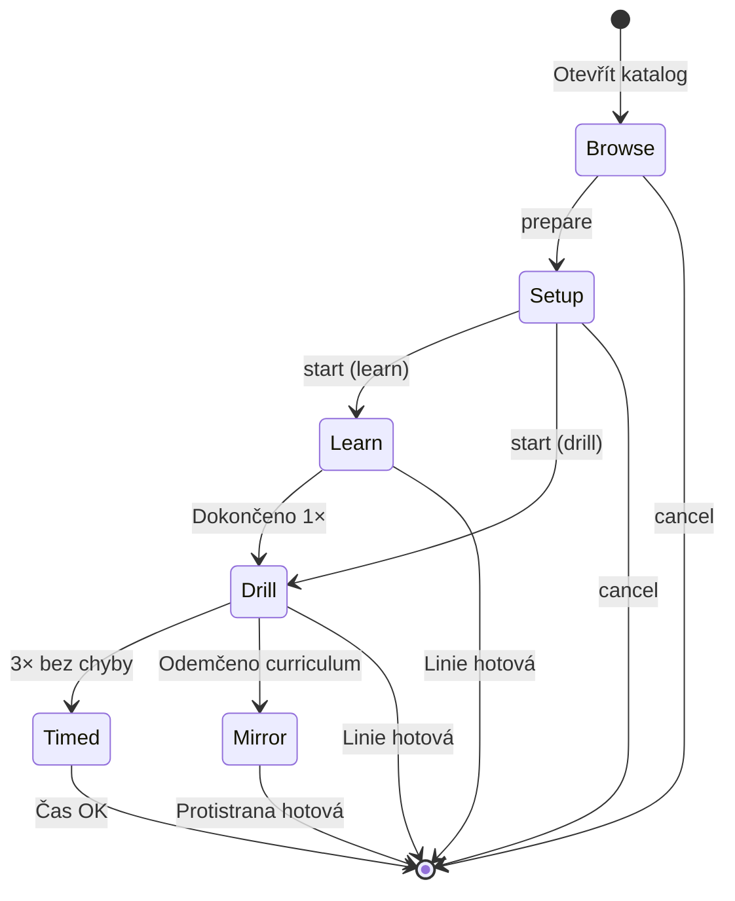
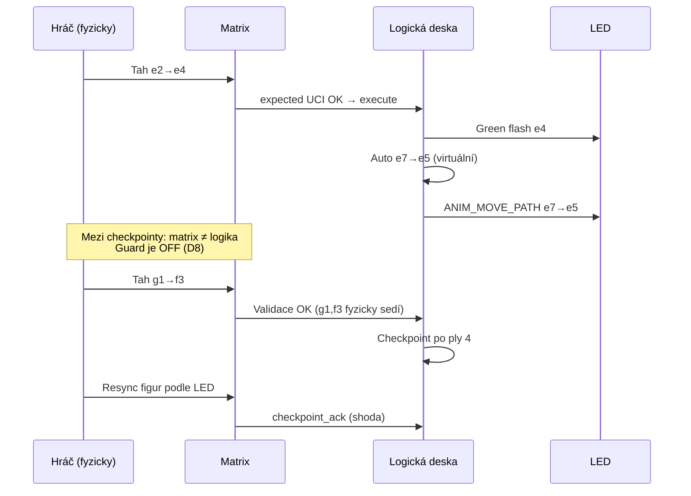
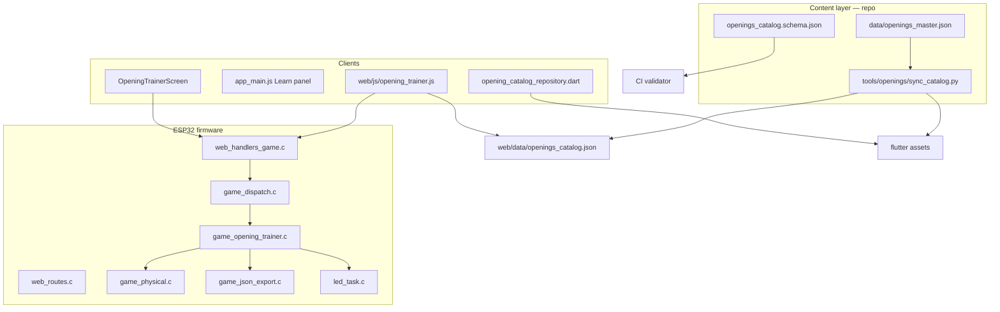
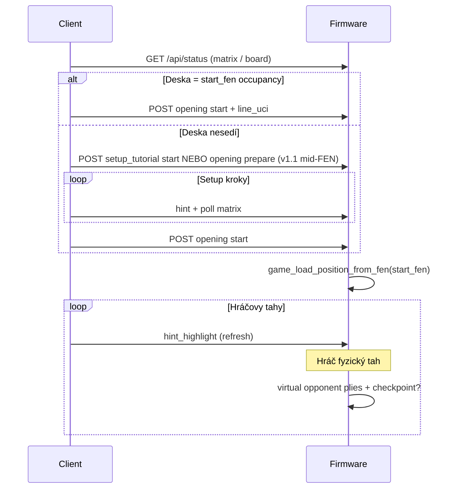

# Plán v2: Interaktivní trénink zahájení (Opening Trainer)

**Verze:** 2.1 (sanity review 2026-07-10)  
**Stav:** schválený návrh — ověřeno proti firmware 1.8.0  
**Cíl:** Krok-za-krokem výuka slavných zahájení pro **bílé i černé**, s fyzickou deskou, LED nápovědou a jednotným UX na webu + Flutter.  
**Vstupní dokumentace:** [docs/README.md](../README.md) · [MATRIX_GUARD.md](MATRIX_GUARD.md) · [WEB_UI_DEPLOY.md](WEB_UI_DEPLOY.md) · [CZECHMATE_INTEGRATION_CHECKLIST.md](CZECHMATE_INTEGRATION_CHECKLIST.md)

---

## 0. Co je nového oproti v1

| Oblast | v1 | v2 upgrade |
|--------|----|------------|
| Rozhodnutí | 4 otevřené otázky | **Uzavřená architektura** (§3) s odůvodněním |
| Deska | „virtuální soupeř“ zmíněn | **Model synchronizace fyzické vs logické desky** (§6) |
| LED | statické cyan/orange | **Reuse `LED_CMD_ANIM_MOVE_PATH`** + nový pulzní hint (§9) |
| API | jeden endpoint | **Plný kontrakt** včetně chyb, BLE, snapshot (§10) |
| Obsah | 24 zahájení tabulka | **30 linií + učební cesty + rodiny ECO** (§8, §12) |
| Fáze | 6 hrubých fází | **9 fází** s checklistem souborů a acceptance (§14) |
| Inventář kódu | obecný | **Konkrétní soubory, funkce, mezery** (§5) |
| Progress | localStorage zmínka | **Hvězdičky, spaced repetition, curriculum unlock** (§11) |
| Sanity | — | **§20 — ověření proti kódu + HW** (matrix guard, setup, captures) |

---

## 0.1 Changelog v2 → v2.1 (sanity review)

| Oprava | Proč |
|--------|------|
| Matrix guard **musí** být vypnutý v opening režimu | Bez toho virtuální tahy okamžitě spustí guard (logika ≠ matrix) |
| Setup **není** puzzle-style prázdná deska pro standardní FEN | `prepare` = empty board jen pro mid-line FEN (v1.1); v1 = startovní pozice |
| Checkpoint = **fyzický resync**, ne jen UI tlačítko | `checkpoint_ack` až po shodě matrix vs logika na checkpoint FEN |
| `game_execute_move_uci` → `game_opening_apply_uci()` | V kódu neexistuje UCI helper; reuse `convert_notation_to_coords` + `game_execute_move` |
| Mirror režim přejmenován / upřesněn | Není „hrát soupeřovy tahy v jedné linii“, ale **párová linie** `mirror_line_id` |
| Katalog v1: omezení capture/rosady | Hráčův capture na virtuálně přesunutou figuru bez resyncu je nemožný |
| Web fáze 2: Flutter-first nebo obnovit embed | `/chess_app.js` dnes vrací 404 (`browser_ui_removed`) |

---

## 1. Shrnutí a design principy

CZECHMATE už umí **skládat pozici po krocích** (setup tutorial, puzzle prepare) a **ukázat tah na LED** (`hint_highlight`). Opening Trainer spojí tyto bloky do režimu **`opening_trainer`**:

1. Katalog **slavných linií** (JSON na klientu).
2. **Setup** výchozí FEN (reuse wizardu).
3. **Řetězec tahů** s validací UCI na fyzické desce.
4. **Virtuální soupeř** na logické desce + LED trace — hráč fyzicky hýbe jen svými tahy.
5. **Postupné režimy** Learn → Drill → Timed → Mirror (obě strany).

### Principy kvality (nezpochybnitelné)

| Princip | Implementace |
|---------|--------------|
| Fyzická deska = primární vstup | UI jen řídí a vysvětluje; tah bez matrix pickup/drop neplatí |
| LED čitelná při živé lekci | FW posílá hint/trace při `start` a auto-reply; klient **refreshuje** hint každých 600 ms |
| Parita Web = Flutter = BLE | Jeden JSON kontrakt; žádné „jen web“ API |
| Offline-first | Katalog v assets; FW nepotřebuje internet |
| Malé PR, zelená CI | Každá fáze = samostatná větev `cursor/opening-trainer-phaseN-8fdd` |
| Žádné nové monolity | `game_opening_trainer.c` max ~400 ř.; logika v existujících modulech |

---

## 2. Cíle a ne-cíle

### Cíle (v1.0 produkt)

| ID | Cíl | Metrika |
|----|-----|---------|
| G1 | **30 linií** (15 bílých + 15 černých) | 100 % legální UCI v CI |
| G2 | Krok za krokem: setup → linie → dokončení | E2E HW test 3 linie |
| G3 | Fyzická deska + LED | 0 regressí matrix guard |
| G4 | Learn / Drill / Timed / Mirror | Každý režim má HW checklist |
| G5 | Web + Flutter parita | Stejná lekce dokončitelná z obou |
| G6 | Curriculum s odemykáním | 4 učební cesty (§8.3) |
| G7 | Progress + hvězdičky | Uloženo lokálně; sync volitelně v2 |

### Ne-cíle (v1.0)

- Opening book engine / neomezená Stockfish hloubka během drillu
- Rozpoznávání typu figury na matrix (jen 0/1 obsazenost)
- Cloud účty a sync mezi zařízeními
- Lichess API za běhu
- Větvení variant (více odpovědí soupeře) — **architektura připravena**, obsah v1.1
- Mazání / přejmenování existujících souborů bez schválení

---

## 3. Uzavřená architektura (dříve „rozhodnutí k potvrzení“)

| # | Rozhodnutí | Volba v2 | Proč |
|---|------------|----------|------|
| D1 | Kde žije katalog | **Klient** (`openings_catalog.json`) | Flash ESP ušetříme; obsah updatuje se s app/web bez OTA |
| D2 | Formát linie | **Plná `line_uci[]`** + `player_ply_indices[]` | FW jednoduše iteruje ply; soupeř i hráč ve stejném poli |
| D3 | Soupeř | **Virtuálně na logické desce** + `led_anim_move_path` | Rychlejší lekce; vyžaduje D8 a checkpoint resync |
| D4 | Režim FW | **Samostatný `opening_trainer`** | Puzzle = 1 tah; opening = stavový stroj s auto-reply — jiná semantika |
| D5 | Setup startovní pozice | **Standardní FEN: přeskočit empty prepare** | Pokud `game_is_physical_board_starting_occupancy()` → rovnou `start`; jinak setup wizard (32 kroků). Empty-board `prepare` jen pro mid-line FEN (v1.1) |
| D6 | Hint LED | **Klient refresh 600 ms** + FW internal hint po auto-reply | Reuse `SETUP_TUTORIAL_REFRESH_MS`; FW-native pulz = Fáze 6 |
| D7 | `GAME_CMD` slot | **`GAME_CMD_OPENING_TRAINER`** v `chess_types.h` | Konzistentní s puzzle/setup pattern |
| D8 | Matrix guard | **Vypnutý po celou aktivní lekci** | `opening_trainer` v `game_task_matrix_guard_mode_conflict_active()` — **povinné**, ne volitelné |
| D9 | Validace tahu | **Nejdřív expected UCI, pak `game_is_valid_move`** | Špatná destinace = opening feedback; legalita z logické desky |

---

## 4. Uživatelské režimy a pedagogika

### 4.1 Režimy tréninku



| Režim | Chování | LED | UI |
|-------|---------|-----|-----|
| **Learn** | Komentář ke každému hráčovu ply; auto-reply po 1,5 s | Zlatý pulz `to`; cyan `from` po pickup | Velký text + miniboard |
| **Drill** | Jen „Tah N/M“; bez komentářů | Jen `to`; po 3 chybách „Ukázat řešení“ | Minimální panel |
| **Timed** | Drill + časovač (celá linie nebo/tah) | Stejné + červený pulz pod 5 s | Timer ring |
| **Mirror** | Samostatná **párová linie** (`mirror_line_id`, typicky opačná barva) | Stejné LED | Badge „Trénuješ černou proti 1.e4“ |
| **Review** | Prohlížení dokončené linie bez HW | Animace na miniboardu | Pouze app (bez FW) |

### 4.2 Hvězdičky a mastery

| Hvězda | Podmínka |
|--------|----------|
| ★ | Dokončeno v Learn |
| ★★ | Dokončeno v Drill ≤ 2 chyby |
| ★★★ | Dokončeno v Timed v limitu |
| ★★★★ | Dokončena **párová** linie `mirror_line_id` s ★★ |

Progress klíč: `opening_progress_v1` → `{ "line_id": { "stars": 3, "best_drill_errors": 1, "last_completed_at": "ISO" } }`.

### 4.3 Spaced repetition (Fáze 7)

- Linie s ★★ se řadí do fronty „opakovat za 3 dny“.
- Notifikace ve Flutteru (lokální); web = banner při otevření Learn.

---

## 5. Inventář existujícího kódu (audit)

### 5.1 Co přímo reuseovat

| Potřeba | Soubor | Symbol / detail |
|---------|--------|-----------------|
| Puzzle lifecycle vzor | `game_puzzle.c` | `enter_setup` → `start` → `cancel`; feedback enum |
| Setup tutorial FW | `game_init.c` | `game_enter_board_setup_tutorial()`, `game_finish_board_setup_tutorial_from_web()` |
| Fyzická validace | `game_physical.c` | `game_process_drop_command` — error recovery, blink |
| Matrix guard | `game_task.c` | `game_task_matrix_guard_mode_conflict_active()` — **rozšířit** |
| Status JSON | `game_json_export.c` | `game_get_status_json()` — přidat `opening_training` |
| HTTP handlery | `web_handlers_game.c` | Vzor `http_post_game_puzzle_handler`, `setup_tutorial` |
| Routes | `web_routes.c` | Registrace `POST /api/game/opening` |
| LED hint | `web_handlers_game.c` | `web_server_apply_hint_highlight_json_body` |
| LED anim tahu | `led_task.c` | `LED_CMD_ANIM_MOVE_PATH` → `led_anim_move_path()` (~ř. 2207) |
| LED barvy hint | `led_task.c` | cyan from / orange to (`LED_CMD_HIGHLIGHT_HINT`) |
| Web setup UX | `web/js/app_main.js` | `SETUP_TUTORIAL_*`, `buildPuzzleSetupStepsFromFen()` |
| Web prefs/API | `web/js/api.js`, `prefs.js` | `apiPostJson`, auth headers |
| Flutter setup | `board_setup_wizard_screen.dart` | Matrix poll 400 ms, LED refresh 900 ms |
| Flutter FEN kroky | `board_setup_fen_steps.dart` | `BoardSetupFenSteps.build(fen)` |
| Flutter API | `board_api_client.dart` | `postSetupTutorial`, `postHintHighlight*` |
| Flutter session | `board_session_notifier.dart` | `postSetupTutorialAction`, `postHintDestination` |
| BLE parita | `ble_czechmate_client.dart` | `postSetupTutorial`, `postHintHighlightDestinationOnly` |
| ECO popisky | `opening_eco.dart` | Rozšířit mapování pro katalog karty |

### 5.2 Kritické mezery (musí Fáze 1 vyřešit)

| Mezera | Detail |
|--------|--------|
| Žádný `game_opening_trainer.c` | Nový modul |
| Žádný `POST /api/game/opening` | Nový handler + `GAME_CMD_OPENING_TRAINER` |
| Puzzle = 1 tah | `game_physical.c` porovnává jen `puzzle_solution_*` |
| LED hint = statický | Chybí pulz, green flash, opponent trace z FW |
| Flutter nevolá puzzle API | Opening musí mít vlastní `postOpeningAction()` od začátku |
| `learn_screen.dart` | Placeholder — L10–L12 locked, jen snackbar |
| Status JSON | Chybí `opening_training` blok |
| `openings_catalog.json` | Neexistuje |

### 5.3 Vzácná vyloučení režimů a matrix guard

Rozšířit `game_task_matrix_guard_mode_conflict_active()` (`game_task.c` ~1801) a hint gating (`app_main.js` ~1158):

```c
|| game_is_opening_trainer_active()
|| game_is_opening_trainer_setup_active()
```

**Proč je to povinné (ne jen „blokovat jiné režimy“):**  
`game_matrix_guard.c` při `mode_conflict_active()` **ignoruje guard** a nechává UP/DN pokračovat. Virtuální tahy soupeře záměrně vytváří rozdíl logika ↔ matrix (§6). Bez D8 by guard po prvním auto-reply pozastavil hru.

Stejně rozšířit:

- `game_matrix_guard_check_resync_after_restore()` — přeskočit při aktivním opening traineru
- `game_physical.c` — pickup/drop povolen i když matrix ≠ logika (guard inactive)

Blokovat současně: normální hra, puzzle, setup tutorial, bot tah, Stockfish hint.

---

## 6. Model synchronizace fyzické vs logické desky

**Nejdůležitější designový problém.** Matrix vidí jen obsazenost; soupeř hraje virtuálně. Tento model **dává smysl jen s D8** (guard off) a **fyzickým checkpoint resync**.

### 6.0 Verdikt: dává to smysl?

| Otázka | Odpověď |
|--------|---------|
| Lze validovat tahy hráče? | **Ano** — porovnání `(from,to)` s UCI + `game_is_valid_move` na logické desce |
| Spustí matrix guard? | **Ano, bez D8** — po 1. virtuálním tahu. **Řešení:** opening v `mode_conflict_active` |
| Lze hrát capture v linii? | **Jen s opatrností** — viz §6.5 a §8.5 |
| Je lepší fyzický soupeř? | Pro v1 **ne** — 2× délka lekce, vyšší chybovost u začátečníků |
| Alternativa v2.0 HW? | Hall senzory s typem figury — mimo scope V1 |

**Závěr:** Plán je realizovatelný na V1 reed desce, pokud dodržíme D8 + checkpoint resync + katalogová pravidla.

### 6.1 Pravidla

| Fáze | Logická deska | Fyzická deska (matrix) |
|------|---------------|------------------------|
| **Setup** | `game_load_position_from_fen(start_fen)` po potvrzení fyzické shody | Hráč má figurky na startovní pozici (wizard jen pokud nesedí) |
| **Hráčův tah** | Očekává se UCI tah hráče | Pickup/drop musí sedět s `expected_from/to` |
| **Soupeřův tah** | `game_opening_apply_uci()` na logice | **Žádná změna matrix** |
| **Checkpoint** | FEN po `ply_index` | **Hráč fyzicky srovná** podle LED diff wizardu |
| **Po checkpointu** | Shoda logika = matrix (0/1) | Pokračuje další hráčův tah |

### 6.2 Důsledek: „ghost“ figurky (mezi checkpointy)

Mezi checkpointy **fyzická deska ≠ logická pozice** — záměr, ne bug.

**Mitigace v1:**

1. **Checkpoint = fyzický resync** (ne jen „OK“ tlačítko): klient porovná `matrix_occupied` vs occupancy z logické FEN; `checkpoint_ack` FW přijme jen při shodě (nebo tolerance 0 diff).
2. **Resync wizard:** reuse `BoardSetupFenSteps` — jen pole kde se liší occupancy (max ~8 figur po 4 tazích).
3. **Learn mode:** po auto-reply pauza 1,5 s + `led_anim_move_path` + text „Soupeř hrál … (virtuálně)“.
4. **Drill/Timed:** checkpoint **povinný** před dalším hráčovým tahem.



### 6.3 Proč ne fyzický soupeř

| Alternativa | Problém |
|-------------|---------|
| Hráč přesouvá i černé | 2× pohybů, zmatení v drillu, delší lekce |
| Reset desky po každém ply | Nepřijatelné UX |
| **Virtuální soupeř + checkpoint** | Nejkratší cesta k 30 liniím na V1 HW |

### 6.4 Matrix guard — povinná integrace

```c
// game_matrix_guard.c — existující chování (ř. ~151):
if (game_task_matrix_guard_mode_conflict_active()) {
  // guard se IGNORUJE, UP/DN pokračuje
}
```

Opening trainer **musí** být v tomto seznamu. Bez toho je virtuální model nefunkční.

Doplňkově v `game_matrix_guard_check_resync_after_restore()`:

```c
if (game_is_opening_trainer_active() || game_is_opening_trainer_setup_active()) {
  return;  // neaktivovat guard po NVS restore během lekce
}
```

### 6.5 Omezení tahů v katalogu (v1)

| Typ tahu | Povoleno v1? | Podmínka |
|----------|--------------|----------|
| Hráč: quiet move (e4, Nf3) | ✅ | Vždy |
| Hráč: capture fyzicky přítomné figury | ✅ | Po checkpointu, když je figura na poli fyzicky |
| Hráč: capture jen na logické desce | ❌ | Zakázáno v1 — validator fail |
| Soupeř: capture (virtuální) | ✅ | Vždy; checkpoint za 1–2 ply |
| Rosada | ⚠️ | Jen pokud fyzický resync zvládne wizard — **v1 spíš vynechat** |
| Promoce | ⚠️ | UCI 5 znaků (`e7e8q`) — Fáze 4+, ne v počátečním katalogu |

---

## 7. Architektura systému



### Rozdělení odpovědností

| Vrstva | Odpovědnost |
|--------|-------------|
| **Master JSON** | Jediný zdroj pravdy v `data/openings_master.json` |
| **Sync skript** | Kopie do web + Flutter assets; validace python-chess |
| **Firmware** | Stav stroje, UCI validace, auto-reply, LED příkazy, feedback |
| **Klient** | Katalog UI, texty, progress, hint refresh, checkpoint UX |

Firmware **nezná** názvy zahájení — dostane `line_uci[]`, `player_ply_indices[]`, `mode`, `start_fen`.

---

## 8. Datový model obsahu

### 8.1 Umístění souborů

```
data/openings_master.json              # zdroj pravdy (git)
data/openings_catalog.schema.json    # JSON Schema draft-07
tools/openings/sync_catalog.py       # validace + kopie
tools/openings/pgn_to_catalog.py     # import z PGN
components/web_server_task/web/data/openings_catalog.json
flutter_czechmate/assets/data/openings_catalog.json
```

### 8.2 Schéma katalogu v2

```json
{
  "$schema": "../openings_catalog.schema.json",
  "version": 2,
  "locale_default": "cs",
  "curricula": [
    {
      "id": "white_classics",
      "name": { "cs": "Klasická bílá", "en": "White classics" },
      "line_ids": ["italian_giuoco_white", "spanish_berlin_white"]
    }
  ],
  "openings": [
    {
      "id": "italian_giuoco_white",
      "eco": "C50",
      "family": "italian",
      "name": { "cs": "Italská hra — Giuoco Piano", "en": "Italian Game — Giuoco Piano" },
      "side": "white",
      "difficulty": 2,
      "tags": ["classical", "e4", "development"],
      "idea": { "cs": "Rychlý rozvoj a tlak na f7.", "en": "Rapid development and pressure on f7." },
      "start_fen": "rnbqkbnr/pppppppp/8/8/8/8/PPPPPPPP/RNBQKBNR w KQkq - 0 1",
      "line_uci": ["e2e4", "e7e5", "g1f3", "b8c6", "f1c4", "f8c5", "c2c3", "g8f6"],
      "player_ply_indices": [0, 2, 4, 6],
      "checkpoint_ply_indices": [4],
      "steps": [
        {
          "ply_index": 0,
          "comment": { "cs": "Ovládni centrum e4.", "en": "Control the center with e4." },
          "arrow": { "from": "e2", "to": "e4" }
        },
        {
          "ply_index": 2,
          "comment": { "cs": "Rozviň jezdce na f3.", "en": "Develop the knight to f3." }
        }
      ],
      "opponent_annotations": [
        {
          "ply_index": 1,
          "comment": { "cs": "Černý odpovídá symetricky v centru.", "en": "Black mirrors in the center." }
        }
      ],
      "common_mistakes": [
        {
          "wrong_uci": "f1b5",
          "at_ply_index": 4,
          "hint": { "cs": "Nejdřív c4 — španělská je jiná lekce.", "en": "Play c4 first — Spanish is another lesson." }
        }
      ],
      "mirror_line_id": "italian_giuoco_black",
      "prerequisites": []
    }
  ]
}
```

**Pravidla:**

- `line_uci` = **kompletní** sekvence včetně soupeře.
- `player_ply_indices` = indexy, kde **očekáváme fyzický tah hráče**.
- `steps[]` odkazuje na `ply_index` (ne duplicitní UCI).
- `checkpoint_ply_indices` = po tomto ply **povinný fyzický resync** před dalším hráčovým tahem.
- `common_mistakes` = **jen klient** v1 (porovnání před odesláním tahu); FW v1.1.
- Pro `side: "black"`: první bílé ply v `line_uci` se auto-playne virtuálně; hráč začíná na `player_ply_indices[0]`.

### 8.5 Validace obsahu (CI + python-chess)

Kromě §8.4 pipeline přidat kontroly:

1. **Legální UCI** — každý tah z `start_fen`.
2. **Player capture rule** — u každého `player_ply_indices[i]` s capture: buď `requires_checkpoint_before: true`, nebo capture cíl byl fyzicky na desce po předchozím checkpointu (simulace).
3. **Žádná rosada** v `line_uci` v1 (`e1g1`, `e8c8`, …) — fail CI.
4. **Max 12 plies**, max 6 hráčových tahů.
5. **`checkpoint_ply_indices`** musí být ≤ poslední virtuální soupeřův tah před dalším hráčovým capture (pokud existuje).

Skript: `tools/openings/sync_catalog.py --validate --physical-rules`

### 8.3 Učební cesty (curricula)

| ID | Název | Obsah | Odemčení |
|----|-------|-------|----------|
| `basics_white` | Bílé základy | Italian, London, Four Knights | Vždy |
| `basics_black` | Černé základy | Sicilian ODB, Caro-Kann, Scandinavian | Po 2× `basics_white` ★ |
| `classical_deep` | Klasika hlouběji | Spanish, QGD, Vienna, Scotch | Po `basics_*` ★★ |
| `systems` | Systémová hra | London, Stonewall, KID setup, Nimzo | Po 5 liniích ★★ |

### 8.4 Pipeline obsahu

```bash
# Lokální validace
python3 tools/openings/sync_catalog.py --validate
python3 tools/openings/sync_catalog.py --copy   # → web + flutter assets

# Import z PGN studie
python3 tools/openings/pgn_to_catalog.py --pgn studies/italian.pgn --id italian_giuoco_white
```

**CI job `openings-catalog`:**

1. JSON Schema validate `data/openings_master.json`
2. python-chess: každý UCI tah legální od `start_fen`
3. `player_ply_indices` ⊆ `[0, len(line_uci))`
4. Duplicitní `id` = fail
5. Soubory web/flutter **shodné hash** s výstupem skriptu

---

## 9. LED a animace — specifikace

### 9.1 Existující building blocks

| Efekt | Mechanismus | Soubor |
|-------|-------------|--------|
| Hint from/to | `POST /api/game/hint_highlight` | `web_handlers_game.c` |
| Clear | `POST /api/game/hint_clear` | `web_handlers_game.c` |
| Tahová stopa | `LED_CMD_ANIM_MOVE_PATH` | `led_task.c` `led_anim_move_path` |
| Chyba | `game_show_invalid_move_error_with_blink` | error recovery |
| Konec | `LED_CMD_ANIM_ENDGAME` | `led_task.c` |

### 9.2 Opening-specific chování

| Událost | FW akce | Barva / animace |
|---------|---------|-----------------|
| Čeká se na hráče | `hint_highlight` (klient refresh 600 ms) | Orange `to`; cyan `from` po pickup |
| Správný tah | `led_anim_move_path` 300 ms + clear | Zelená trace |
| Špatný tah | error blink | Červená na `to` |
| Soupeř auto-reply | `led_anim_move_path(from,to)` | Modrá trace 1 s |
| Checkpoint | `hint_highlight` na diff polích | Fialová (nová volitelná barva v1.1) |
| Dokončení linie | `LED_CMD_ANIM_ENDGAME` zkrácená | Victory wave 2 s |

### 9.3 Fáze 1b — FW-native pulz (volitelné vylepšení)

Nový `LED_CMD_HIGHLIGHT_HINT_PULSE` — firmware sám pulzuje `to` bez HTTP refresh. Snižuje traffic při Learn. **Backlog** pokud Fáze 1 stačí s klient refresh.

### 9.4 `led_guidance_level` integrace

Respektovat `GET /api/status.led_guidance_level`:

| Level | Learn | Drill |
|-------|-------|-------|
| 0 (off) | Jen UI text | Jen UI |
| 1 | `to` only | `to` only |
| 2 | `from` + `to` | `to` + chyba blink |
| 3 | + opponent trace | + opponent trace |

---

## 10. API kontrakt

### 10.1 Tok lekce (opravený setup flow)



**Důležité:** Pro standardní zahájení (`start_fen` = počátek hry) **nepoužívat** `puzzle`-style `prepare` s prázdnou deskou. To by donutilo hráče zbytečně skládat 32 figur. `prepare` s `setup_phase` vyhradit pro v1.1 mid-line FEN.

### 10.2 `POST /api/game/opening`

**Request:**

```json
{
  "action": "prepare",
  "line_id": "italian_giuoco_white",
  "mode": "learn",
  "start_fen": "rnbqkbnr/pppppppp/8/8/8/8/PPPPPPPP/RNBQKBNR w KQkq - 0 1",
  "line_uci": ["e2e4", "e7e5", "g1f3", "b8c6", "f1c4", "f8c5", "c2c3", "g8f6"],
  "player_ply_indices": [0, 2, 4, 6],
  "checkpoint_ply_indices": [4]
}
```

| `action` | Chování | HTTP |
|----------|---------|------|
| `prepare` | **v1.1 mid-FEN only:** prázdná logika + `setup_phase`. **v1 standard:** klient nepoužívá — viz §10.1 | 200 |
| `start` | Načte FEN, auto-play bílé úvodní ply pro black lines, `active=true` | 200 |
| `cancel` | Reset; `hint_clear` | 200 |
| `hint` | Zopakuje LED pro aktuální expected tah | 200 |
| `checkpoint_ack` | Klient potvrdil **fyzický** resync (FW ověří matrix vs logika) | 200 nebo 409 `resync_incomplete` |
| `pause` / `resume` | Timed mode | 200 |

**Response 200:**

```json
{
  "ok": true,
  "opening_training": {
    "active": true,
    "setup_phase": false,
    "mode": "learn",
    "line_id": "italian_giuoco_white",
    "ply_index": 2,
    "ply_total": 8,
    "player_ply_index": 1,
    "player_ply_total": 4,
    "player_side": "white",
    "feedback": "none",
    "message_key": "opening.await_move",
    "expected_from": "g1",
    "expected_to": "f3",
    "checkpoint_required": false,
    "awaiting_checkpoint_ack": false,
    "physical_synced": true
  }
}
```

`physical_synced`: `true` pokud matrix occupancy odpovídá logické desce (0/1) — obzvlášť důležité při checkpointu.

**Feedback hodnoty:** `none` | `correct` | `wrong` | `mistake_hint` | `complete` | `illegal` | `checkpoint`

**Chyby:**

| HTTP | `error` | Kdy |
|------|---------|-----|
| 400 | `invalid_action` | Neznámá action |
| 400 | `invalid_line` | Prázdné `line_uci` |
| 409 | `mode_conflict` | Aktivní hra / puzzle |
| 409 | `setup_incomplete` | `start` bez fyzické startovní pozice |
| 409 | `resync_incomplete` | `checkpoint_ack` ale matrix ≠ logika |
| 503 | `queue_full` | Game command queue |

### 10.3 Status JSON (`GET /api/status` / snapshot)

Nový blok (vedle `puzzle`, `board_setup_tutorial`):

```json
"opening_training": {
  "active": true,
  "setup_phase": false,
  "mode": "drill",
  "line_id": "sicilian_odb_black",
  "ply_index": 5,
  "ply_total": 10,
  "player_side": "black",
  "feedback": "none",
  "message_key": "opening.await_move",
  "expected_from": "g8",
  "expected_to": "f6",
  "last_opponent_uci": "f1c4",
  "checkpoint_required": true,
  "physical_setup_match": true
}
```

`matrix_occupied[64]` exportovat když `setup_phase || checkpoint_required`.

### 10.4 BLE parita

```json
{ "cmd": "opening", "action": "start", "line_id": "...", "line_uci": ["..."], "player_ply_indices": [0,2,4] }
```

Implementace: `ble_nimble_impl.c` → stejný parser jako HTTP (`web_server_apply_opening_json_body` — nová shared funkce vedle hint).

### 10.5 Flutter API

```dart
// board_api_client.dart
Future<Map<String, dynamic>> postOpening(String baseUrl, Map<String, dynamic> body);

// board_session_notifier.dart
Future<void> postOpeningAction({required String action, required OpeningLine line});
```

### 10.6 Staging logy

```c
STAGING_LOGI(TAG, "opening action=%s line=%s ply=%u/%u feedback=%d",
             action, line_id, ply_index, ply_total, feedback);
```

---

## 11. Klienti — UX specifikace

### 11.1 Informační architektura

```
Learn (home)
├── Curriculum cards (4 cesty)
├── Opening catalog (filtr: side / difficulty / tag)
│   └── Opening detail card
│       ├── Start Learn
│       ├── Start Drill (locked until ★)
│       └── Párová linie (mirror_line_id) — locked until ★★
└── Progress summary (hvězdy, streak)

Opening lesson (fullscreen)
├── Phase: Setup → Play → Complete
├── Miniboard (sync /api/board)
├── Instruction panel
├── Progress bar (player plies)
└── Actions: Hint | Pause | Cancel | Checkpoint OK
```

### 11.2 Web moduly

> **Stav repa (2026-07):** HTTP handler `/chess_app.js` vrací `browser_ui_removed` (404).  
> **Fáze 2:** buď obnovit embed (`embed_chess_js.py`), nebo **Flutter-first MVP** a web až po obnově UI.

| Soubor | Úkol |
|--------|------|
| `web/js/opening_trainer.js` | Stav lekce, API, progress, checkpoint |
| `web/js/opening_catalog.js` | Načtení JSON, filtry, curriculum |
| `web/js/app_main.js` | Learn panel wiring, hint gating rozšíření |
| `web/data/openings_catalog.json` | Generovaný asset |

Reuse konstant: `SETUP_TUTORIAL_REFRESH_MS = 600`, `SETUP_TUTORIAL_FAST_POLL_MS = 400`, `SETUP_TUTORIAL_OCC_STABLE_TICKS = 2`.

### 11.3 Flutter soubory

| Soubor | Úkol |
|--------|------|
| `lib/features/opening/opening_trainer_screen.dart` | Hlavní lekce |
| `lib/features/opening/opening_catalog_screen.dart` | Katalog + filtry |
| `lib/features/opening/opening_catalog_repository.dart` | Parse JSON |
| `lib/features/opening/models/opening_line.dart` | Typy |
| `lib/features/learn/learn_screen.dart` | Curriculum → navigace |
| `board_setup_wizard_screen.dart` | `BoardSetupWizardKind.openingStart` |
| `board_session_notifier.dart` | `postOpeningAction` |

### 11.4 Learn screen mapování (L10–L12)

| Lekce | Opening ID | Curriculum |
|-------|------------|------------|
| L10 Control the center | `italian_giuoco_white` | `basics_white` |
| L11 Opening principles | `meta_principles` (text-only, bez FW) | — |
| L12 Ruy Lopez intro | `spanish_berlin_white` | `classical_deep` |

### 11.5 Přístupnost (a11y)

- Každý krok: `Semantics(label: instructionText)` na Flutteru.
- Klávesnice: Enter = Hint, Esc = Cancel.
- Kontrast miniboardu WCAG AA.
- Screen reader oznamuje „Správný tah“, „Chyba“, „Soupeř hrál e5“.

---

## 12. Katalog v1 — 30 linií

### 12.1 Bílá (15)

| ID | ECO | Název | Plies | Obtížnost |
|----|-----|-------|-------|-----------|
| `italian_giuoco_white` | C50 | Italská — Giuoco Piano | 8 | 2 |
| `italian_evans_white` | C51 | Italská — Evans gambit (zkrác.) | 8 | 3 |
| `spanish_berlin_white` | C60 | Španělská — Berlin | 6 | 3 |
| `spanish_morphy_white` | C77 | Španělská — Morphy | 8 | 3 |
| `scotch_game_white` | C45 | Scotch | 8 | 2 |
| `vienna_white` | C25 | Vienna | 8 | 2 |
| `four_knights_white` | C47 | Four Knights | 8 | 1 |
| `london_system_white` | D02 | London System | 8 | 1 |
| `queens_gambit_white` | D06 | Dámský gambit přijatý | 8 | 2 |
| `english_reversed_white` | A13 | Anglická 1.c4 (reversed London) | 8 | 2 |
| `kings_gambit_white` | C33 | Královský gambit přijatý | 8 | 4 |
| `dutch_stonewall_white` | A80 | Stonewall / Dutch setup | 8 | 3 |
| `italian_two_knights_white` | C57 | Two Knights — Fried Liver intro | 6 | 4 |
| `catalan_white` | E00 | Catalan (základ) | 8 | 3 |
| `trompowsky_white` | A45 | Trompowsky | 6 | 2 |

### 12.2 Černá (15)

| ID | Proti | Název | Plies | Obtížnost |
|----|-------|-------|-------|-----------|
| `sicilian_odb_black` | 1.e4 | Sicilská — ODB | 10 | 3 |
| `sicilian_najdorf_intro_black` | 1.e4 | Sicilská — Najdorf úvod | 10 | 4 |
| `caro_kann_classical_black` | 1.e4 | Caro-Kann klasická | 8 | 2 |
| `french_advance_black` | 1.e4 | Francouzská — Advance | 10 | 3 |
| `french_classical_black` | 1.e4 | Francouzská — klasická | 8 | 3 |
| `alekhine_black` | 1.e4 | Aljechinova | 8 | 3 |
| `pirc_classical_black` | 1.e4 | Pirc | 8 | 2 |
| `scandinavian_black` | 1.e4 | Skandinávská | 6 | 1 |
| `petrov_black` | 1.e4 | Petrova | 8 | 2 |
| `slav_main_black` | 1.d4 | Slav | 10 | 3 |
| `queens_gambit_declined_black` | 1.d4 | QGD | 8 | 2 |
| `kings_indian_setup_black` | 1.d4 | King's Indian setup | 10 | 3 |
| `nimzo_indian_black` | 1.d4 | Nimzo-Indian | 8 | 3 |
| `london_vs_black` | 1.d4 | Proti Londonu (…d5, Bf4) | 8 | 2 |
| `english_symmetrical_black` | 1.c4 | Symetrická anglická | 8 | 2 |

Každá linie: **6–12 plných tahů**, 2–5 minut Learn, checkpoint po 4. ply pokud `ply_total > 6`.

---

## 13. Firmware — `game_opening_trainer.c`

### 13.1 Stav stroje

```c
typedef enum {
  OPENING_FEEDBACK_NONE = 0,
  OPENING_FEEDBACK_CORRECT,
  OPENING_FEEDBACK_WRONG,
  OPENING_FEEDBACK_MISTAKE_HINT,
  OPENING_FEEDBACK_ILLEGAL,
  OPENING_FEEDBACK_COMPLETE,
  OPENING_FEEDBACK_CHECKPOINT
} opening_feedback_t;

typedef enum {
  OPENING_MODE_LEARN = 0,
  OPENING_MODE_DRILL,
  OPENING_MODE_TIMED,
  OPENING_MODE_MIRROR
} opening_mode_t;

typedef struct {
  bool active;
  bool setup_phase;
  opening_mode_t mode;
  char line_id[48];
  char start_fen[120];
  char line_uci[OPENING_MAX_PLIES][5];  /* OPENING_MAX_PLIES = 16 */
  uint8_t line_uci_count;
  uint8_t player_ply_indices[OPENING_MAX_PLIES];
  uint8_t player_ply_count;
  uint8_t checkpoint_ply_indices[4];
  uint8_t checkpoint_count;
  uint8_t ply_index;
  uint8_t player_ply_index;  /* který hráčův tah v řadě (0..player_ply_count-1) */
  char expected_from[3];
  char expected_to[3];
  opening_feedback_t feedback;
  player_t player_side;
  bool awaiting_checkpoint_ack;
  uint64_t timed_deadline_ms;
} opening_trainer_state_t;
```

### 13.2 Integrační body (soubor po souboru)

| Soubor | Změna |
|--------|-------|
| `chess_types.h` | `GAME_CMD_OPENING_TRAINER`, payload struct |
| `game_opening_trainer.c` | **NOVÝ** — celý stavový stroj |
| `game_task_internal.h` | Export state, hooks pro physical |
| `game_physical.c` | Větev `opening_trainer_active` před/po puzzle |
| `game_dispatch.c` | Handler `GAME_CMD_OPENING_TRAINER` |
| `game_init.c` | Vzájemné vyloučení s puzzle/tutorial |
| `game_json_export.c` | Sekce `opening_training` |
| `game_task.c` | Matrix guard rozšíření |
| `web_handlers_game.c` | `http_post_game_opening_handler` |
| `web_routes.c` | Route registrace |
| `ble_nimble_impl.c` | BLE `opening` cmd |
| `game_task/CMakeLists.txt` | Přidat `game_opening_trainer.c` |

### 13.3 Hlavní funkce

```c
bool game_opening_apply_uci(const char *uci);  /* parse 4–5 znaků → game_execute_move */
esp_err_t game_opening_prepare(const opening_load_request_t *req);
esp_err_t game_opening_start(void);
esp_err_t game_opening_cancel(void);
bool game_opening_validate_checkpoint_physical(void);  /* matrix vs logika */
bool game_opening_on_physical_move(uint8_t from_row, uint8_t from_col,
                                   uint8_t to_row, uint8_t to_col);
void game_opening_advance_after_correct(void);  /* auto-reply loop */
bool game_is_opening_trainer_active(void);
bool game_is_opening_trainer_setup_active(void);
```

`game_opening_apply_uci`: rozparsovat `"e2e4"` / `"e7e8q"` přes `convert_notation_to_coords` (existuje v `game_task.c`) + sestavit `chess_move_t` + `game_execute_move()` — **neexistující** `game_execute_move_uci` nepřidávat.

### 13.4 Validace tahu (flow) — integrace `game_physical.c`

V `game_process_drop_command`, **před** puzzle větví (~ř. 1609):

1. Pokud `game_is_opening_trainer_active()` a `ply_index` je hráčův:
2. Porovnat `(from,to)` s `expected_from/to` z `line_uci[ply_index]`.
3. **Neshoda:** `OPENING_FEEDBACK_WRONG` + error blink (reuse puzzle pattern — dočasně mutovat board pro recovery).
4. **Shoda:** `game_execute_move(&move)` na logice.
5. Volat `game_opening_advance_after_correct()`:
   - while další ply ∉ `player_ply_indices`: `game_opening_apply_uci()` + `led_anim_move_path`
   - pokud další ply ∈ `checkpoint_ply_indices`: `CHECKPOINT`, čekat `checkpoint_ack` + `game_opening_validate_checkpoint_physical()`
6. **Konec linie:** `OPENING_FEEDBACK_COMPLETE` + `LED_CMD_ANIM_ENDGAME` (zkrácená).

**Poznámka:** `game_is_valid_move` se volá až po shodě s expected UCI — jinak by legální ale „špatná varianta“ prošla.

---

## 14. Implementační roadmap

### Fáze 0a — Schema a validátor (PR `opening-trainer-phase0a`)

- [ ] `data/openings_catalog.schema.json`
- [ ] `data/openings_master.json` — 3 linie (Italian white, Sicilian black, London white)
- [ ] `tools/openings/sync_catalog.py` včetně `--physical-rules`
- [ ] CI job `openings-catalog`

**Acceptance:** `sync_catalog.py --validate --physical-rules` exit 0; 3 linie bez capture/rosady problémů.

### Fáze 0b — PGN import (PR `opening-trainer-phase0b`)

- [ ] `tools/openings/pgn_to_catalog.py`
- [ ] Dokumentace v `tools/openings/README.md`

**Acceptance:** import jedné PGN studie → validní JSON záznam.

### Fáze 1a — Firmware core (PR `opening-trainer-phase1a`)

- [ ] `game_opening_trainer.c` — prepare/start/cancel/hint
- [ ] `game_physical.c` — opening větev
- [ ] `GAME_CMD_OPENING_TRAINER` + dispatch
- [ ] `opening_training` v status JSON
- [ ] Matrix guard rozšíření + **skip** v `game_matrix_guard_check_resync_after_restore`

**Acceptance:** curl script `scripts/test_opening_api.sh` — prepare → start → 3 UCI; UART log `[STAGING]`.

### Fáze 1b — Auto-reply + LED (PR `opening-trainer-phase1b`)

- [ ] `game_opening_advance_after_correct` + `led_anim_move_path`
- [ ] Checkpoint stav + `checkpoint_ack`
- [ ] BLE `opening` cmd

**Acceptance:** HW checklist 1 linie Italian — LED opponent trace viditelná.

### Fáze 2 — Web MVP nebo Flutter-first (PR `opening-trainer-phase2`)

- [ ] `web/js/opening_trainer.js`, `opening_catalog.js` — **nebo odložit** pokud web embed stále 404
- [ ] 10 linií v katalogu
- [ ] Learn panel v UI (web) **nebo** přeskočit při Flutter-first
- [ ] `localStorage` progress (web) — volitelné

**Acceptance:** kompletní lekce na fyzické desce z **alespoň jednoho** klienta.

### Fáze 3 — Flutter parita (PR `opening-trainer-phase3`) — doporučeno před webem

- [ ] `OpeningTrainerScreen`, repository, models
- [ ] `postOpeningAction` v notifier + BLE
- [ ] Learn screen navigace L10, L12
- [ ] SharedPreferences progress

**Acceptance:** stejná lekce jako web z Flutteru (Wi‑Fi i BLE).

### Fáze 4 — Plný katalog + režimy (PR `opening-trainer-phase4`)

- [ ] 30 linií v `openings_master.json`
- [ ] Drill + Timed + Mirror
- [ ] Curriculum unlock logika
- [ ] Hvězdičky

**Acceptance:** CI catalog green; všechny linie HW smoke na 3 vzorcích.

### Fáze 5 — Pedagogika a polish (PR `opening-trainer-phase5`)

- [ ] CS/EN komentáře kompletní
- [ ] `common_mistakes` u 10 linií
- [ ] Miniboard sync
- [ ] Checkpoint „srovnej desku“ UI
- [ ] Stockfish „proč tento tah“ (read-only, Learn only)
- [ ] Rozšířit `MANUAL_TEST_CHECKLIST.md`

**Acceptance:** 5 uživatelů dokončí lekci bez nápovědy dokumentace.

### Fáze 6 — Obsah v1.1 (backlog)

- Mid-line FEN start (kratší setup)
- Větvení variant (`branches[]` v JSON)
- SPIFFS mirror katalogu na ESP
- `LED_CMD_HIGHLIGHT_HINT_PULSE` ve FW

### Fáze 7 — Spaced repetition (backlog)

- Opakování fronta
- Lokální notifikace Flutter

---

## 15. Testování

| Vrstva | Nástroj | Co testuje |
|--------|---------|------------|
| JSON | `sync_catalog.py`, CI | Schema, legální UCI, hash sync |
| Firmware unit | Host test / Unity stub | UCI → from/to, ply advance |
| API | `scripts/test_opening_api.sh` | HTTP prepare/start/cancel |
| Web | Playwright (mock + live) | Catalog load, lesson state machine |
| Flutter | `flutter test` | Parse catalog, ply index, progress |
| HW | `MANUAL_TEST_CHECKLIST.md` | 3 linie × 4 režimy |
| Regrese | Existující CI | `idf.py build`, matrix guard, puzzle beze změny |

### Kritické HW scénáře

1. Learn Italian white — 4 hráčovy tahy, 3 virtual opponent replies.
2. Sicilian black — auto `e2e4` před prvním černým tahem.
3. Checkpoint po 4. ply — **fyzický resync** + `checkpoint_ack` (409 pokud matrix ≠ logika).
4. Cancel během lekce — návrat do normální hry, guard znovu aktivní.
5. Matrix guard během opening — **nesmí** aktivovat (D8); po `cancel` guard funguje normálně.

---

## 16. Rizika a mitigace

| Riziko | Dopad | Mitigace |
|--------|-------|----------|
| Ghost figurky (fyz ≠ logika) | Zmatení hráče | Checkpoint **fyzický resync** + text v Learn; §6 |
| Matrix guard při virtuálním tahu | Hra zamrzne | **D8** — opening v `mode_conflict_active`; §6.4 |
| Matrix nezná typ figury | Špatná figura při setupu | Snapshot `/api/board` + text „dáma na d1“ |
| Hráčův capture na ghost figuru | Nemožný tah | §8.5 CI `--physical-rules`; checkpoint před capture |
| LED přepsány jiným režimem | Ztráta hintu | 600 ms refresh; mode conflict guard |
| Web UI 404 | Žádný browser klient | Flutter-first Fáze 2; §11.2 |
| Příliš dlouhé linie | Únava | Max 12 plies; checkpoint |
| Flutter/web drift | Jiné chování | §10 API kontrakt; shared JSON |
| Flash overflow | Build fail | Katalog jen klient; FW max 16 plies buffer |
| Queue overflow | API 503 | Opening příkazy priorita jako puzzle |
| Špatný PGN import | Nelegální linie | CI python-chess + physical-rules |
| Timed na BLE | Latence | Timer běží na klientu; FW jen stav |

---

## 17. Výkon a paměť (ESP32 budget)

| Položka | Odhad | Limit |
|---------|-------|-------|
| `opening_trainer_state_t` | ~400 B RAM | OK |
| `line_uci[16][5]` v RAM | 80 B | Načteno při start z HTTP body |
| Status JSON rozšíření | +~300 B | Jednorázový buffer |
| LED animace | Reuse existující | Žádná nová task |
| HTTP body max | ~2 KB | Validovat délku v handleru |

**Pravidlo:** FW **neukládá** celý katalog — jen aktivní linii z posledního `start` requestu.

---

## 18. Odkazy na kód

| Oblast | Soubor |
|--------|--------|
| Puzzle vzor | `components/game_task/game_puzzle.c` |
| Setup tutorial | `components/game_task/game_init.c` |
| Fyzická validace | `components/game_task/game_physical.c` |
| Dispatch | `components/game_task/game_dispatch.c` |
| Status JSON | `components/game_task/game_json_export.c` |
| HTTP | `components/web_server_task/web_handlers_game.c` |
| Routes | `components/web_server_task/web_routes.c` |
| LED anim | `components/led_task/led_task.c` |
| Web setup | `components/web_server_task/web/js/app_main.js` |
| Flutter wizard | `flutter_czechmate/lib/features/setup/board_setup_wizard_screen.dart` |
| Flutter learn | `flutter_czechmate/lib/features/learn/learn_screen.dart` |
| ECO | `flutter_czechmate/lib/core/utils/opening_eco.dart` |
| GAME_CMD enum | `components/freertos_chess/include/chess_types.h` |

---

## 19. Referenční inspirace (UX benchmark)

| Produkt | Co převzít | Co nedělat |
|---------|------------|------------|
| **Lichess Opening Trainer** | Krátké linie, okamžitá zpětná vazba | Čistě online bez fyzické desky |
| **Chess.com Lessons** | Komentáře po tazích, hvězdičky | Video-heavy obsah |
| **CZECHMATE Setup Tutorial** | LED + matrix poll | Hardcoded 32 kroků |
| **CZECHMATE Puzzle** | Jednotahová validace + feedback | Jen 1 tah |

**CZECHMATE diferenciátor:** jediný opening trainer s **fyzickou deskou + LED vedením** — UI je doplněk, ne náhrada dotyku figurek.

---

## 20. Sanity review — checklist (ověřeno proti kódu)

| Tvrzení v plánu | Ověření v repu | Verdikt |
|-----------------|----------------|---------|
| Setup tutorial + matrix poll funguje | `app_main.js` SETUP_TUTORIAL_*, `board_setup_wizard_screen.dart` | ✅ Reuse OK |
| Puzzle = 1 tah, feedback enum | `game_puzzle.c`, `game_physical.c` ~1609 | ✅ Rozšířit, ne nahradit |
| `hint_highlight` cyan/orange | `led_task.c` `LED_CMD_HIGHLIGHT_HINT` | ✅ Reuse |
| Animace tahu soupeře | `LED_CMD_ANIM_MOVE_PATH` / `led_anim_move_path` | ✅ Reuse |
| `convert_notation_to_coords` pro UCI | `game_task.c`, `game_puzzle.c` | ✅ Split UCI 4/5 znaků |
| `game_load_position_from_fen` | `game_board_core.c` | ✅ Jako puzzle_start |
| Matrix guard ignoruje special modes | `game_matrix_guard.c` ~151 + `game_task.c` ~1801 | ✅ Opening musí do seznamu |
| Virtuální tah → guard bez D8 | Logika ≠ matrix po e7e5 | ⚠️ D8 povinné |
| `game_execute_move_uci` existuje | grep v `components/game_task` | ❌ → `game_opening_apply_uci` |
| Flutter volá puzzle API | `board_api_client.dart` | ❌ Vlastní opening API |
| Web serving chess_app.js | `web_server_task.c` `browser_ui_removed` | ⚠️ Flutter-first |
| Learn screen funkční | `learn_screen.dart` | ❌ Placeholder |
| Starting position detect | `game_is_physical_board_starting_occupancy()` | ✅ Skip setup |
| Reed matrix = occupancy only | `MATRIX_GUARD.md` | ✅ §6.5 omezení |

### Doporučené pořadí (nejmenší riziko)

1. Fáze 0a — validátor + 3 quiet-move linie  
2. Fáze 1a+1b — FW + D8 + checkpoint + HW Italian  
3. **Fáze 3** — Flutter (setup wizard + BLE už hotové)  
4. Fáze 2 — Web po obnově embed  
5. Fáze 4+ — 30 linií až po ověření checkpoint UX

---

*Plán v2.1 — živý dokument. Implementace: větev `cursor/opening-trainer-phase0a-8fdd` po merge cleanup PR #7.*
