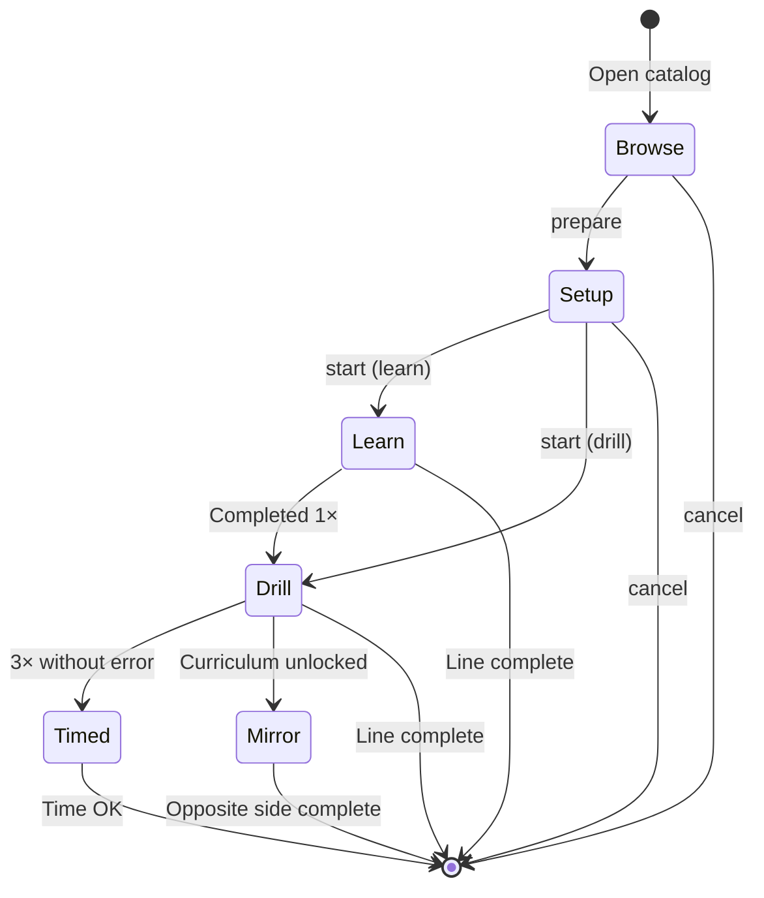
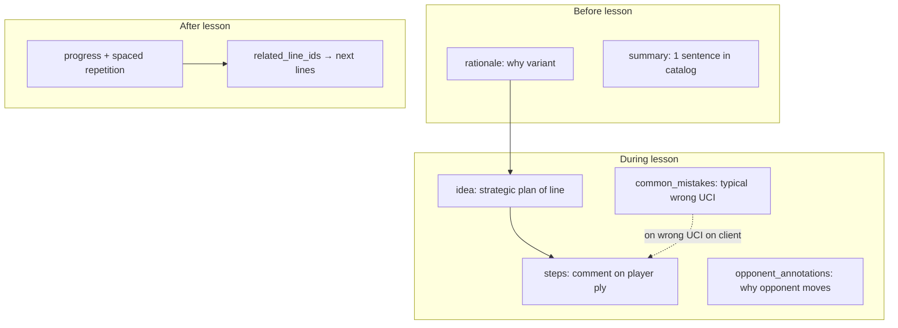
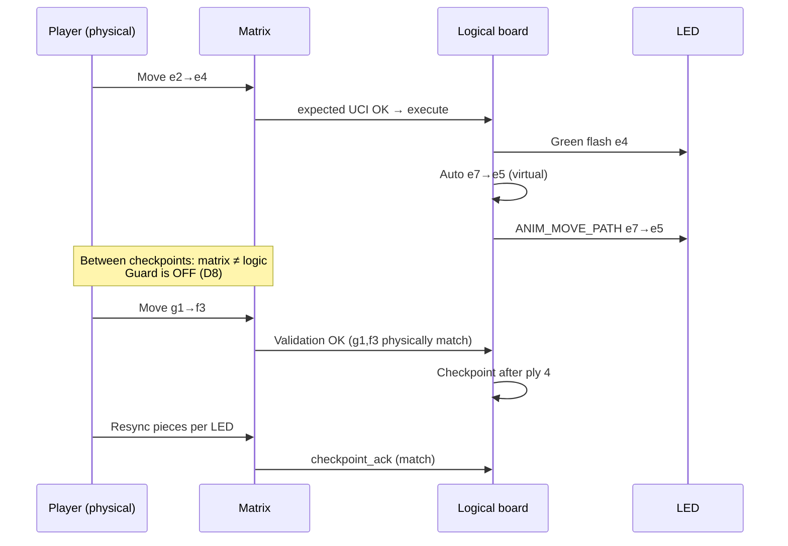
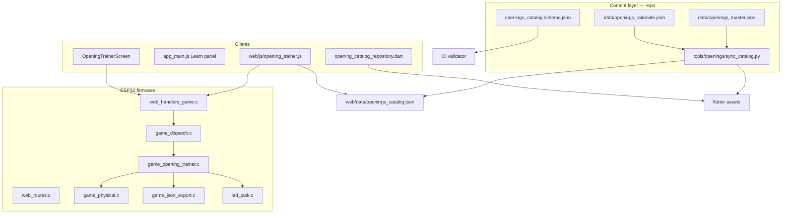
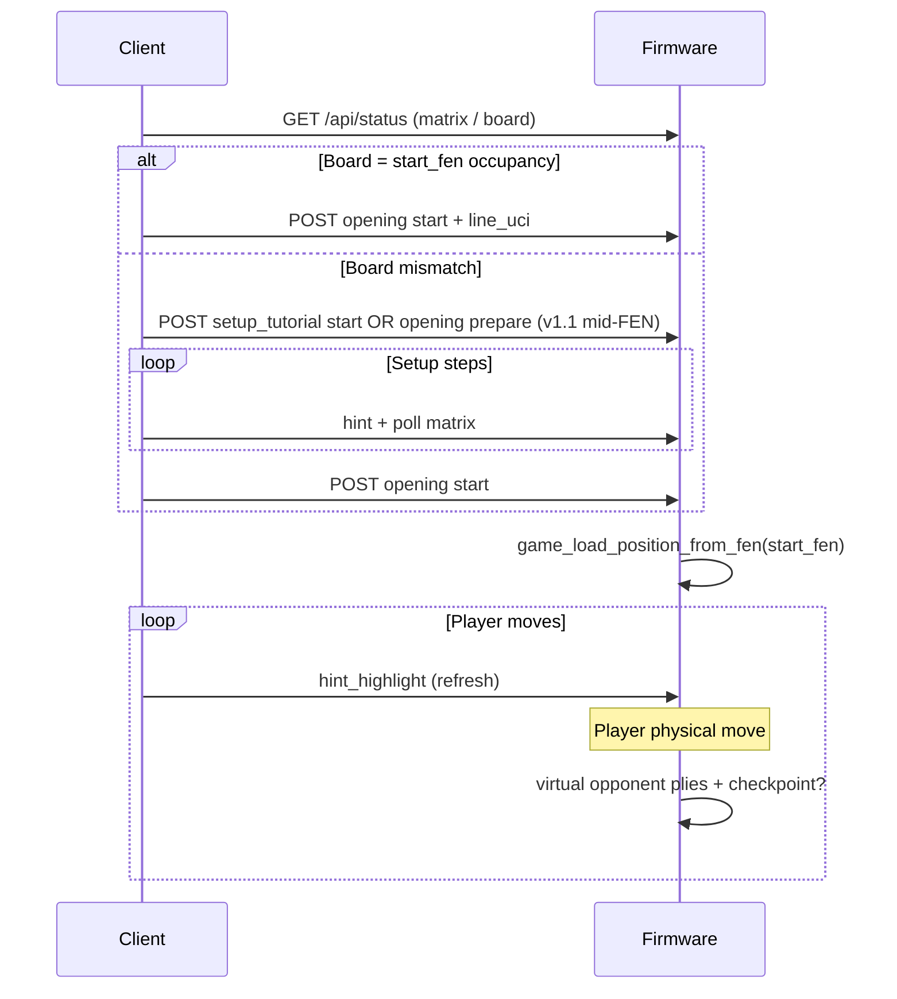
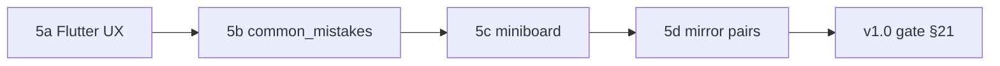

# Plan v2: Interactive Opening Trainer

**Version:** 2.5 (v1.0 release gate — 2026-07-10)  
**Status:** **v1.0 complete in code and CI** — FW + Flutter + web; catalog of 41 lines; Phases 5a–5d; BLE-only CI build; `MANUAL_TEST_CHECKLIST.md` for HW sign-off.  
**Active PR:** — (stack #9–#15 merged into `main`)  
**Goal:** Step-by-step instruction in famous openings for **White and Black**, with a physical board, LED guidance, and unified UX on web + Flutter.  
**Entry documentation:** [docs/README.md](../README.md) · [MATRIX_GUARD.md](MATRIX_GUARD.md) · [WEB_UI_DEPLOY.md](WEB_UI_DEPLOY.md) · [CZECHMATE_INTEGRATION_CHECKLIST.md](CZECHMATE_INTEGRATION_CHECKLIST.md)

### Quick overview — what to do next

| Priority | Task | Status |
|----------|------|--------|
| 1 | **HW sign-off** — `docs/testing/MANUAL_TEST_CHECKLIST.md` | ☐ manual on board |
| 2 | **v1.1** — Phase 6 (branching, mid-line FEN, SPIFFS) | backlog |
| 3 | **v1.1** — Stockfish "why this move", push notifications | backlog |

**v1.0 gate (code):** satisfied by §21 automated portion + checklist ready.

---

## 0. What is new vs v1

| Area | v1 | v2 upgrade |
|--------|----|------------|
| Decisions | 4 open questions | **Closed architecture** (§3) with rationale |
| Board | "virtual opponent" mentioned | **Physical vs logical board sync model** (§6) |
| LED | static cyan/orange | **Reuse `LED_CMD_ANIM_MOVE_PATH`** + new pulse hint (§9) |
| API | single endpoint | **Full contract** including errors, BLE, snapshot (§10) |
| Content | 24-opening table | **41 lines + curricula + rationale sidecar** (§8, §12) |
| Opponent | virtual model only | **Optional physical opponent** (`opponent_mode`) — parity with bot (§3 D10, §6.6) |
| Pedagogy | `idea` + `steps` | **`rationale`** — why this variant, instead of what, when to play (§8.6) |
| Phases | 6 coarse phases | **9 phases + 5a–5d polish + §21 release gate** with checklist (§14) |
| Code inventory | generic | **Concrete files, functions, gaps** (§5) |
| Progress | localStorage mention | **Stars, spaced repetition, curriculum unlock** (§11) |
| Sanity | — | **§20 — verification against code + HW** (matrix guard, setup, captures) |
| Build | monolithic web_server | **`CONFIG_CHESS_ENABLE_WEB_SERVER`** — HTTP optional, BLE bridge always (§3 D12, §17.1) |

---

## 0.1 Changelog v2 → v2.1 (sanity review)

| Fix | Why |
|--------|------|
| Matrix guard **must** be off in opening mode | Without it, virtual moves immediately trigger guard (logic ≠ matrix) |
| Setup **is not** puzzle-style empty board for standard FEN | `prepare` = empty board only for mid-line FEN (v1.1); v1 = starting position |
| Checkpoint = **physical resync**, not just a UI button | `checkpoint_ack` only after matrix vs logic match at checkpoint FEN |
| `game_execute_move_uci` → `game_opening_apply_uci()` | No UCI helper in code; reuse `convert_notation_to_coords` + `game_execute_move` |
| Mirror mode renamed / clarified | Not "play opponent moves in one line", but **paired line** `mirror_line_id` |
| Catalog v1: capture/castling limits | Player capture of a virtually moved piece without resync is impossible |
| Web phase 2: Flutter-first or restore embed | `/chess_app.js` currently returns 404 (`browser_ui_removed`) |

---

## 0.2 Changelog v2.1 → v2.2 (implementation review)

| Change | Why |
|--------|------|
| Catalog **41 lines** (9+9+12+11) | Original target of 30 met and extended; §12 synced with `openings_master.json` |
| **`opponent_mode`**: `physical` \| `virtual` | Player can move opponent pieces (LED like bot); default `physical` |
| **`openings_rationale.json`** sidecar | Pedagogy separated from moves; merge on `sync_catalog.py --copy` |
| Setup phase **must not** cancel opening config | `game_enter_board_setup_tutorial()` preserves active line |
| Status JSON: `setup_phase`, `physical_match`, `mistake_hint`, `wrong_move_count` | Flutter + web setup wizard and retry parity |
| Web embed **restored** | `concat_web_js.py` → `chess_app.js`; opening modules in `web/js/` |
| Learn screen **navigates** to catalog / lesson | L10/L12 → `OpeningTrainerScreen` |

---

## 0.4 Changelog v2.2 → v2.3 (build + pedagogy)

| Change | Why |
|--------|------|
| **`CONFIG_CHESS_ENABLE_WEB_SERVER`** (Kconfig) | HTTP/WS/PNG embeds optional; with `n`, BLE JSON bridge remains (opening API over GATT) |
| **§4.7 Pedagogical layers** | Clear boundary: `rationale` (variant) vs `steps` (move) vs `common_mistakes` (error) |
| **Phase 5 split** into 5a–5d | Priority: lesson UX → common_mistakes → miniboard → mirror pairs |
| **Mirror gap** documented | Only 2/41 `mirror_line_id` — ★★★★ system needs pairing or redefinition |
| **G5 clarified** | Primary client Flutter/BLE; web HTTP is optional transport |

---

## 0.5 Changelog v2.3 → v2.3.1 (repo audit)

| Fix | Why |
|--------|------|
| §6.0 physical opponent | v2.1 text ("not for v1") — contradicts D3 and `opponent_mode` implementation |
| §4.8 mirror quality | 2/41 pairs exist but **incorrectly** (`italian_giuoco_white` ↔ `sicilian_odb_black`) |
| §10.3 / §10.4 status + BLE | `physical_setup_match` → `physical_match` + `physical_synced`; BLE dispatch in `web_server_task.c` |
| §0.3 / §11.4 Flutter gaps | Rationale on web only ply 0; Flutter still whole lesson; L10/L12 without mode picker → default `virtual` |
| §0.3 steps | Data complete (192/192 comments); gap is locale in Flutter, not JSON content |

---

## 0.6 Changelog v2.3.1 → v2.4 (polish strategy)

| Change | Why |
|--------|------|
| **D13** mirror semantics | Closed: repertoire complement (white line ↔ black response), not cross-family placeholder |
| **§4.9** parity matrix | Flutter vs web — concrete gaps and fix owner |
| **§8.7–8.9** content playbook | `common_mistakes` templates, 10 mirror pairs, feedback → UI text mapping |
| **§14.1** PR bundles | Each phase 5a–5d = branch, files, tests, acceptance |
| **§21** v1.0 definition of done | Unambiguous release gate instead of vague "polish" |

---

## 0.3 Implementation status (live overview)

| Area | Status | Evidence / note |
|--------|------|------------------|
| Schema + validator | ✅ | `sync_catalog.py --validate --physical-rules` |
| FW `game_opening_trainer.c` | ✅ | start/cancel/hint/checkpoint, auto-reply |
| Matrix guard OFF in opening | ✅ | D8 in `game_task_matrix_guard_mode_conflict_active` |
| `opponent_mode` physical/virtual | ✅ | `game_physical.c` opponent move validation |
| HTTP `POST /api/game/opening` | ✅ | `web_opening_dispatch.c` |
| Status `opening_training` | ✅ | `game_json_export.c` + Flutter models |
| Catalog 41 lines | ✅ | `data/openings_master.json` |
| Rationale 41 records CS/EN | ✅ | `data/openings_rationale.json` |
| Flutter catalog + lesson | ✅ | `opening_catalog_screen.dart`, `opening_trainer_screen.dart` |
| Web opening modules | ✅ | `opening_catalog.js`, `opening_trainer.js` |
| Learn/Drill/Timed/Mirror modes | ✅ | Stars + curriculum unlock |
| Setup wizard + retry | ✅ | `setup_phase` flow both platforms |
| PGN import | ✅ | `tools/openings/pgn_to_catalog.py` |
| Optional HTTP build | ✅ | `CONFIG_CHESS_ENABLE_WEB_SERVER` — PR #10 |
| `steps[]` locale in UI | ✅ | JSON 192/192; Flutter `commentForPlayerPly(locale)` |
| `mirror_line_id` pairs | ✅ | 10 symmetric pairs §8.8; CI `--mirror-symmetric`; PR 5d |
| `common_mistakes` in UI | ✅ | 11/41 lines; FW `last_wrong_uci` + Flutter/web hint |
| Lesson UX (no debug states) | ✅ | Flutter §8.9 `OpeningFeedbackL10n`; PR 5a |
| Rationale only ply 0 (Learn) | ✅ | Flutter `_playerPly == 0`; web already had it |
| Catalog filters (side/ECO/search) | ✅ | `opening_catalog_screen.dart` PR 5a |
| L10/L12 mode picker | ✅ | `launchOpeningLessonById` + shared picker |
| Miniboard sync in lesson | ✅ | Flutter `OpeningLessonBoardPreview` + web miniboard; PR 5c |
| Stockfish "why this move" | ⬜ | Phase 5 backlog |
| Spaced repetition notifications | ⬜ | Due lines queue done; push notif backlog |
| Branching `branches[]` | ⬜ | v1.1 |
| FW-native LED pulse | ⬜ | Phase 6 backlog |

**Remaining for v1.0 polish:** §21 release gate (HW checklist, manual E2E).

---

## 1. Summary and design principles

CZECHMATE already supports **building a position step by step** (setup tutorial, puzzle prepare) and **showing a move on the LED** (`hint_highlight`). Opening Trainer combines these blocks into **`opening_trainer`** mode:

1. Catalog of **famous lines** (JSON on the client).
2. **Setup** of the default FEN (reuse wizard).
3. **Move sequence** with UCI validation on the physical board.
4. **Opponent** — optionally virtual (logical board) **or physical** (`opponent_mode: physical`, LED shows the move).
5. **Progressive modes** Learn → Drill → Timed → Mirror (both sides).

### Quality principles (non-negotiable)

| Principle | Implementation |
|---------|--------------|
| Physical board = primary input | UI only guides and explains; a move without matrix pickup/drop is invalid |
| LED readable during live lesson | FW sends hint/trace on `start` and auto-reply; client **refreshes** hint every 600 ms |
| Parity Web = Flutter = BLE | One JSON contract; no "web-only" API |
| Offline-first | Catalog in assets; FW does not need internet |
| Small PRs, green CI | Each phase = separate branch `cursor/opening-trainer-phaseN-8fdd` |
| No new monoliths | `game_opening_trainer.c` max ~400 lines; logic in existing modules |

---

## 2. Goals and non-goals

### Goals (v1.0 product)

| ID | Goal | Metric |
|----|-----|---------|
| G1 | **41 lines** (21 white + 20 black in 4 curricula) | 100 % legal UCI + rationale in CI |
| G2 | Step by step: setup → line → completion | E2E HW test 3 lines |
| G3 | Physical board + LED | 0 matrix guard regressions |
| G4 | Learn / Drill / Timed / Mirror | Each mode has HW checklist |
| G5 | Flutter + BLE parity; web HTTP optional | Same lesson from Flutter (Wi‑Fi/BLE); web only if `CONFIG_CHESS_ENABLE_WEB_SERVER=y` |
| G6 | Curriculum with unlock | 4 learning paths (§8.3) |
| G7 | Progress + stars | Stored locally; sync optionally v2 |

### Non-goals (v1.0)

- Opening book engine / unlimited Stockfish depth during drill
- Piece-type recognition on matrix (occupancy 0/1 only)
- Cloud accounts and sync across devices
- Lichess API at runtime
- Variant branching (multiple opponent responses) — **architecture ready**, content v1.1
- Deleting / renaming existing files without approval

---

## 3. Closed architecture (formerly "decisions to confirm")

| # | Decision | v2 choice | Why |
|---|------------|----------|------|
| D1 | Where catalog lives | **Client** (`openings_catalog.json`) | Save ESP flash; content updates with app/web without OTA |
| D2 | Line format | **Full `line_uci[]`** + `player_ply_indices[]` | FW simply iterates plies; opponent and player in same array |
| D3 | Opponent | **`opponent_mode`**: `virtual` (logic) or `physical` (player moves piece) | Default `physical` = same UX as bot; `virtual` = faster, requires checkpoint |
| D4 | FW mode | **Separate `opening_trainer`** | Puzzle = 1 move; opening = state machine with auto-reply — different semantics |
| D5 | Setup starting position | **Standard FEN: skip empty prepare** | If `game_is_physical_board_starting_occupancy()` → straight to `start`; else setup wizard (32 steps). Empty-board `prepare` only for mid-line FEN (v1.1) |
| D6 | Hint LED | **Client refresh 600 ms** + FW internal hint after auto-reply | Reuse `SETUP_TUTORIAL_REFRESH_MS`; FW-native pulse = Phase 6 |
| D7 | `GAME_CMD` slot | **`GAME_CMD_OPENING_TRAINER`** in `chess_types.h` | Consistent with puzzle/setup pattern |
| D8 | Matrix guard | **Off for entire active lesson** (`virtual` opponent) | With `physical` opponent board stays in sync — guard still off for mode consistency |
| D9 | Move validation | **First expected UCI, then `game_is_valid_move`** | Wrong destination = opening feedback; legality from logical board |
| D10 | Opponent choice | **`opponent_mode` in `start` request** | `physical`: FW waits for opponent pickup/drop, feedback `opponent_turn`; `virtual`: auto-reply on logic |
| D11 | Variant pedagogy | **Sidecar `openings_rationale.json`** | Merge into export; master holds moves, rationale editable without touching UCI |
| D12 | HTTP web server build | **`CONFIG_CHESS_ENABLE_WEB_SERVER`** (default y) | `n` = no `esp_http_server`/mDNS/PNG; opening API over BLE + `web_opening_dispatch.c` in lite bridge |
| D13 | Mirror semantics v1.0 | **`mirror_line_id` = repertoire complement** | White attacking line ↔ black response in same **position type** (e4/e5, d4, KID…). **Not** random cross-family pair. Symmetry: both records reference each other. See §8.8 |

### 3.1 Firmware build profiles

| Profile | Kconfig | Opening trainer transport | Typical use |
|--------|---------|---------------------------|-----------------|
| **Full** (default) | `CONFIG_CHESS_ENABLE_WEB_SERVER=y` | HTTP `POST /api/game/opening` + BLE + web UI | Development, LAN, browser client |
| **BLE-only** | `CONFIG_CHESS_ENABLE_WEB_SERVER=n` | BLE JSON (`cmd: opening`) + snapshot GATT | Smaller flash/RAM, factory test, mobile app only |

```bash
idf.py menuconfig
# CzechMate firmware → [ ] Enable HTTP web server (WiFi AP/STA UI + REST)

idf.py fullclean reconfigure build
```

With `n`: task `web_server_task` runs as **remote bridge** (snapshots, `web_server_ble_command_dispatch`, opening dispatch). WiFi AP/HTTP does not start at boot.

---

## 4. User modes and pedagogy

### 4.1 Training modes


```mermaid
stateDiagram-v2
  [*] --> Browse: Open catalog
  Browse --> Setup: prepare
  Setup --> Learn: start (learn)
  Setup --> Drill: start (drill)
  Learn --> Drill: Completed 1×
  Drill --> Timed: 3× without error
  Drill --> Mirror: Curriculum unlocked
  Timed --> [*]: Time OK
  Learn --> [*]: Line complete
  Drill --> [*]: Line complete
  Mirror --> [*]: Opposite side complete
  Browse --> [*]: cancel
  Setup --> [*]: cancel
```

| Mode | Behavior | LED | UI |
|-------|---------|-----|-----|
| **Learn** | Comment on every player ply; rationale at intro; opponent per `opponent_mode` | Gold pulse `to`; cyan `from` after pickup; with physical also opponent move LED | Large text + rationale panel + progress |
| **Drill** | Only "Move N/M"; no comments | `to` only; after 3 errors `mistake_hint` | Minimal panel |
| **Timed** | Drill + timer (whole line or/move) | Same + red pulse under 5 s | Timer ring |
| **Mirror** | Separate **paired line** (`mirror_line_id`, typically opposite color) | Same LED | Badge "Training Black against 1.e4" |
| **Review** | Browse completed line without HW | Animation on miniboard | App only (no FW) |

### 4.2 Stars and mastery

| Star | Condition |
|--------|----------|
| ★ | Completed in Learn |
| ★★ | Completed in Drill ≤ 2 errors |
| ★★★ | Completed in Timed within limit |
| ★★★★ | Completed **paired** line `mirror_line_id` with ★★ |

Progress key: `opening_progress_v1` → `{ "line_id": { "stars": 3, "best_drill_errors": 1, "last_completed_at": "ISO" } }`.

### 4.4 Opponent mode (`opponent_mode`)

| Mode | Who moves opponent piece | Logical board | Matrix | Typical use |
|-------|---------------------------|---------------|--------|-----------------|
| **`physical`** (default) | Player — LED shows `from`→`to` | Move applied after physical drop | **In sync** with logic | Club practice, beginners, parity with bot |
| **`virtual`** | FW auto-reply | Opponent moves virtually | **May diverge** (ghost) | Faster drill; requires checkpoint resync |

Choice in **mode picker** (Flutter SegmentedButton; web same contract in `openingStartPayload`).

---

### 4.5 Variant rationale (`rationale`)

Each line = one variant. Besides `idea` (strategic motive), the exported catalog has a **`rationale`** block:

| Field | UI purpose |
|------|-----------|
| `summary` | Subtitle in catalog list (1 sentence) |
| `why_this_line` | Why this line is taught |
| `instead_of` | Main alternative and why not |
| `when_to_play` | Practical context (tournament, club, style) |
| `related_line_ids` | Clickable related lines in mode picker |

Source: `data/openings_rationale.json` (sidecar). Detail §8.6.

---

### 4.7 Pedagogical layers (what goes where)

Rationale answers **"why this variant in the repertoire"**, not **"what to play on this ply"**.


```mermaid
flowchart TB
  subgraph before [Before lesson]
    R[rationale: why variant]
    S[summary: 1 sentence in catalog]
  end
  subgraph during [During lesson]
    I[idea: strategic plan of line]
    C[steps: comment on player ply]
    O[opponent_annotations: why opponent moves]
    M[common_mistakes: typical wrong UCI]
  end
  subgraph after [After lesson]
    P[progress + spaced repetition]
    F[related_line_ids → next lines]
  end
  R --> I
  I --> C
  M -.->|on wrong UCI on client| C
  P --> F
```

| Layer | Source | When in UI |
|--------|-------|----------|
| `summary` / rationale | `openings_rationale.json` | Catalog + mode picker |
| `idea` | `openings_master.json` | Lesson intro (Learn) |
| `steps[]` | master, per `ply_index` | Every player move |
| `opponent_annotations` | master (backlog) | `opponent_turn` (physical mode) |
| `common_mistakes` | master (backlog) | Client validation before sending move |

**Rule:** rationale **does not belong** in `steps` — edit without touching UCI.

---

### 4.8 Mirror mode and ★★★★ star

| Status | Detail |
|------|--------|
| Mode implementation | ✅ Separate paired line via `mirror_line_id` |
| Content | ✅ **10/10** symmetric pairs §8.8 |
| Pair quality | ⚠️ Both existing pairs are **wrong**: `italian_giuoco_white` ↔ `sicilian_odb_black` (cross-family, not same variant from opposite color) |
| Impact | ★★★★ unreachable for most lines; for 2 lines leads to unrelated lesson |

**Content plan (Phase 5d):** §8.8 — 10 symmetric repertoire pairs (D13); CI `--mirror-symmetric`.

---

### 4.6 Spaced repetition (Phase 7)

- Lines with ★★ join queue "review in 3 days" (`OpeningCurriculumUnlock.linesDueForReview`).
- Notifications in Flutter (local) — **backlog**; web = banner when opening catalog.

---

### 4.9 Client parity matrix (live)

| Feature | Web (`opening_trainer.js`) | Flutter | Action |
|--------|---------------------------|---------|------|
| Feedback texts | ✅ Human CS texts in panel | ⬜ `Stav: $_feedback` | 5a — `opening_feedback_l10n.dart` or l10n keys |
| Rationale in lesson | ✅ Only ply 0, Learn | ⬜ Whole lesson | 5a — condition `_playerPly == 0` |
| `idea` locale | ✅ `name.cs` / rationale locale | ⬜ Only `ideaCs` | 5a — `ideaForLocale()` |
| `steps` locale | ✅ reads both languages from JSON | ⬜ Only `stepCommentsCs` | 5a — `commentForPlayerPly(locale)` |
| Mode picker | ✅ Before start | ✅ Catalog yes; L10/L12 no | 5a — `_pickMode` or `physical` default |
| `common_mistakes` | ⬜ | ⬜ | 5b |
| Miniboard | ✅ | ✅ | 5c — `OpeningLessonBoardPreview` + web `#opening-trainer-board` |
| Catalog filters | ⬜ | ⬜ | 5a — `SearchBar` + chip filters |
| Progress / stars | ✅ localStorage | ✅ SharedPreferences | — |
| BLE opening API | — | ✅ | — |

**Rule:** new opening UI feature = **Flutter first** (primary client), web copies in same PR or following one.

---

## 5. Existing code inventory (audit)

### 5.1 What to reuse directly

| Need | File | Symbol / detail |
|---------|--------|-----------------|
| Puzzle lifecycle pattern | `game_puzzle.c` | `enter_setup` → `start` → `cancel`; feedback enum |
| Setup tutorial FW | `game_init.c` | `game_enter_board_setup_tutorial()`, `game_finish_board_setup_tutorial_from_web()` |
| Physical validation | `game_physical.c` | `game_process_drop_command` — error recovery, blink |
| Matrix guard | `game_task.c` | `game_task_matrix_guard_mode_conflict_active()` — **extend** |
| Status JSON | `game_json_export.c` | `game_get_status_json()` — add `opening_training` |
| HTTP handlers | `web_handlers_game.c` | Pattern `http_post_game_puzzle_handler`, `setup_tutorial` |
| Routes | `web_routes.c` | Register `POST /api/game/opening` |
| LED hint | `web_handlers_game.c` | `web_server_apply_hint_highlight_json_body` |
| LED move animation | `led_task.c` | `LED_CMD_ANIM_MOVE_PATH` → `led_anim_move_path()` (~line 2207) |
| LED hint colors | `led_task.c` | cyan from / orange to (`LED_CMD_HIGHLIGHT_HINT`) |
| Web setup UX | `web/js/app_main.js` | `SETUP_TUTORIAL_*`, `buildPuzzleSetupStepsFromFen()` |
| Web prefs/API | `web/js/api.js`, `prefs.js` | `apiPostJson`, auth headers |
| Flutter setup | `board_setup_wizard_screen.dart` | Matrix poll 400 ms, LED refresh 900 ms |
| Flutter FEN steps | `board_setup_fen_steps.dart` | `BoardSetupFenSteps.build(fen)` |
| Flutter API | `board_api_client.dart` | `postSetupTutorial`, `postHintHighlight*` |
| Flutter session | `board_session_notifier.dart` | `postSetupTutorialAction`, `postHintDestination` |
| BLE parity | `ble_czechmate_client.dart` | `postSetupTutorial`, `postHintHighlightDestinationOnly` |
| ECO labels | `opening_eco.dart` | Extend mapping for catalog cards |

### 5.2 Critical gaps — original (Phase 1) → v2.3 status

| Gap (original) | v2.3 status |
|-------------------|-----------|
| No `game_opening_trainer.c` | ✅ Implemented |
| No `POST /api/game/opening` | ✅ `web_opening_dispatch.c` |
| Puzzle = 1 move | ✅ Branch in `game_physical.c` |
| Flutter does not call opening API | ✅ `postOpeningAction` |
| Status JSON without `opening_training` | ✅ Export + parity |
| `openings_catalog.json` missing | ✅ 41 lines + rationale in assets |

**Remaining gaps (polish):** Phases 5a–5d — see §14; FW-native LED pulse (Phase 6).

### 5.3 Mode mutual exclusion and matrix guard

Extend `game_task_matrix_guard_mode_conflict_active()` (`game_task.c` ~1801) and hint gating (`app_main.js` ~1158):

```c
|| game_is_opening_trainer_active()
|| game_is_opening_trainer_setup_active()
```

**Why this is mandatory (not just "block other modes"):**  
`game_matrix_guard.c` with `mode_conflict_active()` **ignores guard** and lets UP/DN continue. Virtual opponent moves intentionally create logic ↔ matrix difference (§6). Without D8, guard would pause the game after first auto-reply.

Also extend:

- `game_matrix_guard_check_resync_after_restore()` — skip when opening trainer active
- `game_physical.c` — pickup/drop allowed even when matrix ≠ logic (guard inactive)

Block simultaneously: normal game, puzzle, setup tutorial, bot move, Stockfish hint.

---

## 6. Physical vs logical board sync model

**Most important design problem.** Matrix sees occupancy only; opponent plays virtually. This model **only makes sense with D8** (guard off) and **physical checkpoint resync**.

### 6.0 Verdict: does it make sense?

| Question | Answer |
|--------|---------|
| Can player moves be validated? | **Yes** — compare `(from,to)` with UCI + `game_is_valid_move` on logical board |
| Does matrix guard trigger? | **Yes, without D8** — after 1st virtual move. **Fix:** opening in `mode_conflict_active` |
| Can capture be played in line? | **Only with care** — see §6.5 and §8.5 |
| Is physical opponent better? | **Depends on goal** — default `physical` (D3): board = logic, parity with bot; `virtual` faster but ghost pieces |
| v2.0 HW alternative? | Hall sensors with piece type — out of V1 scope |

**Conclusion:** Plan is feasible on V1 reed board if D8 + checkpoint resync + catalog rules are followed.

### 6.1 Rules

| Phase | Logical board | Physical board (matrix) |
|------|---------------|------------------------|
| **Setup** | `game_load_position_from_fen(start_fen)` after physical match confirmed | Player has pieces on starting position (wizard only if mismatch) |
| **Player move** | Player UCI move expected | Pickup/drop must match `expected_from/to` |
| **Opponent move (`virtual`)** | `game_opening_apply_uci()` on logic | **No matrix change** |
| **Opponent move (`physical`)** | After player physical drop | **Matrix and logic both change** — feedback `opponent_turn` |
| **Checkpoint** | FEN after `ply_index` | **Player physically aligns** via LED diff wizard |
| **After checkpoint** | Logic = matrix match (0/1) | Next player move continues |

### 6.2 Consequence: "ghost" pieces (between checkpoints)

Between checkpoints **physical board ≠ logical position** — intentional, not a bug.

**v1 mitigation:**

1. **Checkpoint = physical resync** (not just "OK" button): client compares `matrix_occupied` vs occupancy from logical FEN; FW accepts `checkpoint_ack` only on match (or 0 diff tolerance).
2. **Resync wizard:** reuse `BoardSetupFenSteps` — only squares where occupancy differs (max ~8 pieces after 4 moves).
3. **Learn mode:** after auto-reply pause 1.5 s + `led_anim_move_path` + text "Opponent played … (virtually)".
4. **Drill/Timed:** checkpoint **mandatory** before next player move.


```mermaid
sequenceDiagram
  participant P as Player (physical)
  participant M as Matrix
  participant L as Logical board
  participant LED as LED

  P->>M: Move e2→e4
  M->>L: expected UCI OK → execute
  L->>LED: Green flash e4
  L->>L: Auto e7→e5 (virtual)
  L->>LED: ANIM_MOVE_PATH e7→e5
  Note over P,M: Between checkpoints: matrix ≠ logic<br/>Guard is OFF (D8)
  P->>M: Move g1→f3
  M->>L: Validation OK (g1,f3 physically match)
  L->>L: Checkpoint after ply 4
  P->>M: Resync pieces per LED
  M->>L: checkpoint_ack (match)
```

### 6.3 Why two opponent modes

| Mode | Advantage | Disadvantage |
|-------|--------|----------|
| **`physical`** | Same UX as playing bot; board = logic; no ghost pieces | More physical moves |
| **`virtual`** | Fewer moves; faster line completion | Ghost pieces between checkpoints; D8 required |

### 6.4 Why not force physical opponent only

V1 keeps **both choices** — beginners prefer `physical`, advanced drill may choose `virtual`.

### 6.5 Matrix guard — mandatory integration

```c
// game_matrix_guard.c — existing behavior (~line 151):
if (game_task_matrix_guard_mode_conflict_active()) {
  // guard is IGNORED, UP/DN continues
}
```

Opening trainer **must** be in this list. Without it the virtual model is non-functional.

Additionally in `game_matrix_guard_check_resync_after_restore()`:

```c
if (game_is_opening_trainer_active() || game_is_opening_trainer_setup_active()) {
  return;  // do not activate guard after NVS restore during lesson
}
```

### 6.6 Move limits in catalog (v1)

| Move type | Allowed v1? | Condition |
|----------|--------------|----------|
| Player: quiet move (e4, Nf3) | ✅ | Always |
| Player: capture of physically present piece | ✅ | After checkpoint, when piece is on square physically |
| Player: capture on logical board only | ❌ | Forbidden v1 — validator fail |
| Opponent: capture (virtual) | ✅ | Always; checkpoint within 1–2 plies |
| Castling | ⚠️ | Only if physical resync wizard handles it — **prefer omit v1** |
| Promotion | ⚠️ | UCI 5 chars (`e7e8q`) — Phase 4+, not in initial catalog |

---

## 7. System architecture


```mermaid
flowchart TB
  subgraph content [Content layer — repo]
    Master[data/openings_master.json]
    Rationale[data/openings_rationale.json]
    Script[tools/openings/sync_catalog.py]
    Schema[openings_catalog.schema.json]
  end
  subgraph clients [Clients]
    WebMod[web/js/opening_trainer.js]
    WebUI[app_main.js Learn panel]
    FlRepo[opening_catalog_repository.dart]
    FlUI[OpeningTrainerScreen]
  end
  subgraph esp [ESP32 firmware]
    Routes[web_routes.c]
    Handler[web_handlers_game.c]
    Dispatch[game_dispatch.c]
    OT[game_opening_trainer.c]
    Phys[game_physical.c]
    JSON[game_json_export.c]
    LED[led_task.c]
  end
  Master --> Script
  Rationale --> Script
  Script --> WebData[web/data/openings_catalog.json]
  Script --> FlAssets[flutter assets]
  Schema --> CI[CI validator]
  WebMod --> WebData
  FlRepo --> FlAssets
  WebMod --> Handler
  FlUI --> Handler
  Handler --> Dispatch
  Dispatch --> OT
  OT --> Phys
  OT --> LED
  OT --> JSON
```

### Responsibility split

| Layer | Responsibility |
|--------|-------------|
| **Master JSON** | Single source of truth in `data/openings_master.json` |
| **Sync script** | Copy to web + Flutter assets; python-chess validation |
| **Firmware** | State machine, UCI validation, auto-reply, LED commands, feedback |
| **Client** | Catalog UI, texts, progress, hint refresh, checkpoint UX |

Firmware **does not know** opening names — receives `line_uci[]`, `player_ply_indices[]`, `mode`, `start_fen`.

---

## 8. Content data model

### 8.1 File locations

```
data/openings_master.json              # source of truth — moves, curricula (git)
data/openings_rationale.json           # sidecar — variant pedagogy (git)
data/openings_rationale.schema.json    # rationale schema
data/openings_catalog.schema.json      # JSON Schema draft-07 (export + master)
tools/openings/sync_catalog.py         # validation + merge rationale + copy
tools/openings/pgn_to_catalog.py       # import from PGN
components/web_server_task/web/data/openings_catalog.json
flutter_czechmate/assets/data/openings_catalog.json
```

### 8.2 Catalog schema v2

```json
{
  "$schema": "../openings_catalog.schema.json",
  "version": 2,
  "locale_default": "cs",
  "curricula": [
    {
      "id": "white_classics",
      "name": { "cs": "Klasická bílá", "en": "White classics" },
      "line_ids": ["italian_giuoco_white", "spanish_berlin_white"]
    }
  ],
  "openings": [
    {
      "id": "italian_giuoco_white",
      "eco": "C50",
      "family": "italian",
      "name": { "cs": "Italská hra — Giuoco Piano", "en": "Italian Game — Giuoco Piano" },
      "side": "white",
      "difficulty": 2,
      "tags": ["classical", "e4", "development"],
      "idea": { "cs": "Rychlý rozvoj a tlak na f7.", "en": "Rapid development and pressure on f7." },
      "start_fen": "rnbqkbnr/pppppppp/8/8/8/8/PPPPPPPP/RNBQKBNR w KQkq - 0 1",
      "line_uci": ["e2e4", "e7e5", "g1f3", "b8c6", "f1c4", "f8c5", "c2c3", "g8f6"],
      "player_ply_indices": [0, 2, 4, 6],
      "checkpoint_ply_indices": [4],
      "steps": [
        {
          "ply_index": 0,
          "comment": { "cs": "Ovládni centrum e4.", "en": "Control the center with e4." },
          "arrow": { "from": "e2", "to": "e4" }
        },
        {
          "ply_index": 2,
          "comment": { "cs": "Rozviň jezdce na f3.", "en": "Develop the knight to f3." }
        }
      ],
      "opponent_annotations": [
        {
          "ply_index": 1,
          "comment": { "cs": "Černý odpovídá symetricky v centru.", "en": "Black mirrors in the center." }
        }
      ],
      "common_mistakes": [
        {
          "wrong_uci": "f1b5",
          "at_ply_index": 4,
          "hint": { "cs": "Nejdřív c4 — španělská je jiná lekce.", "en": "Play c4 first — Spanish is another lesson." }
        }
      ],
      "mirror_line_id": "italian_giuoco_black",
      "prerequisites": []
    }
  ]
}
```

**Rules:**

- `line_uci` = **complete** sequence including opponent.
- `player_ply_indices` = indices where **player physical move is expected**.
- `steps[]` references `ply_index` (not duplicate UCI).
- `checkpoint_ply_indices` = after this ply **mandatory physical resync** before next player move.
- `common_mistakes` = **client only** v1 (compare before sending move); FW v1.1.
- For `side: "black"`: first white plies in `line_uci` auto-play virtually; player starts at `player_ply_indices[0]`.

> **Data status (2026-07-10):** `mirror_line_id` — 10 symmetric repertoire pairs §8.8 (20 lines). `common_mistakes` in 11 lines.

### 8.5 Content validation (CI + python-chess)

Besides §8.4 pipeline add checks:

1. **Legal UCI** — every move from `start_fen`.
2. **Player capture rule** — for each `player_ply_indices[i]` with capture: either `requires_checkpoint_before: true`, or capture target was physically on board after previous checkpoint (simulation).
3. **No castling** in `line_uci` v1 (`e1g1`, `e8c8`, …) — fail CI.
4. **Max 12 plies**, max 6 player moves.
5. **`checkpoint_ply_indices`** must be ≤ last virtual opponent move before next player capture (if any).

Script: `tools/openings/sync_catalog.py --validate --physical-rules`

### 8.3 Learning paths (curricula) — 41 lines

| ID | Name | Line count | Unlock |
|----|-------|-------------|----------|
| `basics_white` | White basics | 9 | Always |
| `basics_black` | Black basics | 9 | After 2× `basics_white` ★ |
| `classical_deep` | Classical deeper | 12 | After `basics_*` ★★ |
| `systems` | System play | 11 | After 5 lines ★★ total |

### 8.6 Sidecar rationale (variant pedagogy)

**Why sidecar:** author texts change often; UCI lines stay stable. CI validates 1:1 coverage.

```json
{
  "version": 1,
  "entries": {
    "italian_giuoco_white": {
      "summary": { "cs": "Nejklidnější italská…", "en": "The calmest Italian…" },
      "why_this_line": { "cs": "…", "en": "…" },
      "instead_of": { "cs": "Místo Two Knights…", "en": "Instead of Two Knights…" },
      "when_to_play": { "cs": "…", "en": "…" },
      "related_line_ids": ["italian_two_knights_white", "spanish_berlin_white"]
    }
  }
}
```

**Pipeline:**

```bash
python3 tools/openings/sync_catalog.py --validate --physical-rules  # rationale coverage check
python3 tools/openings/sync_catalog.py --copy                       # merge → web + Flutter
python3 components/web_server_task/tools/concat_web_js.py           # web bundle
```

**UI mapping:** see §4.5. Files: `opening_rationale.dart`, `OpeningRationalePanel`.

### 8.7 Content authorship — playbook (Phase 5b/5d)

**Who edits what:**

| File | Who | Change frequency |
|--------|-----|----------------|
| `openings_master.json` | Line author (UCI, steps, mistakes) | Rarely |
| `openings_rationale.json` | Text author (variant pedagogy) | Often |
| Export web/flutter | CI / `sync_catalog.py --copy` | Automatic |

**`common_mistakes` template (min. 1 per line in 5b):**

```json
{
  "wrong_uci": "f1b5",
  "at_ply_index": 4,
  "hint": {
    "cs": "Nejdřív c4 — španělská je jiná lekce.",
    "en": "Play c4 first — the Spanish is a separate lesson."
  }
}
```

Rules:
- `at_ply_index` ∈ `player_ply_indices` and `wrong_uci` is **legal** move from that position, but ≠ expected.
- Max 2 records per line v1.0 (do not overload UI).
- Hint explains **why another variant**, not just "wrong".

**`opponent_annotations` template (5a, optional):**

```json
{
  "ply_index": 1,
  "comment": {
    "cs": "Černý symetricky drží centrum e5.",
    "en": "Black mirrors central control with ...e5."
  }
}
```

Show on `feedback: opponent_turn` and `opponent_mode: physical`.

**CI extension (planned):**

```bash
python3 tools/openings/sync_catalog.py --validate --physical-rules --mirror-symmetric
```

`--mirror-symmetric`: every `mirror_line_id` must exist, be opposite `side`, and reference back to same `id`.

### 8.8 Mirror pairs v1.0 — target 10 (D13)

Current state: **wrong** cross pair `italian_giuoco_white` ↔ `sicilian_odb_black` — **remove** and replace with table below.

| # | White line (`mirror_line_id` →) | Black line (→ back) | Pedagogical relation |
|---|--------------------------------|----------------------|-------------------|
| 1 | `italian_giuoco_white` | `petrov_black` | 1.e4 e5 classic — attack vs solid defense |
| 2 | `london_system_white` | `slav_defence_black` | d4 system vs structural Black |
| 3 | `four_knights_white` | `caro_kann_classical_black` | Quiet development vs solid ground |
| 4 | `scotch_game_white` | `pirc_classical_black` | Open e4 vs hypermodern Pirc |
| 5 | `spanish_berlin_white` | `sicilian_odb_black` | 1.e4 — Spanish vs Sicilian |
| 6 | `queens_gambit_white` | `queens_gambit_declined_black` | Same gambit pair |
| 7 | `vienna_white` | `alekhine_defence_black` | Aggressive e4 vs provocation |
| 8 | `colle_system_white` | `dutch_defence_black` | White system vs dynamic Dutch |
| 9 | `reti_opening_white` | `nimzo_indian_black` | Flank vs Indian system |
| 10 | `english_four_knights_white` | `kings_indian_black` | Flank e4 vs KID |

**Implementation steps (5d):**
1. In `openings_master.json` set bidirectional `mirror_line_id`.
2. Run `sync_catalog.py --validate --mirror-symmetric` (new flag).
3. Verify Mirror mode in UI: badge "Training Black against …" with paired line name.
4. Manual HW test 2 pairs (one e4, one d4).

> **v1.1 backlog:** "true" mirror of same UCI sequence from opposite color (requires new lines like `italian_giuoco_black`).

### 8.9 Feedback → UI text mapping (Phase 5a)

Firmware sends technical `feedback`; client shows human text. **Web partially implemented** — Flutter should adopt same table (l10n).

| `feedback` | CS (Learn) | EN (Learn) | Drill/Timed |
|------------|------------|------------|-------------|
| `none` | Táhni: `{from}` → `{to}` | Play: `{from}` → `{to}` | Move N/M |
| `correct` | Správně! | Correct! | (no text) |
| `wrong` | To není plánovaný tah. Zkus znovu. | Not the planned move. Try again. | Error |
| `illegal` | Tah není legální. | Illegal move. | Error |
| `mistake_hint` | Po 3 chybách — hint: `{from}` → `{to}` | After 3 errors — hint: … | Hint |
| `opponent_turn` | Tah soupeře: `{from}` → `{to}` | Opponent: `{from}` → `{to}` | (minimal) |
| `checkpoint` | Srovnej desku s logickou pozicí | Sync the board to the logical position | — |
| `complete` | Linie dokončena! | Line complete! | Done |

**Forbidden in production UI:** raw `feedback` enum dump (`Status: wrong`).

### 8.4 Content pipeline

```bash
# Local validation (including rationale sidecar)
python3 tools/openings/sync_catalog.py --validate --physical-rules
python3 tools/openings/sync_catalog.py --copy   # → web + flutter assets (+ rationale merge)

# Import from PGN study
python3 tools/openings/pgn_to_catalog.py --pgn studies/italian.pgn --id italian_giuoco_white
```

**CI job `openings-catalog`:**

1. JSON Schema validate `data/openings_master.json`
2. Rationale coverage: every `opening.id` ∈ `openings_rationale.json`
3. python-chess: every UCI move legal from `start_fen`
4. `--physical-rules`: capture/castling/ghost rules
5. Duplicate `id` = fail
6. Web/flutter files **same hash** as script output

---

## 9. LED and animation — specification

### 9.1 Existing building blocks

| Effect | Mechanism | File |
|-------|-------------|--------|
| Hint from/to | `POST /api/game/hint_highlight` | `web_handlers_game.c` |
| Clear | `POST /api/game/hint_clear` | `web_handlers_game.c` |
| Move trace | `LED_CMD_ANIM_MOVE_PATH` | `led_task.c` `led_anim_move_path` |
| Error | `game_show_invalid_move_error_with_blink` | error recovery |
| End | `LED_CMD_ANIM_ENDGAME` | `led_task.c` |

### 9.2 Opening-specific behavior

| Event | FW action | Color / animation |
|---------|---------|-----------------|
| Waiting for player | `hint_highlight` (client refresh 600 ms) | Orange `to`; cyan `from` after pickup |
| Correct move | `led_anim_move_path` 300 ms + clear | Green trace |
| Wrong move | error blink | Red on `to` |
| Opponent auto-reply | `led_anim_move_path(from,to)` | Blue trace 1 s |
| Checkpoint | `hint_highlight` on diff squares | Purple (new optional color v1.1) |
| Line complete | `LED_CMD_ANIM_ENDGAME` shortened | Victory wave 2 s |

### 9.3 Phase 1b — FW-native pulse (optional enhancement)

New `LED_CMD_HIGHLIGHT_HINT_PULSE` — firmware pulses `to` itself without HTTP refresh. Reduces traffic in Learn. **Backlog** if Phase 1 suffices with client refresh.

### 9.4 `led_guidance_level` integration

Respect `GET /api/status.led_guidance_level`:

| Level | Learn | Drill |
|-------|-------|-------|
| 0 (off) | UI text only | UI only |
| 1 | `to` only | `to` only |
| 2 | `from` + `to` | `to` + error blink |
| 3 | + opponent trace | + opponent trace |

---

## 10. API contract

### 10.1 Lesson flow (corrected setup flow)


```mermaid
sequenceDiagram
  participant C as Client
  participant F as Firmware

  C->>F: GET /api/status (matrix / board)
  alt Board = start_fen occupancy
    C->>F: POST opening start + line_uci
  else Board mismatch
    C->>F: POST setup_tutorial start OR opening prepare (v1.1 mid-FEN)
    loop Setup steps
      C->>F: hint + poll matrix
    end
    C->>F: POST opening start
  end
  F->>F: game_load_position_from_fen(start_fen)
  loop Player moves
    C->>F: hint_highlight (refresh)
    Note over F: Player physical move
    F->>F: virtual opponent plies + checkpoint?
  end
```

**Important:** For standard openings (`start_fen` = game start) **do not use** puzzle-style `prepare` with empty board. That would force player to place 32 pieces unnecessarily. Reserve `prepare` with `setup_phase` for v1.1 mid-line FEN.

### 10.2 `POST /api/game/opening`

**Request:**

```json
{
  "action": "start",
  "line_id": "italian_giuoco_white",
  "mode": "learn",
  "opponent_mode": "physical",
  "start_fen": "rnbqkbnr/pppppppp/8/8/8/8/PPPPPPPP/RNBQKBNR w KQkq - 0 1",
  "line_uci": ["e2e4", "e7e5", "g1f3", "b8c6", "f1c4", "f8c5", "c2c3", "g8f6"],
  "player_ply_indices": [0, 2, 4, 6],
  "checkpoint_ply_indices": [4]
}
```

| `action` | Behavior | HTTP |
|----------|---------|------|
| `prepare` | **v1.1 mid-FEN only:** empty logic + `setup_phase`. **v1 standard:** client does not use — see §10.1 | 200 |
| `start` | Load FEN, auto-play white opening plies for black lines, `active=true` | 200 |
| `cancel` | Reset; `hint_clear` | 200 |
| `hint` | Repeat LED for current expected move | 200 |
| `checkpoint_ack` | Client confirmed **physical** resync (FW verifies matrix vs logic) | 200 or 409 `resync_incomplete` |
| `pause` / `resume` | Timed mode | 200 |

**Response 200:**

```json
{
  "ok": true,
  "opening_training": {
    "active": true,
    "setup_phase": false,
    "mode": "learn",
    "opponent_mode": "physical",
    "line_id": "italian_giuoco_white",
    "ply_index": 2,
    "ply_total": 8,
    "player_ply_index": 1,
    "player_ply_total": 4,
    "player_side": "white",
    "feedback": "none",
    "message_key": "opening.await_move",
    "expected_from": "g1",
    "expected_to": "f3",
    "checkpoint_required": false,
    "awaiting_checkpoint_ack": false,
    "physical_synced": true,
    "wrong_move_count": 0,
    "mistake_hint": false
  }
}
```

**Feedback values:** `none` | `correct` | `wrong` | `mistake_hint` | `complete` | `illegal` | `checkpoint` | `opponent_turn`

With `opponent_mode: physical` and opponent move: `feedback: "opponent_turn"`, `awaiting_opponent_physical: true`, `expected_from` / `expected_to` for LED.

**Errors:**

| HTTP | `error` | When |
|------|---------|-----|
| 400 | `invalid_action` | Unknown action |
| 400 | `invalid_line` | Empty `line_uci` |
| 409 | `mode_conflict` | Active game / puzzle |
| 409 | `setup_incomplete` | `start` without physical starting position |
| 409 | `resync_incomplete` | `checkpoint_ack` but matrix ≠ logic |
| 503 | `queue_full` | Game command queue |

### 10.3 Status JSON (`GET /api/status` / snapshot)

New block (beside `puzzle`, `board_setup_tutorial`):

```json
"opening_training": {
  "active": true,
  "setup_phase": false,
  "mode": "drill",
  "line_id": "sicilian_odb_black",
  "ply_index": 5,
  "ply_total": 10,
  "player_side": "black",
  "feedback": "none",
  "message_key": "opening.await_move",
  "expected_from": "g8",
  "expected_to": "f6",
  "last_opponent_uci": "f1c4",
  "checkpoint_required": true,
  "physical_match": true
}
```

Field `physical_synced` used at checkpoint (matrix vs logic match); `physical_match` at setup/start (match with `start_fen`).

Export `matrix_occupied[64]` when `setup_phase || checkpoint_required`.

### 10.4 BLE parity

```json
{ "cmd": "opening", "action": "start", "line_id": "...", "opponent_mode": "physical", "line_uci": ["..."], "player_ply_indices": [0,2,4] }
```

Implementation: `web_server_task.c` → `web_server_ble_command_dispatch()` → `web_server_opening_dispatch_body()` (shared with HTTP handler in `web_handlers_game.c`).

### 10.5 Flutter API

```dart
// board_api_client.dart
Future<Map<String, dynamic>> postOpening(String baseUrl, Map<String, dynamic> body);

// board_session_notifier.dart
Future<void> postOpeningAction({required String action, required OpeningLine line});
```

### 10.6 Staging logs

```c
STAGING_LOGI(TAG, "opening action=%s line=%s ply=%u/%u feedback=%d",
             action, line_id, ply_index, ply_total, feedback);
```

---

## 11. Clients — UX specification

### 11.1 Information architecture

```
Learn (home)
├── Curriculum cards (4 paths)
├── Opening catalog (filter: side / difficulty / tag)
│   └── Opening detail card
│       ├── Rationale panel ("Why this variant?")
│       ├── opponent_mode choice (Physical / Virtual)
│       ├── Start Learn
│       ├── Start Drill (locked until ★)
│       └── Paired line (mirror_line_id) — locked until ★★
└── Progress summary (stars, streak)

Opening lesson (fullscreen)
├── Phase: Setup → Play → Complete
├── Miniboard (sync /api/board)
├── Instruction panel
├── Progress bar (player plies)
└── Actions: Hint | Pause | Cancel | Checkpoint OK
```

### 11.2 Web modules

> **Repo status (2026-07-10):** `chess_app.js` generated by `concat_web_js.py`; opening modules in `web/js/`.

| File | Task |
|--------|------|
| `web/js/opening_trainer.js` | Lesson state, API, progress, checkpoint, rationale (ply 0) |
| `web/js/opening_catalog.js` | Catalog + rationale in export (generated) |
| `web/js/app_main.js` | Hint gating, setup tutorial hook |
| `web/data/openings_catalog.json` | Generated asset (with rationale) |

Reuse constants: `SETUP_TUTORIAL_REFRESH_MS = 600`, `SETUP_TUTORIAL_FAST_POLL_MS = 400`, `SETUP_TUTORIAL_OCC_STABLE_TICKS = 2`.

### 11.3 Flutter files

| File | Task |
|--------|------|
| `lib/features/opening/opening_trainer_screen.dart` | Main lesson |
| `lib/features/opening/opening_catalog_screen.dart` | Catalog + filters |
| `lib/features/opening/opening_catalog_repository.dart` | Parse JSON + rationale |
| `lib/features/opening/opening_rationale.dart` | Model + `OpeningRationalePanel` |
| `lib/features/learn/learn_screen.dart` | Curriculum → catalog / direct lesson L10/L12 |
| `board_setup_wizard_screen.dart` | `BoardSetupWizardKind.openingStart` |
| `board_session_notifier.dart` | `postOpeningAction` |

### 11.4 Learn screen mapping (L10–L12)

| Lesson | Opening ID | Curriculum |
|-------|------------|------------|
| L10 Control the center | `italian_giuoco_white` | `basics_white` |
| L11 Opening principles | `meta_principles` (text-only, no FW) | — |
| L12 Ruy Lopez intro | `spanish_berlin_white` | `classical_deep` |

> **Gap (Phase 5a):** L10/L12 open `OpeningTrainerScreen` directly — **without mode picker** → constructor default `opponentMode: virtual`. Catalog via `OpeningCatalogScreen` offers choice and defaults `physical`.

### 11.5 Accessibility (a11y)

- Every step: `Semantics(label: instructionText)` on Flutter.
- Keyboard: Enter = Hint, Esc = Cancel.
- Miniboard contrast WCAG AA.
- Screen reader announces "Correct move", "Error", "Opponent played e5".

---

## 12. Catalog v1 — 41 lines

> **Source of truth:** `data/openings_master.json` · pedagogy: `data/openings_rationale.json`  
> Each line: **6–12 full moves**, checkpoint per `checkpoint_ply_indices`, no castling v1.

### 12.1 `basics_white` (9)

| ID | ECO | Plies |
|----|-----|-------|
| `italian_giuoco_white` | C50 | 8 |
| `london_system_white` | D02 | 8 |
| `four_knights_white` | C47 | 8 |
| `vienna_white` | C25 | 8 |
| `scotch_game_white` | C45 | 8 |
| `colle_system_white` | D05 | 10 |
| `italian_two_knights_white` | C55 | 10 |
| `reti_opening_white` | A06 | 10 |
| `english_four_knights_white` | A28 | 10 |

### 12.2 `basics_black` (9)

| ID | ECO | Plies |
|----|-----|-------|
| `sicilian_odb_black` | B50 | 8 |
| `caro_kann_classical_black` | B12 | 8 |
| `petrov_black` | C42 | 8 |
| `pirc_classical_black` | B07 | 8 |
| `alekhine_defence_black` | B03 | 10 |
| `slav_defence_black` | D10 | 10 |
| `dutch_defence_black` | A80 | 10 |
| `philidor_black` | C41 | 10 |
| `modern_defence_black` | B06 | 10 |

### 12.3 `classical_deep` (12)

| ID | ECO | Plies |
|----|-----|-------|
| `spanish_berlin_white` | C60 | 6 |
| `queens_gambit_white` | D06 | 8 |
| `queens_gambit_declined_black` | D30 | 10 |
| `french_classical_black` | C11 | 10 |
| `nimzo_indian_black` | E20 | 10 |
| `torre_attack_white` | A46 | 10 |
| `ruy_lopez_classical_white` | C78 | 10 |
| `queens_indian_black` | E12 | 10 |
| `kings_indian_black` | E60 | 10 |
| `kings_gambit_declined_white` | C30 | 10 |
| `sicilian_closed_black` | B23 | 10 |
| `semi_slav_black` | D45 | 10 |

### 12.4 `systems` (11)

| ID | ECO | Plies |
|----|-----|-------|
| `english_reversed_white` | A13 | 9 |
| `catalan_white` | E00 | 9 |
| `trompowsky_white` | A45 | 8 |
| `english_symmetrical_white` | A35 | 10 |
| `london_vs_kid_white` | A47 | 10 |
| `bogo_indian_black` | E11 | 10 |
| `grunfeld_black` | D70 | 10 |
| `catalan_vs_slav_white` | E00 | 10 |
| `sicilian_alapin_white` | B22 | 10 |
| `chigorin_black` | D07 | 10 |
| `owen_defence_black` | B00 | 10 |

---

## 13. Firmware — `game_opening_trainer.c`

### 13.1 State machine

```c
typedef enum {
  OPENING_FEEDBACK_NONE = 0,
  OPENING_FEEDBACK_CORRECT,
  OPENING_FEEDBACK_WRONG,
  OPENING_FEEDBACK_MISTAKE_HINT,
  OPENING_FEEDBACK_ILLEGAL,
  OPENING_FEEDBACK_COMPLETE,
  OPENING_FEEDBACK_CHECKPOINT
} opening_feedback_t;

typedef enum {
  OPENING_MODE_LEARN = 0,
  OPENING_MODE_DRILL,
  OPENING_MODE_TIMED,
  OPENING_MODE_MIRROR
} opening_mode_t;

typedef struct {
  bool active;
  bool setup_phase;
  opening_mode_t mode;
  char line_id[48];
  char start_fen[120];
  char line_uci[OPENING_MAX_PLIES][5];  /* OPENING_MAX_PLIES = 16 */
  uint8_t line_uci_count;
  uint8_t player_ply_indices[OPENING_MAX_PLIES];
  uint8_t player_ply_count;
  uint8_t checkpoint_ply_indices[4];
  uint8_t checkpoint_count;
  uint8_t ply_index;
  uint8_t player_ply_index;  /* which player move in sequence (0..player_ply_count-1) */
  char expected_from[3];
  char expected_to[3];
  opening_feedback_t feedback;
  player_t player_side;
  bool awaiting_checkpoint_ack;
  uint64_t timed_deadline_ms;
} opening_trainer_state_t;
```

### 13.2 Integration points (file by file)

| File | Change |
|--------|-------|
| `chess_types.h` | `GAME_CMD_OPENING_TRAINER`, payload struct |
| `game_opening_trainer.c` | **NEW** — full state machine |
| `game_task_internal.h` | Export state, hooks for physical |
| `game_physical.c` | Branch `opening_trainer_active` before/after puzzle |
| `game_dispatch.c` | Handler `GAME_CMD_OPENING_TRAINER` |
| `game_init.c` | Mutual exclusion with puzzle/tutorial |
| `game_json_export.c` | Section `opening_training` |
| `game_task.c` | Matrix guard extension |
| `web_handlers_game.c` | `http_post_game_opening_handler` |
| `web_routes.c` | Route registration (only if `CONFIG_CHESS_ENABLE_WEB_SERVER=y`) |
| `web_server_task.c` | BLE `opening` cmd → `web_server_opening_dispatch_body` |
| `game_task/CMakeLists.txt` | Add `game_opening_trainer.c` |

### 13.3 Main functions

```c
bool game_opening_apply_uci(const char *uci);  /* parse 4–5 chars → game_execute_move */
esp_err_t game_opening_prepare(const opening_load_request_t *req);
esp_err_t game_opening_start(void);
esp_err_t game_opening_cancel(void);
bool game_opening_validate_checkpoint_physical(void);  /* matrix vs logic */
bool game_opening_on_physical_move(uint8_t from_row, uint8_t from_col,
                                   uint8_t to_row, uint8_t to_col);
void game_opening_advance_after_correct(void);  /* auto-reply loop */
bool game_is_opening_trainer_active(void);
bool game_is_opening_trainer_setup_active(void);
```

`game_opening_apply_uci`: parse `"e2e4"` / `"e7e8q"` via `convert_notation_to_coords` (exists in `game_task.c`) + build `chess_move_t` + `game_execute_move()` — do **not** add nonexistent `game_execute_move_uci`.

### 13.4 Move validation (flow) — `game_physical.c` integration

In `game_process_drop_command`, **before** puzzle branch (~line 1609):

1. If `game_is_opening_trainer_active()` and `ply_index` is player's:
2. Compare `(from,to)` with `expected_from/to` from `line_uci[ply_index]`.
3. **Mismatch:** `OPENING_FEEDBACK_WRONG` + error blink (reuse puzzle pattern — temporarily mutate board for recovery).
4. **Match:** `game_execute_move(&move)` on logic.
5. Call `game_opening_advance_after_correct()`:
   - while next ply ∉ `player_ply_indices`: `game_opening_apply_uci()` + `led_anim_move_path`
   - if next ply ∈ `checkpoint_ply_indices`: `CHECKPOINT`, wait `checkpoint_ack` + `game_opening_validate_checkpoint_physical()`
6. **End of line:** `OPENING_FEEDBACK_COMPLETE` + `LED_CMD_ANIM_ENDGAME` (shortened).

**Note:** `game_is_valid_move` is called only after match with expected UCI — otherwise legal but "wrong variant" would pass.

---

## 14. Implementation roadmap

> **Legend:** ✅ done · 🟡 partial · ⬜ backlog

### Phase 0a — Schema and validator ✅

- [x] `data/openings_catalog.schema.json`
- [x] `data/openings_master.json` — 41 lines
- [x] `tools/openings/sync_catalog.py` including `--physical-rules` + rationale merge
- [x] CI job `openings-catalog`

### Phase 0b — PGN import ✅

- [x] `tools/openings/pgn_to_catalog.py`
- [x] Documentation in `tools/openings/README.md`

### Phase 1a — Firmware core ✅

- [x] `game_opening_trainer.c` — prepare/start/cancel/hint
- [x] `game_physical.c` — opening branch
- [x] `GAME_CMD_OPENING_TRAINER` + dispatch
- [x] `opening_training` in status JSON
- [x] Matrix guard extension

### Phase 1b — Auto-reply + LED ✅

- [x] `game_opening_advance_after_correct` + `led_anim_move_path`
- [x] Checkpoint state + `checkpoint_ack`
- [x] BLE `opening` cmd

### Phase 1c — Physical opponent ✅ (PR #9)

- [x] `opponent_mode` in API and FW
- [x] `opponent_turn` feedback + validation in `game_physical.c`
- [x] Flutter + web Physical/Virtual choice (default physical)
- [x] Setup phase preserve opening config

### Phase 2 — Web parity ✅

- [x] `web/js/opening_trainer.js`, `opening_catalog.js`
- [x] `concat_web_js.py` → `chess_app.js`
- [x] `localStorage` progress

### Phase 3 — Flutter parity ✅

- [x] `OpeningTrainerScreen`, repository, rationale model
- [x] `postOpeningAction` in notifier + BLE
- [x] Learn screen navigation L10, L12 + catalog
- [x] SharedPreferences progress

### Phase 4 — Full catalog + modes ✅

- [x] 41 lines in `openings_master.json`
- [x] Drill + Timed + Mirror
- [x] Curriculum unlock logic
- [x] Stars

### Phase 4b — Rationale pedagogy ✅ (PR #9)

- [x] `data/openings_rationale.json` — 41 CS/EN records
- [x] Merge into export; Flutter + web UI
- [x] `opening_rationale_test.dart`

### Phase 4c — Optional HTTP build ✅ (PR #10)

- [x] `CONFIG_CHESS_ENABLE_WEB_SERVER` in `main/Kconfig.projbuild`
- [x] Conditional CMake — no HTTP/mDNS/PNG when `n`
- [x] `#if CONFIG_CHESS_ENABLE_WEB_SERVER` in handlers
- [x] BLE bridge + `web_opening_dispatch.c` when `n`
- [x] UART `WEB` command reports disabled build

### Phase 5a — Lesson UX (priority 1) ✅

- [x] Replace debug `Stav: $_feedback` — `OpeningFeedbackL10n`
- [x] Rationale panel only on **ply 0** (Learn) — Flutter + web
- [x] `idea` + `steps[]`: Flutter locale (`commentForPlayerPly`, `ideaForLocale`)
- [x] L10/L12: shared `pickOpeningModeAndStart`
- [x] `opponent_annotations` on 5+ lines — 6 lines (Italian, Sicilian, London, Berlin, Petrov, QG)
- [x] Catalog filters: side + search (name/ECO)

**Acceptance:** Learn lesson without technical states; rationale visible only at intro.

### Phase 5b — `common_mistakes` (priority 2) ✅

- [x] Content: 11 lines in `openings_master.json` (12 records)
- [x] FW export `last_wrong_uci` on wrong move
- [x] UI hint on `wrong_uci` + `at_ply_index` match (Flutter + web)
- [x] CI: `validate_common_mistakes` in `sync_catalog.py` + schema

**Acceptance:** Wrong variant (e.g. `f1b5` instead of `f1c4`) shows pedagogical hint.

### Phase 5c — Miniboard in lesson (priority 3) ✅

- [x] Sync snapshot in `OpeningTrainerScreen` (`OpeningLessonBoardPreview`)
- [x] Web: miniboard in `opening_trainer.js` + CSS
- [x] Checkpoint diff highlight on miniboard (purple squares)
- [x] WCAG AA contrast — light/dark squares + sufficient overlay contrast

**Acceptance:** Player sees position without looking at physical board.

### Phase 5d — Mirror pairs + polish (priority 4) ✅

- [x] Rationale CS/EN complete (sidecar) — Phase 4b
- [x] Removed wrong cross-family pair (`italian_giuoco_white` ↔ `sicilian_odb_black`)
- [x] Implemented 10 pairs per §8.8 + `--mirror-symmetric` in sync + CI
- [x] Checkpoint "sync board" UI — mismatch list + disabled ack + miniboard diff
- [ ] Stockfish "why this move" (read-only, Learn only) — **v1.1**, not blocker
- [x] Extend `MANUAL_TEST_CHECKLIST.md` (incl. BLE-only build) — `docs/testing/MANUAL_TEST_CHECKLIST.md`

**Acceptance:** ★★★★ reachable for ≥10 lines; mirror pairs symmetric and opposite colors.

---

### 14.1 PR bundles (Phase 5 — concrete execution)


```mermaid
flowchart LR
  A[5a Flutter UX] --> B[5b common_mistakes]
  B --> C[5c miniboard]
  C --> D[5d mirror pairs]
  D --> G[v1.0 gate §21]
```

| Phase | Branch | Files (main) | Tests | Out of scope |
|------|-------|------------------|-------|-------------|
| **5a** | `cursor/opening-flutter-ux-5a-8fdd` | `opening_trainer_screen.dart`, `opening_catalog_repository.dart`, `opening_catalog_screen.dart`, `learn_screen.dart`, `app_*.arb` | `opening_trainer_ux_test.dart`, existing catalog tests | FW changes |
| **5b-data** | `cursor/opening-mistakes-content-5b-8fdd` | `openings_master.json` (10+ lines) | `sync_catalog.py --validate` | — |
| **5b-ui** | `cursor/opening-mistakes-client-5b-8fdd` | `opening_catalog_repository.dart`, `opening_trainer_screen.dart`, `opening_trainer.js` | unit test wrong_uci match | FW validation |
| **5c** | `cursor/opening-miniboard-5c-8fdd` | `opening_trainer_screen.dart`, `opening_trainer.js`, reuse board widget | widget test render FEN | new board engine |
| **5d** | `cursor/opening-mirror-pairs-5d-8fdd` | `openings_master.json`, `sync_catalog.py` (--mirror-symmetric) | CI + `opening_curriculum_unlock_test.dart` | new UCI lines |

**After each PR:** `sync_catalog.py --copy`, `flutter test`, green CI, update §0.3 in this plan.

### Phase 6 — Content v1.1 ⬜

- Mid-line FEN start (shorter setup)
- Variant branching (`branches[]` in JSON)
- SPIFFS catalog mirror on ESP
- `LED_CMD_HIGHLIGHT_HINT_PULSE` in FW

### Phase 7 — Spaced repetition 🟡

- [x] Review queue (`linesDueForReview`)
- [ ] Flutter local notifications

---

## 15. Testing

| Layer | Tool | What it tests |
|--------|---------|------------|
| JSON | `sync_catalog.py`, CI | Schema, legal UCI, hash sync |
| Firmware unit | Host test / Unity stub | UCI → from/to, ply advance |
| API | `scripts/test_opening_api.sh` | HTTP prepare/start/cancel |
| Web | Playwright (mock + live) | Catalog load, lesson state machine |
| Flutter | `flutter test` | Parse catalog, ply index, progress |
| HW | `MANUAL_TEST_CHECKLIST.md` | 3 lines × 4 modes |
| Regression | Existing CI | `idf.py build` (y + n), matrix guard, puzzle unchanged |

### Critical HW scenarios

1. Learn Italian white — 4 player moves, 3 virtual opponent replies.
2. Sicilian black — auto `e2e4` before first black move.
3. Checkpoint after ply 4 — **physical resync** + `checkpoint_ack` (409 if matrix ≠ logic).
4. Cancel during lesson — return to normal game, guard active again.
5. Matrix guard during opening — **must not** activate (D8); after `cancel` guard works normally.

---

## 16. Risks and mitigation

| Risk | Impact | Mitigation |
|--------|-------|----------|
| Ghost pieces (phys ≠ logic) | Player confusion | Checkpoint **physical resync** + text in Learn; §6 |
| Matrix guard on virtual move | Game freezes | **D8** — opening in `mode_conflict_active`; §6.4 |
| Matrix unknown piece type | Wrong piece on setup | Snapshot `/api/board` + text "queen on d1" |
| Player capture of ghost piece | Impossible move | §8.5 CI `--physical-rules`; checkpoint before capture |
| LED overwritten by other mode | Lost hint | 600 ms refresh; mode conflict guard |
| Web UI 404 | No browser client | ✅ Restored `concat_web_js.py` |
| Lines too long | Fatigue | Max 12 plies; checkpoint |
| Flutter/web drift | Different behavior | §4.9 parity matrix; §10 API contract |
| Flash overflow | Build fail | Catalog client-only; FW max 16 plies buffer; optional HTTP build (§17.1) |
| Queue overflow | API 503 | Opening commands same priority as puzzle |
| Bad PGN import | Illegal lines | CI python-chess + physical-rules |
| Bad mirror pair in data | ★★★★ leads to unrelated lesson | §8.8 + `--mirror-symmetric` CI; remove cross-family pairs |
| Timed on BLE | Latency | Timer runs on client; FW state only |

---

## 17. Performance and memory (ESP32 budget)

| Item | Estimate | Limit |
|---------|-------|-------|
| `opening_trainer_state_t` | ~400 B RAM | OK |
| `line_uci[16][5]` in RAM | 80 B | Loaded at start from HTTP body |
| Status JSON extension | +~300 B | One-shot buffer |
| LED animation | Reuse existing | No new task |
| HTTP body max | ~2 KB | Validate length in handler |

**Rule:** FW **does not store** full catalog — only active line from last `start` request.

### 17.1 Build profiles and flash budget

| Profile | `CONFIG_CHESS_ENABLE_WEB_SERVER` | Savings (approx.) | Opening transport |
|--------|-----------------------------------|---------------------|-------------------|
| Full | `y` (default) | — | HTTP + BLE + web UI |
| BLE-only | `n` | `esp_http_server`, mDNS, PNG embeds | BLE JSON + lite bridge |

Configuration detail: §3.1. With `n`, `web_server_task` remains **remote bridge** — opening API over GATT, snapshots, `web_opening_dispatch.c`.

**CI recommendation:** one job `idf.py build` with `CONFIG_CHESS_ENABLE_WEB_SERVER=n` (flash + linker regression).

---

## 18. Code references

| Area | File |
|--------|--------|
| Puzzle pattern | `components/game_task/game_puzzle.c` |
| Setup tutorial | `components/game_task/game_init.c` |
| Physical validation | `components/game_task/game_physical.c` |
| Dispatch | `components/game_task/game_dispatch.c` |
| Status JSON | `components/game_task/game_json_export.c` |
| HTTP | `components/web_server_task/web_handlers_game.c` |
| Routes | `components/web_server_task/web_routes.c` |
| LED anim | `components/led_task/led_task.c` |
| Web setup | `components/web_server_task/web/js/app_main.js` |
| Flutter wizard | `flutter_czechmate/lib/features/setup/board_setup_wizard_screen.dart` |
| Flutter learn | `flutter_czechmate/lib/features/learn/learn_screen.dart` |
| ECO | `flutter_czechmate/lib/core/utils/opening_eco.dart` |
| GAME_CMD enum | `components/freertos_chess/include/chess_types.h` |
| Kconfig web server | `main/Kconfig.projbuild` — `CONFIG_CHESS_ENABLE_WEB_SERVER` |
| Web server CMake | `components/web_server_task/CMakeLists.txt` |
| Opening BLE dispatch | `components/web_server_task/web_opening_dispatch.c` |
| Rationale sidecar | `data/openings_rationale.json` |
| Sync + merge | `tools/openings/sync_catalog.py` |

---

## 19. Reference inspiration (UX benchmark)

| Product | What to adopt | What not to do |
|---------|------------|------------|
| **Lichess Opening Trainer** | Short lines, instant feedback | Purely online without physical board |
| **Chess.com Lessons** | Comments after moves, stars | Video-heavy content |
| **CZECHMATE Setup Tutorial** | LED + matrix poll | Hardcoded 32 steps |
| **CZECHMATE Puzzle** | Single-move validation + feedback | Only 1 move |

**CZECHMATE differentiator:** the only opening trainer with **physical board + LED guidance** — UI is a supplement, not a replacement for moving pieces.

---

## 20. Sanity review — checklist (verified 2026-07-10)

| Plan claim | Repo verification | Verdict |
|-----------------|----------------|---------|
| Setup tutorial + matrix poll works | `app_main.js`, `board_setup_wizard_screen.dart` | ✅ |
| Puzzle = 1 move, opening extension | `game_puzzle.c`, `game_physical.c` | ✅ |
| `game_opening_trainer.c` exists | `components/game_task/` | ✅ |
| Matrix guard ignores opening | `game_task_matrix_guard_mode_conflict_active` | ✅ |
| `opponent_mode` physical/virtual | `game_opening_trainer.c`, `web_opening_dispatch.c` | ✅ |
| Rationale sidecar 41/41 | `openings_rationale.json` + sync merge | ✅ |
| Flutter opening API | `board_session_notifier.dart` | ✅ |
| Web `chess_app.js` | `concat_web_js.py` | ✅ |
| Learn screen → opening | `learn_screen.dart` | ✅ |
| Catalog 41 lines CI | `opening_catalog_test.dart`, `opening_rationale_test.dart` | ✅ |
| `common_mistakes` in UI | grep client + sync | ✅ Phase 5b |
| Miniboard in lesson | `opening_trainer_screen.dart`, `opening_trainer.js` | ✅ Phase 5c |
| `CONFIG_CHESS_ENABLE_WEB_SERVER=n` build | `main/Kconfig.projbuild`, CMake | ✅ CI job `build-ble-only` + `sdkconfig.defaults.ble_only` |
| `mirror_line_id` ≥10 pairs | `openings_master.json` | ✅ 10 symmetric pairs §8.8; PR 5d |
| Flutter rationale ply 0 | `opening_trainer_screen.dart` | ✅ PR 5a |
| L10/L12 default opponent | `learn_screen.dart` | ✅ mode picker |

### Recommended order (next work)

See **§14.1 PR bundles** and **§21 release gate**. Briefly: 5a → 5b → 5c → 5d → v1.0 tag.

---

## 21. Definition of done — v1.0 release gate

All items must be ✅ before marking opening trainer as **v1.0 production**.  
**Code + CI:** satisfied (2026-07-10). **HW:** see [MANUAL_TEST_CHECKLIST.md](../testing/MANUAL_TEST_CHECKLIST.md).

### Product minimum

| # | Criterion | Verification | Status |
|---|-----------|---------|------|
| G1 | 41 legal lines + rationale | CI `openings-catalog` | ✅ |
| G2 | E2E HW: 3 lines × Learn + Drill | `MANUAL_TEST_CHECKLIST.md` §A | ☐ HW |
| G3 | Matrix guard no regression | CI + HW §B3 | ☐ HW |
| G4 | 4 modes work on FW | HW §B + `opening_release_gate_test.dart` | ☐ HW / ✅ stars |
| G5 | Flutter = web semantics (§4.9) | Manual §F + widget tests | ☐ HW / ✅ UX tests |
| G6 | Curriculum unlock | `opening_curriculum_unlock_test.dart` | ✅ |
| G7 | Progress survives app restart | `opening_release_gate_test.dart` | ✅ |

### Polish minimum (Phase 5)

| # | Criterion | Metric | Status |
|---|-----------|---------|------|
| P1 | No debug feedback in UI | 0× `Stav:` in opening UI | ✅ |
| P2 | Rationale only ply 0 (Learn) | Flutter + web aligned | ✅ |
| P3 | Locale steps + idea | EN UI → English comments | ✅ |
| P4 | `common_mistakes` | ≥10 lines, client shows hint | ✅ (11 lines) |
| P5 | Miniboard in lesson | Position visible during active lesson | ✅ |
| P6 | Mirror pairs | 10 symmetric pairs §8.8, ★★★★ test on 2 lines | ✅ CI / ☐ HW §C |
| P7 | L10/L12 start | `opponent_mode: physical` or mode picker | ✅ |

### Explicitly out of v1.0

- Stockfish "why this move"
- Spaced repetition push notifications
- Branching `branches[]`
- FW-native LED pulse
- SPIFFS catalog on ESP

---

*Plan v2.5 — living document (2026-07-10). Implementation merged #9–#15. HW sign-off: [MANUAL_TEST_CHECKLIST.md](../testing/MANUAL_TEST_CHECKLIST.md).*
