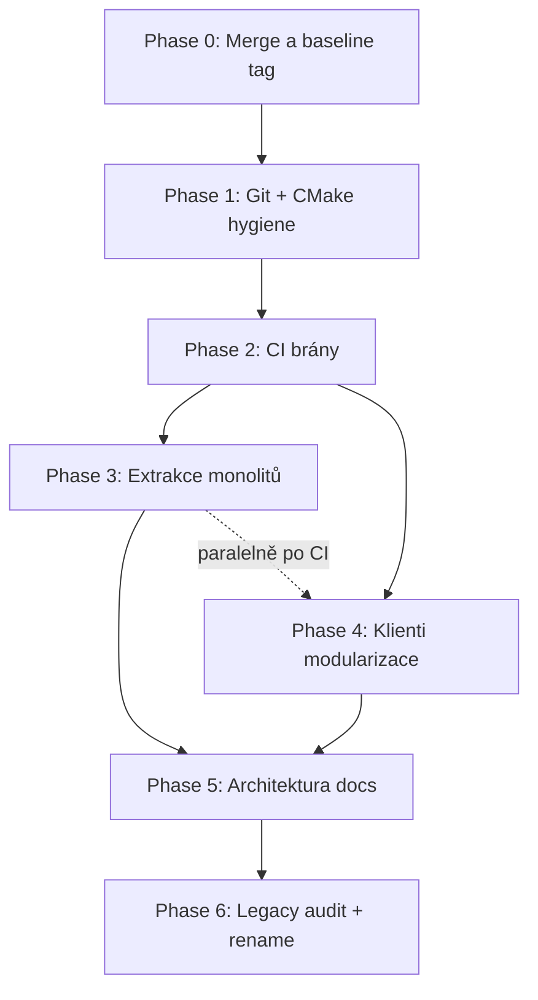

# Plán profesionalizace kódu — CZECHMATE firmware 1.8.0

**Stav:** návrh (2026-07-10)  
**Cíl:** čistší, udržovatelný a ověřitelný kód **bez změny chování** na HW V1.  
**Vstupní rozcestník:** [docs/README.md](../README.md) · [REPO_LAYOUT.md](REPO_LAYOUT.md) (větev `cursor/repo-organize-complete-8fdd`)

---

## 1. Shrnutí

Projekt funguje, ale má typický dluh rychlého vývoje:

| Oblast | Problém | Dopad |
|--------|---------|-------|
| **Monolity** | `game_task.c` ~15 323 ř., `uart_task.c` ~8 294, `web_server_task.c` ~6 569, `chess_app.js` ~4 726 | těžké review, riziko regresí |
| **CMake / git** | mrtvé cesty (`screen_saver_task`, `matter_task`), build artefakty v historii | matoucí onboarding, pomalý clone |
| **CI** | jen diagramy + Flutter release + Pages | žádná automatická kontrola firmware buildu |
| **Legacy komponenty** | `enhanced_castling_system`, `animation_task`, `visual_error_system` | nejasná „pravda“ v kódu |
| **Paralelní PR** | #4 (reorg) + #5 (matrix guard) na různých větvích | merge konflikty, duplicitní cherry-picky |

**Princip:** nejdřív stabilizovat a automatizovat ověření, pak **move-only** refaktory po malých PR. **Žádné mazání souborů bez schválení.**

---

## 2. Aktuální stav (větev `main`)

### 2.1 Otevřené PR

| PR | Větev | Obsah | Doporučení |
|----|-------|-------|------------|
| [#5](https://github.com/AlfredKrutina/chess_esp32_c6_devkit/pull/5) | `cursor/matrix-guard-sync-8fdd` | Oprava matrix guard + recovery API + UI | **Merge jako první** (~26 souborů, behavior fix) |
| [#4](https://github.com/AlfredKrutina/chess_esp32_c6_devkit/pull/4) | `cursor/repo-organize-complete-8fdd` | Reorg fáze 1–5 + cherry-pick guard | **Rebase na `main` po #5**, pak merge |
| #1–#3 | starší drafty reorg | superseded | Zavřít po merge #4 |

### 2.2 Velikost „god souborů“

```
game_task.c              15 323 ř.
uart_task.c               8 294 ř.
web_server_task.c         6 569 ř.
chess_app.js              4 726 ř.
board_session_notifier    1 520 ř.
matrix_task.c             1 184 ř.
```

### 2.3 Známé CMake / link chyby na `main`

- `CMakeLists.txt` → `components/screen_saver_task`, `components/matter_task` **neexistují**
- `game_task/CMakeLists.txt` → `REQUIRES enhanced_castling_system`, ale **`game_task.c` komponentu nevolá** (jen LED stub v `led_task.c`)
- `ha_light_task`, `timer_system` nejsou v `EXTRA_COMPONENT_DIRS`, ale linkují se přes řetězec `REQUIRES` (funguje, ale není explicitní v inventáři)

### 2.4 Cyklické závislosti komponent

```
game_task  ←REQUIRES→  matrix_task
     ↑                        ↑
     └──── game_command_queue ┘
```

Při extrakci modulů z `game_task` **nesmí** vzniknout nový cyklus (např. `game_matrix_guard.c` musí zůstat v `game_task` nebo jít přes tenký `game_hooks` / shared header).

### 2.5 Legacy / neaktivní (audit — **nesmazat bez schválení**)

| Komponenta | Stav | Důkaz |
|------------|------|-------|
| `animation_task` | vypnuto | `#include` zakomentován v `main.c` |
| `enhanced_castling_system` | kód existuje, **nepoužívá game_task** | REQUIRES jen v CMake na `main` |
| `visual_error_system` | **orphan** | žádný `#include` mimo vlastní složku |
| `screen_saver_task`, `matter_task` | chybí adresář | jen v root CMake |

### 2.6 Rozbité / zastaralé tooling

- `embed_chess_js.py` — marker v `web_server_task.c` nenalezen (JS se servíruje handlerem; embed cesta mrtvá)
- `generate_arb.py` — **nebezpečné** pustit bez kontroly: dříve přepsalo ARB na zkrácenou verzi

---

## 3. Graf závislostí fází



**Pravidlo:** Phase 3 a 4 jdou paralelně až **po Phase 2** (CI). Phase 6 až po dokumentaci a stabilních extrakcích.

---

## 4. Fáze detailně

### Phase 0 — Stabilizace baseline (BLOCKER)

**Účel:** jeden známý commit před refaktory.

| Krok | Akce |
|------|------|
| 0.1 | Merge **PR #5** → `main` |
| 0.2 | Tag `v1.8.0-guard-fix` (nebo `pre-cleanup-2026-07`) |
| 0.3 | Rebase `cursor/repo-organize-complete-8fdd` na nový `main`; vyřešit ARB konflikty (`app_*.arb` — **ručně**, ne slepě `generate_arb.py`) |
| 0.4 | Merge **PR #4** → `main` |
| 0.5 | Zavřít PR #1–#3 |
| 0.6 | Lokálně: `source $IDF_PATH/export.sh && idf.py build flash monitor` + `cd flutter_czechmate && flutter test` |

**Acceptance criteria**

- [ ] `main` obsahuje matrix guard fix i reorg
- [ ] Tag existuje na GitHubu
- [ ] HW smoke test: tah, rošáda, matrix guard → Obnovit hru (web + Flutter)
- [ ] Žádné regrese v `flutter test`

**Rizika**

| Riziko | Mitigace |
|--------|----------|
| ARB po rebase poškozené | diff ARB proti `origin/main` + kontrola počtu klíčů |
| Reorg smazal něco důležitého | checklist [CZECHMATE_INTEGRATION_CHECKLIST.md](CZECHMATE_INTEGRATION_CHECKLIST.md) |

---

### Phase 1 — Git / CMake / skripty (nízké riziko)

Většina je v PR #4; po merge doplnit:

| ID | Úkol | Soubory | PR velikost |
|----|------|---------|-------------|
| 1.1 | Ověřit `.gitignore` (`.cache/`, STM32 build, `.DS_Store`) | `.gitignore` | hotovo v #4 |
| 1.2 | Odstranit mrtvé `EXTRA_COMPONENT_DIRS` | `CMakeLists.txt` | hotovo v #4 |
| 1.3 | Odebrat `enhanced_castling_system` z `game_task` REQUIRES | `components/game_task/CMakeLists.txt` | hotovo v #4 |
| 1.4 | Doplnit `ha_light_task`, `timer_system` do [REPO_LAYOUT.md](REPO_LAYOUT.md) tabulky | docs | 1 PR |
| 1.5 | Root wrappery → `scripts/` (ponechat tenké symlinky/wrappery v kořeni pro zpětnou kompatibilitu) | `generate_docs.sh`, … | hotovo v #4 |
| 1.6 | Odstranit `sdkconfig.old` z gitu (pokud je trackovaný) | git | 1 commit |

**Acceptance criteria**

- [ ] `idf.py build` projde na čistém clone
- [ ] `grep screen_saver_task CMakeLists.txt` → 0 výskytů
- [ ] README + REPO_LAYOUT odpovídají skutečnosti

---

### Phase 2 — CI brány (střední riziko, vysoká hodnota)

**Účel:** každý refaktor PR musí projít automaticky.

| ID | Workflow | Trigger | Poznámka |
|----|----------|---------|----------|
| 2.1 | **Firmware build** | PR + push `main` | `espressif/esp-idf-ci-action` nebo Docker `espressif/idf:v5.x`; target `esp32c6`; `./scripts/idf_build.sh` |
| 2.2 | **Flutter test** | PR touching `flutter_czechmate/**` | `flutter test`; cache pub |
| 2.3 | **Docs diagramy** | existuje | `.github/workflows/docs-diagrams.yml` |
| 2.4 | **Embed JS check** (volitelné) | PR touching `chess_app.js` | buď opravit `embed_chess_js.py`, nebo CI krok „marker exists OR skip embed path“ dokumentovaný v [WEB_UI_DEPLOY.md](WEB_UI_DEPLOY.md) |

**Acceptance criteria**

- [ ] PR bez buildu nemůže být mergnut (branch protection)
- [ ] CI běh < 15 min firmware + < 5 min Flutter
- [ ] Badge v README (volitelně)

**Pořadí PR:** nejdřív 2.1 (nejvíc chytá regrese), pak 2.2.

---

### Phase 3 — Extrakce firmware monolitů (vysoké riziko → malé PR)

**Pravidla extrakce**

1. **Jen move** — žádná změna logiky v prvním commitu daného modulu
2. **Jeden modul = jeden PR** (~300–800 ř. max)
3. Po každém PR: `idf.py build` + krátký HW nebo UART smoke test
4. Nové `.c` soubory registrovat ve stejném `CMakeLists.txt` komponenty
5. Veřejné API zůstává v `game_task.h` (forward deklarace / tenké wrappery)

#### 3A — `game_task` (priorita)

| Pořadí | Nový soubor | Odhad ř. | Obsah (orientačně) | Závislost |
|--------|-------------|----------|---------------------|-----------|
| 3A.1 | `game_matrix_guard.c` | ~400 | guard LED, clear, `game_force_clear_matrix_guard`, sync s matrix | po #5 merge |
| 3A.2 | `game_snapshot.c` | ~600 | NVS load/save, boot restore, `snapshot_*` flags | 3A.1 |
| 3A.3 | `game_board_core.c` | ~500 | init, reset, FEN, piece helpers | — |
| 3A.4 | `game_move_validate.c` | ~781 | `game_validate_*`, check detection | 3A.3 | **hotovo** (PR #7) |
| 3A.5 | `game_move_exec.c` | ~866 | `game_execute_move*`, history | 3A.4 | **hotovo** (PR #7) |
| 3A.6 | `game_physical.c` | ~1200 | pickup/drop/castle/promote command processing | 3A.5 |
| 3A.7 | `game_bot.c` | ~? | Stockfish integrace | 3A.5 |
| 3A.8 | `game_puzzle.c` | ~300 | puzzle setup/start | 3A.3 |
| 3A.9 | `game_task.c` (zbytek) | ~2000 | task loop, queue dispatch, orchestrace | vše |

**Cíl:** `game_task.c` < 3 000 ř.

#### 3B — `uart_task`

| Pořadí | Soubor | Obsah |
|--------|--------|-------|
| 3B.1 | `uart_commands.c` | pole `commands[]`, registrace, help |
| 3B.2 | `uart_parse.c` | `uart_parse_command` |
| 3B.3 | tematické handlery | game / wifi / system / debug |

Tabulka příkazů začíná ~řádek 2562 — největší okamžitý win.

#### 3C — `web_server_task`

| Pořadí | Soubor | Obsah |
|--------|--------|-------|
| 3C.1 | `web_routes.c` | registrace URI |
| 3C.2 | `web_handlers_game.c` | `/api/game/*`, snapshot |
| 3C.3 | `web_handlers_wifi.c` | `/api/wifi/*` |
| 3C.4 | `web_handlers_system.c` | OTA, factory reset, demo |
| 3C.5 | `web_ws.c` | WebSocket |

**Acceptance criteria (každý PR Phase 3)**

- [ ] `idf.py build` OK
- [ ] diff stat: převážně `rename` / move (git diff --numstat)
- [ ] Doxygen / žádné nové warningy (pokud běží)
- [ ] Manuálně: endpoint nebo UART příkaz z daného modulu

---

### Phase 4 — Klienti (paralelně s Phase 3 po CI)

#### 4A — Web `chess_app.js`

Cíl: ES moduly nebo IIFE namespaces **bez bundleru** (firmware servíruje statické soubory).

| Modul | Funkce (příklady) |
|-------|-------------------|
| `js/board.js` | `createBoard`, drag, sandbox |
| `js/api.js` | fetch, auth headers, snapshot poll |
| `js/matrix_guard.js` | panel, `matrixGuardShowPanel` |
| `js/prefs.js` | localStorage, device prefs |
| `js/bot.js` | bot settings, Stockfish UI |

**Postup:** nejdřív extrahovat `matrix_guard.js` (malý, izolovaný), pak `api.js`.

**Pozor:** `web_server_task.c` musí servírovat více `.js` souborů nebo jeden concatenated build krok v CI — rozhodnout v PR 4A.0 (design).

#### 4B — Flutter

| Modul | Z `board_session_notifier.dart` |
|-------|-----------------------------------|
| `board_connection_mixin` / notifier | WiFi/BLE stav |
| `board_guard_notifier` | matrix guard, `postGuardClear` |
| `board_snapshot_sync` | polling, revision |
| ponechat tenký `BoardSessionNotifier` | composition |

**Acceptance criteria**

- [ ] `flutter test` green
- [ ] žádná změna veřejného API widgetů bez důvodu
- [ ] l10n: nové klíče jen přes ARB + kontrola diff

---

### Phase 5 — Dokumentace architektury

| Dokument | Obsah |
|----------|-------|
| [ARCHITECTURE.md](ARCHITECTURE.md) | task diagram, datové toky, boot sequence |
| [CONTRIBUTING.md](../../CONTRIBUTING.md) | branch policy, CI, jak flashnout, ARB pravidla |
| [COMPONENTS.md](COMPONENTS.md) | tabulka komponent, REQUIRES, aktivní/neaktivní |
| Aktualizace [README.md](../../README.md) | odkaz na CONTRIBUTING |

Využít existující [KOMUNIKACE_MEZI_TASKY.md](KOMUNIKACE_MEZI_TASKY.md) — ne duplikovat, ale linkovat.

**Acceptance criteria**

- [ ] Nový contributor zvládne build do 30 min jen z docs
- [ ] Každá aktivní komponenta má 1 řádek v COMPONENTS.md

---

### Phase 6 — Legacy audit a volitelné rename (jen se schválením)

**Krok 6.0 — audit report (PR pouze docs)**

Pro každou legacy komponentu:

- kdo ji REQUIRES
- kdo volá API
- návrh: **keep / stub / deprecate / delete**

Kandidáti na deprecate (po schválení):

- `visual_error_system` — orphan
- `enhanced_castling_system` — nahrazeno logikou v `game_task` + LED
- `animation_task` — merged do `led_task`

**Renames (odloženo):** `web/chess_app.js` layout z PR #4 je dostatečný; globální přejmenování `components/*` až po Phase 3.

---

## 5. Doporučená sekvence PR (28 kroků)

```
# Stabilizace
PR-00  Merge #5 matrix guard
PR-01  Rebase + merge #4 reorg
PR-02  Tag baseline

# Hygiene + CI
PR-03  REPO_LAYOUT doplnění + sdkconfig.old
PR-04  CI: idf.py build
PR-05  CI: flutter test
PR-06  embed_chess_js fix OR documented skip

# game_task extrakce
PR-07  game_matrix_guard.c
PR-08  game_snapshot.c
PR-09  game_board_core.c
PR-10  game_move_validate.c
PR-11  game_move_exec.c
PR-12  game_physical.c
PR-13  game_bot.c + game_puzzle.c

# uart + web server
PR-14  uart_commands.c
PR-15  uart_parse + handlers split
PR-16  web_routes.c
PR-17  web_handlers_game.c
PR-18  web_handlers_wifi + system

# Klienti
PR-19  chess_app matrix_guard + api modules
PR-20  board_session_notifier split

# Docs + legacy
PR-21  ARCHITECTURE.md + COMPONENTS.md
PR-22  CONTRIBUTING.md
PR-23  Legacy audit report (no deletes)
PR-24+ Schválené deprecations (jeden PR na komponentu)
```

---

## 6. Matice rizik

| Riziko | Pravděpodobnost | Dopad | Mitigace |
|--------|-----------------|-------|----------|
| Regrese šachové logiky při split | střední | kritický | move-only PR, CI build, UART test script |
| Matrix guard znovu rozsynchron | nízká | vysoký | nechat 3A.1 jako první extrakci; test [MATRIX_GUARD.md](MATRIX_GUARD.md) |
| Cyklická závislost komponent | střední | build fail | nové moduly jen uvnitř `game_task/`, ne nová komponenta |
| ARB wipe | střední | Flutter CI fail | zákaz slepého `generate_arb.py` v CI; review ARB diff |
| Web multi-file serving | střední | broken UI | PR 4A.0 design + manual browser test |
| Příliš velký PR | vysoká | review fatigue | max ~800 ř. změn na PR |

---

## 7. Definition of Done (celý program)

- [ ] `main`: CI build firmware + Flutter test green
- [ ] Žádný source soubor > 5 000 ř. (výjimka: generated)
- [ ] REPO_LAYOUT + COMPONENTS aktuální
- [ ] Matrix guard dokumentace a test scénáře projdu HW
- [ ] Legacy komponenty: kaud audit + rozhodnutí vlastníka
- [ ] Tag `v1.9.0-cleanup` nebo semver minor po dokončení Phase 3–5

---

## 8. Co teď nedělat

- **Nemazat** `enhanced_castling_system`, `visual_error_system`, `animation_task` bez explicitního „ano“
- **Nespouštět** hromadné rename cest a Phase 6 před CI
- **Nesloučit** Phase 3 extrakci s behavior změnami (jiný PR)
- **Nepřeskakovat** Phase 0 — refaktor na dvou větvích současně zdvojnásobí konflikty

---

## 9. Lokální ověřovací checklist (po každé větší změně)

```bash
# Firmware
source "$IDF_PATH/export.sh"
idf.py build
idf.py flash monitor   # UART: HELP, STATUS, GUARD_CLEAR

# Flutter
cd flutter_czechmate && flutter test

# Web (proti běžící desce)
# POST /api/game/guard_clear — 200, hra pokračuje
```

Matrix guard scénáře: viz [MATRIX_GUARD.md](MATRIX_GUARD.md) sekce „Testování“.

---

## 10. Odkazy

- [MATRIX_GUARD.md](MATRIX_GUARD.md)
- [CZECHMATE_INTEGRATION_CHECKLIST.md](CZECHMATE_INTEGRATION_CHECKLIST.md)
- [WEB_UI_DEPLOY.md](WEB_UI_DEPLOY.md)
- PR #4 reorg · PR #5 matrix guard
