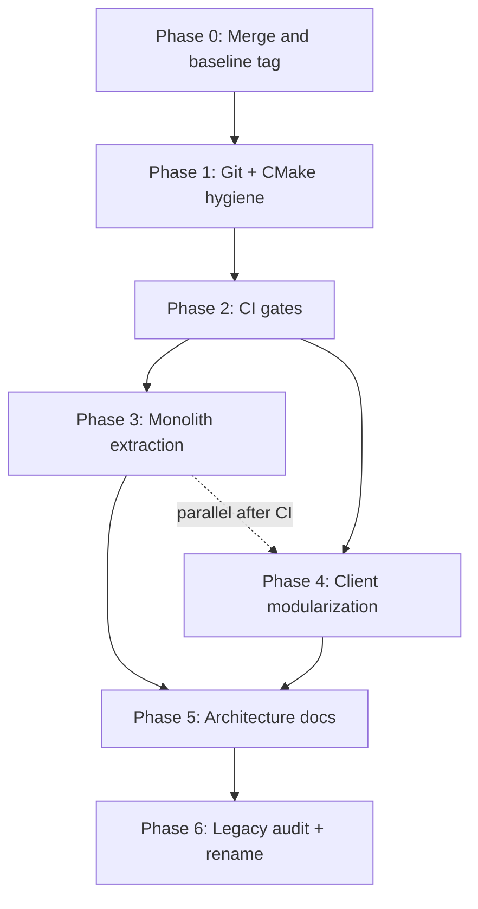

# Code professionalization plan — CZECHMATE firmware 1.8.0

**Status:** proposal (2026-07-10)  
**Goal:** cleaner, maintainable, verifiable code **without behavior change** on HW V1.  
**Entry index:** [docs/README.md](../README.md) · [REPO_LAYOUT.md](REPO_LAYOUT.md) (branch `cursor/repo-organize-complete-8fdd`)

---

## 1. Summary

The project works but carries typical fast-development debt:

| Area | Problem | Impact |
|--------|---------|-------|
| **Monoliths** | `game_task.c` ~2,476 lines (+ split modules), `uart_task.c` ~4,408, `web_server_task.c` ~3,707 (+ split modules), `chess_app.js` ~4,726 | hard review, regression risk |
| **CMake / git** | dead paths (`screen_saver_task`, `matter_task`), build artifacts in history | confusing onboarding, slow clone |
| **CI** | diagrams + Flutter release + Pages only | no automatic firmware build check |
| **Legacy components** | `enhanced_castling_system`, `animation_task`, `visual_error_system` | unclear “source of truth” in code |
| **Parallel PRs** | #4 (reorg) + #5 (matrix guard) on different branches | merge conflicts, duplicate cherry-picks |

**Principle:** stabilize and automate verification first, then **move-only** refactors in small PRs. **No file deletion without approval.**

---

## 2. Current state (branch `main`)

### 2.1 Open PRs

| PR | Branch | Content | Recommendation |
|----|-------|-------|------------|
| [#5](https://github.com/AlfredKrutina/chess_esp32_c6_devkit/pull/5) | `cursor/matrix-guard-sync-8fdd` | Matrix guard fix + recovery API + UI | **Merge first** (~26 files, behavior fix) |
| [#4](https://github.com/AlfredKrutina/chess_esp32_c6_devkit/pull/4) | `cursor/repo-organize-complete-8fdd` | Reorg phases 1–5 + cherry-pick guard | **Rebase on `main` after #5**, then merge |
| #1–#3 | older reorg drafts | superseded | Close after merge #4 |

### 2.2 “God file” sizes

```
game_task.c               2,476 lines  (split: matrix_guard, snapshot, board_core, move_validate, move_exec, physical, puzzle, json_export, timer, dispatch, cmd_handlers, error_recovery, init, matrix_workflow, endgame_report, endgame_detect, promotion, resignation, move_gen, castling)
game_puzzle.c               ~224 lines
game_json_export.c          ~560 lines
game_timer.c                ~277 lines
game_dispatch.c             ~693 lines
game_cmd_handlers.c       ~1,036 lines
game_error_recovery.c       ~873 lines
game_init.c                 ~663 lines
game_matrix_workflow.c      ~817 lines
game_endgame_report.c       ~347 lines
game_endgame_detect.c       ~347 lines
game_promotion.c            ~424 lines
game_resignation.c          ~261 lines
game_move_gen.c             ~642 lines
game_castling.c             ~598 lines
uart_task.c               4,408 lines  (split: commands_table, parse, handlers_game/wifi/debug)
web_server_task.c         3,707 lines  (split: routes ~350, game ~1230, wifi ~340, system ~865, ws ~186)
web_routes.c                ~350 lines
web_handlers_game.c       ~1,230 lines
web_handlers_wifi.c         ~340 lines
web_handlers_system.c       ~865 lines
web_ws.c                    ~186 lines
chess_app.js              4,726 lines
board_session_notifier    1,520 lines
matrix_task.c             1,184 lines
```

### 2.3 Known CMake / link issues on `main`

- `CMakeLists.txt` → `components/screen_saver_task`, `components/matter_task` **do not exist**
- `game_task/CMakeLists.txt` → `REQUIRES enhanced_castling_system`, but **`game_task.c` does not call the component** (LED stub only in `led_task.c`)
- `ha_light_task`, `timer_system` not in `EXTRA_COMPONENT_DIRS`, but link via `REQUIRES` chain (works, not explicit in inventory)

### 2.4 Component cyclic dependencies

```
game_task  ←REQUIRES→  matrix_task
     ↑                        ↑
     └──── game_command_queue ┘
```

When extracting modules from `game_task` **must not** create new cycles (e.g. `game_matrix_guard.c` stays in `game_task` or goes via thin `game_hooks` / shared header).

### 2.5 Legacy / inactive (audit — **do not delete without approval**)

| Component | Status | Evidence |
|------------|------|-------|
| `animation_task` | disabled | `#include` commented in `main.c` |
| `enhanced_castling_system` | code exists, **game_task does not use** | REQUIRES only in CMake on `main` |
| `visual_error_system` | **orphan** | no `#include` outside its folder |
| `screen_saver_task`, `matter_task` | missing directory | only in root CMake |

### 2.6 Broken / stale tooling

- `embed_chess_js.py` — marker in `web_server_task.c` not found (JS served by handler; embed path dead)
- `generate_arb.py` — **dangerous** to run unchecked: previously overwrote ARB with shortened version

---

## 3. Phase dependency graph


```mermaid
flowchart TD
  P0[Phase 0: Merge and baseline tag]
  P1[Phase 1: Git + CMake hygiene]
  P2[Phase 2: CI gates]
  P3[Phase 3: Monolith extraction]
  P4[Phase 4: Client modularization]
  P5[Phase 5: Architecture docs]
  P6[Phase 6: Legacy audit + rename]

  P0 --> P1
  P1 --> P2
  P2 --> P3
  P2 --> P4
  P3 --> P5
  P4 --> P5
  P5 --> P6

  P3 -.->|parallel after CI| P4
```

**Rule:** Phase 3 and 4 run in parallel only **after Phase 2** (CI). Phase 6 after docs and stable extractions.

---

## 4. Phases in detail

### Phase 0 — Baseline stabilization (BLOCKER)

**Purpose:** one known commit before refactors.

| Step | Action |
|------|------|
| 0.1 | Merge **PR #5** → `main` |
| 0.2 | Tag `v1.8.0-guard-fix` (or `pre-cleanup-2026-07`) |
| 0.3 | Rebase `cursor/repo-organize-complete-8fdd` on new `main`; resolve ARB conflicts (`app_*.arb` — **manually**, not blind `generate_arb.py`) |
| 0.4 | Merge **PR #4** → `main` |
| 0.5 | Close PR #1–#3 |
| 0.6 | Locally: `source $IDF_PATH/export.sh && idf.py build flash monitor` + `cd flutter_czechmate && flutter test` |

**Acceptance criteria**

- [ ] `main` contains matrix guard fix and reorg
- [ ] Tag exists on GitHub
- [ ] HW smoke test: move, castling, matrix guard → Restore game (web + Flutter)
- [ ] No regressions in `flutter test`

**Risks**

| Risk | Mitigation |
|--------|----------|
| ARB broken after rebase | diff ARB vs `origin/main` + key count check |
| Reorg deleted something important | checklist [CZECHMATE_INTEGRATION_CHECKLIST.md](CZECHMATE_INTEGRATION_CHECKLIST.md) |

---

### Phase 1 — Git / CMake / scripts (low risk)

Most is in PR #4; after merge add:

| ID | Task | Files | PR size |
|----|------|---------|-------------|
| 1.1 | Verify `.gitignore` (`.cache/`, STM32 build, `.DS_Store`) | `.gitignore` | done in #4 |
| 1.2 | Remove dead `EXTRA_COMPONENT_DIRS` | `CMakeLists.txt` | done in #4 |
| 1.3 | Remove `enhanced_castling_system` from `game_task` REQUIRES | `components/game_task/CMakeLists.txt` | done in #4 |
| 1.4 | Add `ha_light_task`, `timer_system` to [REPO_LAYOUT.md](REPO_LAYOUT.md) table | docs | 1 PR |
| 1.5 | Root wrappers → `scripts/` (keep thin symlinks/wrappers at root for compatibility) | `generate_docs.sh`, … | done in #4 |
| 1.6 | Remove `sdkconfig.old` from git (if tracked) | git | 1 commit |

**Acceptance criteria**

- [ ] `idf.py build` passes on clean clone
- [ ] `grep screen_saver_task CMakeLists.txt` → 0 hits
- [ ] README + REPO_LAYOUT match reality

---

### Phase 2 — CI gates (medium risk, high value)

**Purpose:** every refactor PR must pass automatically.

| ID | Workflow | Trigger | Note |
|----|----------|---------|----------|
| 2.1 | **Firmware build** | PR + push `main` | `espressif/esp-idf-ci-action` or Docker `espressif/idf:v5.x`; target `esp32c6`; `./scripts/idf_build.sh` |
| 2.2 | **Flutter test** | PR touching `flutter_czechmate/**` | `flutter test`; cache pub |
| 2.3 | **Docs diagrams** | exists | `.github/workflows/docs-diagrams.yml` |
| 2.4 | **Embed JS check** (optional) | PR touching `chess_app.js` | fix `embed_chess_js.py`, or CI step “marker exists OR skip embed path” documented in [WEB_UI_DEPLOY.md](WEB_UI_DEPLOY.md) |

**Acceptance criteria**

- [ ] PR cannot merge without build (branch protection)
- [ ] CI run < 15 min firmware + < 5 min Flutter
- [ ] Badge in README (optional)

**PR order:** 2.1 first (catches most regressions), then 2.2.

---

### Phase 3 — Firmware monolith extraction (high risk → small PRs)

**Extraction rules**

1. **Move only** — no logic change in first commit of a module
2. **One module = one PR** (~300–800 lines max)
3. After each PR: `idf.py build` + short HW or UART smoke test
4. Register new `.c` files in same component `CMakeLists.txt`
5. Public API stays in `game_task.h` (forward declarations / thin wrappers)

#### 3A — `game_task` (priority)

| Order | New file | Est. lines | Content (approx.) | Dependency |
|--------|-------------|----------|---------------------|-----------|
| 3A.1 | `game_matrix_guard.c` | ~400 | guard LED, clear, `game_force_clear_matrix_guard`, matrix sync | after #5 merge |
| 3A.2 | `game_snapshot.c` | ~600 | NVS load/save, boot restore, `snapshot_*` flags | 3A.1 |
| 3A.3 | `game_board_core.c` | ~500 | init, reset, FEN, piece helpers | — |
| 3A.4 | `game_move_validate.c` | ~781 | `game_validate_*`, check detection | 3A.3 | **done** (PR #7) |
| 3A.5 | `game_move_exec.c` | ~866 | `game_execute_move*`, history | 3A.4 | **done** (PR #7) |
| 3A.6 | `game_physical.c` | ~2684 | pickup/drop/castle/promote command processing | 3A.5 | **done** (PR #7) |
| 3A.7 | `game_bot.c` | — | **N/A** (Stockfish only in `chess_app.js`, not firmware) |
| 3A.8 | `game_puzzle.c` | ~234 | puzzle setup/start | 3A.3 | **done** (PR #7) |
| 3A.9 | `game_json_export.c` | ~560 | board/status/history/captured/advantage/timer JSON | 3A.8 | **done** (PR #7) |
| 3A.10 | `game_timer.c` + `game_dispatch.c` | ~277 + ~693 | timer integration, command queue dispatch, undo | 3A.9 | **done** (PR #7) |
| 3A.11 | `game_cmd_handlers.c` | ~1,036 | evaluate/save/load/endgame/list/delete UART handlers | 3A.10 | **done** (PR #7) |
| 3A.12 | `game_error_recovery.c` | ~873 | invalid move recovery, move cmd, LED animations | 3A.11 | **done** (PR #7) |
| 3A.13 | `game_init.c` | ~663 | reset, new game, board setup tutorial, revision | 3A.12 | **done** (PR #7) |
| 3A.14 | `game_matrix_workflow.c` | ~817 | matrix LED workflow, promotion command, movable highlights | 3A.13 | **done** (PR #7) |
| 3A.15 | `game_endgame_report.c` | ~347 | endgame stats, UART report, win/draw getters | 3A.14 | **done** (PR #7) |
| 3A.16 | `game_endgame_detect.c` | ~347 | check/stalemate/draw detection, `game_is_king_in_check` | 3A.15 | **done** (PR #7) |
| 3A.17 | `game_promotion.c` | ~424 | promotion LED, button handling, anchor pulse | 3A.16 | **done** (PR #7) |
| 3A.18 | `game_resignation.c` + `game_move_gen.c` + `game_castling.c` | ~261 + ~642 + ~598 | resignation, legal moves, castling legacy | 3A.17 | **done** (PR #7) |

**Goal:** `game_task.c` < 3,000 lines — **met** (2,476 lines)

#### 4A — `chess_app.js` modularization

| Order | Module | Content | Status |
|--------|-------|-------|------|
| 4A.0 | `concat_web_js.py` | concat `web/js/*` → `chess_app.js` without bundler | **done** (PR #7) |
| 4A.1 | `js/matrix_guard.js` | panel, mask→squares, guard_clear | **done** (PR #7) |
| 4A.2 | `js/api.js` | auth headers, snapshot fetch, apiGet/PostJson | **done** (PR #7) |
| 4A.3 | `js/prefs.js` | devicePrefs, hint getters, UI settings sync | **done** (PR #7) |
| 4A.4 | `js/board.js`, `js/bot.js` | board UI, Stockfish/bot | planned |

#### 3B — `uart_task`

| Order | File | Content |
|--------|--------|-------|
| 3B.1 | `uart_commands_table.c` | ~499 | `commands[]` array, registration, help | **done** (PR #7) |
| 3B.2 | `uart_parse.c` | ~365 | `uart_parse_command`, `find_command`, move parsing | 3B.1 | **done** (PR #7) |
| 3B.3 | `uart_handlers_game.c` | ~1117 | game move/board/castle/promote handlers | 3B.2 | **done** (PR #7) |
| 3B.4 | `uart_handlers_wifi.c` + `uart_handlers_debug.c` | ~977 + ~957 | wifi/timer/web + debug diagnostics | 3B.3 | **done** (PR #7) |

Command table starts ~line 2562 — biggest immediate win.

#### 3C — `web_server_task`

| Order | File | Content |
|--------|--------|-------|
| 3C.1 | `web_routes.c` | URI registration | **done** (PR #7) |
| 3C.2 | `web_handlers_game.c` | `/api/game/*`, snapshot | **done** (PR #7) |
| 3C.3 | `web_handlers_wifi.c` | `/api/wifi/*` | **done** (PR #7) |
| 3C.4 | `web_handlers_system.c` | OTA, factory reset, demo, settings, MQTT | **done** (PR #7) |
| 3C.5 | `web_ws.c` | WebSocket | **done** (PR #7) |

**Acceptance criteria (each Phase 3 PR)**

- [ ] `idf.py build` OK
- [ ] diff stat: mostly `rename` / move (git diff --numstat)
- [ ] Doxygen / no new warnings (if run)
- [ ] Manual: endpoint or UART command from that module

---

### Phase 4 — Clients (parallel with Phase 3 after CI)

#### 4A — Web `chess_app.js`

Goal: ES modules or IIFE namespaces **without bundler** (firmware serves static files).

| Module | Functions (examples) |
|-------|-------------------|
| `js/board.js` | `createBoard`, drag, sandbox |
| `js/api.js` | fetch, auth headers, snapshot poll |
| `js/matrix_guard.js` | panel, `matrixGuardShowPanel` |
| `js/prefs.js` | localStorage, device prefs |
| `js/bot.js` | bot settings, Stockfish UI |

**Approach:** extract `matrix_guard.js` first (small, isolated), then `api.js`.

**4A.0 design (PR #7):** source in `web/js/`, output `web/chess_app.js` from `tools/concat_web_js.py` (no bundler). Firmware handler `/chess_app.js` currently returns 404 — modules prepare maintenance and future multi-file serving.

**Note:** when ESP serving is restored, `web_routes.c` may register `/js/matrix_guard.js` or stay on concat output.

#### 4B — Flutter

| Module | From `board_session_notifier.dart` |
|-------|-----------------------------------|
| `board_connection_mixin` / notifier | WiFi/BLE state |
| `board_guard_notifier` | matrix guard, `postGuardClear` |
| `board_snapshot_sync` | polling, revision |
| keep thin `BoardSessionNotifier` | composition |

**Acceptance criteria**

- [ ] `flutter test` green
- [ ] no public widget API change without reason
- [ ] l10n: new keys only via ARB + diff review

---

### Phase 5 — Architecture documentation

| Document | Content |
|----------|-------|
| [ARCHITECTURE.md](ARCHITECTURE.md) | task diagram, data flows, boot sequence |
| [CONTRIBUTING.md](../../CONTRIBUTING.md) | branch policy, CI, how to flash, ARB rules |
| [COMPONENTS.md](COMPONENTS.md) | component table, REQUIRES, active/inactive |
| Update [README.md](../../README.md) | link to CONTRIBUTING |

Use existing [TASK_COMMUNICATION.md](TASK_COMMUNICATION.md) — do not duplicate, link instead.

**Acceptance criteria**

- [ ] New contributor can build in 30 min from docs alone
- [ ] Each active component has one line in COMPONENTS.md

---

### Phase 6 — Legacy audit and optional rename (approval only)

**Step 6.0 — audit report (docs-only PR)**

For each legacy component:

- who REQUIRES it
- who calls API
- proposal: **keep / stub / deprecate / delete**

Deprecate candidates (after approval):

- `visual_error_system` — orphan
- `enhanced_castling_system` — replaced by logic in `game_task` + LED
- `animation_task` — merged into `led_task`

**Renames (deferred):** `web/chess_app.js` layout from PR #4 is enough; global `components/*` rename after Phase 3.

---

## 5. Recommended PR sequence (28 steps)

```
# Stabilization
PR-00  Merge #5 matrix guard
PR-01  Rebase + merge #4 reorg
PR-02  Tag baseline

# Hygiene + CI
PR-03  REPO_LAYOUT update + sdkconfig.old
PR-04  CI: idf.py build
PR-05  CI: flutter test
PR-06  embed_chess_js fix OR documented skip

# game_task extraction
PR-07  game_matrix_guard.c
PR-08  game_snapshot.c
PR-09  game_board_core.c
PR-10  game_move_validate.c
PR-11  game_move_exec.c
PR-12  game_physical.c
PR-13  game_bot.c + game_puzzle.c

# uart + web server
PR-14  uart_commands.c
PR-15  uart_parse + handlers split
PR-16  web_routes.c
PR-17  web_handlers_game.c
PR-18  web_handlers_wifi + system

# Clients
PR-19  chess_app matrix_guard + api modules
PR-20  board_session_notifier split

# Docs + legacy
PR-21  ARCHITECTURE.md + COMPONENTS.md
PR-22  CONTRIBUTING.md
PR-23  Legacy audit report (no deletes)
PR-24+ Approved deprecations (one PR per component)
```

---

## 6. Risk matrix

| Risk | Probability | Impact | Mitigation |
|--------|-----------------|-------|----------|
| Chess logic regression on split | medium | critical | move-only PR, CI build, UART test script |
| Matrix guard resync again | low | high | keep 3A.1 first extraction; test [MATRIX_GUARD.md](MATRIX_GUARD.md) |
| Component cyclic dependency | medium | build fail | new modules only inside `game_task/`, not new component |
| ARB wipe | medium | Flutter CI fail | no blind `generate_arb.py` in CI; review ARB diff |
| Web multi-file serving | medium | broken UI | PR 4A.0 design + manual browser test |
| PR too large | high | review fatigue | max ~800 lines changed per PR |

---

## 7. Definition of Done (whole program)

- [ ] `main`: CI firmware build + Flutter test green — **PR #7 green (2026-07-10)**
- [ ] No source file > 5,000 lines (except generated)
- [ ] REPO_LAYOUT + COMPONENTS current
- [ ] Matrix guard docs and test scenarios pass on HW
- [ ] Legacy components: audit + owner decision
- [ ] Tag `v1.9.0-cleanup` or semver minor after Phase 3–5

---

## 8. What not to do now

- **Do not delete** `enhanced_castling_system`, `visual_error_system`, `animation_task` without explicit “yes”
- **Do not run** mass path renames and Phase 6 before CI
- **Do not merge** Phase 3 extraction with behavior changes (separate PR)
- **Do not skip** Phase 0 — refactor on two branches doubles conflicts

---

## 9. Local verification checklist (after major change)

```bash
# Firmware
source "$IDF_PATH/export.sh"
idf.py build
idf.py flash monitor   # UART: HELP, STATUS, GUARD_CLEAR

# Flutter
cd flutter_czechmate && flutter test

# Web (against running board)
# POST /api/game/guard_clear — 200, game continues
```

Matrix guard scenarios: see [MATRIX_GUARD.md](MATRIX_GUARD.md) “Testing” section.

---

## 10. Links

- [MATRIX_GUARD.md](MATRIX_GUARD.md)
- [CZECHMATE_INTEGRATION_CHECKLIST.md](CZECHMATE_INTEGRATION_CHECKLIST.md)
- [WEB_UI_DEPLOY.md](WEB_UI_DEPLOY.md)
- [OPENING_TRAINING_PLAN.md](OPENING_TRAINING_PLAN.md) — interactive opening trainer proposal (parallel feature, after cleanup Phase 3–4)
- PR #4 reorg · PR #5 matrix guard
